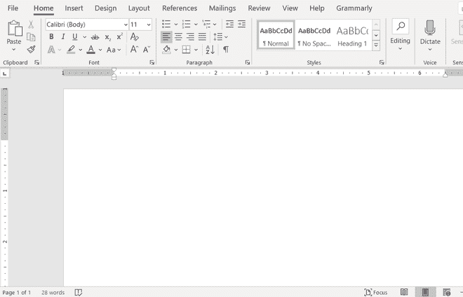
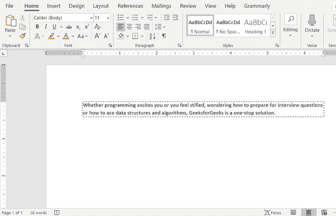

# 如何使用 Java 对 Word 文档中的文本应用边框？

> 原文:[https://www . geeksforgeeks . org/如何使用 java 将边框应用到文字文档中/](https://www.geeksforgeeks.org/how-to-apply-borders-to-the-text-in-a-word-document-using-java/)

java 库 [Apache POI](https://www.geeksforgeeks.org/apache-poi-introduction/) 将用于在 Java 中对 Word 文档中的文本应用边框。Apache POI 是由 Apache 软件基金会运营的项目，之前是[雅加达](https://jakarta.apache.org/)项目的子项目，提供纯 Java 库，用于读写 Microsoft Office 格式的文件，如 Word、PowerPoint 和 Excel。使用 [Apache](https://www.geeksforgeeks.org/apache-poi-introduction/) 指南为视窗/Linux 系统安装 Apache 兴趣点库。

**进场:**

*   使用 Apache POI 包中的[xwpfddocument](https://www.geeksforgeeks.org/java-program-to-write-a-paragraph-in-a-word-document/)创建一个空文档对象。
*   创建[文件输出流](https://www.geeksforgeeks.org/creating-a-file-using-fileoutputstream/)对象，将 Word 文档保存在系统中所需的路径/位置。
*   使用文档中的 [XWPFParagraph](https://www.geeksforgeeks.org/java-program-to-write-a-paragraph-in-a-word-document/) 对象创建段落。
*   将边框应用于段落。
*   使用段落中的 [XWPFRun](https://www.geeksforgeeks.org/java-program-to-write-a-paragraph-in-a-word-document/) 对象创建文本行。

**图示:**样本输入图像



**实施:**

*   **步骤 1:** 创建空白文档
*   **第二步:**获取当前工作目录的路径，在运行程序的同一目录下创建 PDF 文件。
*   **步骤 3:** 用指定的路径创建一个文件对象。
*   **第四步:**创建一个段落。
*   **第五步:**设置边框。
*   **步骤 6:** 保存对文档的更改。
*   **步骤 7:** 关闭连接。

**示例:**

## Java 语言(一种计算机语言，尤用于创建网站)

```
// Java Program to apply borders to the text
// in a Word document

// Importing inout output classes
import java.io.*;
// importing Apache POI environment packages
import org.apache.poi.xwpf.usermodel.*;

// Class-BorderText
public class GFG {

    // Main driver method
    public static void main(String[] args) throws Exception
    {

        // Step 1: Creating a blank document
        XWPFDocument document = new XWPFDocument();

        // Step 2: Getting path of current working directory
        // to create the pdf file in the same directory of
        // the running java program
        String path = System.getProperty("user.dir");
        path += "/BorderText.docx";

        // Step 3: Creating a file object with the path specified
        FileOutputStream out
            = new FileOutputStream(new File(path));

        // Step 4: Create a paragraph
        XWPFParagraph paragraph
            = document.createParagraph();

        // Step 5: Setting borders

        // Set bottom border to paragraph
        paragraph.setBorderBottom(Borders.DASHED);

        // Set left border to paragraph
        paragraph.setBorderLeft(Borders.DASHED);

        // Set right border to paragraph
        paragraph.setBorderRight(Borders.DASHED);

        // Set top border to paragraph
        paragraph.setBorderTop(Borders.DASHED);

        XWPFRun line = paragraph.createRun();
        line.setText(
            "Whether programming excites you or you feel stifled"
            + ", wondering how to prepare for interview questions"
            + " or how to ace data structures and algorithms"
            + ", GeeksforGeeks is a one-stop solution.");

        // Step 6: Saving changes to document
        document.write(out);

        // Step 7: Closing the connections
        out.close();
        document.close();

        // Display message on console to illustrate
        // successful execution of the program
        System.out.println(
            "Word Document with Border Text created successfully!");
    }
}
```

**输出:**

```
Word Document with Border Text created successfully!
```



输出

> 文本被插入到同一 Word 文档中，并且边框被成功应用到 Word 中的同一文本，同时将输出图像与作为示例的输入图像进行比较，以显示实现后对其所做的更改。