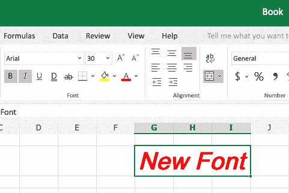

# 如何使用 Java 对单元格内容应用字体？

> 原文:[https://www . geesforgeks . org/如何使用 java 将字体应用于单元格内容/](https://www.geeksforgeeks.org/how-to-apply-fonts-to-the-contents-of-a-cell-using-java/)

在本文中，我们将学习如何使用 [Java](https://www.geeksforgeeks.org/java/) 和 [Apache POI](https://www.google.com/url?client=internal-element-cse&cx=009682134359037907028:tj6eafkv_be&q=https://www.geeksforgeeks.org/apache-poi-getting-started/&sa=U&ved=2ahUKEwjcsYfwmontAhV0IbcAHW_oB5EQFjABegQICRAC&usg=AOvVaw3tYs4Q0b4DbV4VEWc0vy4o) (一个对处理微软文档非常有用的 Java API)来应用自定义字体和与之相关的各种样式。

**进场:**

使用兴趣点编写文件非常简单，包括以下步骤:

1.  创建工作簿。
2.  在工作簿中创建电子表格。
3.  创建一种字体并在电子表格中对其应用样式。
4.  创建一个单元格并对其应用值。
5.  在电子表格中添加单元格。
6.  重复步骤 3 至 5 以写入更多数据

**示例:**

## Java 语言(一种计算机语言，尤用于创建网站)

```java
// import Statements
import java.io.File;
import java.io.FileOutputStream;

import org.apache.poi.hssf.util.HSSFColor;
import org.apache.poi.xssf.usermodel.XSSFCell;
import org.apache.poi.xssf.usermodel.XSSFCellStyle;
import org.apache.poi.xssf.usermodel.XSSFFont;
import org.apache.poi.xssf.usermodel.XSSFRow;
import org.apache.poi.xssf.usermodel.XSSFSheet;
import org.apache.poi.xssf.usermodel.XSSFWorkbook;

public class FontsInExcel {
    public static void fontFile()
    { 
          // Created a workbook
        XSSFWorkbook myWorkbook = new XSSFWorkbook();

        // Created a spreadsheet
        XSSFSheet newSpreadsheet
            = myWorkbook.createSheet("Book");
        XSSFRow row = newSpreadsheet.createRow(1);

        // Created a new font
        XSSFFont font = myWorkbook.createFont();

        // Setting Font Properties
        font.setFontHeightInPoints((short)30);
        font.setFontName("Arial");
        font.setBold(true);
        font.setItalic(true);
        font.setColor(HSSFColor.BRIGHT_RED.index);

        // Set created font into style
        XSSFCellStyle cellStyle
            = myWorkbook.createCellStyle();
        cellStyle.setFont(font);

        // Create a cell with a custom value and set style
        // to it.
        XSSFCell myCell = row.createCell(6);
        myCell.setCellValue("New Font");
        myCell.setCellStyle(cellStyle);

        // Opening and changing the File
        FileOutputStream file = new FileOutputStream(
            new File("C:/Book.xlsx"));

        myWorkbook.write(file);
        file.close();
    }
    public static void main(String[] args) throws Exception
    {
        fontFile();
    }
}
```

**输出**

