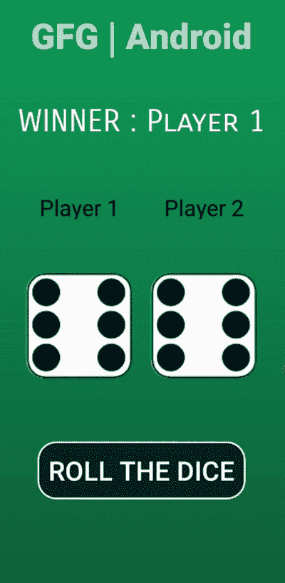

# 如何在安卓中搭建骰子游戏？

> 原文:[https://www . geesforgeks . org/如何构建安卓骰子游戏/](https://www.geeksforgeeks.org/how-to-build-a-dice-game-in-android/)

在本文中，我们将在安卓系统中使用 **Java 和 XML** 构建一个骰子游戏项目。骰子游戏是基于两人游戏。两个玩家都掷骰子，获得最高相位值的玩家将赢得游戏。这个应用程序中只有一个活动。这个活动将显示两个玩家的名字和他们的骰子。结果将显示在顶部，底部将有一个滚动按钮。下面给出了一个 GIF 示例，来了解一下我们将在本文中做什么。注意，我们将使用 **Java** 语言来实现这个项目。



## 逐步实施

**第一步:创建新项目**

要在安卓工作室创建新项目，请参考[如何在安卓工作室创建/启动新项目](https://www.geeksforgeeks.org/android-how-to-create-start-a-new-project-in-android-studio/)。注意选择 **Java** 作为编程语言。

**第二步:** **先去编码区之前你要做一些前置任务**

*   **骰子图像:**下面列出了所有骰子图像。将它们保存在资源中的可绘制文件夹中。转到**应用程序>资源>可绘制**并粘贴以下文件:
    *   说 1
    *   [说 2](https://media.geeksforgeeks.org/wp-content/uploads/20200508141001/dice2.png)
    *   [说 3](https://media.geeksforgeeks.org/wp-content/uploads/20200508141003/dice3.png)
    *   [说 4](https://media.geeksforgeeks.org/wp-content/uploads/20200508141004/dice4.png)
    *   [说 5](https://media.geeksforgeeks.org/wp-content/uploads/20200508141005/dice5.png)
    *   [说 6](https://media.geeksforgeeks.org/wp-content/uploads/20200508141006/dice6.png)
*   **修改 colors.xml 文件:**

## 可扩展标记语言

```
<?xml version="1.0" encoding="utf-8"?>
<resources>
    <color name="colorPrimary">#6200EE</color>
    <color name="colorPrimaryDark">#3700B3</color>
    <color name="colorAccent">#03DAC5</color>
    <color name="gradStop">#0F9D58</color>
    <color name="white">#FFFFFF</color>
</resources>
```

*   **background.xml 文件:**

## 可扩展标记语言

```
<?xml version="1.0" encoding="utf-8"?>
<selector xmlns:android="http://schemas.android.com/apk/res/android">
    <item>
        <shape>
            <gradient
                android:angle="90"
                android:startColor="#0E5131"
                android:endColor="#0F9D58"
                android:type="linear"/>
        </shape>
    </item>
</selector>
```

*   **btn_bg.xml 文件:**

## 可扩展标记语言

```
<shape
    xmlns:android="http://schemas.android.com/apk/res/android"
    android:shape="rectangle">

    <corners android:topLeftRadius="20dp"
        android:topRightRadius="20dp"
        android:bottomLeftRadius="20dp"
        android:bottomRightRadius="20dp"/>

    <stroke android:color="@color/white"
        android:width="2dp"/>

    <solid android:color="#022127"/>

</shape>
```

**步骤 3:使用 activity_main.xml 文件**

XML 代码用于构建活动的结构及其样式部分。它包含一个 [**文本视图**](https://www.geeksforgeeks.org/textview-widget-in-android-using-java-with-examples/) 在活动的最顶端显示游戏结果。然后它包含两个 [**图像视图**](https://www.geeksforgeeks.org/imageview-in-kotlin/) ，每个都有一个**文本视图**用于玩家名称和掷骰子的图像。活动底部有 [**按钮**](https://www.geeksforgeeks.org/button-in-kotlin/) 掷骰子。下面是**activity _ main . XML**文件的代码。

## 可扩展标记语言

```
<?xml version="1.0" encoding="utf-8"?>
<RelativeLayout 
    xmlns:android="http://schemas.android.com/apk/res/android"
    android:layout_width="match_parent"
    android:layout_height="match_parent"
    android:background="@drawable/background"
    android:padding="20dp">

    <TextView
        android:id="@+id/tvVar2"
        android:layout_width="wrap_content"
        android:layout_height="wrap_content"
        android:layout_centerHorizontal="true"
        android:layout_marginBottom="40dp"
        android:fontFamily="sans-serif-black"
        android:gravity="center"
        android:text="GFG | Android"
        android:textSize="40dp"
        android:textStyle="bold" />

    <TextView
        android:id="@+id/tvVar1"
        android:layout_width="match_parent"
        android:layout_height="60dp"
        android:layout_below="@+id/tvVar2"
        android:fontFamily="sans-serif-smallcaps"
        android:gravity="center"
        android:text="WINNER : Player 1"
        android:textAlignment="center"
        android:textColor="@color/white"
        android:textSize="35dp" />

    <LinearLayout
        android:layout_width="match_parent"
        android:layout_height="wrap_content"
        android:layout_below="@+id/tvVar1"
        android:layout_marginTop="40dp"
        android:orientation="vertical">

        <LinearLayout
            android:layout_width="wrap_content"
            android:layout_height="50dp"
            android:layout_gravity="center"
            android:layout_marginBottom="40dp"
            android:orientation="horizontal">

            <TextView
                android:layout_width="140dp"
                android:layout_height="50dp"
                android:layout_gravity="center"
                android:gravity="center"
                android:padding="10dp"
                android:text="Player 1"
                android:textAlignment="center"
                android:textColor="#000000"
                android:textSize="25dp" />

            <TextView
                android:layout_width="140dp"
                android:layout_height="50dp"
                android:layout_gravity="center"
                android:gravity="center"
                android:padding="10dp"
                android:text="Player 2"
                android:textAlignment="center"
                android:textColor="#000000"
                android:textSize="25dp" />

        </LinearLayout>

        <LinearLayout
            android:layout_width="wrap_content"
            android:layout_height="wrap_content"
            android:layout_gravity="center"
            android:orientation="horizontal">

            <ImageView
                android:id="@+id/ivVar1"
                android:layout_width="140dp"
                android:layout_height="140dp"
                android:padding="10dp"
                android:src="@drawable/dice6" />

            <ImageView
                android:id="@+id/ivVar2"
                android:layout_width="140dp"
                android:layout_height="140dp"
                android:padding="10dp"
                android:src="@drawable/dice6" />

        </LinearLayout>

        <Button
            android:id="@+id/btVar1"
            android:layout_width="wrap_content"
            android:layout_height="65dp"
            android:layout_gravity="center"
            android:layout_marginTop="60dp"
            android:background="@drawable/btn_bg"
            android:gravity="center"
            android:padding="12dp"
            android:text="Roll the Dice"
            android:textAlignment="center"
            android:textColor="#ffffff"
            android:textSize="30dp" />

    </LinearLayout>

</RelativeLayout>
```

**步骤 4:使用 MainActivity.java 文件**

我们将在 Java 文件中创建一个包含骰子所有图像的数组。然后我们将为按钮调用 **onClickListener()** ，并使用 **Random** 函数生成两个随机数。然后我们将检查这两个数字，并分别显示结果。此外，我们将设置阵列中的两个图像。下面是**MainActivity.java**文件的代码。代码中添加了注释，以更详细地理解代码。

## Java 语言(一种计算机语言，尤用于创建网站)

```
import android.os.Bundle;
import android.view.View;
import android.widget.Button;
import android.widget.ImageView;
import android.widget.TextView;

import androidx.appcompat.app.AppCompatActivity;

import java.util.Random;

public class MainActivity extends AppCompatActivity {

    public static Button button;
    public static TextView textView;
    public static ImageView img1, img2;

    @Override
    protected void onCreate(Bundle savedInstanceState) {
        super.onCreate(savedInstanceState);
        setContentView(R.layout.activity_main);

        // array to store dice images
        final int dice[] = {R.drawable.dice1, R.drawable.dice2, R.drawable.dice3, 
                            R.drawable.dice4, R.drawable.dice5, R.drawable.dice6};

        // linking the roll button from its id..
        button = findViewById(R.id.btVar1);

        // linking the result textview from its id..
        textView = findViewById(R.id.tvVar1);

        // linking both the imageView of 
        // the dice images from its id..
        img1 = findViewById(R.id.ivVar1);
        img2 = findViewById(R.id.ivVar2);

        // call the on click function
        button.setOnClickListener(new View.OnClickListener() {
            @Override
            public void onClick(View v) {

                // generate two random numbers 
                // using Random function
                Random random = new Random();
                int num1 = random.nextInt(6);
                Random random1 = new Random();
                int num2 = random.nextInt(6);

                // the bigger number will be displayed in the
                // textView as the winner otherwise draw..
                if (num1 > num2) {
                    textView.setText("WINNER : Player 1");
                } else if (num2 > num1) {
                    textView.setText("WINNER : Player 2");
                } else {
                    textView.setText("RESULT : Draw");
                }
                // set the images from the array by the index
                // position of the numbers generated
                img1.setImageResource(dice[num1]);
                img2.setImageResource(dice[num2]);
            }
        });
    }
}
```

### 输出:

<video class="wp-video-shortcode" id="video-532983-1" width="640" height="360" preload="metadata" controls=""><source type="video/mp4" src="https://media.geeksforgeeks.org/wp-content/uploads/20201227040305/Edited_20201227_020713.mp4?_=1">[https://media.geeksforgeeks.org/wp-content/uploads/20201227040305/Edited_20201227_020713.mp4](https://media.geeksforgeeks.org/wp-content/uploads/20201227040305/Edited_20201227_020713.mp4)</video>