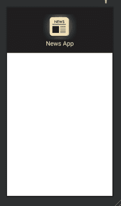

# 如何在安卓工作室使用 WebView 控制器搭建新闻 App？

> 原文:[https://www . geesforgeks . org/how-to-build-a-news-app-use-webview-controller-in-Android-studio/](https://www.geeksforgeeks.org/how-to-build-a-news-app-using-webview-controller-in-android-studio/)

在本文中，我们将借助安卓工作室中的[网络视图控制器](https://www.geeksforgeeks.org/android-webview-in-kotlin/)制作一个新闻应用程序。通过制作这个应用程序，我们将学习如何在我们的安卓应用程序中访问互联网权限，以及如何使用网络视图及其名为网络视图控制器的类。在完成这个应用程序后，你还会注意到安卓工作室的[导航抽屉活动](https://www.geeksforgeeks.org/navigation-drawer-in-android/)。所以，让我们开始吧！


### **本文我们要构建什么？**

在这个应用程序中，我们将使用导航抽屉活动，并在其中设置不同报纸的不同片段。在导航抽屉的片段中，我们将使用网络视图来访问不同新闻频道的网站，最后，我们将制作一个类网络视图控制器，这样我们就可以在自己的应用程序中显示所有这些网站，而不是去浏览器。下面给出了一个示例 GIF，以了解我们将在本文中做什么。注意，我们将使用 **Java** 语言来实现这个项目。

<video class="wp-video-shortcode" id="video-610061-1" width="640" height="360" preload="metadata" controls=""><source type="video/mp4" src="https://media.geeksforgeeks.org/wp-content/uploads/20210523230717/WhatsApp-Video-2021-05-23-at-23.03.53.mp4?_=1">[https://media.geeksforgeeks.org/wp-content/uploads/20210523230717/WhatsApp-Video-2021-05-23-at-23.03.53.mp4](https://media.geeksforgeeks.org/wp-content/uploads/20210523230717/WhatsApp-Video-2021-05-23-at-23.03.53.mp4)</video>

### **分步实施**

**第一步:创建新项目**

打开安卓工作室[选择**导航抽屉活动**创建新项目](https://www.geeksforgeeks.org/android-how-to-create-start-a-new-project-in-android-studio/)。您将获得许多默认文件，但您必须只在我们必须工作的地方进行更改。

**第二步:处理 XML 文件**

打开**布局> nav_header_main.xml** 文件，设计我们导航抽屉的标题。使用下面的代码-

## 可扩展标记语言

```java
<?xml version="1.0" encoding="utf-8"?>
<androidx.constraintlayout.widget.ConstraintLayout
    xmlns:android="http://schemas.android.com/apk/res/android"
    xmlns:app="http://schemas.android.com/apk/res-auto"
    android:layout_width="match_parent"
    android:layout_height="@dimen/nav_header_height"
    android:background="#201E1E"
    android:gravity="bottom"
    android:orientation="vertical"
    android:paddingLeft="@dimen/activity_horizontal_margin"
    android:paddingTop="@dimen/activity_vertical_margin"
    android:paddingRight="@dimen/activity_horizontal_margin"
    android:paddingBottom="@dimen/activity_vertical_margin"
    android:theme="@style/ThemeOverlay.AppCompat.Dark">

    <ImageView
        android:id="@+id/imageView"
        android:layout_width="130dp"
        android:layout_height="110dp"
        android:layout_gravity="center"
        android:contentDescription="@string/nav_header_desc"
        android:foregroundGravity="center"
        android:paddingTop="@dimen/nav_header_vertical_spacing"
        app:layout_constraintBottom_toBottomOf="parent"
        app:layout_constraintEnd_toEndOf="parent"
        app:layout_constraintStart_toStartOf="parent"
        app:layout_constraintTop_toTopOf="parent"
        app:layout_constraintVertical_bias="0.0"
        app:srcCompat="@drawable/news_app_img" />

    <TextView
        android:layout_width="wrap_content"
        android:layout_height="51dp"
        android:layout_gravity="center"
        android:gravity="center"
        android:paddingTop="@dimen/nav_header_vertical_spacing"
        android:text="News App"
        android:textAppearance="@style/TextAppearance.AppCompat.Body1"
        android:textColor="#F6F8CA"
        android:textSize="24sp"
        app:layout_constraintBottom_toBottomOf="parent"
        app:layout_constraintEnd_toEndOf="parent"
        app:layout_constraintHorizontal_bias="0.501"
        app:layout_constraintStart_toStartOf="parent"
        app:layout_constraintTop_toTopOf="@+id/imageView"
        app:layout_constraintVertical_bias="1.0" />

</androidx.constraintlayout.widget.ConstraintLayout>
```

实现上述代码后，头文件的用户界面将如下所示:



打开**菜单> activity_main_drawer.xml** 文件，并在其中使用以下代码，这样我们就可以向导航抽屉添加不同的项目并使用它们的片段。

## 可扩展标记语言

```java
<?xml version="1.0" encoding="utf-8"?>
<menu xmlns:android="http://schemas.android.com/apk/res/android">

    <group android:checkableBehavior="single">

        <item
            android:id="@+id/nav_home"
            android:icon="@drawable/z"
            android:menuCategory="secondary"
            android:title="Zee News" />
        <item
            android:id="@+id/nav_gallery"
            android:icon="@drawable/t1"
            android:menuCategory="secondary"
            android:title="Times Of India" />
        <item
            android:id="@+id/nav_slideshow"
            android:icon="@drawable/h"
            android:menuCategory="secondary"
            android:title="Hindustan Times" />

    </group>

</menu>
```