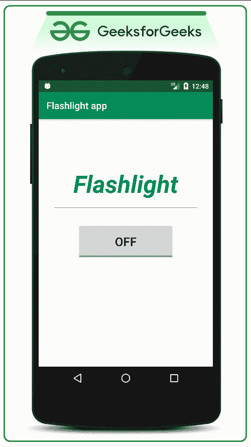
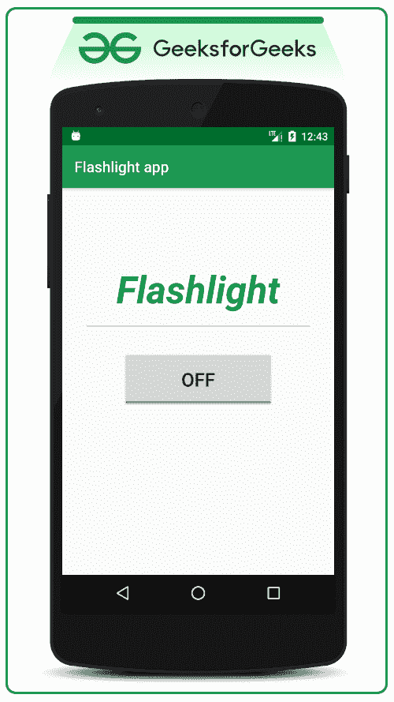

# 如何构建一个简单的手电筒/手电筒安卓应用？

> 原文:[https://www . geeksforgeeks . org/如何构建一个简单的手电筒-手电筒-安卓-app/](https://www.geeksforgeeks.org/how-to-build-a-simple-flashlight-torchlight-android-app/)

所有进入安卓开发领域的初学者都应该构建一个简单的安卓应用程序，通过点击一个按钮就可以打开/关闭手电筒或手电筒。因此，在本文的最后，人们将能够用简单的布局构建自己的 android 手电筒应用程序。下面给出了一个 GIF 示例，来了解一下在本文中要做什么。请注意，我们将使用 **Java** 语言来实现这个项目。



### 构建简单手电筒/火炬灯安卓应用程序的步骤

**第一步:创建新项目**

要在安卓工作室创建新项目，请参考[如何在安卓工作室创建/启动新项目](https://www.geeksforgeeks.org/android-how-to-create-start-a-new-project-in-android-studio/)。注意选择 **Java** 作为编程语言。

**步骤 2:使用 activity_main.xml**

*   该布局包含一个简单的[文本视图](https://www.geeksforgeeks.org/textview-widget-in-android-using-java-with-examples/)、视图(作为分割线)和一个[切换手电筒单元的切换按钮](https://www.geeksforgeeks.org/how-to-add-toggle-button-in-an-android-application/)。
*   请参考[如何在安卓应用](https://www.geeksforgeeks.org/how-to-add-toggle-button-in-an-android-application/)中添加切换按钮，实现，看看切换按钮是如何工作的。
*   在 activity_main.xml 文件中调用以下代码，或者可以设计自定义小部件。

## 可扩展标记语言

```java
<?xml version="1.0" encoding="utf-8"?>
<LinearLayout
    xmlns:android="http://schemas.android.com/apk/res/android"
    xmlns:tools="http://schemas.android.com/tools"
    android:layout_width="match_parent"
    android:layout_height="match_parent"
    android:orientation="vertical"
    tools:context=".MainActivity"
    tools:ignore="HardcodedText">

    <TextView
        android:layout_width="wrap_content"
        android:layout_height="wrap_content"
        android:layout_gravity="center"
        android:layout_marginTop="100dp"
        android:text="Flashlight"
        android:textColor="@color/colorPrimary"
        android:textSize="50sp"
        android:textStyle="bold|italic" />

    <!--This is the simple divider between above
        TextView and ToggleButton-->
    <View
        android:layout_width="match_parent"
        android:layout_height="1dp"
        android:layout_marginStart="32dp"
        android:layout_marginTop="16dp"
        android:layout_marginEnd="32dp"
        android:background="@android:color/darker_gray" />

    <!--This toggle button by default toggles
        between the ON and OFF we no need to
        set separate TextView for it-->
    <ToggleButton
        android:id="@+id/toggle_flashlight"
        android:layout_width="200dp"
        android:layout_height="75dp"
        android:layout_gravity="center"
        android:layout_marginTop="32dp"
        android:onClick="toggleFlashLight"
        android:textSize="25sp" />

</LinearLayout>
```

**产生如下输出 UI:**



**第三步:操作切换按钮小部件在****MainActivity.java 文件**内切换开或关

**MainActivity.java**文件的完整代码如下。代码中添加了注释，以更详细地理解代码。

## Java 语言(一种计算机语言，尤用于创建网站)

```java
import android.content.Context;
import android.hardware.camera2.CameraAccessException;
import android.hardware.camera2.CameraManager;
import android.os.Build;
import android.os.Bundle;
import android.view.View;
import android.widget.Toast;
import android.widget.ToggleButton;
import androidx.annotation.RequiresApi;
import androidx.appcompat.app.AppCompatActivity;

public class MainActivity extends AppCompatActivity {

    private ToggleButton toggleFlashLightOnOff;
    private CameraManager cameraManager;
    private String getCameraID;

    @Override
    protected void onCreate(Bundle savedInstanceState) {
        super.onCreate(savedInstanceState);
        setContentView(R.layout.activity_main);

        // Register the ToggleButton with specific ID
        toggleFlashLightOnOff = findViewById(R.id.toggle_flashlight);

        // cameraManager to interact with camera devices
        cameraManager = (CameraManager) getSystemService(Context.CAMERA_SERVICE);

        // Exception is handled, because to check whether
        // the camera resource is being used by another
        // service or not.
        try {
            // O means back camera unit,
            // 1 means front camera unit
            getCameraID = cameraManager.getCameraIdList()[0];
        } catch (CameraAccessException e) {
            e.printStackTrace();
        }
    }

    // RequiresApi is set because, the devices which are
    // below API level 10 don't have the flash unit with
    // camera.
    @RequiresApi(api = Build.VERSION_CODES.M)
    public void toggleFlashLight(View view) {
        if (toggleFlashLightOnOff.isChecked()) {
            // Exception is handled, because to check
            // whether the camera resource is being used by
            // another service or not.
            try {
                // true sets the torch in ON mode
                cameraManager.setTorchMode(getCameraID, true);

                // Inform the user about the flashlight
                // status using Toast message
                Toast.makeText(MainActivity.this, "Flashlight is turned ON", Toast.LENGTH_SHORT).show();
            } catch (CameraAccessException e) {
                // prints stack trace on standard error
                // output error stream
                e.printStackTrace();
            }
        } else {
            // Exception is handled, because to check
            // whether the camera resource is being used by
            // another service or not.
            try {
                // true sets the torch in OFF mode
                cameraManager.setTorchMode(getCameraID, false);

                // Inform the user about the flashlight
                // status using Toast message
                Toast.makeText(MainActivity.this, "Flashlight is turned OFF", Toast.LENGTH_SHORT).show();
            } catch (CameraAccessException e) {
                // prints stack trace on standard error
                // output error stream
                e.printStackTrace();
            }
        }
    }
  // when yoou click on button and torch open and
  // you do not close the tourch again this code
  // will off the tourch automatically
  @RequiresApi(api = Build.VERSION_CODES.M)
    @Override
    public void finish() {
        super.finish();
        try {
            // true sets the torch in OFF mode
            cameraManager.setTorchMode(getCameraID, false);

            // Inform the user about the flashlight
            // status using Toast message
            Toast.makeText(SlaphScreen.this, "Flashlight is turned OFF", Toast.LENGTH_SHORT).show();
        } catch (CameraAccessException e) {
            // prints stack trace on standard error
            // output error stream
            e.printStackTrace();
        }
    }
}
```

*   在这里阅读 **printStackTrace()** 函数:[Java 中的可抛出 printStackTrace()方法，示例](https://www.geeksforgeeks.org/throwable-printstacktrace-method-in-java-with-examples/)。
*   处理完 ToggleButton 后，需要在**物理安卓设备**下测试应用程序。因为如果你在 android studio 附带的模拟器中运行应用程序，一旦点击 ToggleButton，应用程序就会崩溃，因为模拟器设备不会附带相机闪光灯。
*   这种访问相机硬件的方法不需要用户的特殊许可来访问相机单元。因为在这种情况下，我们只通过摄像头 ID(无论是前置摄像头还是后置摄像头)来访问闪光灯。

### 输出:

<video class="wp-video-shortcode" id="video-490832-1" width="640" height="360" preload="metadata" controls=""><source type="video/mp4" src="https://media.geeksforgeeks.org/wp-content/uploads/20200921184957/GFG_frame_nexus_5.mp4?_=1">[https://media.geeksforgeeks.org/wp-content/uploads/20200921184957/GFG_frame_nexus_5.mp4](https://media.geeksforgeeks.org/wp-content/uploads/20200921184957/GFG_frame_nexus_5.mp4)</video>