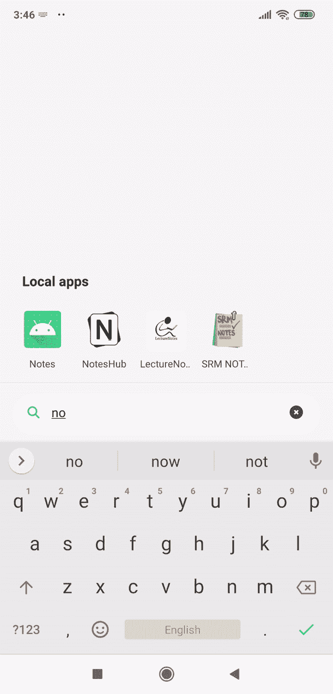
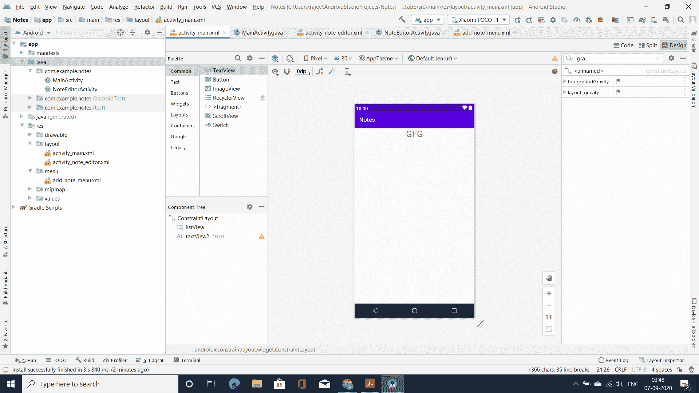

# 如何在安卓系统中搭建简易笔记 App？

> 原文:[https://www . geesforgeks . org/how-to-build-a-simple-notes-app-in-Android/](https://www.geeksforgeeks.org/how-to-build-a-simple-notes-app-in-android/)

Notes 应用程序用于制作简短的文本笔记，需要时更新，完成后丢弃。它可以用于各种功能，因为你可以在这个应用程序中添加你的待办事项列表，一些重要的笔记供将来参考等。这个应用在某些情况下非常有用，比如当你想快速访问笔记的时候。同样，这里让我们创建一个安卓应用程序来学习如何创建一个简单的记事本。因此，在本文中，让我们构建一个 Notes 应用程序，其中**用户可以添加任何数据、删除任何数据以及编辑任何数据**。下面给出了一个 GIF 示例，来了解一下我们将在本文中做什么。注意，我们将使用 **Java** 语言来实现这个项目。



### 创建笔记应用程序的步骤

**第一步:创建新项目**

要在安卓工作室创建新项目，请参考[如何在安卓工作室创建/启动新项目](https://www.geeksforgeeks.org/android-how-to-create-start-a-new-project-in-android-studio/)。注意选择 **Java** 作为编程语言。

**步骤 2:使用 activity_main.xml 文件**

在 **activity_main.xml** 文件中，添加一个[列表视图](https://www.geeksforgeeks.org/android-listview-in-java-with-example/)和一个[文本视图](https://www.geeksforgeeks.org/textview-widget-in-android-using-java-with-examples/)。添加了列表视图来显示自动保存的笔记列表，文本视图用于简单地显示 GFG 文本。下面是 **activity_main.xml** 文件的完整代码。

## 可扩展标记语言

```java
<?xml version="1.0" encoding="utf-8"?>
<androidx.constraintlayout.widget.ConstraintLayout 
    xmlns:android="http://schemas.android.com/apk/res/android"
    xmlns:app="http://schemas.android.com/apk/res-auto"
    xmlns:tools="http://schemas.android.com/tools"
    android:layout_width="match_parent"
    android:layout_height="match_parent"
    tools:context=".MainActivity">

    <!--Adding a ListView -->
    <ListView
        android:id="@+id/listView"
        android:layout_width="409dp"
        android:layout_height="601dp"
        android:layout_marginTop="80dp"
        app:layout_constraintBottom_toBottomOf="parent"
        app:layout_constraintEnd_toEndOf="parent"
        app:layout_constraintStart_toStartOf="parent"
        app:layout_constraintTop_toTopOf="parent" />

    <!--Adding a TextView -->
    <TextView
        android:id="@+id/textView2"
        android:layout_width="0dp"
        android:layout_height="0dp"
        android:gravity="center_horizontal"
        android:text="GFG"
        android:textColor="@android:color/holo_green_dark"
        android:textSize="30sp"
        app:layout_constraintBottom_toTopOf="@+id/listView"
        app:layout_constraintEnd_toEndOf="parent"
        app:layout_constraintStart_toStartOf="parent"
        app:layout_constraintTop_toTopOf="parent" />

</androidx.constraintlayout.widget.ConstraintLayout>
```

**输出 UI:**



**第三步:新建布局显示** **菜单**

前往 **app > res >右键>新建>目录**并命名为**菜单**。然后点击 **app > res >菜单>新建>菜单资源文件**并将文件命名为 **add_note_menu** 。下面是 **add_note_menu.xml** 文件的代码。

## 可扩展标记语言

```java
<?xml version="1.0" encoding="utf-8"?>
<!--Adding Menu to show the function to 
    User to delete and edit the data-->
<menu xmlns:android="http://schemas.android.com/apk/res/android">

    <item android:id="@+id/add_note" android:title="Add note"></item>

</menu>
```