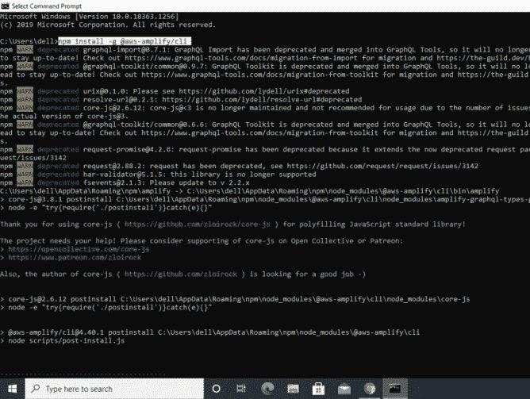
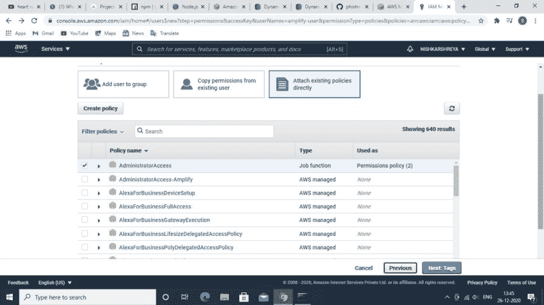
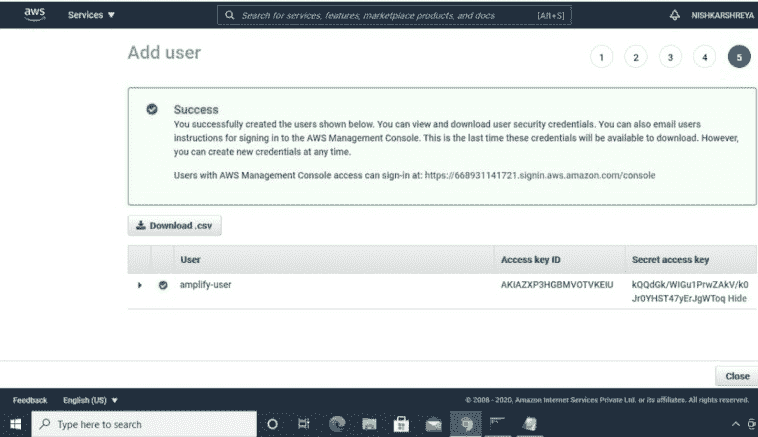
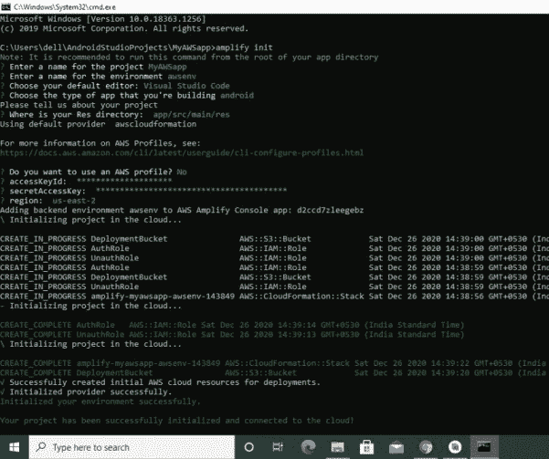
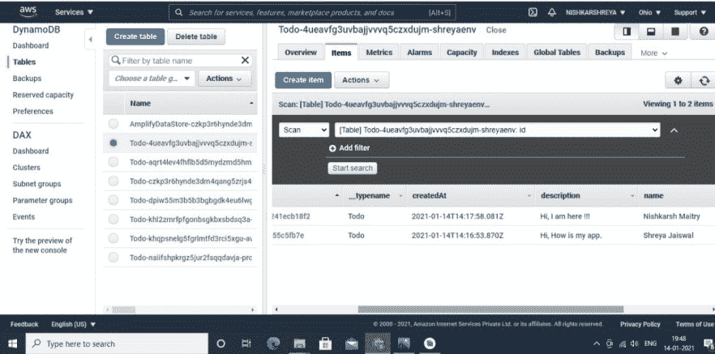

# 如何构建一个以 AWS DynamoDB 为数据库的 TODO 安卓应用？

> 原文:[https://www . geesforgeks . org/how-to-a-todo-Android-application-with-AWS-dynamo db-as-database/](https://www.geeksforgeeks.org/how-to-build-a-todo-android-application-with-aws-dynamodb-as-database/)

这是一个在 android studio IDE 上做的 TODO 应用，代码是用 **JAVA** 写的，数据存储在 [AWS DynamoDB](https://www.geeksforgeeks.org/dynamodb-introduction/) 中，取到主屏幕。通过放大器命令行界面在应用程序和自动气象站之间建立的连接以及成功存储的数据通过在动态数据库中创建一个待办事项表来获得，还创建了一个显示数据结构的模式。数据成功提取并显示在应用程序的主页上。这个项目的目的是展示如何将你的安卓应用程序与 AWS 连接起来，并使用 AWS 资源(DynamoDB)。下面给出了一个视频示例，以了解我们在本文中要做什么。

<video class="wp-video-shortcode" id="video-553037-1" width="640" height="360" preload="metadata" controls=""><source type="video/mp4" src="https://media.geeksforgeeks.org/wp-content/uploads/20210116081234/WhatsApp-Video-2021-01-15-at-11.55.29-PM.mp4?_=1">[https://media.geeksforgeeks.org/wp-content/uploads/20210116081234/WhatsApp-Video-2021-01-15-at-11.55.29-PM.mp4](https://media.geeksforgeeks.org/wp-content/uploads/20210116081234/WhatsApp-Video-2021-01-15-at-11.55.29-PM.mp4)</video>

在跳到实现之前，先看看下面的术语。

*   **放大命令行界面**:放大命令行界面(CLI)是一个组合工具链，用于为您的应用程序创建、集成和管理 AWS 云服务/资源。
*   **DynamoDB** :是一个快速灵活的 NoSQL 数据库。这是一个完全管理的数据库，可以帮助您处理文档和键值数据模型。

**先决条件:** [安装 node . js](https://nodejs.org/en/download/)(10 . x 版)安装[NPM](https://www.npmjs.com/get-npm)(6 . x 版)，创建一个 AWS 账号如果没有的话，安装 Android studio(4.0 或更高版本)，android SDK API level 29(android 10)，安装 amplify CLI(在命令提示符下写下)。

> npm 安装-g @ AWS-amplife/CLI

## **分步实施**

### 1.配置放大器命令行界面

**第一步:在命令提示符**上写下以下内容

> 放大器配置



安装放大器

**步骤 2:** 如果你已经创建了一个 IAM 用户，那么写**“你想使用 AWS 配置文件吗？是”**然后在其下方写下**接入密钥 Id** 和**秘书接入密钥**否则写下**“您想使用 AWS 配置文件吗？否**创建一个 IAM 用户，并使用其**访问密钥**和**秘书访问密钥**。


配置放大器



授予权限



用户已创建

**第三步:写下以下内容以初始化新的放大项目**

> 放大初始化



初始化放大

**第四步:使用 GraphQL 查询语言创建后端 API，然后使用“放大发布”进行部署**

> 放大添加 api
> 
> 放大推力
> 
> 放大出版


将应用编程接口添加到您的后端

### 2.借助放大器将 AWS 集成到安卓工作室中

**第一步:在 gradle 脚本**的 build.gradle (Project: Todo)的依赖项中添加以下内容

```java
buildscript {
   repositories {
       google()
       jcenter()
   }

   dependencies {
       classpath 'com.android.tools.build:gradle:4.1.1'

       // Add this line into `dependencies` in `buildscript`
       classpath 'com.amplifyframework:amplify-tools-gradle-plugin:1.0.2'
   }
}

allprojects {
   repositories {
       google()
       jcenter()
   }
}

// Add this line at the end of the file
apply plugin: 'com.amplifyframework.amplifytools'
```

**第二步:在 gradle 脚本的 build.gradle (Module: app)的依赖项中添加以下内容。运行梯度同步**

```java
dependencies {
    implementation 'com.amplifyframework:aws-api:1.6.9'
    implementation 'com.amplifyframework:aws-datastore:1.6.9'
}
```

**第三步:在安卓工作室中，转到项目- >放大- > app - >后端- > api - > schema.graphql**

```java
type Todo @model {
  id: ID!
  name: String!
  description: String
}
```

**第 4 步:在 onCreate()方法的 MainActivity & MainActivity2 中添加以下代码，初始化放大**

```java
 try {
     Amplify.addPlugin(new AWSDataStorePlugin());
     Amplify.configure(getApplicationContext());

     Log.i("Tutorial", "Initialized Amplify");
 } catch (AmplifyException e) {
     Log.e("Tutorial", "Could not initialize Amplify", e);
 }
```

**步骤 5:** **在 onCreate()方法的 MainActivity2 中添加以下代码，创建一个 Todo 项，该 Todo 项有两个属性:名称和描述**

```java
 Todo todo = Todo.builder()
                        .name(name1)
                        .description(name2)
                        .build();
```

**第六步:在 onCreate()方法的 MainActivity2 中添加以下代码，使用 mutate** 保存项目

```java
 Amplify.API.mutate(
                     ModelMutation.create(todo),
                     response -> Log.i("MyAmplifyApp", "Added Todo with id: " + response.getData().getId()),
                     error -> Log.e("MyAmplifyApp", "Create failed", error)
                );
```

前往您的 **AWS 管理控制台** - > **AppSync** - >选择您的 **API** - > **数据源** - >选择**待办事项表** - > **项**



数据已成功存储

**第 7 步:** **在 onCreate()方法的 MainActivity 中添加以下代码，以获取数据/运行查询来检索存储的数据**

```java
 Amplify.API.query(
                ModelQuery.list(Todo.class),
                response -> {
                    for (Todo todo : response.getData()) {
                        ls.add(todo.getName());
                        Log.i("MyAmplifyApp", todo.getName());
                    }
                },
                error -> Log.e("MyAmplifyApp", "Query failure", error)
        );
```

### 以下是的完整代码:

**主要活动文件(应用主页)**

## 可扩展标记语言

```java
<?xml version="1.0" encoding="utf-8"?>
<RelativeLayout 
    xmlns:android="http://schemas.android.com/apk/res/android"
    xmlns:app="http://schemas.android.com/apk/res-auto"
    xmlns:tools="http://schemas.android.com/tools"
    android:layout_width="match_parent"
    android:layout_height="match_parent"
    tools:context=".MainActivity">

    <ListView
        android:id="@+id/lt"
        android:layout_width="match_parent"
        android:layout_height="wrap_content"
        app:layout_constraintEnd_toEndOf="parent"
        app:layout_constraintStart_toStartOf="parent"
        app:layout_constraintTop_toTopOf="parent">
    </ListView>

    <com.google.android.material.floatingactionbutton.FloatingActionButton
        android:id="@+id/fab"
        android:layout_width="221dp"
        android:layout_height="53dp"
        android:layout_alignParentRight="true"
        android:layout_alignParentBottom="true"
        android:layout_marginEnd="25dp"
        android:layout_marginRight="25dp"
        android:layout_marginBottom="70dp"
        android:clickable="true"
        app:srcCompat="@android:drawable/ic_input_add" />

</RelativeLayout>
```

## Java 语言(一种计算机语言，尤用于创建网站)

```java
package com.example.shreyaawsapp;

import android.content.Intent;
import android.os.AsyncTask;
import android.os.Bundle;
import android.os.Handler;
import android.os.Looper;
import android.util.Log;
import android.view.View;
import android.widget.ArrayAdapter;
import android.widget.ListView;
import android.widget.Toast;
import androidx.appcompat.app.AppCompatActivity;
import com.amplifyframework.AmplifyException;
import com.amplifyframework.api.aws.AWSApiPlugin;
import com.amplifyframework.api.graphql.model.ModelQuery;
import com.amplifyframework.core.Amplify;
import com.amplifyframework.datastore.generated.model.Todo;
import com.google.android.material.floatingactionbutton.FloatingActionButton;
import java.util.ArrayList;
import java.util.List;

public class MainActivity extends AppCompatActivity {

      // declaration
    public FloatingActionButton btn;
    public ListView lv;
    public String[] st;
    int i = 0;
    Handler handler;

      // the array adapter converts an ArrayList of objects
    // into View items filled into the ListView container
    ArrayAdapter<String> arrayAdapter;

      // list to store data
    public static List<String> ls;

    @Override
    protected void onCreate(Bundle savedInstanceState)
    {
        super.onCreate(savedInstanceState);
        setContentView(R.layout.activity_main);

          // provide id to the layout items
        btn = findViewById(R.id.fab);
        st = new String[100];

        lv = findViewById(R.id.lt);

          // set listener to the floating button which takes
        // you to the next activity where you add and sore
        // your data
        btn.setOnClickListener(new View.OnClickListener() {
            @Override public void onClick(View v)
            {
                Intent intent = new Intent(MainActivity.this, MainActivity2.class);
                startActivity(intent);
            }
        });
        ls = new ArrayList<String>();

          // add the code below to initialize Amplpify
        try {
            // Add these lines to add the AWSApiPlugin plugins
            Amplify.addPlugin(new AWSApiPlugin());
            Amplify.configure(getApplicationContext());
            Log.i("MyAmplifyApp", "Initialized Amplify");
        }
        catch (AmplifyException error) {
            Log.e("MyAmplifyApp", "Could not initialize Amplify", error);
        }

          // add the code below to fetch 
          // data/run queries to
        // retrieve the stored data
        Amplify.API.query(ModelQuery.list(Todo.class), response -> {
                for (Todo todo : response.getData()) {
                    ls.add(todo.getName());
                    Log.i("MyAmplifyApp", todo.getName());
                }
            },
            error -> Log.e("MyAmplifyApp", "Query failure", error));

        handler = new Handler();
        final Runnable r = new Runnable() {
            public void run()
            {
                handler.postDelayed(this, 2000);
                arrayAdapter = new ArrayAdapter<String>(
                    getApplicationContext(),
                    android.R.layout.simple_list_item_1,
                    ls);
                lv.setAdapter(arrayAdapter);
                arrayAdapter.notifyDataSetChanged();
            }
        };
        handler.postDelayed(r, 1000);
    }
}
```

**主要活动 2 文件(写笔记页)**

## 可扩展标记语言

```java
<?xml version="1.0" encoding="utf-8"?>
<androidx.constraintlayout.widget.ConstraintLayout 
    xmlns:android="http://schemas.android.com/apk/res/android"
    xmlns:app="http://schemas.android.com/apk/res-auto"
    xmlns:tools="http://schemas.android.com/tools"
    android:layout_width="match_parent"
    android:layout_height="match_parent"
    tools:context=".MainActivity2">

    <EditText
        android:id="@+id/edname"
        android:layout_width="347dp"
        android:layout_height="54dp"
        android:layout_marginTop="110dp"
        android:ems="10"
        android:hint="Title"
        android:inputType="textPersonName"
        app:layout_constraintEnd_toEndOf="parent"
        app:layout_constraintStart_toStartOf="parent"
        app:layout_constraintTop_toTopOf="parent" />

    <EditText
        android:id="@+id/eddes"
        android:layout_width="347dp"
        android:layout_height="54dp"
        android:layout_marginTop="216dp"
        android:ems="10"
        android:inputType="textPersonName"
        android:hint="Description"
        app:layout_constraintEnd_toEndOf="parent"
        app:layout_constraintStart_toStartOf="parent"
        app:layout_constraintTop_toTopOf="parent" />

    <Button
        android:id="@+id/button2"
        android:layout_width="134dp"
        android:layout_height="53dp"
        android:layout_marginStart="138dp"
        android:layout_marginTop="69dp"
        android:layout_marginEnd="138dp"
        android:text="Store in data"
        app:layout_constraintEnd_toEndOf="parent"
        app:layout_constraintStart_toStartOf="parent"
        app:layout_constraintTop_toBottomOf="@+id/eddes" />

</androidx.constraintlayout.widget.ConstraintLayout>
```

## Java 语言(一种计算机语言，尤用于创建网站)

```java
package com.example.shreyaawsapp;

import android.content.Intent;
import android.net.wifi.p2p.WifiP2pManager;
import android.os.Bundle;
import android.util.Log;
import android.view.View;
import android.widget.ArrayAdapter;
import android.widget.Button;
import android.widget.EditText;
import android.widget.ListView;
import android.widget.Toast;
import androidx.appcompat.app.AppCompatActivity;
import com.amplifyframework.AmplifyException;
import com.amplifyframework.api.aws.AWSApiPlugin;
import com.amplifyframework.api.graphql.model.ModelMutation;
import com.amplifyframework.api.graphql.model.ModelQuery;
import com.amplifyframework.core.Amplify;
import com.amplifyframework.datastore.generated.model.Todo;
import java.util.ArrayList;
import java.util.List;

public class MainActivity2 extends AppCompatActivity {

    // declaration
    public EditText name, desc;
    public Button btn;

    @Override
    protected void onCreate(Bundle savedInstanceState)
    {
        // give id to the items
        super.onCreate(savedInstanceState);
        setContentView(R.layout.activity_main2);
        name = findViewById(R.id.edname);
        desc = findViewById(R.id.eddes);
        btn = findViewById(R.id.button2);

        // add the code below to initialize Amplify
        try {
            // Add these lines to add the AWSApiPlugin plugins
            Amplify.addPlugin(new AWSApiPlugin());
            Amplify.configure(getApplicationContext());
            Log.i("MyAmplifyApp", "Initialized Amplify");
        }
        catch (AmplifyException error) {
            Log.e("MyAmplifyApp", "Could not initialize Amplify", error);
        }
        // set listener on the store data button to store
        // data in dynamoDB
        btn.setOnClickListener(new View.OnClickListener() {
            @Override public void onClick(View v)
            {
                String name1 = name.getText().toString();
                String name2 = desc.getText().toString();
                // add the code below to create a toto item
                // with two properties a name and a
                // description
                Todo todo = Todo.builder()
                                .name(name1)
                                .description(name2)
                                .build();
                // add the code below  to save item using mutate
                Amplify.API.mutate(ModelMutation.create(todo), response -> Log.i(
                        "MyAmplifyApp", "Added Todo with id: " + response.getData().getId()),
                    error
                    -> Log.e("MyAmplifyApp", "Create failed", error));
            }
        });
    }
    // move to the next activity
    @Override public void onBackPressed()
    {
        super.onBackPressed();
        startActivity(new Intent(MainActivity2.this, MainActivity.class));
    }
}
```

### **输出:**

<video class="wp-video-shortcode" id="video-553037-2" width="640" height="360" preload="metadata" controls=""><source type="video/mp4" src="https://media.geeksforgeeks.org/wp-content/uploads/20210116081234/WhatsApp-Video-2021-01-15-at-11.55.29-PM.mp4?_=2">[https://media.geeksforgeeks.org/wp-content/uploads/20210116081234/WhatsApp-Video-2021-01-15-at-11.55.29-PM.mp4](https://media.geeksforgeeks.org/wp-content/uploads/20210116081234/WhatsApp-Video-2021-01-15-at-11.55.29-PM.mp4)</video>

**源代码:**[**https://github . com/shreya 593/shreyawsapp . git**](https://github.com/shreya593/Shreyaawsapp.git)