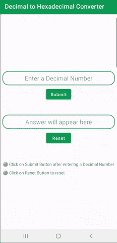
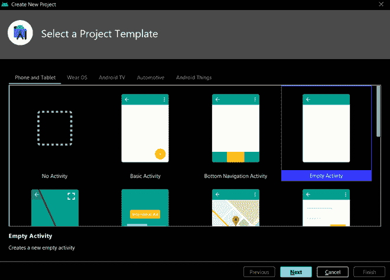
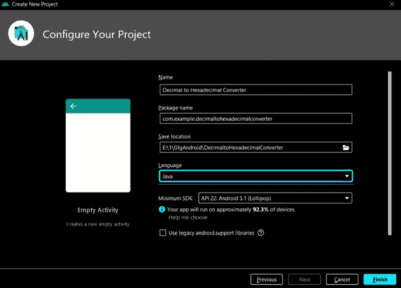
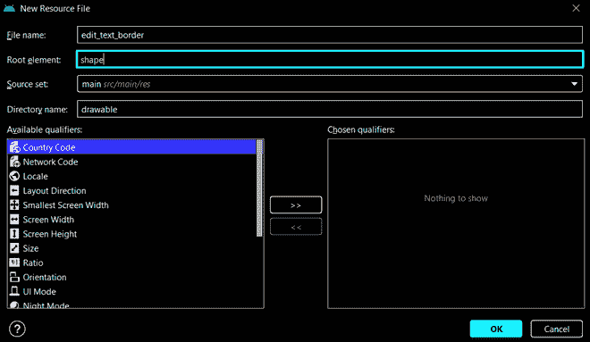
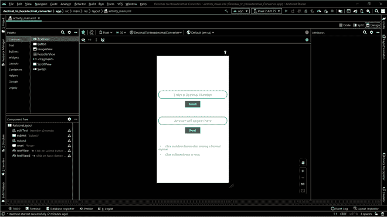
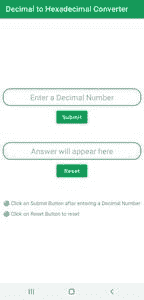
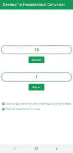

# 如何在安卓工作室搭建十进制到十六进制的转换器安卓 App？

> 原文:[https://www . geesforgeks . org/如何构建十进制到十六进制的转换器-Android-app-in-Android-studio/](https://www.geeksforgeeks.org/how-to-build-decimal-to-hexadecimal-converter-android-app-in-android-studio/)

在这篇文章中，我们将学习如何在**安卓工作室**的 **Java** 中制作一个**十进制到十六进制转换器应用程序**。这款应用将输入一个**十进制数**，将其转换为**十六进制数**，然后显示输出。因此，让我们简单回顾一下我们将如何制作该应用程序。

### 简要经历

我们将从首先**创建可绘制的资源文件**开始，并使用它的 XML 给[编辑文本](https://www.geeksforgeeks.org/working-with-the-edittext-in-android/)一个轮廓，我们将进一步实现它。之后，我们将使用 activity _ main . XML**，在这里我们将添加**两个编辑文本**，一个用于输入十进制数，另一个用于显示输出，**两个提交按钮**，提交按钮将提交输入并清除以重置输入，然后**两个文本视图**向用户显示如何使用应用程序的一些说明。最后，我们将与 MainActivity.java**一起工作，在那里我们实现一些功能，当用户点击按钮时，这些功能将完成整个转换。注意，我们要用 **Java** 编程语言实现整个应用。下面是工作应用程序的示例 gif，它将让您了解我们将在本文中制作什么。



### 逐步实施

**步骤 1:创建一个活动为空的新项目**

要在安卓工作室创建新项目，请参考[如何在安卓工作室创建/启动新项目](https://www.geeksforgeeks.org/android-how-to-create-start-a-new-project-in-android-studio/)。我们将首先选择一个项目模板，然后通过给出名称和选择我们制作应用程序的语言来配置我们的项目。注意选择 **Java** 作为编程语言。

 

**第二步:添加新的可绘制资源文件**

在这一步中，我们将通过导航到**app/RES/drawing**来添加新的可绘制资源文件，然后右键单击可绘制文件夹并转到**新建/可绘制资源文件**。


现在，我们将**命名可绘制的资源文件**并**选择根元素作为形状**。剩余的默认设置点击“确定”按钮。请注意，在命名资源文件时，**名称不应包含任何大写字母**。



**步骤 3:使用可绘制的资源文件**

在上一步中创建了可绘制的资源文件之后，现在我们必须用 XML 编写一些代码，以便它将**轮廓**提供给**编辑文本**。首先，我们将形状定义为“**矩形**”。然后**在形状上添加一个笔划**，它将在形状周围形成一个轮廓。在同一属性下，我们将指定笔画的**宽度**和**颜色**。最后，我们将通过指定拐角的半径在拐角处给出一个圆形。请参考下面的 XML 代码来理解上面的行:

## 可扩展标记语言

```
<?xml version="1.0" encoding="utf-8"?>
<shape xmlns:android="http://schemas.android.com/apk/res/android"
    android:shape = "rectangle">

    <stroke
        android:width="2dp"
        android:color="@color/gfg_official"/>

    <corners
        android:radius="20dp"/>

</shape>
```

**第 4 步:使用 activity_main.xml 文件**

导航到**app/RES/layout/activity _ main . XML**，并将下面的代码添加到该文件中。在 **activity_main.xml 文件**中，我们必须添加**两个 EditText** 用于**输入**和**输出** **文本**显示，**两个按钮**用于提交，这将**提交**输入，**清除**将其重置，我们还添加了**两个 TextView** 来显示一些文本，以便指导用户如何使用下面是 **activity_main.xml** 文件的代码。

## 可扩展标记语言

```
<?xml version="1.0" encoding="utf-8"?>
<RelativeLayout 
    xmlns:android="http://schemas.android.com/apk/res/android"
    xmlns:tools="http://schemas.android.com/tools"
    android:layout_width="match_parent"
    android:layout_height="match_parent"
    tools:context=".MainActivity">

    <EditText
        android:id="@+id/editText"
        android:layout_width="match_parent"
        android:layout_height="wrap_content"
        android:layout_marginLeft="8dp"
        android:layout_marginTop="200dp"
        android:layout_marginRight="8dp"
        android:background="@drawable/edit_text_border"
        android:hint="Enter a Decimal Number"
        android:inputType="numberDecimal"
        android:padding="10dp"
        android:textAlignment="center"
        android:textSize="20sp" />

    <Button
        android:id="@+id/submit"
        android:layout_width="wrap_content"
        android:layout_height="wrap_content"
        android:layout_below="@id/editText"
        android:layout_centerHorizontal="true"
        android:layout_margin="8dp"
        android:text="Submit"
        android:textAllCaps="false" />

    <EditText
        android:id="@+id/output"
        android:layout_width="match_parent"
        android:layout_height="wrap_content"
        android:layout_below="@id/submit"
        android:layout_marginLeft="8dp"
        android:layout_marginTop="40dp"
        android:layout_marginRight="8dp"
        android:background="@drawable/edit_text_border"
        android:hint="Answer will appear here"
        android:padding="10dp"
        android:textAlignment="center"
        android:textSize="20sp" />

    <Button
        android:id="@+id/reset"
        android:layout_width="wrap_content"
        android:layout_height="wrap_content"
        android:layout_below="@id/output"
        android:layout_centerHorizontal="true"
        android:layout_margin="8dp"
        android:text="Reset"
        android:textAllCaps="false" />

    <TextView
        android:id="@+id/textView"
        android:layout_width="wrap_content"
        android:layout_height="wrap_content"
        android:layout_below="@id/reset"
        android:layout_marginLeft="10dp"
        android:layout_marginTop="50dp"
        android:text="⚫ Click on Submit Button after entering a Decimal Number"
        android:textSize="15dp" />

    <TextView
        android:id="@+id/textView3"
        android:layout_width="wrap_content"
        android:layout_height="wrap_content"
        android:layout_below="@id/textView"
        android:layout_marginLeft="10dp"
        android:layout_marginTop="10dp"
        android:text="⚫ Click on Reset Button to reset"
        android:textSize="15dp" />

</RelativeLayout>
```

为应用程序编写完 XML 文件的代码后，**设计**看起来像这样:



**步骤 5:使用 MainActivity.java 文件**

转到**MainActivity.java 文件**并参考以下代码。**注释**添加在代码内部，以更详细地理解代码。

## Java 语言(一种计算机语言，尤用于创建网站)

```
import android.os.Bundle;
import android.view.View;
import android.widget.Button;
import android.widget.EditText;

import androidx.appcompat.app.AppCompatActivity;

public class MainActivity extends AppCompatActivity {

    // Giving name to the variables for two EditTexts and two Buttons
    // input is where the user will input the decimal number
    // output is where the user will get the output in the form of binary number
    // submit is the button created to submit the decimal number entered by the user
    // clear is the button to clear the answer
    EditText input, output;
    Button submit, reset;

    @Override
    protected void onCreate(Bundle savedInstanceState) {
        super.onCreate(savedInstanceState);
        setContentView(R.layout.activity_main);

        // Calling the EditText by id which we gave in xml file
        input = (EditText) findViewById(R.id.editText);
        output = (EditText) findViewById(R.id.output);

        submit = (Button) findViewById(R.id.submit);

        // It is set so that when the user clicks on submit button, the data
        // gets send in the function created below which will convert it and then
        // show the answer to the user in the output
        submit.setOnClickListener(new View.OnClickListener() {
            @Override
            public void onClick(View v) {

                // Creating a string method argument
                String string = input.getText().toString();

                // Here, we are parsing a string
                // method argument into an integer object
                int i = Integer.parseInt(string);

                // Converts and stores it in the form of string
                String hexadecimal = Integer.toHexString(i);

                // It will show the output in the 
                // second edit text that we created
                output.setText(hexadecimal);
            }
        });

        // Here, we will define a function which will 
        // clear the whole text and reset it
        reset = (Button) findViewById(R.id.reset);
        reset.setOnClickListener(new View.OnClickListener() {
            @Override
            public void onClick(View v) {
                input.setText("");
                output.setText("");
            }
        });

    }
}
```

**输出:**

#### 图像

 

#### 录像

<video class="wp-video-shortcode" id="video-601167-1" width="640" height="360" preload="metadata" controls=""><source type="video/mp4" src="https://media.geeksforgeeks.org/wp-content/uploads/20210504082422/video1.mp4?_=1">[https://media.geeksforgeeks.org/wp-content/uploads/20210504082422/video1.mp4](https://media.geeksforgeeks.org/wp-content/uploads/20210504082422/video1.mp4)</video>