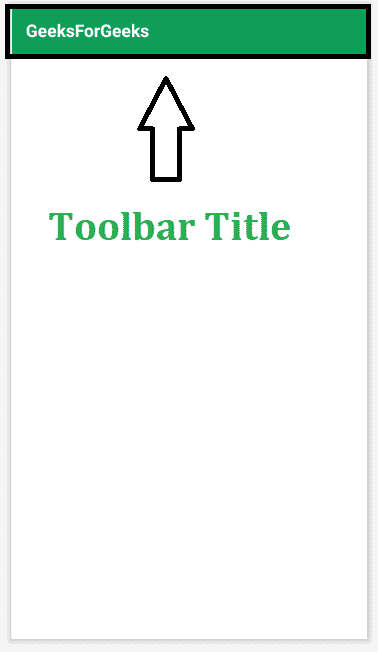

# 如何在安卓应用中更改工具栏标题的字体？

> 原文:[https://www . geesforgeks . org/如何更改工具栏字体-安卓应用标题/](https://www.geeksforgeeks.org/how-to-change-font-of-toolbar-title-in-an-android-app/)

谷歌字体提供了各种各样的字体，可用于在[安卓工作室](https://www.geeksforgeeks.org/android-how-to-create-start-a-new-project-in-android-studio/?ref=rp)中设置文本样式。合适的字体不仅能增强用户界面，还能表明和强调文本的目的。在本文中，您将学习如何在[安卓应用程序](https://www.geeksforgeeks.org/android-app-development-fundamentals-for-beginners/)中更改工具栏标题的字体系列。在安卓应用程序中，工具栏标题预设在应用程序的上部。下面是一个示例图像，显示了工具栏标题的位置。



有两种方法可以更改工具栏标题的字体。

### 方法 1:通过在活动文件中添加子文本视图

在方法 1 中，只需转到 activity_main.xml 文件，并在工具栏小部件中添加一个具有字体系列属性的 [TextView](https://www.geeksforgeeks.org/textview-in-kotlin/) 。 **activity_main.xml** 文件的完整代码如下。

## 可扩展标记语言

```java
<?xml version="1.0" encoding="utf-8"?>
<RelativeLayout 
    xmlns:android="http://schemas.android.com/apk/res/android"
    xmlns:tools="http://schemas.android.com/tools"
    android:layout_width="match_parent"
    android:layout_height="match_parent"
    tools:context=".MainActivity">

    <androidx.appcompat.widget.Toolbar
        android:id="@+id/toolbar"
        android:layout_width="match_parent"
        android:layout_height="?attr/actionBarSize"
        android:background="#0F9D58">

        <TextView
            android:id="@+id/custom_title"
            android:layout_width="wrap_content"
            android:layout_height="wrap_content"
            android:fontFamily="sans-serif-smallcaps"
            android:text="GeeksForGeeks"
            android:textColor="#FFFFFF"
            android:textSize="20sp"
            android:textStyle="bold" />

    </androidx.appcompat.widget.Toolbar>

</RelativeLayout>
```

**输出 UI:**


### 方法 2:通过编程设置文本字体

首先，在项目的**src/main/assets/font/**中添加一个字体文件。然后为工具栏和文本标题创建变量，并调用方法**findwiewbyid()**。从指定的字体数据创建一个新的字体。最后在文本标题中设置字体。以下是**MainActivity.java/MainActivity.kt**文件的完整代码。

## Java 语言(一种计算机语言，尤用于创建网站)

```java
import android.graphics.Typeface;
import android.os.Bundle;
import android.widget.TextView;
import androidx.appcompat.app.AppCompatActivity;
import androidx.appcompat.widget.Toolbar;

public class MainActivity extends AppCompatActivity {
    @Override
    protected void onCreate(Bundle savedInstanceState) {
        super.onCreate(savedInstanceState);
        setContentView(R.layout.activity_main);

        Toolbar toolbar = findViewById(R.id.toolbar);

        // Custom title
        TextView textCustomTitle = (TextView) findViewById(R.id.custom_title);

        // Custom font
        Typeface customFont = Typeface.createFromAsset(this.getAssets(), "fonts/sans-serif-smallcaps.ttf");

        // Set
        textCustomTitle.setTypeface(customFont);

        setSupportActionBar(toolbar);
    }
}
```

## 我的锅

```java
import android.graphics.Typeface
import android.os.Bundle
import android.widget.TextView
import androidx.appcompat.app.AppCompatActivity
import androidx.appcompat.widget.Toolbar

class MainActivity : AppCompatActivity() {
    override fun onCreate(savedInstanceState: Bundle?) {
        super.onCreate(savedInstanceState)
        setContentView(R.layout.activity_main)

        val toolbar: Toolbar = findViewById(R.id.toolbar)

        // Custom title
        val textCustomTitle: TextView = findViewById(R.id.custom_title)

        // Custom font
        val customFont = Typeface.createFromAsset(this.assets, "fonts/sans-serif-smallcaps.ttf")

        // Set
        textCustomTitle.typeface = customFont
        setSupportActionBar(toolbar)
    }
}
```

对应的 **activity_main.xml** 文件如下。

## 可扩展标记语言

```java
<?xml version="1.0" encoding="utf-8"?>
<RelativeLayout 
    xmlns:android="http://schemas.android.com/apk/res/android"
    xmlns:tools="http://schemas.android.com/tools"
    android:layout_width="match_parent"
    android:layout_height="match_parent"
    tools:context=".MainActivity">

    <androidx.appcompat.widget.Toolbar
        android:id="@+id/toolbar"
        android:layout_width="match_parent"
        android:layout_height="?attr/actionBarSize"
        android:background="?attr/colorPrimary">

        <TextView
            android:id="@+id/custom_title"
            android:layout_width="wrap_content"
            android:layout_height="wrap_content"
            android:text="GeeksForGeeks"
            android:textColor="#FFFFFF"
            android:textSize="20sp"
            android:textStyle="bold" />

    </androidx.appcompat.widget.Toolbar>

</RelativeLayout>
```

**输出 UI:**

