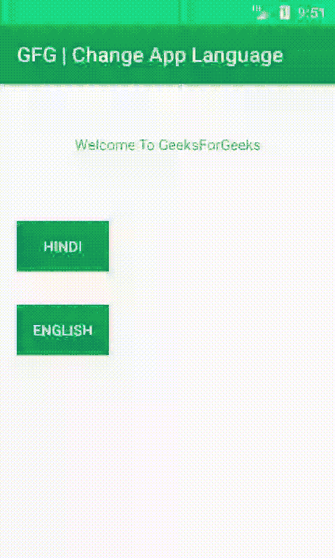
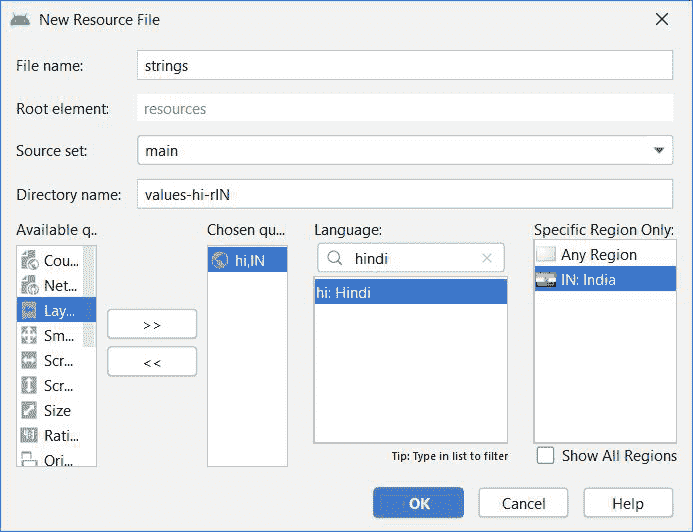

# 如何以编程方式改变安卓中的整个 App 语言？

> 原文:[https://www . geesforgeks . org/如何以编程方式改变整个安卓应用程序语言/](https://www.geeksforgeeks.org/how-to-change-the-whole-app-language-in-android-programmatically/)

安卓 7.0(API 级别 24)为多语言用户提供支持，允许用户在设置中选择多个语言环境。一个**场所**对象代表一个特定的地理、政治或文化区域。需要这些区域设置来执行任务的操作称为**区域敏感**，并使用区域设置为用户定制信息。例如，显示一个数字是一项区分区域设置的操作，因此应该根据用户的原生区域、文化或国家的惯例来设置数字的格式。

### **例**

在这个例子中，我们将创建一个简单的应用程序，其中用户可以选择他想要的语言- **英语**或**印地语**。这将改变整个应用程序的语言。下面给出了一个 GIF 示例，以了解我们在本文中要做什么。注意，我们将使用 **Java** 语言来实现这个项目。



### **分步实施**

**第一步:创建新项目**

要在安卓工作室创建新项目，请参考[如何在安卓工作室创建/启动新项目](https://www.geeksforgeeks.org/android-how-to-create-start-a-new-project-in-android-studio/)。注意选择 **Java** 作为编程语言。

**第二步:创建资源文件**

> **参考:**安卓工作室中的[资源原始文件夹](https://www.geeksforgeeks.org/resource-raw-folder-in-android-studio/)

在这一步中，我们需要为印地语创建一个字符串资源文件。转到**应用程序>资源>值>右键单击>新建>值资源文件**并将其命名为字符串。现在，我们必须从可用列表中选择限定符作为 Locale，并从下拉列表中选择语言作为 Hindi。下面是要执行的步骤的图片。

 

现在，在这个资源文件**中，在代码片段中添加下面给出的代码。**

## 可扩展标记语言

```
<resources>
    <string name="app_name">GFG | Change App Language</string>
    <string name="selected_language">हिन्दी</string>
    <string name="language">नमस्ते, जी यफ जी</string>
</resources>
```

并且在 **string.xml** 文件中(默认为英文)添加这些行。

## 可扩展标记语言

```
<resources>
    <string name="app_name">GFG | Change App Language</string>
    <string name="selected_language">English</string>
    <string name="language">Hi, GFG</string>
</resources>
```

在进一步移动之前，让我们添加一些颜色属性，以增强应用程序栏。转到**应用程序> res >值> colors.xml** 并添加以下颜色属性。

## 可扩展标记语言

```
<resources> 
    <color name="colorPrimary">#0F9D58</color> 
    <color name="colorPrimaryDark">#16E37F</color> 
    <color name="colorAccent">#03DAC5</color> 
</resources> 
```

**步骤 3:为应用程序创建布局文件**

在这一步中，我们将为应用程序创建一个布局。转到**应用程序> res >布局> activity_main.xml** 并添加两个[文本视图](https://www.geeksforgeeks.org/textview-widget-in-android-using-java-with-examples/)，一个用于消息，一个用于所选语言，一个[图像视图](https://www.geeksforgeeks.org/imageview-in-kotlin/)用于下拉图标。下面是 activity_main.xml 文件的代码片段。

## 可扩展标记语言

```
<?xml version="1.0" encoding="utf-8"?>
<LinearLayout 
    xmlns:android="http://schemas.android.com/apk/res/android"
    xmlns:app="http://schemas.android.com/apk/res-auto"
    xmlns:tools="http://schemas.android.com/tools"
    android:layout_width="match_parent"
    android:layout_height="match_parent"
    android:orientation="vertical"
    tools:context=".MainActivity">

    <!--text view for the message to display-->
    <TextView
        android:id="@+id/textView"
        android:layout_width="match_parent"
        android:layout_height="wrap_content"
        android:layout_margin="48dp"
        android:text="Welcome To GeeksForGeeks"
        android:textAlignment="center" />

    <!--button view for hindi language-->
    <Button
        android:id="@+id/btnHindi"
        android:layout_margin="16dp"
        android:background="@color/colorPrimary"
        android:textColor="#ffffff"
        android:layout_width="wrap_content"
        android:layout_height="wrap_content"
        android:text="Hindi"/>

    <!--button view for english language-->
    <Button
        android:id="@+id/btnEnglish"
        android:layout_margin="16dp"
        android:background="@color/colorPrimary"
        android:textColor="#ffffff"
        android:layout_width="wrap_content"
        android:layout_height="wrap_content"
        android:text="English"/>

</LinearLayout>
```

**第四步:创建本地类**

现在，我们将创建一个区域助手类。这个类包含所有有助于运行时语言转换的函数。转到 **app > java >包>右键新建一个 java 类**，命名为 **LocaleHelper** 。下面是为 LocaleHelper 类给出的代码片段。

## Java 语言(一种计算机语言，尤用于创建网站)

```
import android.annotation.TargetApi;
import android.content.Context;
import android.content.SharedPreferences;
import android.content.res.Configuration;
import android.content.res.Resources;
import android.os.Build;
import android.preference.PreferenceManager;

import java.util.Locale;

public class LocaleHelper {
        private static final String SELECTED_LANGUAGE = "Locale.Helper.Selected.Language";

        // the method is used to set the language at runtime
        public static Context setLocale(Context context, String language) {
            persist(context, language);

            // updating the language for devices above android nougat
            if (Build.VERSION.SDK_INT >= Build.VERSION_CODES.N) {
                return updateResources(context, language);
            }
            // for devices having lower version of android os
            return updateResourcesLegacy(context, language);
        }

        private static void persist(Context context, String language) {
            SharedPreferences preferences = PreferenceManager.getDefaultSharedPreferences(context);
            SharedPreferences.Editor editor = preferences.edit();
            editor.putString(SELECTED_LANGUAGE, language);
            editor.apply();
        }

        // the method is used update the language of application by creating
        // object of inbuilt Locale class and passing language argument to it
        @TargetApi(Build.VERSION_CODES.N)
        private static Context updateResources(Context context, String language) {
            Locale locale = new Locale(language);
            Locale.setDefault(locale);

            Configuration configuration = context.getResources().getConfiguration();
            configuration.setLocale(locale);
            configuration.setLayoutDirection(locale);

            return context.createConfigurationContext(configuration);
        }

        @SuppressWarnings("deprecation")
        private static Context updateResourcesLegacy(Context context, String language) {
            Locale locale = new Locale(language);
            Locale.setDefault(locale);

            Resources resources = context.getResources();

            Configuration configuration = resources.getConfiguration();
            configuration.locale = locale;
            if (Build.VERSION.SDK_INT >= Build.VERSION_CODES.JELLY_BEAN_MR1) {
                configuration.setLayoutDirection(locale);
            }

            resources.updateConfiguration(configuration, resources.getDisplayMetrics());

            return context;
        }
    }
```

**步骤 5:使用 MainActivity.java 文件**

在这一步中，我们将实现 Java 代码来在 string.xml 文件之间切换，以使用各种语言。首先，我们将初始化所有视图，并在[警报对话框](https://www.geeksforgeeks.org/android-alert-dialog-box-and-how-to-create-it/)上设置点击行为，以便在**本地帮助程序**类的帮助下选择所需的语言。下面是为**MainActivity.java**类给出的代码片段。

## Java 语言(一种计算机语言，尤用于创建网站)

```
import androidx.appcompat.app.AppCompatActivity;

import android.content.Context;
import android.content.res.Resources;
import android.os.Bundle;
import android.view.View;
import android.widget.Button;
import android.widget.TextView;

public class MainActivity extends AppCompatActivity {
    TextView messageView;
    Button btnHindi, btnEnglish;
    Context context;
    Resources resources;

    @Override
    protected void onCreate(Bundle savedInstanceState) {
        super.onCreate(savedInstanceState);
        setContentView(R.layout.activity_main);

        // referencing the text and button views
        messageView = (TextView) findViewById(R.id.textView);
        btnHindi = findViewById(R.id.btnHindi);
        btnEnglish = findViewById(R.id.btnEnglish);

        // setting up on click listener event over the button
        // in order to change the language with the help of 
          // LocaleHelper class
        btnEnglish.setOnClickListener(new View.OnClickListener() {
            @Override
            public void onClick(View view) {
                context = LocaleHelper.setLocale(MainActivity.this, "en");
                resources = context.getResources();
                messageView.setText(resources.getString(R.string.language));
            }
        });

        btnHindi.setOnClickListener(new View.OnClickListener() {
            @Override
            public void onClick(View view) {
                context = LocaleHelper.setLocale(MainActivity.this, "hi");
                resources = context.getResources();
                messageView.setText(resources.getString(R.string.language));
            }
        });

    }
}
```

### **输出:**

<video class="wp-video-shortcode" id="video-536123-1" width="640" height="360" preload="metadata" controls=""><source type="video/mp4" src="https://media.geeksforgeeks.org/wp-content/uploads/20210103143640/Change-the-Whole-App-Language-in-Android.mp4?_=1">[https://media.geeksforgeeks.org/wp-content/uploads/20210103143640/Change-the-Whole-App-Language-in-Android.mp4](https://media.geeksforgeeks.org/wp-content/uploads/20210103143640/Change-the-Whole-App-Language-in-Android.mp4)</video>