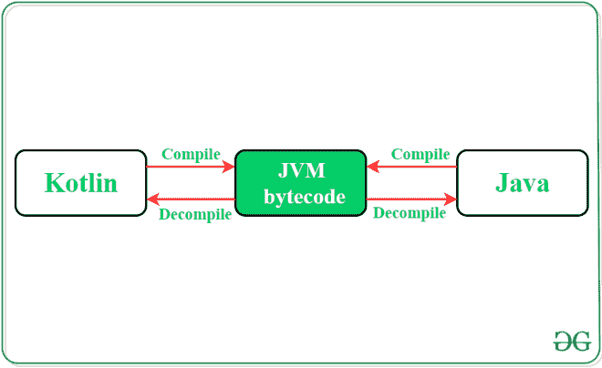
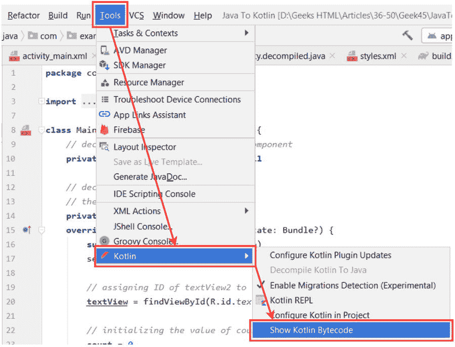
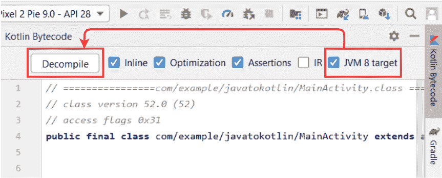

# 如何在安卓 Studio 中将 Kotlin 代码转换成 Java 代码？

> 原文:[https://www . geesforgeks . org/how-convert-kot Lin-code-to-Java-code-in-Android-studio/](https://www.geeksforgeeks.org/how-to-convert-kotlin-code-to-java-code-in-android-studio/)

[**Java**](https://www.geeksforgeeks.org/java/) 编程语言是[安卓 app 开发](https://www.geeksforgeeks.org/kotlin-android-tutorial/)最古老、最首选的语言。然而在**谷歌 I/O 2017** 期间，Kotlin 已经被谷歌安卓团队宣布为安卓开发的官方语言。由于 Kotlin 与 Java 语言的相似性和互操作性，它很快在开发人员中流行起来。人们可以在设计安卓项目时混合使用 Java 和 Kotlin 的代码。Java 和 Kotlin 的语法在很多方面都不同，但是它们的编译过程几乎是一样的。这两种语言的代码被编译成字节码，可在 [**Java 虚拟机**](https://www.geeksforgeeks.org/jvm-works-jvm-architecture/) 上执行。因此，如果一个人可以得到编译过的 Kotlin 文件的字节码，那么它可以被反编译以产生等价的 Java 代码。[安卓工作室](https://www.geeksforgeeks.org/guide-to-install-and-set-up-android-studio/)做的完全一样，进行从 Kotlin 到 Java 的代码转换。开发人员可能有许多理由将 Kotlin 代码转换为 Java，例如:

*   **集成易于用 Java 语言实现的特性。**
*   **解决一些在科特林难以定位的性能问题。**
*   **从项目文件中删除科特林代码。**



### 代码转换

**第一步:打开 Kotlin 类/文件**

打开要转换成 Java 的 Kotlin 类/文件。考虑下面提到的**主活动文件**的代码进行转换。

## 我的锅

```java
import android.os.Bundle
import android.view.View
import android.widget.TextView
import androidx.appcompat.app.AppCompatActivity

class MainActivity : AppCompatActivity() {
    // declaring variable for TextView component
    private var textView: TextView? = null

    // declaring variable to store
    // the number of button click
    private var count = 0
    override fun onCreate(savedInstanceState: Bundle?) {
        super.onCreate(savedInstanceState)
        setContentView(R.layout.activity_main)

        // assigning ID of textView2 to the variable
        textView = findViewById(R.id.textView2)

        // initializing the value of count with 0
        count = 0
    }

    // function to perform operations
    // when button is clicked
    fun buttonOnClick(view: View?) {
        // increasing count by one on
        // each tap on the button
        count++

        // changing the value of the
        // textView with the current
        // value of count variable
        textView!!.text = Integer.toString(count)
    }
}
```

**步骤 2:导航至工具菜单**

从安卓工作室最顶端的工具栏中，选择**工具**，然后导航至**科特林>显示科特林字节码**。它将在右侧打开一个窗口，其中包含 Kotlin 文件的逐行字节码。



**第三步:反编译字节码**

在字节码窗口中，勾选选项**“JVM 8 目标”**，并点击**反编译。**安卓工作室将为 Kotlin 文件生成 Java 等效代码。生成的 java 代码将包含一些附加信息，比如元数据。下面是为上述 Kotlin 文件生成的 Java 代码。



## Java 语言(一种计算机语言，尤用于创建网站)

```java
import android.os.Bundle;
import android.view.View;
import android.widget.TextView;
import androidx.appcompat.app.AppCompatActivity;
import kotlin.Metadata;
import kotlin.jvm.internal.Intrinsics;
import org.jetbrains.annotations.Nullable;

@Metadata(
   mv = {1, 4, 1},
   bv = {1, 0, 3},
   k = 1,
   d1 = {"\u0000,\n\u0002\u0018\u0002\n\u0002\u0018\u0002\n\u0002\b\u0002\n\u0002\u0010\b\n\u0000\n\u0002\u0018\u0002\n\u0000\n\u0002\u0010\u0002\n\u0000\n\u0002\u0018\u0002\n\u0002\b\u0002\n\u0002\u0018\u0002\n\u0000\u0018\u00002\u00020\u0001B\u0005¢\u0006\u0002\u0010\u0002J\u0010\u0010\u0007\u001a\u00020\b2\b\u0010\t\u001a\u0004\u0018\u00010\nJ\u0012\u0010\u000b\u001a\u00020\b2\b\u0010\f\u001a\u0004\u0018\u00010\rH\u0014R\u000e\u0010\u0003\u001a\u00020\u0004X\u0082\u000e¢\u0006\u0002\n\u0000R\u0010\u0010\u0005\u001a\u0004\u0018\u00010\u0006X\u0082\u000e¢\u0006\u0002\n\u0000¨\u0006\u000e"},
   d2 = {"Lcom/example/javatokotlin/MainActivity;", "Landroidx/appcompat/app/AppCompatActivity;", "()V", "count", "", "textView", "Landroid/widget/TextView;", "buttonOnClick", "", "view", "Landroid/view/View;", "onCreate", "savedInstanceState", "Landroid/os/Bundle;", "app"}
)
public final class MainActivity extends AppCompatActivity {
   private TextView textView;
   private int count;

   protected void onCreate(@Nullable Bundle savedInstanceState) {
      super.onCreate(savedInstanceState);
      this.setContentView(1300009);
      this.textView = (TextView)this.findViewById(1000069);
      this.count = 0;
   }

   public final void buttonOnClick(@Nullable View view) {
      int var10001 = this.count++;
      TextView var10000 = this.textView;
      Intrinsics.checkNotNull(var10000);
      var10000.setText((CharSequence)Integer.toString(this.count));
   }
}
```

> **注意:**Kotlin 到 Java 代码的转换不会在可以访问 Java 代码的项目目录中创建新文件。因此，要使用安卓工作室生成的 java 代码，需要从显示的反编译 Java 文件中复制它。

### **Java 相对于 Kotlin 的优势**

*   运算符重载是不可能的。
*   默认情况下，用 Java 编写的类不会成为最终类。
*   更易读的语法。
*   静态方法和变量的使用。