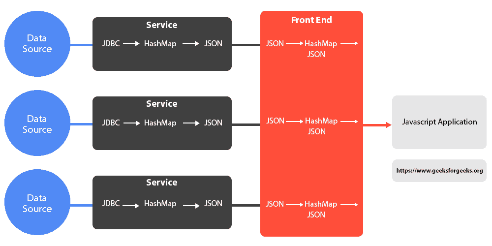
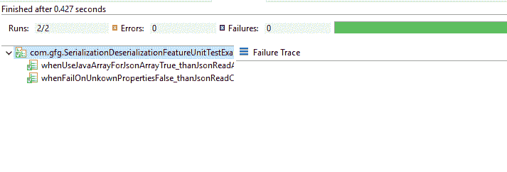

# 如何在 Java 中将 Map 转换为 JSON 转换为 HashMap？

> 原文:[https://www . geesforgeks . org/how-convert-map-to-JSON-to-hashmap-in-Java/](https://www.geeksforgeeks.org/how-to-convert-map-to-json-to-hashmap-in-java/)

JSON 是一种开放的标准文件格式，更容易的数据交换格式有助于人类传输数据。大多数应用程序显示 JSON 数据，因此现在 JSON 已经成为传输数据的强制媒体。这里我们将了解如何将 Map 转换为 JSON，对于 Map，让我们将 HashMap 作为一组输入数据。



**安装:**

**步骤 1:** 对于与控制台相关的 Java 部分，我们需要从下面提供的链接下载 jar。下载 jar，提取它们，并将 jar 放在项目的构建路径中

> http://www.java2s.com/Code/Jar/j/Downloadjacksonannotations212jar.htm
> 
> http://www.java2s.com/Code/Jar/c/Downloadcomfasterxmljacksondatabindjar.htm

**步骤 2(A):** 对于 Maven 项目，在“ *pom.xml 文件中需要以下依赖项。”*

```java
<dependency>
  <groupId>com.fasterxml.jackson.core</groupId>
   <artifactId>jackson-databind</artifactId>
   <version>2.9.6</version>
</dependency>
```

**第二步(B):** 对于**梯度**项目，如下:

```java
dependencies
{

   // a dependency on Jackson Databind
   implementation 'com.fasterxml.jackson.core:jackson-databind:2.8.9'
}
```

**实施:**

让我们看一个数据 HashMap 的例子。HashMap 的优点是以不同步的方式将数据存储在键、值对中。

我们将把学生标识、学生名字、学生姓氏、学生流和学生标记作为哈希映射的关键元素。使用 com . fasterxml . Jackson . databind . object mapper，我们正在将 HashMap 转换为 JSON。让我们看一个简单的 Java 应用程序。ObjectMapper 是 Jackson 库中的主要基本类，有助于读写 JSON，可以是往返于基本 POJO(普通旧 Java 对象)或包含键/值对的 HashMap。

在这里，我们将在代码中使用一个名为“writeValueAsString()”的方法，该方法可用于将任何 Java 值序列化为字符串。这里我们将数据的 HashMap 作为对象传递，并将它们序列化为字符串。当使用对象映射器时，它编写 JSON 字符串。

**例 1:**

## Java 语言(一种计算机语言，尤用于创建网站)

```java
// Java Program to Convert Map to JSON to HashMap

// Importing required basic libraries
// Importing required classes from com.fasterxml.jackson
// package
import com.fasterxml.jackson.core.JsonGenerationException;
import com.fasterxml.jackson.databind.JsonMappingException;
import com.fasterxml.jackson.databind.ObjectMapper;
import java.io.IOException;
import java.util.HashMap;

// Main class
// MapToJSONExample
public class GFG {

    // Main driver method
    public static void main(String[] args)
    {

        // Creating an object of HashMap class
        // Declaring object of String and Object type
        HashMap<String, Object> studentHashmap
            = new HashMap<String, Object>();

        // Let us hold studentHashmap containing
        // 1\. studentId
        // 2\. studentFirstName
        // 3\. studentLastName
        // 4\. studentStream
        // 5\. studentMarks

        // Custom input entries
        studentHashmap.put("studentId", 1);
        studentHashmap.put("studentFirstName", "AAA");
        studentHashmap.put("studentLastName", "BBB");
        studentHashmap.put("studentStream", "PCMB");
        studentHashmap.put("studentMarks", "480");

        // ObjectMapper object is a reusable object.
        // ObjectMapper is the main essential class in
        // Jackson library which helps for reading and
        // writing JSON, either to and from basic POJOs
        // (Plain Old Java Objects) or from HashMap
        // containing key/value pairs.
        ObjectMapper mapper = new ObjectMapper();

        // Try block to check fo exceptions
        try {

            // Convert studentHashmap to JSON
            // In method writeValueAsString(Object object),
            // we are using this method in the code and that
            // can be used to serialize any Java value as a
            // String. Here we are passing HashMap of data
            // as object and it serializes them as string .
            // As ObjectMapper is used, it writes JSON
            // string
            String studentJson
                = mapper.writeValueAsString(studentHashmap);

            // Print JSON output
            System.out.println(studentJson);
        }

        // There are possibilities of following exceptions,
        // so catch block to handle the exceptions
        catch (JsonGenerationException e) {

            // Printing the exception along with line number
            // using the printStackTrace() method
            e.printStackTrace();
        }

        // Catch block 2
        catch (JsonMappingException e) {
            e.printStackTrace();
        }

        // Catch block 3
        // Catching generic input output exceptions
        catch (IOException e) {
            e.printStackTrace();
        }
    }
}
```

**输出:**


继续下一个例子。在这个例子中，让我们看看如何使用对象映射器将 JSON 数据转换为 Map。我们将在这里使用 readValue()将 JSON 内容反序列化为非容器类型。在这个例子中，作为一个映射类，JSON 内容被反序列化。

```java
readValue(JsonParser p, Class<T> valueType)
```

**例 2:**

## Java 语言(一种计算机语言，尤用于创建网站)

```java
// Java Program to Convert Map to JSON to HashMap

// Importing utility and input output classes
// Importing ObjectMapper class
import com.fasterxml.jackson.databind.ObjectMapper;
import java.io.IOException;
import java.util.Map;

// Main class
// To convert JSON to Map
public class GFG {

    // Main driver method
    public static void main(String[] args)
    {

        // Creating an object of ObjectMapper class
        // in the main() method
        ObjectMapper mapper = new ObjectMapper();

        // Custom string data in JSON
        String studentJsonData
            = "{\"studentId\":\"1\", \"studentFirstName\":\"AAA\",\"studentLastName\":\"BBB\",\"studentStream\":\"PCMB\",\"studentMarks\":\"480\"}";

        // Try block to handle the exceptions
        try {

            // Convert JSON string to Map
            // This method deserializes JSON content into a
            // non-container type. In our example as a Map
            // class, JSON content is deserialized.
            Map<String, String> studentMapData
                = mapper.readValue(studentJsonData,
                                   Map.class);
            System.out.println(studentMapData);
        }

        // Catch block to handle the exceptions
        catch (IOException e) {

            // Display and print the exceptions along with
            // line number using printStackTrace() method
            e.printStackTrace();
        }
    }
}
```

**输出:**


**输出解释:**

这里，正如我们在示例 1 和示例 2 中看到的，有可能产生**jsonmapingexception**，这可能发生在“无法构造实例”/“没有合适的构造函数”/“根名称与预期不匹配”/“找不到类的序列化程序”等情况下。所以无论何时从 HashMap 到 JSON 或者 JSON 到 HashMap 的转换存在，都有可能出现上述异常，因此我们需要处理它。除此之外，JsonGenerationException 和 IOException 也是可能的，我们需要处理它

前进到下一个例子，让我们考虑一个有点复杂的例子，并通过 JunitTestCase 提供结果。这里我们将 JSON 内容反序列化到 [POJO 类](https://www.geeksforgeeks.org/pojo-vs-java-beans/)中

**例 3(A):** POJO 类即 Automobiles.java 包含 3 个属性即颜色/类型/名称

## Java 语言(一种计算机语言，尤用于创建网站)

```java
// Java Program illustratiing Simple POJO class only
// containing 3 attributes namely color/type/name

public class Automobiles {

    // Any kind of automobiles can have these attributes and
    // for simplicity let us keep this
    private String color;
    private String type;
    private String name;

    // Constructor 1
    // Default constructor of this class
    public Automobiles() {}

    // Constructor 2
    // Parameterized constructor of this class
    public Automobiles(final String color,
                       final String type, final String name)
    {

        // This keyword refers to current instance itself
        this.color = color;
        this.type = type;
        this.name = name;
    }

    // Method 1
    public String getName() { return name; }

    // Method 2
    public void setName(String name) { this.name = name; }

    // Method 3
    public String getColor() { return color; }

    // Method 4
    public void setColor(final String color)
    {
        this.color = color;
    }

    // Method 5
    public String getType() { return type; }

    // Method 6
    public void setType(final String type)
    {
        this.type = type;
    }
}
```

现在，让我们编写 JunitTestCases，并检查反序列化功能在下面的示例中是如何工作的，如下所示:

**例 3(B):**

## Java 语言(一种计算机语言，尤用于创建网站)

```java
// Java Program to Convert Map to JSON to HashMap

import static org.junit.Assert.assertNotNull;
import static org.junit.Assert.assertTrue;

import com.fasterxml.jackson.databind.DeserializationFeature;
import com.fasterxml.jackson.databind.ObjectMapper;
import org.junit.Test;

public class
    SerializationDeserializationFeatureUnitTestExample {
    final String EXAMPLE_JSON
        = "{ \"color\" : \"Black\", \"type\" : \"BMW\" }";
    final String JSON_CAR
        = "{ \"color\" : \"Red\", \"type\" : \"Honda WRV\", \"year\" : \"2018\" }";
    final String JSON_ARRAY
        = "[{ \"color\" : \"Blue\", \"type\" : \"Sedan\",\"name\" : \"Honda City\" }, { \"color\" : \"Red\", \"type\" : \"Hatchback\",\"name\" : \"Santro\"  }]";

    @Test
    public void
    whenFailOnUnkownPropertiesFalse_thanJsonReadCorrectly()
        throws Exception
    {
        // ObjectMapper is the main essential class in
        // Jackson library which helps for reading and
        // writing JSON, and in this example it is from POJO
        // class that is our Automobiles class
        final ObjectMapper objectMapper
            = new ObjectMapper();
        // Reason for setting
        // DeserializationFeature.FAIL_ON_UNKNOWN_PROPERTIES
        // to false is that it will tell Jackson to ignore
        // unknown attributes in all deserializations where
        // that object mapper is used.
        objectMapper.configure(
            DeserializationFeature
                .FAIL_ON_UNKNOWN_PROPERTIES,
            false);
        // readValue(JsonParser p, Class<T> valueType) -
        // This method deserializes JSON content into a
        // non-container type. In our example it is
        // Automobiles class, JSON content is deserialized.
        final Automobiles automobiles
            = objectMapper.readValue(JSON_CAR,
                                     Automobiles.class);
        assertNotNull(automobiles);
    }

    @Test
    public void
    whenUseJavaArrayForJsonArrayTrue_thanJsonReadAsArray()
        throws Exception
    {
        final ObjectMapper objectMapper
            = new ObjectMapper();
        // Reason for setting
        // DeserializationFeature.FAIL_ON_UNKNOWN_PROPERTIES
        // to true is that it will tell Jackson to consider
        // attributes in all deserializations where that
        // object mapper is used.
        objectMapper.configure(
            DeserializationFeature
                .USE_JAVA_ARRAY_FOR_JSON_ARRAY,
            true);
        final Automobiles[] automobiles
            = objectMapper.readValue(JSON_ARRAY,
                                     Automobiles[].class);
        for (final Automobiles car : automobiles) {
            assertNotNull(car);
        }
        assertTrue(
            automobiles[1].getName().equalsIgnoreCase(
                "Santro"));
        assertTrue(
            automobiles[0].getType().equalsIgnoreCase(
                "Sedan"));
    }
}
```

**输出:**运行完这些 JUnits 后



> **结论:**构建到 JSON 的 Map 和 JSON 到 Map 的逆向方式是软件行业遵循的标准机制。它们在软件项目的许多地方都非常有用。