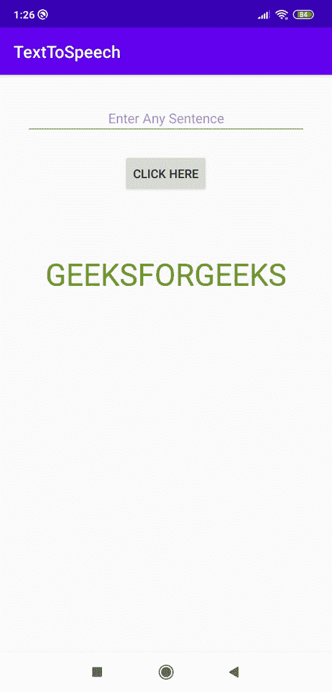
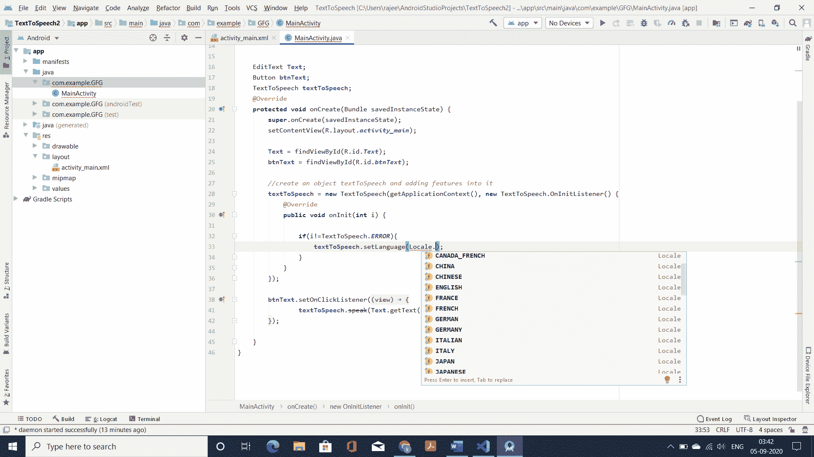

# 如何在安卓系统中将文字转换成语音？

> 原文:[https://www . geesforgeks . org/如何在 android 中将文本转换为语音/](https://www.geeksforgeeks.org/how-to-convert-text-to-speech-in-android/)

**文字转语音 App** 将屏幕上写的文字转换为语音，就像你在屏幕上写了“Hello World”一样，按下按钮，它就会说“Hello World”。文本到语音转换通常被用作辅助功能来帮助那些阅读屏幕文本有困难的人，但对于那些也想被阅读的人来说也很方便。这个功能对于用户来说是一个非常常见和有用的功能。



> **注意:**要实现其反过来也就是将语音转换为文本，请参考[如何在安卓系统中将语音转换为文本？](https://www.geeksforgeeks.org/how-to-convert-speech-to-text-in-android/)

### 安卓系统中文本转换为语音的步骤

**第一步:创建新项目**

要在安卓工作室创建新项目，请参考[如何在安卓工作室创建/启动新项目](https://www.geeksforgeeks.org/android-how-to-create-start-a-new-project-in-android-studio/)。注意选择 [Java](https://www.geeksforgeeks.org/java/) 作为编程语言。

**步骤 2:** **使用 activity_main.xml 文件**

转到**应用- > res - >布局- > activity_main.xml** 部分，设置应用的布局。在这个文件中，添加一个[编辑文本](https://www.geeksforgeeks.org/edittext-widget-in-android-using-java-with-examples/)来输入用户的文本，一个[按钮](https://www.geeksforgeeks.org/button-in-kotlin/)，这样每当用户点击按钮时，它就被转换成语音，一个[文本视图](https://www.geeksforgeeks.org/textview-widget-in-android-using-java-with-examples/)来显示极客博客的文本。下面是 **activity_main.xml** 文件的完整代码。

## activity_main.xml

```
<?xml version="1.0" encoding="utf-8"?>
<LinearLayout 
    xmlns:android="http://schemas.android.com/apk/res/android"
    xmlns:app="http://schemas.android.com/apk/res-auto"
    xmlns:tools="http://schemas.android.com/tools"
    android:layout_width="match_parent"
    android:layout_height="match_parent"
    android:orientation="vertical"
    android:layout_margin="30dp"
    tools:context=".MainActivity">

    <!--To add text in the app-->
    <EditText
        android:layout_width="match_parent"
        android:layout_height="wrap_content"
        android:id="@+id/Text"
        android:layout_marginBottom="20dp"
        android:hint="Enter Any Sentence"
        android:gravity="center"
        android:textSize="16dp"/>

    <!--when you press this button it will 
        convert text into speech-->
    <Button
        android:layout_width="wrap_content"
        android:id="@+id/btnText"
        android:layout_height="wrap_content"
        android:text="Click Here"
        android:layout_gravity="center"/>

    <!--To display the name of GeeksForGeeks -->
    <TextView
        android:id="@+id/textView"
        android:layout_width="match_parent"
        android:layout_height="wrap_content"
        android:layout_marginTop="70dp"
        android:gravity="center_horizontal"
        android:text="GEEKSFORGEEKS"
        android:textColor="@android:color/holo_green_dark"
        android:textSize="36sp" />

</LinearLayout>
```

**第三步:使用 MainActivity.java 文件**

转到应用-> java -> com.example.GFG(包名)-> MainActivity.java 部分。现在，将按钮和编辑文本加入到 Java 代码中，并在代码中添加注释，以便于理解代码。以下是**MainActivity.java**文件的完整代码。

## MainActivity.java

```
import androidx.appcompat.app.AppCompatActivity;
import android.os.Bundle;
import android.speech.tts.TextToSpeech;
import android.view.View;
import android.widget.Button;
import android.widget.EditText;
import java.util.Locale;

public class MainActivity extends AppCompatActivity {

    EditText Text;
    Button btnText;
    TextToSpeech textToSpeech;
    @Override
    protected void onCreate(Bundle savedInstanceState) {
        super.onCreate(savedInstanceState);
        setContentView(R.layout.activity_main);

        Text = findViewById(R.id.Text);
        btnText = findViewById(R.id.btnText);

        // create an object textToSpeech and adding features into it
        textToSpeech = new TextToSpeech(getApplicationContext(), new TextToSpeech.OnInitListener() {
            @Override
            public void onInit(int i) {

                // if No error is found then only it will run
                if(i!=TextToSpeech.ERROR){ 
                    // To Choose language of speech
                    textToSpeech.setLanguage(Locale.UK); 
                }
            }
        });

        // Adding OnClickListener
        btnText.setOnClickListener(new View.OnClickListener() {
            @Override
            public void onClick(View view) {
                textToSpeech.speak(Text.getText().toString(),TextToSpeech.QUEUE_FLUSH,null);
            }
        });

    }
}
```

用户也可以选择另一种语言。关于这一点，请参考下图，了解如何做到这一点。



### 输出:在模拟器上运行

<video class="wp-video-shortcode" id="video-482678-1" width="640" height="360" preload="metadata" controls=""><source type="video/mp4" src="https://media.geeksforgeeks.org/wp-content/uploads/20200905034625/WhatsApp-Video-2020-09-05-at-01.26.40.mp4?_=1">[https://media.geeksforgeeks.org/wp-content/uploads/20200905034625/WhatsApp-Video-2020-09-05-at-01.26.40.mp4](https://media.geeksforgeeks.org/wp-content/uploads/20200905034625/WhatsApp-Video-2020-09-05-at-01.26.40.mp4)</video>