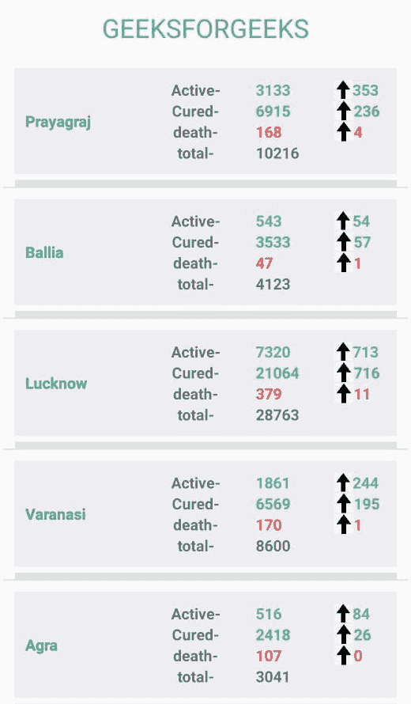
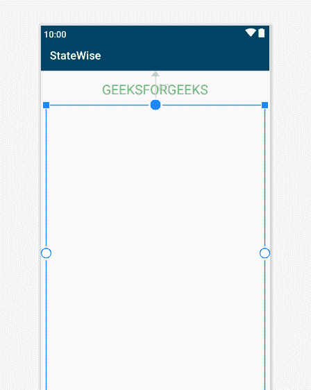
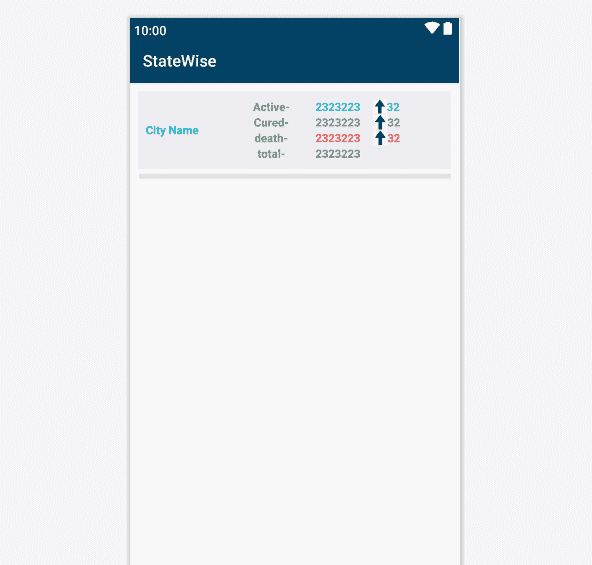
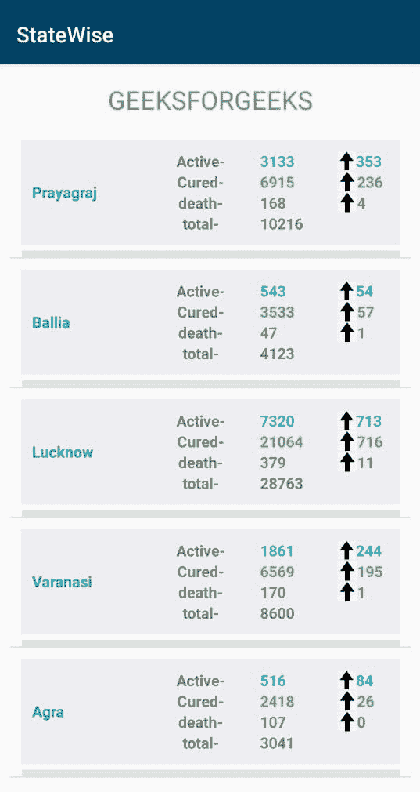

# 如何创建一个新冠肺炎追踪器安卓应用程序来查看印度任何城市和州的详细信息？

> 原文:[https://www . geeksforgeeks . org/如何创建新冠肺炎追踪器-安卓-应用程序-查看印度任何城市和州的详细信息/](https://www.geeksforgeeks.org/how-to-create-a-covid-19-tracker-android-app-to-see-details-of-any-city-and-state-in-india/)

在前一篇文章中，我们已经讨论了如何创建一个新冠肺炎追踪器安卓应用程序，它只显示**全球统计数据**。在这篇文章中，我们将学习如何创建一个**新冠肺炎跟踪器安卓应用程序，它将显示印度任何州的任何城市的细节。详情如–**各城市的总活跃病例数、治愈病例数、死亡人数和确诊病例总数**。在这个应用程序中，让我们跟踪 5 个城市的演示，其中一个可以根据他/她的需求进行更改。**



### **接近**

#### **第一步:创建新项目**

在安卓工作室创建新项目请参考 [**【如何在安卓工作室创建/启动新项目】**](https://www.geeksforgeeks.org/android-how-to-create-start-a-new-project-in-android-studio/) 。**注意，选择** [**Java**](https://www.geeksforgeeks.org/java/) **作为编程语言。**

#### **步骤 2:** 现在在编写 XML 和 Java 代码之前添加一些文件

*   转到**应用->RES->values->colors . XML**部分，设置应用的颜色。
*   这些颜色用于不同地方的应用程序。

## colors.xml

```java
<?xml version="1.0" encoding="utf-8"?>
<resources>
    <color name="colorPrimary">#024265</color>
    <color name="colorPrimaryDark">#024265</color>
    <color name="colorAccent">#05af9b</color>

    <color name="color_one">#fb7268</color>
    <color name="color_white">#ededf2</color>
    <color name="color_two">#E3E0E0</color>

    <color name="cases">#FFA726</color>
    <color name="recovered">#66BB6A</color>
    <color name="deaths">#EF5350</color>
    <color name="active">#29B6F6</color>
</resources>
```

*   转到**梯度脚本- >** [**构建.梯度(模块:应用)**](https://www.geeksforgeeks.org/android-build-gradle/) 部分，导入以下依赖项，点击**立即同步**按钮同步应用。
*   要了解更多关于截击库的信息[请点击此处](https://developer.android.com/training/volley)。

> 实现‘com . Android .凌空:凌空:1 . 1 . 1’

*   现在转到**应用- >清单- >安卓清单. xml** 部分，允许“[](https://www.geeksforgeeks.org/android-how-to-request-permissions-in-android-application/)**”互联网权限，因为此应用将使用互联网权限。**

## **AndroidManifests.xml**

```java
<?xml version="1.0" encoding="utf-8"?>
<manifest xmlns:android="http://schemas.android.com/apk/res/android"
    package="com.example.statewise">
    <uses-permission android:name="android.permission.INTERNET"/>

    <application
        android:allowBackup="true"
        android:icon="@mipmap/ic_launcher"
        android:label="@string/app_name"
        android:roundIcon="@mipmap/ic_launcher_round"
        android:supportsRtl="true"
        android:theme="@style/AppTheme">
        <activity android:name=".MainActivity">
            <intent-filter>
                <action android:name="android.intent.action.MAIN" />

                <category android:name="android.intent.category.LAUNCHER" />
            </intent-filter>
        </activity>
    </application>

</manifest>
```

#### ****第三步:**使用 JSON 解析从网站获取数据**

*   **点击此网址-[https://api.covid19india.org/state_district_wise.json](https://api.covid19india.org/state_district_wise.json)**
*   **它将显示整个国家的数据，在这种情况下，我们将只从这里获取数据。**

#### ****步骤 4: D** 设计活动的布局**

1.  **转到 **app - > res - >布局- > activity_main.xml****
2.  **在布局中添加一个[文本视图](https://www.geeksforgeeks.org/textview-widget-in-android-using-java-with-examples/):在屏幕顶部显示极客。**
3.  **在布局中添加一个[列表视图](https://www.geeksforgeeks.org/android-listview-in-java-with-example/):在屏幕上显示城市追踪详情列表。**

## **activity_main.xml**

```java
<?xml version="1.0" encoding="utf-8"?>
<RelativeLayout
    xmlns:android="http://schemas.android.com/apk/res/android"
    android:layout_width="match_parent"
    android:layout_height="match_parent">

    <TextView
        android:id="@+id/textView"
        android:layout_width="wrap_content"
        android:layout_height="wrap_content"
        android:layout_alignParentTop="true"
        android:layout_centerHorizontal="true"
        android:layout_marginTop="17dp"
        android:text="GEEKSFORGEEKS"
        android:textColor="@color/recovered"
        android:textSize="24sp" />

    <ListView
        android:id="@+id/listView"
        android:layout_width="match_parent"
        android:layout_height="550dp"
        android:layout_alignParentTop="true"
        android:layout_alignParentBottom="true"
        android:layout_marginStart="10dp"
        android:layout_marginTop="60dp"
        android:layout_marginEnd="10dp"
        android:layout_marginBottom="10dp" />

</RelativeLayout>
```

****输出 UI:****

****

#### ****步骤 5: D** 设计列表视图的布局**

1.  **右键单击资源文件夹中的布局文件夹，创建新布局**
2.  **然后点击布局资源文件，设置名称 **testing.xml****
3.  **点击**完成**保存**
4.  **单击测试. xml 并开始设计列表视图的用户界面布局**
5.  ****testing.xml** 中使用的可绘制文件是“**向上箭头**”。转到**可绘制- >新建- >矢量资产**并搜索**“向上箭头”**并将其添加到您的文件**中。****

## **testing.xml**

```java
<?xml version="1.0" encoding="utf-8"?>
<RelativeLayout
    xmlns:android="http://schemas.android.com/apk/res/android"
    xmlns:tools="http://schemas.android.com/tools"
    android:layout_width="match_parent"
    android:layout_height="match_parent"
    tools:context=".MainActivity">

    <LinearLayout
        android:layout_width="match_parent"
        android:layout_height="wrap_content"
        android:layout_margin="10dp"
        android:background="@color/color_white"
        android:orientation="vertical">

        <LinearLayout
            android:layout_width="match_parent"
            android:layout_height="wrap_content"
            android:layout_margin="10dp"
            android:orientation="horizontal"
            android:weightSum="2">

            <LinearLayout
                android:layout_width="wrap_content"
                android:layout_height="match_parent"
                android:layout_gravity="center_vertical"
                android:layout_weight="1"
                android:orientation="vertical">

                <!--Text view to display City name-->
                <TextView
                    android:id="@+id/state"
                    android:layout_width="210dp"
                    android:layout_height="match_parent"
                    android:gravity="center_vertical"
                    android:text="City Name"
                    android:textColor="@color/colorAccent"
                    android:textSize="14sp"
                    android:textStyle="bold" />
            </LinearLayout>

            <LinearLayout
                android:layout_width="match_parent"
                android:layout_height="wrap_content"
                android:layout_weight="1"
                android:orientation="vertical">

                <LinearLayout
                    android:layout_width="match_parent"
                    android:layout_height="match_parent"
                    android:orientation="horizontal">

                    <!--Text view to display Active Cases-->
                    <TextView
                        android:layout_width="107dp"
                        android:layout_height="match_parent"
                        android:gravity="center_horizontal"
                        android:text="Active- "
                        android:textStyle="bold" />

                    <!--Text view to display Active Cases in Numbers-->
                    <TextView
                        android:id="@+id/active"
                        android:layout_width="72dp"
                        android:layout_height="wrap_content"
                        android:text="2323223 "
                        android:textColor="@color/active"
                        android:textStyle="bold" />

                    <!--Image view to display increase in Cases -->
                    <ImageView
                        android:layout_width="17dp"
                        android:layout_height="match_parent"
                        android:src="@drawable/change" />

                    <!--Text view to display Todays Active Cases in Numbers-->
                    <TextView
                        android:id="@+id/incactive"
                        android:layout_width="wrap_content"
                        android:layout_height="match_parent"
                        android:gravity="center_horizontal"
                        android:text="32"
                        android:textColor="@color/active"
                        android:textStyle="bold" />
                </LinearLayout>

                <LinearLayout
                    android:layout_width="match_parent"
                    android:layout_height="match_parent"
                    android:orientation="horizontal">

                    <!--Text view to display Cured Cases -->
                    <TextView
                        android:layout_width="107dp"
                        android:layout_height="match_parent"
                        android:gravity="center_horizontal"
                        android:text="Cured- "
                        android:textStyle="bold" />

                    <!--Text view to display Total Cured Cases in Numbers -->
                    <TextView
                        android:id="@+id/cured"
                        android:layout_width="72dp"
                        android:layout_height="wrap_content"
                        android:text="2323223 "
                        android:textColor="@color/recovered"
                        android:textStyle="bold" />

                    <!--Image view to display increase in Cases -->
                    <ImageView
                        android:layout_width="18dp"
                        android:layout_height="match_parent"
                        android:src="@drawable/change" />

                    <!--Text view to display Todays Cured Cases in Numbers -->
                    <TextView
                        android:id="@+id/inccured"
                        android:layout_width="wrap_content"
                        android:layout_height="match_parent"
                        android:gravity="center_horizontal"
                        android:text="32"
                        android:textColor="@color/recovered"
                        android:textStyle="bold" />

                </LinearLayout>

                <LinearLayout
                    android:layout_width="match_parent"
                    android:layout_height="match_parent"
                    android:orientation="horizontal">

                    <!--Text view to display deths Cases -->
                    <TextView
                        android:layout_width="107dp"
                        android:layout_height="match_parent"
                        android:gravity="center_horizontal"
                        android:text="death- "
                        android:textStyle="bold" />

                    <!--Text view to display total death Cases in Numbers -->
                    <TextView
                        android:id="@+id/death"
                        android:layout_width="72dp"
                        android:layout_height="wrap_content"
                        android:text="2323223 "
                        android:textColor="@color/deaths"
                        android:textStyle="bold" />

                    <!--Image view to display increase in Cases -->
                    <ImageView
                        android:layout_width="18dp"
                        android:layout_height="match_parent"
                        android:src="@drawable/change" />

                    <!--Text view to display todays death Cases in Numbers -->
                    <TextView
                        android:id="@+id/incdeath"
                        android:layout_width="wrap_content"
                        android:layout_height="match_parent"
                        android:gravity="center"
                        android:text="32"
                        android:textColor="@color/deaths"
                        android:textStyle="bold" />

                </LinearLayout>

                <LinearLayout
                    android:layout_width="match_parent"
                    android:layout_height="match_parent"
                    android:orientation="horizontal">

                    <!--Text view to display total Number of cases Cases  -->
                    <TextView
                        android:layout_width="107dp"
                        android:layout_height="match_parent"
                        android:gravity="center_horizontal"
                        android:text="total- "
                        android:textStyle="bold" />

                    <!--Text view to display total Number of cases Cases in Numbers -->
                    <TextView
                        android:id="@+id/total"
                        android:layout_width="match_parent"
                        android:layout_height="wrap_content"
                        android:text="2323223 "
                        android:textStyle="bold" />

                </LinearLayout>

            </LinearLayout>

        </LinearLayout>

    </LinearLayout>

    <View
        android:layout_width="391dp"
        android:layout_height="6dp"
        android:layout_alignParentStart="true"
        android:layout_alignParentTop="true"
        android:layout_alignParentEnd="true"
        android:layout_marginStart="11dp"
        android:layout_marginLeft="20dp"
        android:layout_marginTop="113dp"
        android:layout_marginEnd="10dp"
        android:layout_marginRight="20dp"
        android:background="@color/color_two" />

</RelativeLayout>
```

****输出 UI:****

****

#### ****第 6 步:**创建一个新的 JAVA 类来获取我们想要从网站获取的数据**

1.  **创建一个新的 JAVA 类名为**Model.java****
2.  **使用 getters 和 setters 函数为您想要从网站获取的数据创建一个函数。**

## **Model.java**

```java
public class Model {
    private String name, total, death, cured, active, incAct, incDec, incRec;

    public Model(String name, String total, String death, String cured,
                 String active, String incAct, String incDec, String incRec)
    {
        this.name = name;
        this.total = total;
        this.death = death;
        this.cured = cured;
        this.active = active;
        this.incAct = incAct;
        this.incDec = incDec;
        this.incRec = incRec;
    }

    public String getIncAct() 
    {
        return incAct;
    }

    public void setIncAct(String incAct) 
    {
        this.incAct = incAct;
    }

    public String getIncDec() 
    {
        return incDec;
    }

    public void setIncDec(String incDec) 
    {
        this.incDec = incDec;
    }

    public String getIncRec() 
    {
        return incRec;
    }

    public void setIncRec(String incRec)
    {
        this.incRec = incRec;
    }

    public String getName() 
    {
        return name;
    }

    public void setName(String name)
    {
        this.name = name;
    }

    public String getTotal() 
    {
        return total;
    }

    public void setTotal(String total)
    {
        this.total = total;
    }

    public String getDeath() 
    {
        return death;
    }

    public void setDeath(String death) 
    {
        this.death = death;
    }

    public String getCured() 
    {
        return cured;
    }

    public void setCured(String cured)
    {
        this.cured = cured;
    }

    public String getActive()
    {
        return active;
    }

    public void setActive(String active)
    {
        this.active = active;
    }
}
```

#### ****步骤 7:创建适配器类****

**现在创建一个新的 JAVA 适配器类，将提取的数据放入之前创建的列表视图中。**

## **Java 语言(一种计算机语言，尤用于创建网站)**

```java
import android.content.Context;
import android.view.LayoutInflater;
import android.view.View;
import android.view.ViewGroup;
import android.widget.ArrayAdapter;
import android.widget.TextView;
import androidx.annotation.NonNull;
import androidx.annotation.Nullable;
import java.util.List;

// Create A Class Adapter
public class Adapter extends ArrayAdapter<Model> {
    private Context context;
    private List<Model> modelList;

    public Adapter(Context context, List<Model> modelList) {
        super(context, R.layout.testing, modelList);

        this.context = context;
        this.modelList = modelList;
    }

    @NonNull
    @Override
    public View getView(int position, @Nullable View convertView, @NonNull ViewGroup parent) {

        View view = LayoutInflater.from(parent.getContext()).inflate(R.layout.testing, null,true);

        // In this step we connect the XML with Java File
        TextView state = view.findViewById(R.id.state);
        TextView active = view.findViewById(R.id.active);
        TextView cured = view.findViewById(R.id.cured);
        TextView death = view.findViewById(R.id.death);
        TextView total = view.findViewById(R.id.total);
        TextView incactive = view.findViewById(R.id.incactive);
        TextView inccured = view.findViewById(R.id.inccured);
        TextView incdeath = view.findViewById(R.id.incdeath);

        // Adding Data to modellist
        state.setText(modelList.get(position).getName());
        active.setText(modelList.get(position).getActive());
        cured.setText(modelList.get(position).getCured());
        death.setText(modelList.get(position).getDeath());
        total.setText(modelList.get(position).getTotal());
        incactive.setText(modelList.get(position).getIncAct());
        inccured.setText(modelList.get(position).getIncRec());
        incdeath.setText(modelList.get(position).getIncDec());

        return view;
    }
}
```

#### ****步骤 8:使用**MainActivity.java 文件**

**在这个文件中，我们将使用[凌空](https://www.geeksforgeeks.org/volley-library-in-android/)库。参考代码内部的注释来理解代码。**

## **MainActivity.java**

```java
import android.os.Bundle;
import android.widget.ListView;
import android.widget.Toast;
import androidx.appcompat.app.AppCompatActivity;
import com.android.volley.Request;
import com.android.volley.RequestQueue;
import com.android.volley.Response;
import com.android.volley.VolleyError;
import com.android.volley.toolbox.StringRequest;
import com.android.volley.toolbox.Volley;
import org.json.JSONException;
import org.json.JSONObject;
import java.util.ArrayList;
import java.util.List;

public class MainActivity extends AppCompatActivity {

    ListView listView;

    public static List<Model> modelList = new ArrayList<>();
    Model model;
    Adapter adapter;

    @Override
    protected void onCreate(Bundle savedInstanceState) {
        super.onCreate(savedInstanceState);
        setContentView(R.layout.activity_main);

        listView = findViewById(R.id.listView);
        fetchData();

    }

    private void fetchData() {
        // The Link Through Which We Can Fetch Data
        String url = "https://api.covid19india.org/state_district_wise.json";

        StringRequest request = new StringRequest(Request.Method.GET, url, new Response.Listener<String>() {
            @Override
            public void onResponse(String response) {

                try {
                    // Creating JSON Object
                    JSONObject object = new JSONObject(response);

                    // From that object we are fetching data
                    JSONObject object1 = object.getJSONObject("Uttar Pradesh");
                    JSONObject object2 = object1.getJSONObject("districtData");
                    JSONObject object3 = object2.getJSONObject("Prayagraj");
                    JSONObject object4 = object3.getJSONObject("delta");

                    String active = object3.getString("active");
                    String confirmed = object3.getString("confirmed");
                    String deceased = object3.getString("deceased");
                    String recovered = object3.getString("recovered");

                    String confInc = object4.getString("confirmed");
                    String confDec = object4.getString("deceased");
                    String confRec = object4.getString("recovered");

                    model = new Model("Prayagraj", confirmed, deceased, recovered, active,
                                                                      confInc, confDec, confRec);
                    // placing data into the app using AdapterClass
                    modelList.add(model);

                    // Creating JSON Object
                    object3 = object2.getJSONObject("Ballia");

                    // From that object we are fetching data
                    active = object3.getString("active");
                    confirmed = object3.getString("confirmed");
                    deceased = object3.getString("deceased");
                    recovered = object3.getString("recovered");
                    object4 = object3.getJSONObject("delta");
                    confInc = object4.getString("confirmed");
                    confDec = object4.getString("deceased");
                    confRec = object4.getString("recovered");

                    model = new Model("Ballia", confirmed, deceased, recovered, active,
                                                                   confInc, confDec, confRec);
                    // placing data into the app using AdapterClass
                    modelList.add(model);

                    // Creating JSON Object
                    object3 = object2.getJSONObject("Lucknow");

                    // From that object we are fetching data
                    active = object3.getString("active");
                    confirmed = object3.getString("confirmed");
                    deceased = object3.getString("deceased");
                    recovered = object3.getString("recovered");
                    object4 = object3.getJSONObject("delta");

                    confInc = object4.getString("confirmed");
                    confDec = object4.getString("deceased");
                    confRec = object4.getString("recovered");

                    model = new Model("Lucknow", confirmed, deceased, recovered, active,
                                                                    confInc, confDec, confRec);
                    // placing data into the app using AdapterClass
                    modelList.add(model);

                    // Creating JSON Object
                    object3 = object2.getJSONObject("Varanasi");

                    // From that object we are fetching data
                    active = object3.getString("active");
                    confirmed = object3.getString("confirmed");
                    deceased = object3.getString("deceased");
                    recovered = object3.getString("recovered");
                    object4 = object3.getJSONObject("delta");

                    confInc = object4.getString("confirmed");
                    confDec = object4.getString("deceased");
                    confRec = object4.getString("recovered");

                    model = new Model("Varanasi", confirmed, deceased, recovered, active,
                                                                    confInc, confDec, confRec);
                    // placing data into the app using AdapterClass
                    modelList.add(model);

                    // Creating JSON Object
                    object3 = object2.getJSONObject("Agra");

                    // From that object we are fetching data
                    active = object3.getString("active");
                    confirmed = object3.getString("confirmed");
                    deceased = object3.getString("deceased");
                    recovered = object3.getString("recovered");
                    object4 = object3.getJSONObject("delta");
                    confInc = object4.getString("confirmed");
                    confDec = object4.getString("deceased");
                    confRec = object4.getString("recovered");

                    model = new Model("Agra", confirmed, deceased, recovered, active,
                                                                 confInc, confDec, confRec);
                    // placing data into the app using AdapterClass
                    modelList.add(model);

                    adapter = new Adapter(MainActivity.this, modelList);
                    listView.setAdapter(adapter);

                    // In case of error it will run
                }   catch (JSONException e) {
                    e.printStackTrace();
                }

            }
        }, new Response.ErrorListener() {
            @Override
            public void onErrorResponse(VolleyError error) {
                // In case of error it will run
                Toast.makeText(MainActivity.this, error.getMessage(), Toast.LENGTH_SHORT).show();
            }
        });

        RequestQueue requestQueue = Volley.newRequestQueue(this);
        requestQueue.add(request);
    }
}
```

### **输出**

****