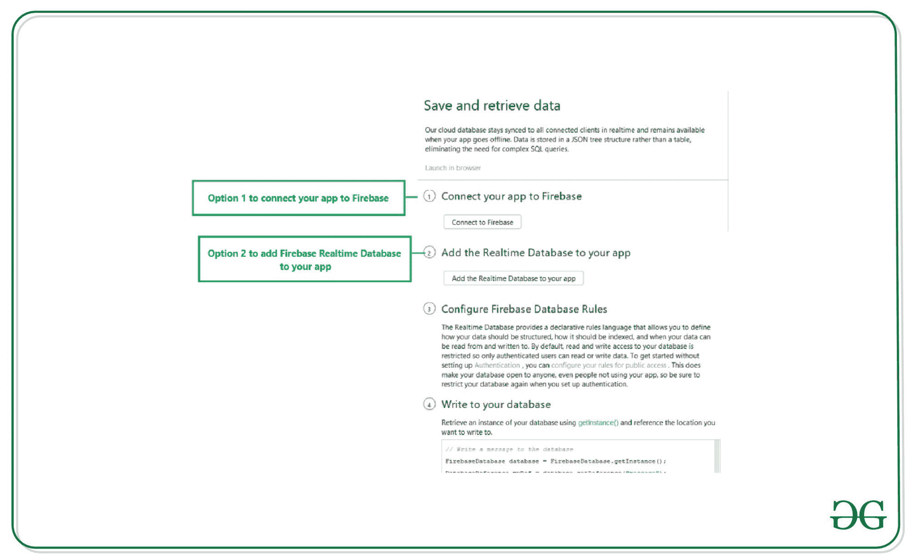

# 如何用 Firebase 实时数据库在安卓系统中创建动态音频播放器？

> 原文:[https://www . geeksforgeeks . org/如何创建动态音频播放器-带 firebase 的安卓实时数据库/](https://www.geeksforgeeks.org/how-to-create-a-dynamic-audio-player-in-android-with-firebase-realtime-database/)

许多在线音乐播放器应用程序需要如此多的歌曲、音频文件。所以要处理这么多文件，我们要么使用任何类型的数据库，要么管理所有这些文件。在应用程序中存储文件不是更好的方法。因此，在本文中，我们将看看如何在我们的安卓应用程序中实现动态音频播放器。

### 我们将在本文中构建什么？

在本文中，我们将构建一个简单的应用程序，在这个应用程序中，我们将最好地播放来自 web URL 的音频文件，并且我们将在运行时更改音频文件 URL 以更新我们的音频文件。下面给出了一个示例视频，让我们了解一下在本文中要做什么。请注意，我们将使用 **Java** 语言来实现这个项目。

<video class="wp-video-shortcode" id="video-544522-1" width="640" height="360" preload="metadata" controls=""><source type="video/mp4" src="https://media.geeksforgeeks.org/wp-content/uploads/20210113205758/Screenrecorder-2021-01-13-20-53-19-821.mp4?_=1">[https://media.geeksforgeeks.org/wp-content/uploads/20210113205758/Screenrecorder-2021-01-13-20-53-19-821.mp4](https://media.geeksforgeeks.org/wp-content/uploads/20210113205758/Screenrecorder-2021-01-13-20-53-19-821.mp4)</video>

### **分步实施**

**第一步:创建新项目**

要在安卓工作室创建新项目，请参考[如何在安卓工作室创建/启动新项目](https://www.geeksforgeeks.org/android-how-to-create-start-a-new-project-in-android-studio/)。注意选择 **Java** 作为编程语言。

**第二步:将你的应用连接到 Firebase**

创建新项目后。导航到顶部栏上的工具选项。点击火焰基地。点击 Firebase 后，你可以看到截图中下面提到的右栏。


在该列中，导航到 Firebase 实时数据库。点击那个选项，你会看到两个选项:连接应用程序到 Firebase 和添加 Firebase 实时数据库到你的应用程序。单击立即连接选项，您的应用程序将连接到 Firebase。之后点击第二个选项，现在你的应用程序连接到 Firebase。



完成此过程后，您将看到下面的屏幕。


现在验证您的应用程序是否连接到 Firebase。转到您的 build.gradle 文件。导航到**应用程序>渐变脚本>build . grade le(应用程序)**文件，并确保以下依赖项已添加到您的依赖项部分。

> *实现‘com . Google . firebase:firebase-数据库:19 . 6 . 0’*

添加这个依赖项后，在你的 Gradle 文件中添加 ExoPlayer 的依赖项。

**第三步:添加互联网权限**

当我们从互联网加载视频时，我们必须在清单文件中添加互联网权限。导航至**应用程序> AndroidManifest.xml** 文件，并在其中添加以下权限。

## 可扩展标记语言

```java
<!--Permissions for internet-->
<uses-permission android:name="android.permission.INTERNET" />
<uses-permission android:name="android.permission.ACCESS_NETWORK_STATE" />
```

**第 4 步:使用 activity_main.xml 文件**

转到**activity _ main . XML**文件，参考以下代码。下面是**activity _ main . XML**文件的代码。

## 可扩展标记语言

```java
<?xml version="1.0" encoding="utf-8"?>
<RelativeLayout 
    xmlns:android="http://schemas.android.com/apk/res/android"
    xmlns:tools="http://schemas.android.com/tools"
    android:layout_width="match_parent"
    android:layout_height="match_parent"
    android:orientation="vertical"
    tools:context=".MainActivity">

    <!--Button for playing audio-->
    <Button
        android:id="@+id/idBtnPlay"
        android:layout_width="wrap_content"
        android:layout_height="wrap_content"
        android:layout_centerInParent="true"
        android:text="Play Audio file"
        android:textAllCaps="false" />

    <!--Button for pausing the audio-->
    <Button
        android:id="@+id/idBtnPause"
        android:layout_width="wrap_content"
        android:layout_height="wrap_content"
        android:layout_below="@id/idBtnPlay"
        android:layout_centerInParent="true"
        android:text="Pause Audio"
        android:textAllCaps="false" />

</RelativeLayout>
```

**步骤 5:使用 MainActivity.java 文件**

转到**文件，参考以下代码。以下是**MainActivity.java**文件的代码。代码中添加了注释，以更详细地理解代码。**

## **Java 语言(一种计算机语言，尤用于创建网站)**

```java
import android.media.AudioManager;
import android.media.MediaPlayer;
import android.os.Bundle;
import android.view.View;
import android.widget.Button;
import android.widget.Toast;

import androidx.annotation.NonNull;
import androidx.appcompat.app.AppCompatActivity;

import com.google.firebase.database.DataSnapshot;
import com.google.firebase.database.DatabaseError;
import com.google.firebase.database.DatabaseReference;
import com.google.firebase.database.FirebaseDatabase;
import com.google.firebase.database.ValueEventListener;

import java.io.IOException;

public class MainActivity extends AppCompatActivity {

    // creating a variable for
    // button and media player
    Button playBtn, pauseBtn;
    MediaPlayer mediaPlayer;

    // creating a string for storing
    // our audio url from firebase.
    String audioUrl;

    // creating a variable for our Firebase Database.
    FirebaseDatabase firebaseDatabase;

    // creating a variable for our 
    // Database Reference for Firebase.
    DatabaseReference databaseReference;

    @Override
    protected void onCreate(Bundle savedInstanceState) {
        super.onCreate(savedInstanceState);
        setContentView(R.layout.activity_main);

        // below line is used to get the instance 
        // of our Firebase database.
        firebaseDatabase = FirebaseDatabase.getInstance();

        // below line is used to get reference for our database.
        databaseReference = firebaseDatabase.getReference("url");

        // calling add value event listener method for getting the values from database.
        databaseReference.addValueEventListener(new ValueEventListener() {
            @Override
            public void onDataChange(@NonNull DataSnapshot snapshot) {
                // this method is call to get the realtime updates in the data.
                // this method is called when the data is changed in our Firebase console.
                // below line is for getting the data from snapshot of our database.
                audioUrl = snapshot.getValue(String.class);
                // after getting the value for our audio url we are storing it in our string.
            }

            @Override
            public void onCancelled(@NonNull DatabaseError error) {
                // calling on cancelled method when we receive any error or we are not able to get the data.
                Toast.makeText(MainActivity.this, "Fail to get audio url.", Toast.LENGTH_SHORT).show();
            }
        });

        // initializing our buttons
        playBtn = findViewById(R.id.idBtnPlay);
        pauseBtn = findViewById(R.id.idBtnPause);

        // setting on click listener for our play and pause buttons.
        playBtn.setOnClickListener(new View.OnClickListener() {
            @Override
            public void onClick(View v) {
                // calling method to play audio.
                playAudio(audioUrl);
            }
        });
        pauseBtn.setOnClickListener(new View.OnClickListener() {
            @Override
            public void onClick(View v) {
                // checking the media player 
                // if the audio is playing or not.
                if (mediaPlayer.isPlaying()) {
                    // pausing the media player if 
                    // media player is playing we are 
                    // calling below line to stop our media player.
                    mediaPlayer.stop();
                    mediaPlayer.reset();
                    mediaPlayer.release();

                    // below line is to display a message when media player is paused.
                    Toast.makeText(MainActivity.this, "Audio has been paused", Toast.LENGTH_SHORT).show();
                } else {
                    // this method is called when media player is not playing.
                    Toast.makeText(MainActivity.this, "Audio has not played", Toast.LENGTH_SHORT).show();
                }
            }
        });
    }

    private void playAudio(String audioUrl) {
        // initializing media player
        mediaPlayer = new MediaPlayer();

        // below line is use to set the audio stream type for our media player.
        mediaPlayer.setAudioStreamType(AudioManager.STREAM_MUSIC);
        try {
            // below line is use to set our 
            // url to our media player.
            mediaPlayer.setDataSource(audioUrl);

            // below line is use to prepare 
            // and start our media player.
            mediaPlayer.prepare();
            mediaPlayer.start();

            // below line is use to display a toast message.
            Toast.makeText(this, "Audio started playing..", Toast.LENGTH_SHORT).show();
        } catch (IOException e) {
            // this line of code is use to handle error while playing our audio file.
            Toast.makeText(this, "Error found is " + e, Toast.LENGTH_SHORT).show();
        }
    }
}
```