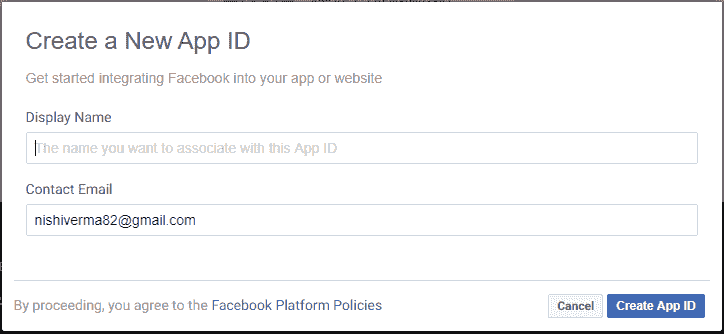
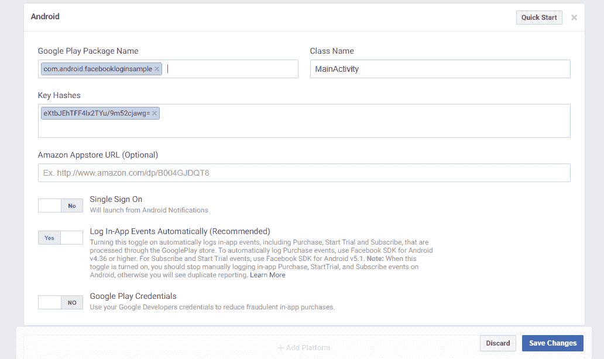
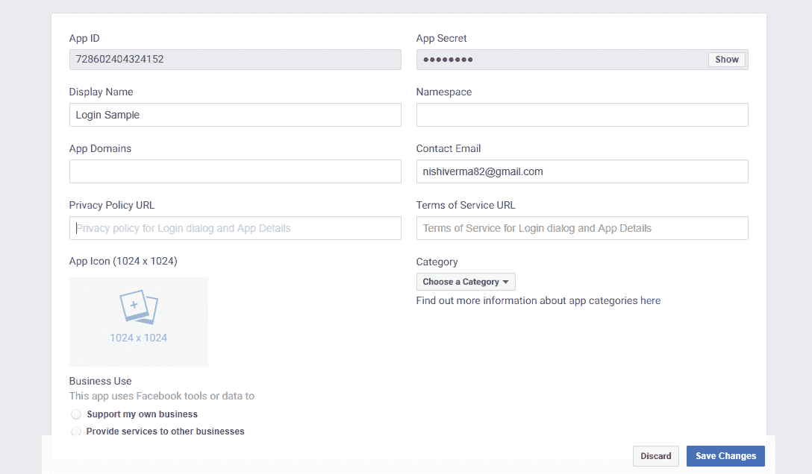

# 如何使用安卓应用创建脸书登录？

> 原文:[https://www . geesforgeks . org/如何使用安卓应用程序创建 facebook 登录/](https://www.geeksforgeeks.org/how-to-create-a-facebook-login-using-an-android-app/)

本文解释了[如何创建一个有](https://www.geeksforgeeks.org/android-app-development-fundamentals-for-beginners/)[脸书](https://www.geeksforgeeks.org/tag/facebook/)登录的安卓应用。

安卓应用中有各种各样的社交登录功能可以使用。在这里我们将学习使用脸书的**社交登录，因此需要在项目中**集成脸书 SDK** 来使用脸书登录。**

下面是如何做的各个步骤；

1.  First thing you need to do is to have **[Facebook Developer Account](https://www.geeksforgeeks.org/facebook-api-set-1/)** and then create a new app.

    

2.  [安装**安卓工作室** ( > = 3.0)然后打开/创建一个想要添加脸书登录的项目](https://www.geeksforgeeks.org/guide-to-install-and-set-up-android-studio/)。
3.  在您的项目中，在您的**T2【梯度脚本】- >构建.梯度 T4【项目】中添加以下代码。

    ```java
    buildscript{
        repositories {
            jcenter()
        }
    }
    ```** 
4.  现在，在您的项目中使用脸书登录 SDK 的最新版本**在**[Gradle Scripts->build . Gradle](https://www.geeksforgeeks.org/android-build-gradle/)**(模块:app)中添加以下代码。

    ```java
    dependencies {
         implementation 'com.facebook.android:facebook-android-sdk:5.0.0'
    }
    ```** 
5.  **同步您的项目**
6.  **Now open **app -> res -> values -> strings.xml** file to add the following lines and **replace** the **[APP_ID]** with your APP_ID, which you can get from Facebook Developer console.

    ```java
    <string name="facebook_app_id">[APP_ID]</string>
    <string name="fb_login_protocol_scheme">fb[APP_ID]</string>
    ```

    ** 
7.  **打开**app->manifest->[AnDroidManifest . XML](https://www.geeksforgeeks.org/application-manifest-file-android/)**文件，在应用程序元素外添加这一行。

    ```java
    <uses-permission android:name="android.permission.INTERNET"/>
    ```** 
8.  **将此**元数据**元素添加到**和**文件中的应用程序元素中:

    ```java
    <meta-data
        android:name="com.facebook.sdk.ApplicationId"
        android:value="@string/facebook_app_id"/>
    <activity
        android:name="com.facebook.FacebookActivity"
        android:configChanges="keyboard|keyboardHidden
                              |screenLayout|screenSize
                              |orientation"
        android:label="@string/app_name" />
    ```** 
9.  **现在你需要的第一件事是**键散列**，所以在脸书登录代码之前在你的活动类中添加这些行:

    ```java
    @Override
    protected void onCreate(Bundle savedInstanceState)
    {
        super.onCreate(savedInstanceState);
        setContentView(R.layout.activity_login);

        ... printHashKey();
        ...
    }

    ...

        public void
        printHashKey()
    {

        // Add code to print out the key hash
        try {

            PackageInfo info
                = getPackageManager().getPackageInfo(
                    "com.android.facebookloginsample",
                    PackageManager.GET_SIGNATURES);

            for (Signature signature : info.signatures) {

                MessageDigest md
                    = MessageDigest.getInstance("SHA");
                md.update(signature.toByteArray());
                Log.d("KeyHash:",
                      Base64.encodeToString(
                          md.digest(),
                          Base64.DEFAULT));
            }
        }

        catch (PackageManager.NameNotFoundException e) {
        }

        catch (NoSuchAlgorithmException e) {
        }
    }
    ```** 
10.  **现在[在你的模拟器或你连接的设备](https://www.geeksforgeeks.org/android-running-your-first-android-app/)上运行你的应用程序。您将看到密钥哈希值打印在日志文件中，将此保存以备后用。**
11.  **转到**脸书开发者控制台**选择**设置- >基础- >添加平台**(在页面底部)弹出窗口**选择平台**。选择**安卓**作为平台。**
12.  **Add your **project package name** under ‘Google Play Package Name’. Add class name where login will implement in project like ‘LoginActivity’ and also add the key hash value under **‘Key Hashes’**.

    ** 
13.  **现在回到安卓工作室，在你的 ***中添加这个自定义按钮。xml** 布局文件:

    ```java
    <Button
        android:id="@+id/button_facebook"
        style="@style/FacebookLoginButton"
        android:layout_width="match_parent"
        android:layout_height="45dp"
        android:layout_gravity="center_horizontal"
        android:layout_marginTop="15dp"
        android:text="Continue With Facebook"
        android:textAllCaps="false"
        android:textColor="@android:color/white" />
    ```** 
14.  **在**app->RES->styles . XML**文件中添加此代码:

    ```java
    <style name="FacebookLoginButton">
        <item name="android:textSize">14sp</item>
        <item name="android:background">@drawable/facebook_signin_btn</item>
        <item name="android:paddingTop">11dp</item>
        <item name="android:paddingBottom">11dp</item>
        <item name="android:paddingLeft">15dp</item>
        <item name="android:layout_marginLeft">3dp</item>
        <item name="android:layout_marginRight">3dp</item>
        <item name="android:layout_height">wrap_content</item>
        <item name="android:layout_gravity">center_horizontal</item>
    </style>
    ```** 
15.  **您可以相应地自定义此按钮，也可以使用脸书默认按钮作为脸书登录按钮，而不是上面的自定义按钮。**
16.  **在 **app - > res - >可绘制**文件夹中创建名为**‘BG _ button _ Facebook . XML’**的可绘制文件，并粘贴到以下代码:

    ```java
    <?xml version="1.0" encoding="utf-8"?>
    <shape
    xmlns:android="http://schemas.android.com/apk/res/android"
    android:shape="rectangle">
        <corners android:radius="5dp"/>
        <solid android:color="#3B5998"/>
    </shape>
    ```** 
17.  **现在在 ***中初始化按钮。java 文件**和一些代码来**初始化脸书 SDK** 也:

    ```java
    // Declare variables
    private Button mButtonFacebook;

    private CallbackManager callbackManager;
    private LoginManager loginManager;

    ...

        @Override
        protected void onCreate(Bundle savedInstanceState)
    {
        super.onCreate(savedInstanceState);
        setContentView(R.layout.activity_login);

        ...

            mButtonFacebook
            = findViewById(R.id.button_facebook);
        FacebookSdk.sdkInitialize(MainActivity.this);
        callbackManager = CallbackManager.Factory.create();
        facebookLogin();

        ...

            mButtonFacebook.setOnClickListener(new View.OnClickListener() {
                @Override
                public void onClick(View v)
                {
                    loginManager.logInWithReadPermissions(
                        MainActivity.this,
                        Arrays.asList(
                            "email",
                            "public_profile",
                            "user_birthday"));
                }
            });
        ...
    }

    ...
    ```** 
18.  **在 java 文件的 onCreate()外添加**‘facebooklog in’**方法。这是**脸书登录响应的代码。**

    ```java
    public void facebookLogin()
    {

        loginManager
            = LoginManager.getInstance();
        callbackManager
            = CallbackManager.Factory.create();

        loginManager
            .registerCallback(
                callbackManager,
                new FacebookCallback<LoginResult>() {

                    @Override
                    public void onSuccess(LoginResult loginResult)
                    {
                        GraphRequest request = GraphRequest.newMeRequest(

                            loginResult.getAccessToken(),

                            new GraphRequest.GraphJSONObjectCallback() {

                                @Override
                                public void onCompleted(JSONObject object,
                                                        GraphResponse response)
                                {

                                    if (object != null) {
                                        try {
                                            String name = object.getString("name");
                                            String email = object.getString("email");
                                            String fbUserID = object.getString("id");

                                            disconnectFromFacebook();

                                            // do action after Facebook login success
                                            // or call your API
                                        }
                                        catch (JSONException | NullPointerException e) {
                                            e.printStackTrace();
                                        }
                                    }
                                }
                            });

                        Bundle parameters = new Bundle();
                        parameters.putString(
                            "fields",
                            "id, name, email, gender, birthday");
                        request.setParameters(parameters);
                        request.executeAsync();
                    }

                    @Override
                    public void onCancel()
                    {
                        Log.v("LoginScreen", "---onCancel");
                    }

                    @Override
                    public void onError(FacebookException error)
                    {
                        // here write code when get error
                        Log.v("LoginScreen", "----onError: "
                                                 + error.getMessage());
                    }
                });
    }
    ```** 
19.  **现在添加另一个登录集成所需的方法**“从 Facebook 断开连接”**，类似地将此添加到外部 onCreate。这用于断开应用程序与脸书的连接，因为不需要保持连接。

    ```java
    public void disconnectFromFacebook()
    {
        if (AccessToken.getCurrentAccessToken() == null) {
            return; // already logged out
        }

        new GraphRequest(
            AccessToken.getCurrentAccessToken(),
            "/me/permissions/",
            null,
            HttpMethod.DELETE,
            new GraphRequest
                .Callback() {
                    @Override
                    public void onCompleted(GraphResponse graphResponse)
                    {
                        LoginManager.getInstance().logOut();
                    }
                })
            .executeAsync();
    }
    ```** 
20.  **在同一个活动中添加**【活动结果】**方法外的【创建】:

    ```java
    @Override
    protected void onActivityResult(int requestCode,
                                    int resultCode,
                                    Intent data)
    {

        // add this line
        callbackManager.onActivityResult(
            requestCode,
            resultCode,
            data);

        super.onActivityResult(requestCode,
                               resultCode,
                               data);
    }
    ```** 
21.  **现在你已经完成了编码。**在您的设备或仿真器中运行您的应用程序**。您现在可以在应用程序中使用脸书登录**。****
22.  **If you **want to upload your app on play store**, then you have to **enable ‘status’** from top right section on Facebook for Developers, for this first **add privacy policy url** in **settings -> Basic** as per given in below screenshot. Now save the changes and enable status from dashboard.

    **