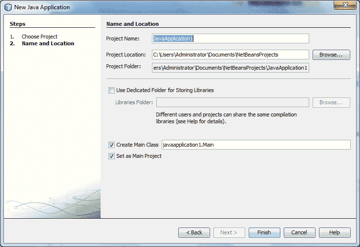
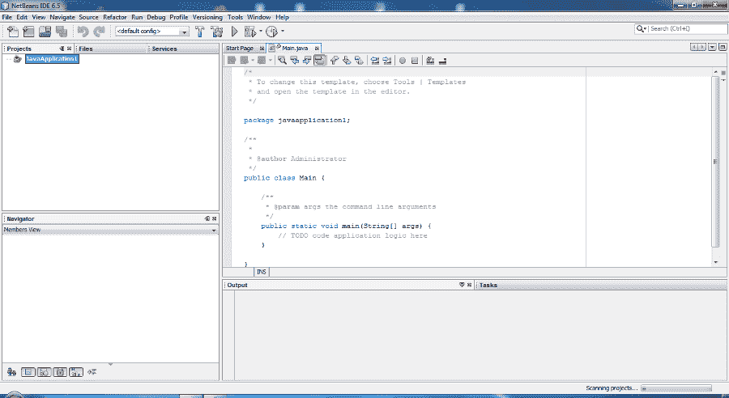

# 如何在 NetBeans GUI 中创建项目？

> 原文:[https://www . geesforgeks . org/如何在 netbeans-gui 中创建项目/](https://www.geeksforgeeks.org/how-to-create-a-project-in-netbeans-gui/)

集成开发环境中的所有 Java 开发都发生在项目中，我们首先需要创建一个新的项目，在其中存储源代码和其他项目文件。IDE 项目是一组 JAVA Source 文件及其关联的[元数据](https://www.geeksforgeeks.org/difference-between-data-and-metadata/)(关于数据的数据)，包括项目**<u>–</u>**特定属性文件以及许多其他相关文件。一个 Java 应用程序可能由一个或多个集成开发环境项目组成。

**步骤 1:** 创建新的图形用户界面应用程序项目

*   点击菜单栏中的 ***【文件】*** 选项，或者直接点击工具栏中的**新建项目选项**，或者按 **Ctrl + N** 启动 java 新建项目。


**菜单条**

*   现在，如果您点击了菜单栏中的文件选项，那么下拉列表将出现在屏幕前面，您可以在该下拉列表中选择新项目选项。
*   一个**新项目**窗口将出现在你的屏幕前。


**新项目窗口**

**第二步:**选择 ***类别*** 为 ***JAVA*** 并在 ***项目*** 中选择 ***Java 应用程序*** **。**
**第三步:**然后按窗口中的***下一步按钮*** 。
**第四步:**输入项目名称“但要记住，在写项目名称时，空格是不需要的。请输入名称，不要留下空格。



**项目名称&文件位置**

**第五步:**现在， ***对话框*** 也显示了 NetBeans 将要保存项目的位置。如果你想改变项目位置，你可以从这里进行设置，但是默认情况下，所有项目将保存在本地计算机的以下位置，如下所示:

```
C:\Users\Administrator\Documents\NetBeansProjects
// As per windows operating system
// Note: Will differ as per OS 
```

**第六步:**然后点击窗口中的 ***完成按钮*** 。



**新建项目窗口**

> 现在，一个项目被创造出来，就像你可以从绘画作品中想象的那样。通过遵循上述步骤，您可以在网络 bean 中启动新项目，之后您可以根据项目/客户要求在 JAVA 应用程序、JAVA 类和网络应用程序中启动项目。