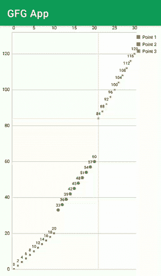

# 如何在安卓中创建散点图来表示数据？

> 原文:[https://www . geeksforgeeks . org/如何在 android 中创建散点图来表示数据/](https://www.geeksforgeeks.org/how-to-create-a-scatter-chart-in-android-to-represent-data/)

如果您正在寻找显示大量数据的方法，并且正在为这种类型的视图的表示寻找不同的用户界面设计。然后，您可以使用散点图来表示此视图。散点图用于表示数据。通过使用该散点图，您可以轻松地以分散的形式表示数据。在本文中，我们将看到散点图在安卓系统中的实现。

### 我们将在本文中构建什么？

我们将构建一个简单的图表，其中我们将显示一个图表，其中我们将显示数据。下面给出了一个 GIF 示例，来了解一下在本文中要做什么。请注意，我们将使用 **Java** 语言来实现这个项目。



### **散点图重要属性**

<figure class="table">

| 

属性

 | 

使用

 |
| --- | --- |
| setDrawGridBackground | 此方法用于设置网格的背景。 |
| setTouchEnabled | 这种方法用于在我们的图表上启用手势。 |
| setMaxHighlightDistance | 设置触摸可以离开条目的最大距离，使其高亮显示。 |
| setDragEnabled | 此方法用于启用和禁用拖动。 |
| setScaleEnabled | 此方法用于启用缩放。 |
| setMaxVisibleValueCount | 仅当启用了 setDrawValues()时，设置图表上最大可见绘制值的数量 |
| 设定缩放 | 它用于缩放 x 轴和 y 轴。 |
| 绅士 | 此方法用于获取图表的图例。 |
| getAxisLeft | 返回左 y 轴对象。 |
| getAxisRight | 返回右 y 轴对象。 |
| 设置绘图网格线 | 此方法用于绘制网格线。 |
| 设置散射形状 | 设置此数据集应使用的散射形状。这将搜索可用的渲染器，并为数据集设置此渲染器。 |
| 设置数据 | 为图表设置新的数据对象。 |
| 使无效 | 如果视图已启用，此方法用于使视图无效。 |

</figure>

### **分步实施**

**第一步:创建新项目**

要在安卓工作室创建新项目，请参考[如何在安卓工作室创建/启动新项目](https://www.geeksforgeeks.org/android-how-to-create-start-a-new-project-in-android-studio/)。注意选择 **Java** 作为编程语言。

**第二步:添加依赖项进行构建. gradle(模块:app)**

导航到**渐变脚本>构建.渐变(模块:应用)**，并在依赖项部分添加以下依赖项。

> 实现' com . github . philjay:MPAndroidChart:v 3 . 1 . 0 '

添加后，导航到 **build.gradle(项目)**，并在存储库部分添加下面的行。

> 所有项目{
> 
> 存储库{
> 
> //添加到存储库部分的下面一行
> 
> maven { URL https://jitpack . I }
> 
> 谷歌()
> 
> jcenter()
> 
> }
> 
> }

**步骤 3:使用 activity_main.xml 文件**

转到 **activity_main.xml** 文件，参考以下代码。下面是 **activity_main.xml** 文件的代码。

## 可扩展标记语言

```java
<?xml version="1.0" encoding="utf-8"?>
<RelativeLayout
    xmlns:android="http://schemas.android.com/apk/res/android"
    xmlns:tools="http://schemas.android.com/tools"
    android:layout_width="match_parent"
    android:layout_height="match_parent"
    android:orientation="vertical"
    tools:context=".MainActivity">

    <com.github.mikephil.charting.charts.ScatterChart
        android:id="@+id/chart1"
        android:layout_width="match_parent"
        android:layout_height="match_parent" />

</RelativeLayout>
```

**步骤 4:使用 MainActivity.java 文件**

转到**MainActivity.java**文件，参考以下代码。以下是**MainActivity.java**文件的代码。代码中添加了注释，以更详细地理解代码。

## Java 语言(一种计算机语言，尤用于创建网站)

```java
import android.os.Bundle;

import androidx.appcompat.app.AppCompatActivity;

import com.github.mikephil.charting.charts.ScatterChart;
import com.github.mikephil.charting.components.Legend;
import com.github.mikephil.charting.components.XAxis;
import com.github.mikephil.charting.components.YAxis;
import com.github.mikephil.charting.data.Entry;
import com.github.mikephil.charting.data.ScatterData;
import com.github.mikephil.charting.data.ScatterDataSet;
import com.github.mikephil.charting.interfaces.datasets.IScatterDataSet;
import com.github.mikephil.charting.utils.ColorTemplate;

import java.util.ArrayList;

public class MainActivity extends AppCompatActivity {
    // creating a variable for scatter chart
    private ScatterChart chart;

    @Override
    protected void onCreate(Bundle savedInstanceState) {
        super.onCreate(savedInstanceState);
        setContentView(R.layout.activity_main);

        // initializing our scatter chart.
        chart = findViewById(R.id.chart1);

        // below line is use to disable the description 
        // of our scatter chart.
        chart.getDescription().setEnabled(false);

        // below line is use to draw grid background 
        // and we are setting it to false.
        chart.setDrawGridBackground(false);

        // below line is use to set touch 
        // enable for our chart.
        chart.setTouchEnabled(true);

        // below line is use to set maximum 
        // highlight distance for our chart.
        chart.setMaxHighlightDistance(50f);

        // below line is use to set
        // dragging for our chart.
        chart.setDragEnabled(true);

        // below line is use to set scale
        // to our chart.
        chart.setScaleEnabled(true);

        // below line is use to set maximum 
        // visible count to our chart.
        chart.setMaxVisibleValueCount(200);

        // below line is use to set 
        // pinch zoom to our chart.
        chart.setPinchZoom(true);

        // below line we are getting 
        // the legend of our chart.
        Legend l = chart.getLegend();

        // after getting our chart
        // we are setting our chart for vertical and horizontal
        // alignment to top, right and vertical.
        l.setVerticalAlignment(Legend.LegendVerticalAlignment.TOP);
        l.setHorizontalAlignment(Legend.LegendHorizontalAlignment.RIGHT);
        l.setOrientation(Legend.LegendOrientation.VERTICAL);

        // below line is use for 
        // setting draw inside to false.
        l.setDrawInside(false);

        // below line is use to set 
        // offset value for our legend.
        l.setXOffset(5f);

        // below line is use to get 
        // y-axis of our chart.
        YAxis yl = chart.getAxisLeft();

        // below line is use to set 
        // minimum axis to our y axis.
        yl.setAxisMinimum(0f);

        // below line is use to get axis
        // right of our chart
        chart.getAxisRight().setEnabled(false);

        // below line is use to get
        // x axis of our chart.
        XAxis xl = chart.getXAxis();

        // below line is use to enable
        // drawing of grid lines.
        xl.setDrawGridLines(false);

        // in below line we are creating an array list 
        // for each entry of our chart.
        // we will be representing three values in our charts.
        // below is the line where we are creating three
        // lines for our chart.
        ArrayList<Entry> values1 = new ArrayList<>();
        ArrayList<Entry> values2 = new ArrayList<>();
        ArrayList<Entry> values3 = new ArrayList<>();

        // on below line we are adding data to our charts.
        for (int i = 0; i < 11; i++) {
            values1.add(new Entry(i, (i * 2)));
        }

        // on below line we are adding
        // data to our value 2
        for (int i = 11; i < 21; i++) {
            values2.add(new Entry(i, (i * 3)));
        }

        // on below line we are adding
        // data to our 3rd value.
        for (int i = 21; i < 31; i++) {
            values3.add(new Entry(i, (i * 4)));
        }

        // create a data set and give it a type
        ScatterDataSet set1 = new ScatterDataSet(values1, "Point 1");

        // below line is use to set shape for our point on our graph.
        set1.setScatterShape(ScatterChart.ScatterShape.SQUARE);

        // below line is for setting color to our shape.
        set1.setColor(ColorTemplate.COLORFUL_COLORS[0]);

        // below line is use to create a new point for our scattered chart.
        ScatterDataSet set2 = new ScatterDataSet(values2, "Point 2");

        // for this point we are setting our shape to circle
        set2.setScatterShape(ScatterChart.ScatterShape.CIRCLE);

        // below line is for setting color to our point in chart.
        set2.setScatterShapeHoleColor(ColorTemplate.COLORFUL_COLORS[3]);

        // below line is use to set hole 
        // radius to our point in chart.
        set2.setScatterShapeHoleRadius(3f);

        // below line is use to set color to our set.
        set2.setColor(ColorTemplate.COLORFUL_COLORS[1]);

        // in below line we are creating a third data set for our chart.
        ScatterDataSet set3 = new ScatterDataSet(values3, "Point 3");

        // inside this 3rd data set we are setting its color.
        set3.setColor(ColorTemplate.COLORFUL_COLORS[2]);

        // below line is use to set shape size
        // for our data set of the chart.
        set1.setScatterShapeSize(8f);
        set2.setScatterShapeSize(8f);
        set3.setScatterShapeSize(8f);

        // in below line we are creating a new array list for our data set.
        ArrayList<IScatterDataSet> dataSets = new ArrayList<>();

        // in below line we are adding all 
        // data sets to above array list.
        dataSets.add(set1); // add the data sets
        dataSets.add(set2);
        dataSets.add(set3);

        // create a data object with the data sets
        ScatterData data = new ScatterData(dataSets);

        // below line is use to set data to our chart
        chart.setData(data);

        // at last we are calling
        // invalidate method on our chart.
        chart.invalidate();
    }
}
```

添加上述代码后，现在运行您的应用程序并查看应用程序的输出。

### 输出:

<video class="wp-video-shortcode" id="video-542634-1" width="640" height="360" preload="metadata" controls=""><source type="video/mp4" src="https://media.geeksforgeeks.org/wp-content/uploads/20210111160613/Screenrecorder-2021-01-11-16-04-42-647.mp4?_=1">[https://media.geeksforgeeks.org/wp-content/uploads/20210111160613/Screenrecorder-2021-01-11-16-04-42-647.mp4](https://media.geeksforgeeks.org/wp-content/uploads/20210111160613/Screenrecorder-2021-01-11-16-04-42-647.mp4)</video>