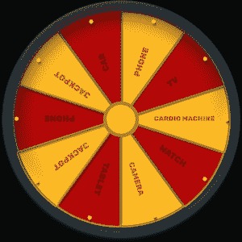
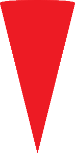
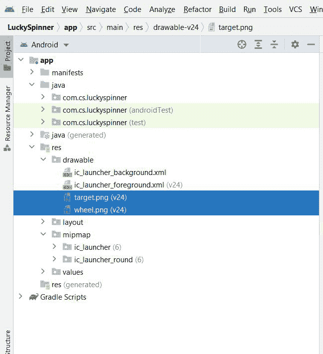
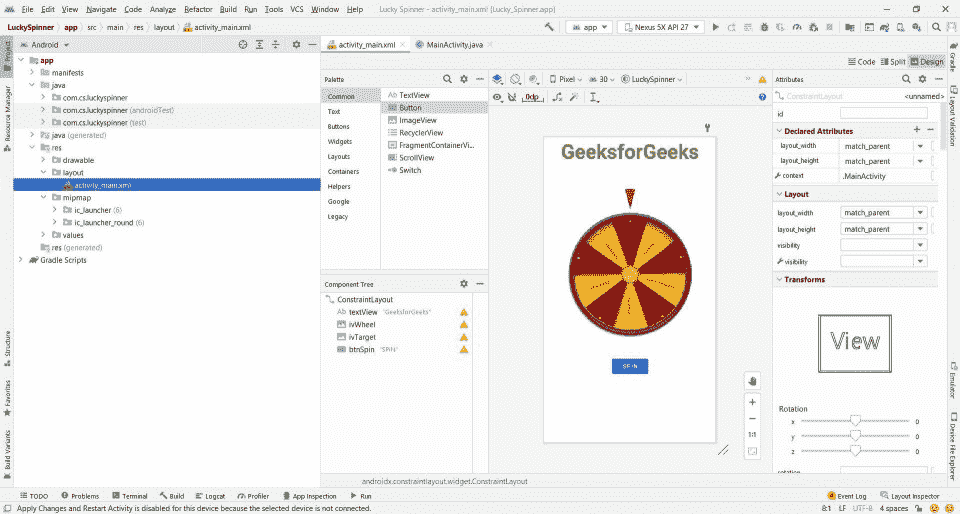
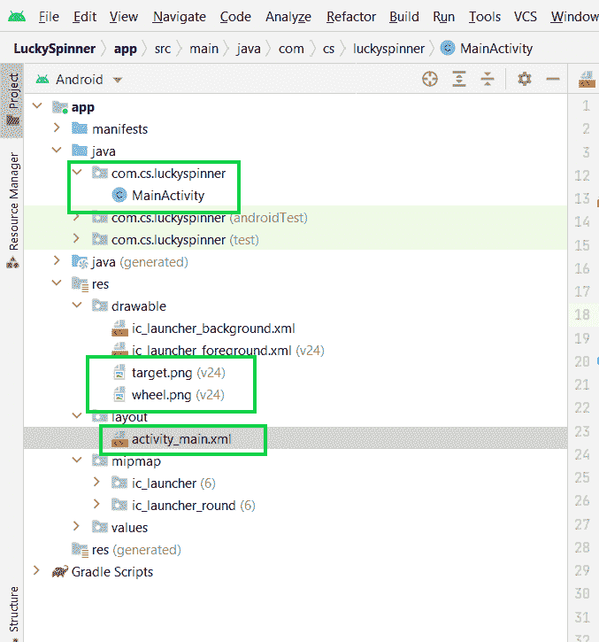

# 如何在安卓中创建一个简单的抽奖纺车？

> 原文:[https://www . geeksforgeeks . org/如何在安卓中创建一个简单的抽奖旋转轮/](https://www.geeksforgeeks.org/how-to-create-a-simple-lucky-draw-spinning-wheel-in-android/)

**先决条件:**

*   [新手安卓应用开发基础](https://www.geeksforgeeks.org/android-app-development-fundamentals-for-beginners/)
*   [安卓工作室安装设置指南](https://www.geeksforgeeks.org/guide-to-install-and-set-up-android-studio/)
*   [如何在安卓工作室创建/启动新项目？](https://www.geeksforgeeks.org/android-how-to-create-start-a-new-project-in-android-studio/)
*   [运行你的第一个安卓应用](https://www.geeksforgeeks.org/android-running-your-first-android-app/)
*   [安卓中的 CountDownTimer 示例](https://www.geeksforgeeks.org/countdowntimer-in-android-with-example/)
*   [Java 中的随机类](https://www.geeksforgeeks.org/java-util-random-class-java/)

我们将构建一个幸运转盘，当你点击一个按钮时，它会让你旋转一个转盘。这是我们将要构建的应用程序的一瞥。该应用程序包含单个[活动](https://www.geeksforgeeks.org/introduction-to-activities-in-android/)，单个[文本视图](https://www.geeksforgeeks.org/textview-widget-in-android-using-java-with-examples/)，两个[图像视图](https://www.geeksforgeeks.org/imageview-in-android-with-example/)，以及一个旋转滚轮的按钮，下面给出了一个示例视频，以了解我们在本文中要做的事情。注意，我们将使用 **Java** 语言来实现这个项目。

<video class="wp-video-shortcode" id="video-712054-1" width="640" height="360" preload="metadata" controls=""><source type="video/mp4" src="https://media.geeksforgeeks.org/wp-content/uploads/20211102183804/Untitled-271_1440p.mp4?_=1">[https://media.geeksforgeeks.org/wp-content/uploads/20211102183804/Untitled-271_1440p.mp4](https://media.geeksforgeeks.org/wp-content/uploads/20211102183804/Untitled-271_1440p.mp4)</video>

### **分步实施**

**第一步:创建新项目**

要在安卓工作室创建新项目，请参考[如何在安卓工作室创建/启动新项目](https://www.geeksforgeeks.org/android-how-to-create-start-a-new-project-in-android-studio/)。注意选择 **Java** 作为编程语言。

**第二步:增加必要的资产**

现在，转到 **app > res >可绘制**，并将以下图像粘贴到可绘制文件夹中。

**轮子. png** :



wheel.png

**目标.png** ：



目标.png

您可以添加任何其他类似的图像。但是一定要把图片分别命名为**wheel.png**和**target.png**。一旦您将图像粘贴到可绘制文件夹中，它将看起来像这样，



**第三步:使用 activity_main.xml** **文件**

我们已经为正在构建的应用程序添加了必要的资源文件。现在，让我们为我们的应用程序设计用户界面。将此 XML 文件添加到**应用程序> res >布局**中。下面是 **activity_main.xml** 文件的代码。

## 可扩展标记语言

```java
<?xml version="1.0" encoding="utf-8"?>
<androidx.constraintlayout.widget.ConstraintLayout 
    xmlns:android="http://schemas.android.com/apk/res/android"
    xmlns:app="http://schemas.android.com/apk/res-auto"
    xmlns:tools="http://schemas.android.com/tools"
    android:layout_width="match_parent"
    android:layout_height="match_parent"
    tools:context=".MainActivity">

    <TextView
        android:id="@+id/textView"
        android:layout_width="wrap_content"
        android:layout_height="wrap_content"
        android:text="GeeksforGeeks"
        android:textColor="@android:color/holo_green_dark"
        android:textSize="48sp"
        android:textStyle="bold"
        app:layout_constraintEnd_toEndOf="parent"
        app:layout_constraintStart_toStartOf="parent"
        app:layout_constraintTop_toTopOf="parent" />

    <ImageView
        android:id="@+id/ivWheel"
        android:layout_width="300dp"
        android:layout_height="300dp"
        android:layout_marginStart="55dp"
        android:layout_marginTop="116dp"
        android:layout_marginEnd="56dp"
        android:rotation="17"
        app:layout_constraintEnd_toEndOf="parent"
        app:layout_constraintStart_toStartOf="parent"
        app:layout_constraintTop_toBottomOf="@+id/textView"
        app:srcCompat="@drawable/wheel" />

    <ImageView
        android:id="@+id/ivTarget"
        android:layout_width="50dp"
        android:layout_height="50dp"
        android:layout_marginStart="181dp"
        android:layout_marginTop="59dp"
        android:layout_marginEnd="181dp"
        app:layout_constraintEnd_toEndOf="parent"
        app:layout_constraintStart_toStartOf="parent"
        app:layout_constraintTop_toBottomOf="@+id/textView"
        app:srcCompat="@drawable/target" />

    <Button
        android:id="@+id/btnSpin"
        android:layout_width="wrap_content"
        android:layout_height="wrap_content"
        android:layout_marginStart="161dp"
        android:layout_marginTop="44dp"
        android:layout_marginEnd="161dp"
        android:text="SPIN"
        app:layout_constraintEnd_toEndOf="parent"
        app:layout_constraintStart_toStartOf="parent"
        app:layout_constraintTop_toBottomOf="@+id/ivWheel" />

</androidx.constraintlayout.widget.ConstraintLayout>
```

**预览:**



activity_main.xml

**第四步:使用****MainActivity.java 文件**

现在是时候初始化 MainActivity 中的所有内容了。我们在 java 中使用 **Random** 类，生成一个随机数进行旋转，**countdowtimer**类每毫秒将图像旋转 2 度。下面是 MainActivity 的完整代码。以下是**MainActivity.java**文件的代码。代码中添加了注释，以更详细地理解代码。

## Java 语言(一种计算机语言，尤用于创建网站)

```java
package com.cs.luckyspinner;

import androidx.appcompat.app.AppCompatActivity;

import android.os.Bundle;
import android.os.CountDownTimer;
import android.view.View;
import android.widget.Button;
import android.widget.ImageView;

import java.util.Random;

public class MainActivity extends AppCompatActivity {

    Button btnSpin;
    ImageView ivWheel;
    CountDownTimer timer;

    @Override
    protected void onCreate(Bundle savedInstanceState) {
        super.onCreate(savedInstanceState);
        setContentView(R.layout.activity_main);

        // initializing views
        btnSpin = findViewById(R.id.btnSpin);
        ivWheel = findViewById(R.id.ivWheel);

        // creating an object of Random class
        // to generate random numbers for the spin
        Random random = new Random();

        // on click listener for btnSpin
        btnSpin.setOnClickListener(new View.OnClickListener() {
            @Override
            public void onClick(View view) {
                // disabling the button so that user
                // should not click on the button
                // while the wheel is spinning
                btnSpin.setEnabled(false);

                // reading random value between 10 to 30
                int spin = random.nextInt(20)+10;

                // since the wheel has 10 divisions, the
                // rotation should be a multiple of
                // 360/10 = 36 degrees
                spin = spin * 36;

                // timer for each degree movement
                timer = new CountDownTimer(spin*20,1) {
                    @Override
                    public void onTick(long l) {
                        // rotate the wheel
                        float rotation = ivWheel.getRotation() + 2;
                        ivWheel.setRotation(rotation);
                    }

                    @Override
                    public void onFinish() {
                        // enabling the button again
                        btnSpin.setEnabled(true);
                    }
                }.start();

            }
        });

    }
}
```

就这样。现在我们可以运行应用程序了。确保您的项目包含以下所有文件。



这是最终申请的预览。

**输出:**

<video class="wp-video-shortcode" id="video-712054-2" width="640" height="360" preload="metadata" controls=""><source type="video/mp4" src="https://media.geeksforgeeks.org/wp-content/uploads/20211102183804/Untitled-271_1440p.mp4?_=2">[https://media.geeksforgeeks.org/wp-content/uploads/20211102183804/Untitled-271_1440p.mp4](https://media.geeksforgeeks.org/wp-content/uploads/20211102183804/Untitled-271_1440p.mp4)</video>