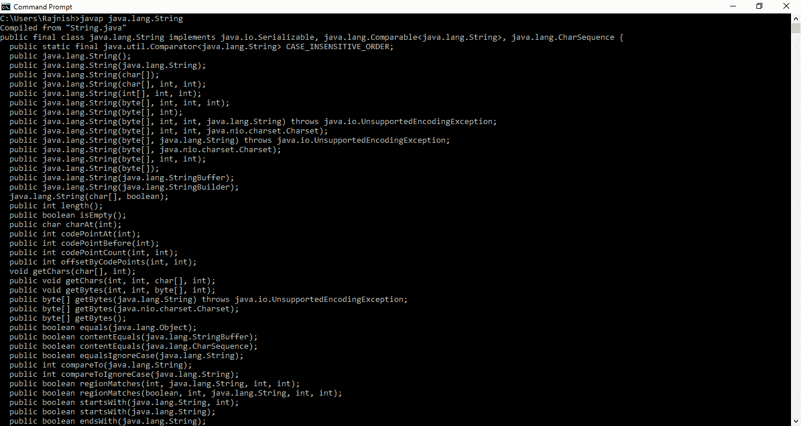

# 如何创建用户自定义的 javap 工具？

> 原文:[https://www . geesforgeks . org/如何创建用户定义的 javap 工具/](https://www.geeksforgeeks.org/how-to-create-a-user-defined-javap-tool/)

### <u>什么是 javap 工具？</u>

<u>T3】</u>

**javap** 工具用于获取任何类或接口的信息。javap 命令(也称为 **Java 反汇编器**)反汇编一个或多个类文件。其输出取决于所使用的**选项**(**-c**或 **-verbose** )分别用于字节码和字节码以及内部信息。如果不使用任何选项，javap 会打印出传递给它的类的包、受保护的和公共的字段和方法。

**语法:**

```
javap [classname] [option]

```

为了更清楚地理解它，请参见命令提示符下的以下示例，该示例打印了[字符串类](https://www.geeksforgeeks.org/string-class-in-java/)
**的详细信息。使用的命令是:**

```
javap java.lang.String

```

**输出:**
[](https://media.geeksforgeeks.org/wp-content/uploads/20190506125502/Annotation-2019-05-06-125358.png)

### <u>如何创建用户自定义的 javap 工具？</u>

<u>T3】</u>

为了创建一个用户定义的 javap 工具，我们将使用以下方法

*   [方法[] getDeclaredMethods()](https://www.geeksforgeeks.org/java-lang-class-class-java-set-2/) :此方法返回一个 Method 对象，该对象反映了此 class 对象表示的类或接口的指定声明方法。
*   [Field[]getDeclaredFields()](https://www.geeksforgeeks.org/java-lang-class-class-java-set-2/):这个方法返回一个 Field 对象的数组，该数组反映了这个 class 对象所表示的类或接口所声明的所有字段。这包括公共、受保护、默认(包)访问和私有字段，但不包括继承字段。
*   [Constructor[]getDeclaredConstructors()](https://www.geeksforgeeks.org/java-lang-class-class-java-set-2/):这个方法返回一个 Constructor 对象的数组，该数组反映了这个 class 对象所代表的类所声明的所有构造函数。这些是公共的、受保护的、默认的(包)访问和私有的构造函数。

我们也将使用 Java 的[反射 API](https://www.geeksforgeeks.org/reflection-in-java/) 。[反射 API](https://www.geeksforgeeks.org/reflection-in-java/) 用于在运行时检查或修改方法、类、接口的行为。

**下面的程序实现了用户定义的 javap 工具** :
**示例 1:** 在这个示例中，我们在用户定义的类上使用这个程序。

```
// The program implements
// user defined javap tool

// Import Reflection
import java.lang.reflect.*;

// Test class on which
// custom javap tool will be used
class test_class {

    // Variables
    int a;
    double d;
    char c;
    String s;

    // Constructors
    test_class()
    {
        a = 0;
        d = 0.0;
        c = 'a';
        s = "Hello";
    }

    test_class(int a, double d, char c, String s)
    {
        this.a = a;
        this.d = d;
        this.c = c;
        this.s = s;
    }

    // Some class Methods
    void printData()
    {
        System.out.println(a + d + c + s);
    }

    void setData()
    {
        a = 1;
        d = 0.0;
        c = 'A';
        s = "Hello Geeks";
    }
}

// Custom javap tool
public class javapcustom {

    public static void main(String[] args)
        throws Exception
    {
        Class class_name = Class.forName("test_class");

        // Print field of class
        System.out.println("Fields of class");

        Field f[] = class_name.getDeclaredFields();
        for (int i = 0; i < f.length; i++) {
            System.out.println(f[i]);
        }

        // Print constructor of class
        System.out.println("\nConstructors of class");

        Constructor cons[] = class_name.getDeclaredConstructors();
        for (int i = 0; i < cons.length; i++) {
            System.out.println(cons[i]);
        }

        // Print methods of class
        System.out.println("\nMethods of class");

        Method method[] = class_name.getDeclaredMethods();
        for (int i = 0; i < method.length; i++)
            System.out.println(method[i]);
    }
}
```

**输出:**

```
Fields of class
int test_class.a
double test_class.d
char test_class.c
java.lang.String test_class.s

Constructors of class
test_class(int, double, char, java.lang.String)
test_class()

Methods of class
void test_class.printData()
void test_class.setData()

```

**示例 2:** 在这个示例中，我们在预定义的 Java 类上使用这个用户定义的 javap 工具。

```
// The program implements
// user defined javap tool

// Import Reflection
import java.lang.reflect.*;

// Custom javap tool
public class javapcustom {

    public static void main(String[] args)
        throws Exception
    {

        // You can replace args[0] with
        // the name of predefined Class
        // on which you want to use javap tool
        // eg: replace args[0] with "java.lang.String"
        Class class_name = Class.forName(args[0]);

        // Print field of class
        System.out.println("Fields of class");
        Field f[] = class_name.getDeclaredFields();
        for (int i = 0; i < f.length; i++) {
            System.out.println(f[i]);
        }

        // Print constructor of class
        System.out.println("\nConstructors of class");
        Constructor cons[] = class_name.getDeclaredConstructors();
        for (int i = 0; i < cons.length; i++) {
            System.out.println(cons[i]);
        }

        // Print methods of class
        System.out.println("\nMethods of class");
        Method method[] = class_name.getDeclaredMethods();
        for (int i = 0; i < method.length; i++)
            System.out.println(method[i]);
    }
}
```

**输出:**
[](https://media.geeksforgeeks.org/wp-content/uploads/20190504015916/Annotation-2019-05-04-015744.png)