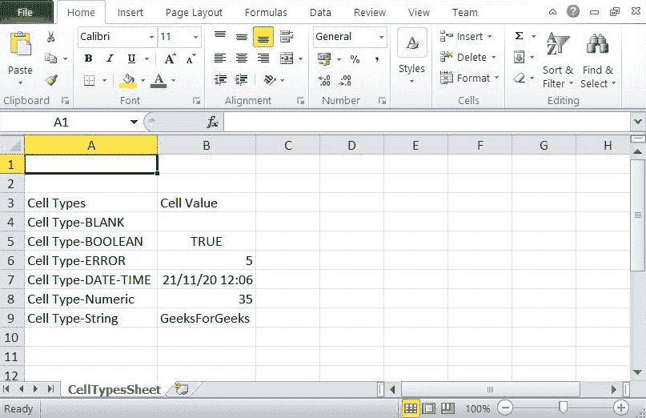

# 如何使用 Java 在电子表格中创建不同类型的单元格？

> 原文:[https://www . geesforgeks . org/如何使用 java 创建不同类型的电子表格单元格/](https://www.geeksforgeeks.org/how-to-create-different-types-of-cells-in-a-spreadsheet-using-java/)

[Apache POI](https://www.geeksforgeeks.org/apache-poi-introduction/)是 Apache 基金会提供的一个应用编程接口，用于为单元格设置各种类型的值。Apache POI 的重载功能 ***设置单元格值(** )* 用于设置单元格的值类型。 [Maven](https://www.geeksforgeeks.org/introduction-apache-maven-build-automation-tool-java-projects/) 是基于 POM(项目对象模型)的强大项目管理工具。它用于项目构建、依赖关系**、**和文档。它像 ANT 一样简化了构建过程。但是它比 ANT 先进太多了。

**算法:**在电子表格中创建不同类型单元格的步骤

*   **步骤 1:** 创建工作簿的实例
*   **第二步**:在上面的工作簿中创建一个电子表格。
*   **步骤 3:** 使用 [XSSF](https://www.geeksforgeeks.org/apache-poi-getting-started/) 行创建行
*   **步骤 4:** 通过定义类型为[文件输出流](https://www.geeksforgeeks.org/fileoutputstream-in-java/)的对象，将内容写入工作簿
*   **第五步:**关闭文件

**程序:**

**步骤 1:** 在 eclipse 中创建一个 [Maven](https://www.geeksforgeeks.org/introduction-apache-maven-build-automation-tool-java-projects/) 项目，并将 Apache POI(用于设置单元格的值类型)依赖项添加到其中或者一个安装了 Apache POI 库的 Java 项目中。

**步骤 2:** 与创建 Maven 项目一样，为了使用 Apache POI 库，需要先决条件将以下 Maven 依赖项添加到 [pom.xml](https://www.geeksforgeeks.org/page-object-model-pom/) 文件中。对于这些库，在线搜索 Maven Central Library，然后搜索 Apache POI 并获取依赖项，或者也可以将如下所示的依赖项复制到主 java 程序中。

## 可扩展标记语言

```
<dependencies>

        <!-- https://mvnrepository.com/artifact/org.apache.poi/poi -->
        <dependency>
            <groupId>org.apache.poi</groupId>
            <artifactId>poi</artifactId>
            <version>3.12</version>
        </dependency>

        <!-- https://mvnrepository.com/artifact/org.apache.poi/poi-ooxml -->
        <dependency>
            <groupId>org.apache.poi</groupId>
            <artifactId>poi-ooxml</artifactId>
            <version>3.9</version>
        </dependency>  

</dependencies>
```

**步骤 3:** 添加依赖项后，创建一个新类。要创建一个新的类，请转到 **src/main/java/package 右键单击并创建一个新的类**并命名它，这里为了说明起见，文件命名为 GFG。。在本课中，我们将首先创建工作簿的一个实例，并使用该实例创建一个电子表格，在该电子表格中，我们将定义单元格的值类型。下面是上面讨论的 GFG 类的代码片段。

**实现:**代码片段

**示例:**在电子表格中创建不同类型的单元格

## Java 语言(一种计算机语言，尤用于创建网站)

```
// Java Program to create 
// different types of cells in a spreadsheet

// Importing Maven dependenncies
// Importing Apache POI dependency files
// Importing java input/output file and
// Date class from java.util package
import java.io.File;
import java.io.FileOutputStream;
import java.util.Date;
import org.apache.poi.ss.usermodel.CellStyle;
import org.apache.poi.ss.usermodel.CreationHelper;
import org.apache.poi.xssf.usermodel.XSSFCell;
import org.apache.poi.xssf.usermodel.XSSFRow;
import org.apache.poi.xssf.usermodel.XSSFSheet;
import org.apache.poi.xssf.usermodel.XSSFWorkbook;

// Class having different types of cells
public class GFG {

    // Main driver method
    public static void main(String[] args) throws Exception
    {

        // Step 1: Create an instance of the workbook
        XSSFWorkbook workbook = new XSSFWorkbook();
        CreationHelper creationHelper
            = workbook.getCreationHelper();

        // Step 2: Create a spreadsheet in the above
        // workbook
        // and name it as CellTypesSheet
        XSSFSheet spreadsheet
            = workbook.createSheet("CellTypesSheet");

        // Step 3: Create rows using XSSFRow
        // We need to create row before creating cells,
        // row is a collection of cells
        XSSFRow noOfRows = spreadsheet.createRow((short)2);

        // Creating cells
        // Custom inputs in cells

        // Cell 1
        noOfRows.createCell(0).setCellValue("Cell Types");

        // Cell 2
        noOfRows.createCell(1).setCellValue("Cell Value");

        // Above two cells(Cell Types and Cell Values) are
        // created at row 3 in excel and similarly for rest
        // of the cells
        noOfRows = spreadsheet.createRow((short)3);

        // Cell 3
        // Setting a Blank type cell
        noOfRows.createCell(0).setCellValue(
            "Cell Type-BLANK");
        noOfRows.createCell(1);
        noOfRows = spreadsheet.createRow((short)4);

        // Cell 4
        // Setting a Boolean type cell
        noOfRows.createCell(0).setCellValue(
            "Cell Type-BOOLEAN");
        noOfRows.createCell(1).setCellValue(true);
        noOfRows = spreadsheet.createRow((short)5);

        // Cell 5
        // Setting a Error type cell
        noOfRows.createCell(0).setCellValue(
            "Cell Type-ERROR");
        noOfRows.createCell(1).setCellValue(
            XSSFCell.CELL_TYPE_ERROR);
        noOfRows = spreadsheet.createRow((short)6);

        // Cell 6
        // Setting a Date and Time type cell
        CellStyle cellStyle = workbook.createCellStyle();
        cellStyle.setDataFormat(
            creationHelper.createDataFormat().getFormat(
                "d/m/y h:mm"));
        noOfRows.createCell(0).setCellValue(
            "Cell Type-DATE-TIME");
        noOfRows.createCell(1).setCellValue(new Date());
        noOfRows.getCell(1).setCellStyle(cellStyle);
        noOfRows = spreadsheet.createRow((short)7);

        // Cell 7
        // Setting a Numeric type cell
        noOfRows.createCell(0).setCellValue(
            "Cell Type-Numeric");
        noOfRows.createCell(1).setCellValue(35);
        noOfRows = spreadsheet.createRow((short)8);

        // Cell 8
        // Setting a String type cell
        noOfRows.createCell(0).setCellValue(
            "Cell Type-String");
        noOfRows.createCell(1).setCellValue(
            "GeeksForGeeks");

        // Step 4: Writing the content to the workbook
        // by defining object of type  FileOutputStream
        FileOutputStream out = new FileOutputStream(
            new File("GfgTypesOfCells.xlsx"));
        workbook.write(out);

        // Step 5: Close the file
        out.close();

        // Display message to be printed for successful
        // execution of program
        System.out.println("GFG.xlsx Created Successfully");
    }
}
```

**输出:**控制台中将打印一条消息，该消息在程序中最后指定为“GFG.xlsx 已成功创建”，表示成功执行了负责更改以下电子表格的程序:

