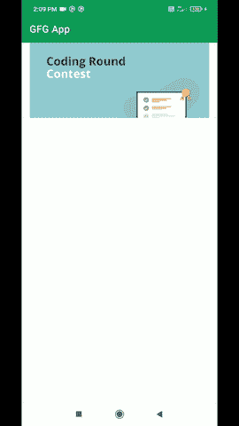

# 如何用 Firebase 在安卓中创建动态自动图像滑块？

> 原文:[https://www . geeksforgeeks . org/how-create-dynamic-auto-image-slider-in-Android-with-firebase/](https://www.geeksforgeeks.org/how-to-create-dynamic-auto-image-slider-in-android-with-firebase/)

我们已经看到许多应用程序将滑块格式的图像显示为自动滑动的横幅。这种类型的自动图像滑块功能在许多电子商务网站上都可以看到。这个功能在很多有图片的应用程序中都可以看到。在本文中，我们将了解一下**如何在安卓**中创建动态自动图像滑块。因此，我们将使用 Firebase 加载我们的滑块内的图像 [Firebase](https://www.geeksforgeeks.org/firebase-introduction/) 。在 Firebase 的帮助下，这些图像可以实时更新，而无需更新应用程序。为了实现幻灯片视图，我们将使用幻灯片视图库。

### 我们将在本文中构建什么？

我们将创建一个简单的应用程序，其中我们将创建一个滑块视图，我们将在我们的幻灯片视图中显示来自 Firebase 的图像。下面给出了一个 GIF 示例，来了解一下在本文中要做什么。请注意，我们将使用 **Java** 语言来实现这个项目。



### **分步实施**

**第一步:创建新项目**

要在安卓工作室创建新项目，请参考[如何在安卓工作室创建/启动新项目](https://www.geeksforgeeks.org/android-how-to-create-start-a-new-project-in-android-studio/)。注意选择 **Java** 作为编程语言。

**第二步:将你的应用连接到 Firebase**

创建新项目后，导航到顶部栏上的“工具”选项。点击火焰基地。点击 Firebase 后，你可以看到截图中下面提到的右栏。


在那一栏中，导航到火基云火石。点击那个选项，你会看到两个选项:连接应用到 Firebase 和添加云 Firestore 到你的应用。单击立即连接选项，您的应用程序将连接到 Firebase。之后点击第二个选项，现在你的应用程序连接到 Firebase。将您的应用程序连接到 Firebase 后，您将看到下面的屏幕。


之后，验证 Firebase Firestore 数据库的依赖项已经添加到我们的 Gradle 文件中。导航到该文件中的**应用程序>渐变脚本**，检查是否添加了以下依赖项。如果您的 build.gradle 文件中不存在以下依赖项。在依赖项部分添加以下依赖项。

> 实现' com . Google . firebase:firebase-firestore:22 . 0 . 1 '

添加该依赖项后，我们将为我们的**幻灯片视图**和[毕加索](https://www.geeksforgeeks.org/image-loading-caching-library-android-set-1/)添加依赖项，这将用于从它们的图像网址加载图像。

> 实现' com . github . smart eist:autoimageslider:1 . 3 . 9 '
> 
> 实现' com.squareup .毕加索:毕加索:2.71828 '

添加这些依赖项后，同步您的项目。现在我们将转向应用程序的 AndroidManifest.xml 部分。

**第三步:使用 AndroidManifest.xml 文件**

为了向 Firebase 添加数据，我们应该授予访问互联网的权限。要添加这些权限，请导航至**应用程序> AndroidManifest.xml** ，并在该文件中添加以下权限。

## 可扩展标记语言

```java
<!--Permissions for internet-->
<uses-permission android:name="android.permission.INTERNET" />
<uses-permission android:name="android.permission.ACCESS_NETWORK_STATE" />
```

**第 4 步:使用 activity_main.xml 文件**

转到 **activity_main.xml** 文件，参考以下代码。下面是 **activity_main.xml** 文件的代码。

## 可扩展标记语言

```java
<?xml version="1.0" encoding="utf-8"?>
<LinearLayout 
    xmlns:android="http://schemas.android.com/apk/res/android"
    xmlns:app="http://schemas.android.com/apk/res-auto"
    xmlns:tools="http://schemas.android.com/tools"
    android:layout_width="match_parent"
    android:layout_height="match_parent"
    android:orientation="vertical"
    tools:context=".MainActivity">

    <!--Slider view for displaying our sliding images-->
    <com.smarteist.autoimageslider.SliderView
        android:id="@+id/slider"
        android:layout_width="match_parent"
        android:layout_height="150dp"
        app:sliderAnimationDuration="600"
        app:sliderAutoCycleDirection="back_and_forth"
        app:sliderIndicatorAnimationDuration="600"
        app:sliderIndicatorEnabled="false"
        app:sliderIndicatorGravity="center_horizontal|bottom"
        app:sliderIndicatorMargin="15dp"
        app:sliderIndicatorOrientation="horizontal"
        app:sliderIndicatorPadding="3dp"
        app:sliderIndicatorRadius="2dp"
        app:sliderIndicatorSelectedColor="#5A5A5A"
        app:sliderIndicatorUnselectedColor="#FFF"
        app:sliderScrollTimeInSec="1" />

</LinearLayout>
```