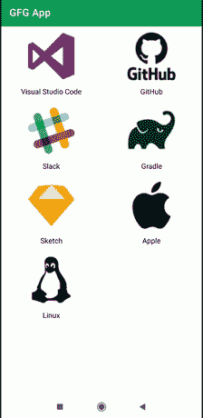
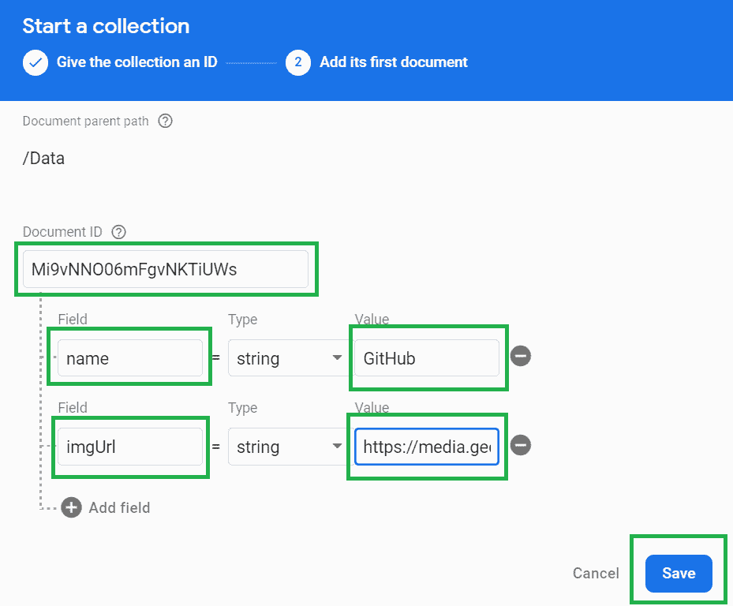

# 如何使用 Firebase Firestore 在安卓中创建动态 GridView？

> 原文:[https://www . geeksforgeeks . org/how-create-dynamic-GridView-in-Android-use-firebase-firestore/](https://www.geeksforgeeks.org/how-to-create-dynamic-gridview-in-android-using-firebase-firestore/)

[GridView](https://www.geeksforgeeks.org/gridview-in-android-with-example/) 也是最常用的 UI 组件之一，用于在我们的应用程序中以 Grid 格式显示项目。通过使用这种类型的视图，我们可以以网格格式显示项目。我们在大多数应用程序中都见过这种类型的 GridView。我们还在我们的应用程序中看到了 GridView 的实现。在本文中，我们将看一下在安卓系统中使用 Firebase Firestore 实现 **GridView。**

### 我们将在本文中构建什么？

我们将构建一个简单的应用程序，其中我们将以网格格式显示数据，我们将从 GridView 中的 Firebase Firestore 加载这些数据。下面给出了一个示例 GIF，以了解我们将在本文中做什么。注意，我们将使用 **Java** 语言来实现这个项目。



### **分步实施**

**第一步:创建新项目**

要在安卓工作室创建新项目，请参考[如何在安卓工作室创建/启动新项目](https://www.geeksforgeeks.org/android-how-to-create-start-a-new-project-in-android-studio/)。注意选择 **Java** 作为编程语言。

**第二步:将你的应用连接到 Firebase**

创建新项目后，导航到顶部栏上的“工具”选项。点击火焰基地。点击 Firebase 后，你可以看到截图中下面提到的右栏。


在那一栏中，导航到火基云火石。点击那个选项，你会看到两个选项:连接应用到 Firebase 和添加云 Firestore 到你的应用。单击立即连接选项，您的应用程序将连接到 Firebase。之后点击第二个选项，现在你的应用程序连接到 Firebase。将您的应用程序连接到 Firebase 后，您将看到下面的屏幕。


之后，验证 Firebase Firestore 数据库的依赖项是否已经添加到我们的 Gradle 文件中。导航到该文件中的**应用程序>渐变脚本**，检查是否添加了以下依赖项。如果您的 build.gradle 文件中不存在以下依赖项。在依赖项部分添加以下依赖项。

> *实现‘com . Google . firebase:firebase-firestore:22 . 0 . 1’*

添加此依赖项后，同步您的项目，现在我们可以创建我们的应用程序了。如果你想了解更多关于连接你的应用到 Firebase。参考本文详细了解[如何给安卓 App](https://www.geeksforgeeks.org/adding-firebase-to-android-app/) 添加 Firebase。

**第 3 步:使用 AndroidManifest.xml 文件**

为了向 Firebase 添加数据，我们应该授予访问互联网的权限。要添加这些权限，请导航至**应用程序> AndroidManifest.xml** ，并在该文件中添加以下权限。

## 可扩展标记语言

```
<!--Permissions for internet-->
<uses-permission android:name="android.permission.INTERNET" />
<uses-permission android:name="android.permission.ACCESS_NETWORK_STATE" />
```

**第 4 步:使用 activity_main.xml 文件**

转到 **activity_main.xml** 文件，参考以下代码。下面是 **activity_main.xml** 文件的代码。

## 可扩展标记语言

```
<?xml version="1.0" encoding="utf-8"?>
<RelativeLayout 
    xmlns:android="http://schemas.android.com/apk/res/android"
    xmlns:tools="http://schemas.android.com/tools"
    android:layout_width="match_parent"
    android:layout_height="match_parent"
    android:orientation="vertical"
    tools:context=".MainActivity">

    <!--Grid View for displaying our data from Firebase-->
    <GridView
        android:id="@+id/idGVCourses"
        android:layout_width="match_parent"
        android:layout_height="match_parent"
        android:numColumns="2" />

</RelativeLayout>
```

**第五步:现在我们将创建一个新的 Java 类来存储我们的数据**

为了从 Firebase Firestore 数据库中读取数据，我们必须创建一个 Object 类，我们将在这个类中读取数据。要创建一个对象类，导航到**应用程序> java >你的应用程序的包名>右键单击它，然后单击新建> Java 类>给你的类命名**。这里我们已经给了名称为**数据模式**并添加了下面的代码。

## Java 语言(一种计算机语言，尤用于创建网站)

```
public class DataModal {

    // variables for storing our image and name.
    private String name;
    private String imgUrl;

    public DataModal() {
        // empty constructor required for firebase.
    }

    // constructor for our object class.
    public DataModal(String name, String imgUrl) {
        this.name = name;
        this.imgUrl = imgUrl;
    }

    // getter and setter methods
    public String getName() {
        return name;
    }

    public void setName(String name) {
        this.name = name;
    }

    public String getImgUrl() {
        return imgUrl;
    }

    public void setImgUrl(String imgUrl) {
        this.imgUrl = imgUrl;
    }
}
```

**第 6 步:为我们的 GridView 项目创建一个布局文件**

导航到**应用程序> res >布局>右键单击它，然后单击新建>布局资源文件**，并为该文件命名。创建该文件后，向其中添加以下代码。这里我们给了名称为**的图像 _gv_item** ，并添加了下面的代码。

## 可扩展标记语言

```
<?xml version="1.0" encoding="utf-8"?>
<LinearLayout 
    xmlns:android="http://schemas.android.com/apk/res/android"
    android:layout_width="match_parent"
    android:layout_height="wrap_content"
    android:layout_gravity="center"
    android:gravity="center"
    android:orientation="vertical"
    android:padding="4dp">

    <!--Image view for displaying our image-->
    <ImageView
        android:id="@+id/idIVimage"
        android:layout_width="100dp"
        android:layout_height="100dp"
        android:layout_margin="4dp"
        android:background="@color/white"
        android:backgroundTint="@color/white"
        android:padding="3dp" />

    <!--Text view for displaying our text -->
    <TextView
        android:id="@+id/idTVtext"
        android:layout_width="wrap_content"
        android:layout_height="wrap_content"
        android:layout_margin="2dp"
        android:padding="3dp"
        android:text="Category Text"
        android:textAlignment="center"
        android:textColor="@color/black" />

</LinearLayout>
```

**步骤 7:现在为我们的 GridView 创建一个适配器类**

要创建一个新的适配器类，导航到**应用程序> java >你的应用程序的包名>右键单击它，然后单击新建> java 类**，将你的 Java 类命名为**coursesgwadapter**，并添加下面的代码。代码中添加了注释，以更详细地理解代码。

## Java 语言(一种计算机语言，尤用于创建网站)

```
import android.content.Context;
import android.view.LayoutInflater;
import android.view.View;
import android.view.ViewGroup;
import android.widget.ArrayAdapter;
import android.widget.ImageView;
import android.widget.TextView;
import android.widget.Toast;

import androidx.annotation.NonNull;
import androidx.annotation.Nullable;

import com.squareup.picasso.Picasso;

import java.util.ArrayList;

public class CoursesGVAdapter extends ArrayAdapter<DataModal> {

    // constructor for our list view adapter.
    public CoursesGVAdapter(@NonNull Context context, ArrayList<DataModal> dataModalArrayList) {
        super(context, 0, dataModalArrayList);
    }

    @NonNull
    @Override
    public View getView(int position, @Nullable View convertView, @NonNull ViewGroup parent) {

        // below line is use to inflate the 
        // layout for our item of list view.
        View listitemView = convertView;
        if (listitemView == null) {
            listitemView = LayoutInflater.from(getContext()).inflate(R.layout.image_gv_item, parent, false);
        }

        // after inflating an item of listview item
        // we are getting data from array list inside 
        // our modal class.
        DataModal dataModal = getItem(position);

        // initializing our UI components of list view item.
        TextView nameTV = listitemView.findViewById(R.id.idTVtext);
        ImageView courseIV = listitemView.findViewById(R.id.idIVimage);

        // after initializing our items we are
        // setting data to our view.
        // below line is use to set data to our text view.
        nameTV.setText(dataModal.getName());

        // in below line we are using Picasso to load image
        // from URL in our Image VIew.
        Picasso.get().load(dataModal.getImgUrl()).into(courseIV);

        // below line is use to add item 
        // click listener for our item of list view.
        listitemView.setOnClickListener(new View.OnClickListener() {
            @Override
            public void onClick(View v) {
                // on the item click on our list view.
                // we are displaying a toast message.
                Toast.makeText(getContext(), "Item clicked is : " + dataModal.getName(), Toast.LENGTH_SHORT).show();
            }
        });
        return listitemView;
    }
}
```

**步骤 8:使用 MainActivity.java 文件**

转到**MainActivity.java**文件，参考以下代码。以下是**MainActivity.java**文件的代码。代码中添加了注释，以更详细地理解代码。

## Java 语言(一种计算机语言，尤用于创建网站)

```
import android.os.Bundle;
import android.widget.GridView;
import android.widget.Toast;

import androidx.annotation.NonNull;
import androidx.appcompat.app.AppCompatActivity;

import com.google.android.gms.tasks.OnFailureListener;
import com.google.android.gms.tasks.OnSuccessListener;
import com.google.firebase.firestore.DocumentSnapshot;
import com.google.firebase.firestore.FirebaseFirestore;
import com.google.firebase.firestore.QuerySnapshot;

import java.util.ArrayList;
import java.util.List;

public class MainActivity extends AppCompatActivity {

    // creating a variable for our 
    // grid view, arraylist and 
    // firebase Firestore.
    GridView coursesGV;
    ArrayList<DataModal> dataModalArrayList;
    FirebaseFirestore db;

    @Override
    protected void onCreate(Bundle savedInstanceState) {
        super.onCreate(savedInstanceState);
        setContentView(R.layout.activity_main);

        // below line is use to initialize our variables.
        coursesGV = findViewById(R.id.idGVCourses);
        dataModalArrayList = new ArrayList<>();

        // initializing our variable for firebase
        // firestore and getting its instance.
        db = FirebaseFirestore.getInstance();

        // here we are calling a method 
        // to load data in our list view.
        loadDatainGridView();
    }

    private void loadDatainGridView() {
        // below line is use to get data from Firebase
        // firestore using collection in android.
        db.collection("Data").get()
                .addOnSuccessListener(new OnSuccessListener<QuerySnapshot>() {
                    @Override
                    public void onSuccess(QuerySnapshot queryDocumentSnapshots) {
                        // after getting the data we are calling on success method
                        // and inside this method we are checking if the received 
                        // query snapshot is empty or not.
                        if (!queryDocumentSnapshots.isEmpty()) {
                            // if the snapshot is not empty we are hiding our
                            // progress bar and adding our data in a list.
                            List<DocumentSnapshot> list = queryDocumentSnapshots.getDocuments();
                            for (DocumentSnapshot d : list) {

                                // after getting this list we are passing
                                // that list to our object class.
                                DataModal dataModal = d.toObject(DataModal.class);

                                // after getting data from Firebase 
                                // we are storing that data in our array list
                                dataModalArrayList.add(dataModal);
                            }
                            // after that we are passing our array list to our adapter class.
                            CoursesGVAdapter adapter = new CoursesGVAdapter(MainActivity.this, dataModalArrayList);

                            // after passing this array list 
                            // to our adapter class we are setting 
                            // our adapter to our list view.
                            coursesGV.setAdapter(adapter);
                        } else {
                            // if the snapshot is empty we are displaying a toast message.
                            Toast.makeText(MainActivity.this, "No data found in Database", Toast.LENGTH_SHORT).show();
                        }
                    }
                }).addOnFailureListener(new OnFailureListener() {
            @Override
            public void onFailure(@NonNull Exception e) {
                // we are displaying a toast message 
                // when we get any error from Firebase.
                Toast.makeText(MainActivity.this, "Fail to load data..", Toast.LENGTH_SHORT).show();
            }
        });
    }
}
```

添加上述代码后，将数据添加到 Android 中的 Firebase Firestore。

**第九步:将数据添加到安卓**中的 Firebase Firestore

在你的浏览器中搜索 Firebase，然后转到那个网站，你会看到下面的屏幕。


单击“转到控制台”选项后。点击您的项目，如下所示。


点击你的项目后，你会看到下面的屏幕。点击这个项目后，你会看到下面的屏幕。


点击创建数据库选项后，您将看到下面的屏幕。


在此屏幕中，我们必须选择“在测试模式下启动”选项。我们使用测试模式，因为我们没有在我们的应用程序中设置身份验证。所以我们在测试模式下选择开始。选择测试模式后，点击下一步选项，您将看到下面的屏幕。


在这个屏幕中，我们只需要点击启用按钮来启用我们的 Firebase Firestore 数据库。完成这个过程后，我们必须在 Firebase 控制台中添加数据。用于向我们的 Firebase 控制台添加数据。

你要点击**开始采集**选项，并给出采集名称为**数据**。创建集合后，您必须单击**自动添加**选项来创建第一个文档。然后创建两个字段，一个为“**名称**”，一个为“ **imgUrl** ”，并为它们输入相应的值。请注意，在 imgUrl 字段的值中指定**图像网址链接**。点击**保存**按钮。您在**数据**中的第一个图像已经添加。



同样，点击“**添加文档**”按钮添加更多图像。


添加这些图像后，运行您的应用程序，您将在下面的屏幕上看到输出。

### **输出:**

<video class="wp-video-shortcode" id="video-542652-1" width="640" height="360" preload="metadata" controls=""><source type="video/mp4" src="https://media.geeksforgeeks.org/wp-content/uploads/20210112113825/1610431550215.mp4?_=1">[https://media.geeksforgeeks.org/wp-content/uploads/20210112113825/1610431550215.mp4](https://media.geeksforgeeks.org/wp-content/uploads/20210112113825/1610431550215.mp4)</video>