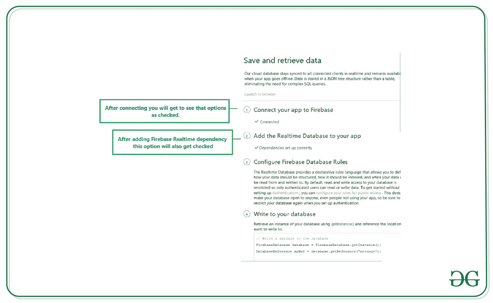
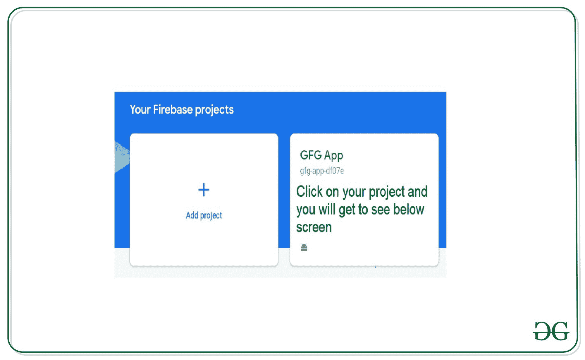
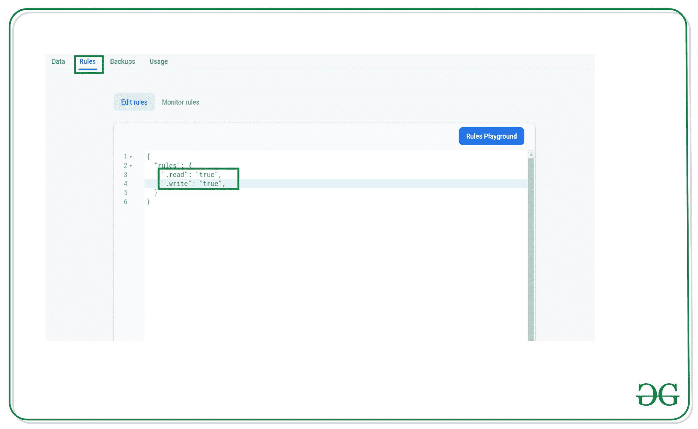
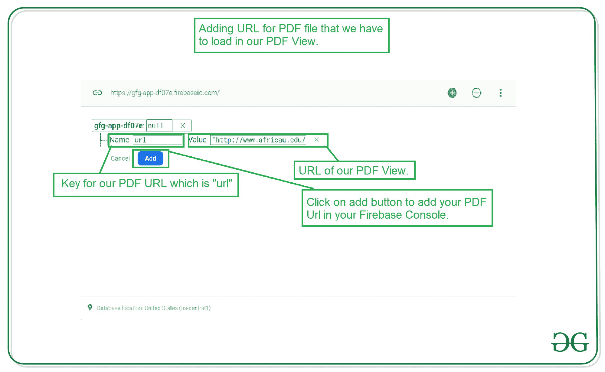

# 如何用 Firebase 在安卓中创建动态 PDF 查看器？

> 原文:[https://www . geesforgeks . org/how-create-dynamic-pdf-viewer-in-Android-with-firebase/](https://www.geeksforgeeks.org/how-to-create-dynamic-pdf-viewer-in-android-with-firebase/)

如果你正在为学生或教育目的创建应用程序，那么你需要添加一些 PDF 文件来显示我们的应用程序中的一些数据。这些 PDF 文件会定期更新。为了从服务器加载这个 PDF，我们更喜欢使用 PDF 查看器，它将从安卓的网址加载 PDF。在这里，我们将 PDF 的网址添加到我们的应用程序代码中，并从该网址加载它。如果我们想更改 PDF，那么我们需要在代码中更改 PDF 的网址。但实际上，不可能为用户更改 PDF 文件的网址和更新应用程序。所以为了处理这个案例，我们将使用 Firebase。通过使用 Firebase，我们将从 Firebase 动态加载 PDF，并在我们的应用程序中更新 PDF。现在我们将进入实现部分。

### 我们将在这个项目中构建什么？

我们将建立一个应用程序，我们将从我们的 Firebase 控制台加载 PDF，并通过更改 Firebase 控制台中的网址实时更新该 PDF。为了实施这个项目，我们将使用 [Firebase 实时数据库](https://www.geeksforgeeks.org/firebase-realtime-database-with-operations-in-android-with-examples/)，通过它我们将实时更新我们的 PDF。注意，我们将使用 **Java** 语言来实现这个项目。

### **分步实施**

**第一步:创建新项目**

要在安卓工作室创建新项目，请参考[如何在安卓工作室创建/启动新项目](https://www.geeksforgeeks.org/android-how-to-create-start-a-new-project-in-android-studio/)。注意选择 **Java** 作为编程语言。

**第二步:将你的应用连接到 Firebase**

创建新项目后。导航到顶部栏上的工具选项。点击火焰基地。点击 Firebase 后，你可以看到截图中下面提到的右栏。


在该列中，导航到 Firebase 实时数据库。点击那个选项，你会看到两个选项:连接应用程序到 Firebase 和添加 Firebase 实时数据库到你的应用程序。单击立即连接，您的应用程序将连接到 Firebase。之后点击第二个选项，现在你的应用连接到 [Firebase](https://www.geeksforgeeks.org/adding-firebase-to-android-app/) 。


完成此过程后，您将看到下面的屏幕。



现在验证您的应用程序是否连接到 Firebase。转到您的 build.gradle 文件。导航到**应用程序>渐变脚本>构建.渐变**文件，并确保以下依赖项已添加到您的依赖项部分。

> 实现' com . Google . firebase:firebase-数据库:19.6.0 '

添加此依赖项后，在您的渐变文件中添加 PDF 查看器的依赖项。

**第三步:在 build.gradle 文件**中添加 PDF 查看器的依赖项

导航到**应用程序>渐变脚本> build.gradle** 文件，并在其中添加下面的依赖项。

> 实现' com . github . barteksc:Android-pdf-viewer:2 . 8 . 2 '

添加此依赖项后，同步您的项目。现在我们将转向 XML 部分。

**第四步:在你的 AndroidManifest.xml 文件**中添加互联网权限

在 AndroidManifest.xml 文件中添加互联网权限。

## 可扩展标记语言

```java
<uses-permission android:name="android.permission.INTERNET" />
<uses-permission android:name="android.permission.ACCESS_NETWORK_STATE" />
```

**第 5 步:使用 activity_main.xml 文件**

转到 **activity_main.xml** 文件，参考以下代码。下面是 **activity_main.xml** 文件的代码。

## 可扩展标记语言

```java
<?xml version="1.0" encoding="utf-8"?>
<RelativeLayout 
    xmlns:android="http://schemas.android.com/apk/res/android"
    xmlns:tools="http://schemas.android.com/tools"
    android:layout_width="match_parent"
    android:layout_height="match_parent"
    tools:context=".MainActivity">

    <!--PDF View for displaying our PDF-->
    <com.github.barteksc.pdfviewer.PDFView
        android:id="@+id/pdfView"
        android:layout_width="match_parent"
        android:layout_height="match_parent" />

</RelativeLayout>
```

**步骤 6:使用 MainActivity.java 文件**

转到**MainActivity.java**文件，参考以下代码。以下是**MainActivity.java**文件的代码。代码中添加了注释，以更详细地理解代码。

## Java 语言(一种计算机语言，尤用于创建网站)

```java
import android.os.AsyncTask;
import android.os.Bundle;
import android.widget.Toast;

import androidx.annotation.NonNull;
import androidx.appcompat.app.AppCompatActivity;

import com.github.barteksc.pdfviewer.PDFView;
import com.google.firebase.database.DataSnapshot;
import com.google.firebase.database.DatabaseError;
import com.google.firebase.database.DatabaseReference;
import com.google.firebase.database.FirebaseDatabase;
import com.google.firebase.database.ValueEventListener;

import java.io.BufferedInputStream;
import java.io.IOException;
import java.io.InputStream;
import java.net.HttpURLConnection;
import java.net.URL;

public class MainActivity extends AppCompatActivity {

    // creating a variable for our Firebase Database.
    FirebaseDatabase firebaseDatabase;

    // creating a variable for our Database 
    // Reference for Firebase.
    DatabaseReference databaseReference;

    // creating a variable for our pdfview
    private PDFView pdfView;

    @Override
    protected void onCreate(Bundle savedInstanceState) {
        super.onCreate(savedInstanceState);
        setContentView(R.layout.activity_main);

        // initializing variable for pdf view.
        pdfView = findViewById(R.id.pdfView);

        // below line is used to get the instance 
        // of our Firebase database.
        firebaseDatabase = FirebaseDatabase.getInstance();

        // below line is used to get reference for our database.
        databaseReference = firebaseDatabase.getReference("url");

        // calling method to initialize
        // our PDF view.
        initializePDFView();
    }

    private void initializePDFView() {

        // calling add value event listener method 
        // for getting the values from database.
        databaseReference.addValueEventListener(new ValueEventListener() {
            @Override
            public void onDataChange(@NonNull DataSnapshot snapshot) {
                // this method is call to get the realtime updates in the data.
                // this method is called when the data is changed in our Firebase console.
                // below line is for getting the data from snapshot of our database.
                String pdfUrl = snapshot.getValue(String.class);

                // after getting the value for our Pdf url we are 
                // passing that value to our RetrivePdfFromFirebase
                // class which will load our PDF file.
                new RetrivedPdffromFirebase().execute(pdfUrl);
            }

            @Override
            public void onCancelled(@NonNull DatabaseError error) {
                // calling on cancelled method when we receive
                // any error or we are not able to get the data.
                Toast.makeText(MainActivity.this, "Fail to get PDF url.", Toast.LENGTH_SHORT).show();
            }
        });
    }

    class RetrivedPdffromFirebase extends AsyncTask<String, Void, InputStream> {
        // we are calling async task and performing 
        // this task to load pdf in background.
        @Override
        protected InputStream doInBackground(String... strings) {
            // below line is for declaring
            // our input stream.
            InputStream pdfStream = null;
            try {
                // creating a new URL and passing 
                // our string in it.
                URL url = new URL(strings[0]);

                // creating a new http url connection and calling open
                // connection method to open http url connection.
                HttpURLConnection httpURLConnection = (HttpURLConnection) url.openConnection();
                if (httpURLConnection.getResponseCode() == 200) {
                    // if the connection is successful then 
                    // we are getting response code as 200.
                    // after the connection is successful 
                    // we are passing our pdf file from url
                    // in our pdfstream.
                    pdfStream = new BufferedInputStream(httpURLConnection.getInputStream());
                }

            } catch (IOException e) {
                // this method is 
                // called to handle errors.
                return null;
            }
            // returning our stream
            // of PDF file.
            return pdfStream;
        }

        @Override
        protected void onPostExecute(InputStream inputStream) {
            // after loading stream we are setting 
            // the pdf in your pdf view.
            pdfView.fromStream(inputStream).load();
        }
    }
}
```

**第七步:在你的 Firebase 控制台中添加 PDF 的网址**

用于在 Firebase 控制台中添加 PDF 网址。在浏览器中浏览 [Firebase](https://firebase.google.com/) ，点击右上角的转到控制台选项，如下图截图所示。


点击“转到控制台”选项后，您将看到您的项目。从可用项目列表中单击您的项目名称。



点击你的项目后。单击左侧窗口中的实时数据库选项。


点击此选项后，您将看到右侧的屏幕。在此页面上，单击顶部栏中的规则选项。你会看到下面的屏幕。



在这个项目中，我们将我们的规则添加为真，用于读取和写入，因为我们不使用任何身份验证来验证我们的用户。因此，我们目前将其设置为 true 以测试我们的应用程序。改变规则后。点击右上角的发布按钮，您的规则将保存在那里。现在再次回到数据选项卡。现在，我们将从 Firebase 本身手动向 Firebase 添加数据。

**第八步:在 Firebase 控制台**中为你的 PDF 添加网址

Firebase 实时数据库内部。导航到数据选项卡。在此选项卡中，无论数据库部分如何，单击“+”图标。单击“+”图标后，您将看到两个输入字段，即“名称”和“值”字段。在名称字段中，您必须为您的 PDF 文件添加一个引用，在我们的例子中是“url”。在我们的值字段中，我们必须为我们的 PDF 文件添加一个网址。将该字段中的值相加后。点击添加按钮，您的数据将被添加到 Firebase 控制台。



添加此 PDF 网址后，现在运行您的应用程序并查看应用程序的输出。

### **输出:**

您可以更改 PDF 的网址，应用程序中的 PDF 将实时更新，而无需再次加载应用程序。

<video class="wp-video-shortcode" id="video-538792-1" width="640" height="360" preload="metadata" controls=""><source type="video/mp4" src="https://media.geeksforgeeks.org/wp-content/uploads/20210101132859/Screenrecorder-2021-01-01-13-27-16-504.mp4?_=1">[https://media.geeksforgeeks.org/wp-content/uploads/20210101132859/Screenrecorder-2021-01-01-13-27-16-504.mp4](https://media.geeksforgeeks.org/wp-content/uploads/20210101132859/Screenrecorder-2021-01-01-13-27-16-504.mp4)</video>