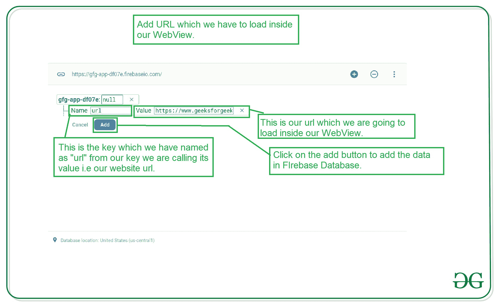
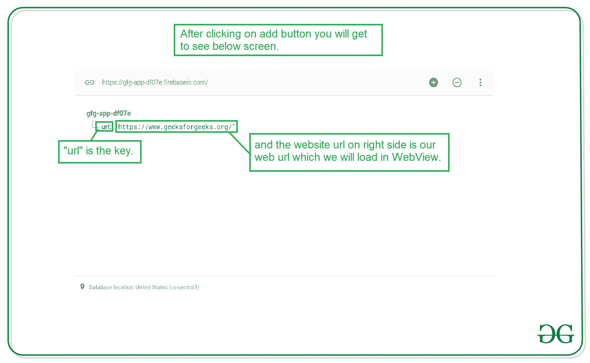

# 如何用 Firebase 在安卓中创建动态 WebView？

> 原文:[https://www . geeksforgeeks . org/how-create-dynamic-web view-in-Android-with-firebase/](https://www.geeksforgeeks.org/how-to-create-dynamic-webview-in-android-with-firebase/)

将一个网站转换成一个应用程序似乎是安卓系统上的一项基本任务。借助[网络视图](https://www.geeksforgeeks.org/how-to-use-webview-in-android/)，我们可以在我们的安卓应用程序中显示任何网页。我们只需要实现网络视图的小部件，并在我们必须加载的网络视图中添加网址。因此，如果你正在寻找一个网站加载到你的应用程序，可以动态改变，而不需要重新格式化代码，那么这将变得更容易根据我们的要求动态更新我们的网络视图应用程序。因此，在本文中，我们将研究在我们的应用程序中使用 Android 中的 Firebase 实现动态 WebView。

### 我们将在本文中构建什么？

在本文中，我们将构建一个简单的应用程序，在其中我们将创建一个简单的网络视图，并从 [**Firebase 实时数据库**](https://www.geeksforgeeks.org/firebase-realtime-database-with-operations-in-android-with-examples/) 中为我们的网络视图加载一个网址。因此，如果我们想更改我们的网络视图的网址，我们可以很容易地更改我们的网络视图的网址，它将在我们的应用程序中自动更新。注意，我们将使用 **Java** 语言来实现这个项目。

### **分步实施**

**第一步:创建新项目**

要在安卓工作室创建新项目，请参考[如何在安卓工作室创建/启动新项目](https://www.geeksforgeeks.org/android-how-to-create-start-a-new-project-in-android-studio/)。注意选择 **Java** 作为编程语言。

**第二步:将你的应用连接到 Firebase**

创建新项目后。导航到顶部栏上的工具选项。点击火焰基地。点击 Firebase 后，你可以看到截图中下面提到的右栏。


在该列中，导航到 Firebase 实时数据库。点击那个选项，你会看到两个选项:连接应用程序到 Firebase 和添加 Firebase 实时数据库到你的应用程序。单击立即连接，您的应用程序将连接到 Firebase。之后点击第二个选项，现在你的应用程序连接到 Firebase。


完成此过程后，您将看到下面的屏幕。


现在验证您的应用程序是否连接到 Firebase。转到您的 build.gradle 文件。导航到**应用程序>渐变脚本>构建.渐变文件**，并确保以下依赖项已添加到您的依赖项部分。

> 实现' com . Google . firebase:firebase-数据库:19.6.0 '

如果上述依赖项没有添加到您的依赖项部分。添加此依赖项并同步您的项目。现在，我们将转向应用程序的 XML 部分。

**步骤 3:使用 activity_main.xml 文件**

转到 **activity_main.xml** 文件，参考以下代码。下面是 **activity_main.xml** 文件的代码。

## 可扩展标记语言

```
<?xml version="1.0" encoding="utf-8"?>
<RelativeLayout 
    xmlns:android="http://schemas.android.com/apk/res/android"
    xmlns:tools="http://schemas.android.com/tools"
    android:layout_width="match_parent"
    android:layout_height="match_parent"
    tools:context=".MainActivity">

    <!--Web View for displaying our web pages-->
    <WebView
        android:id="@+id/idWebView"
        android:layout_width="match_parent"
        android:layout_height="match_parent" />

</RelativeLayout>
```

**第四步:在你的 AndroidManifest.xml 文件**中添加互联网权限

在 AndroidManifest.xml 文件中添加互联网权限。

## 可扩展标记语言

```
<uses-permission android:name="android.permission.INTERNET" />
<uses-permission android:name="android.permission.ACCESS_NETWORK_STATE" />
```

**步骤 5:使用 MainActivity.java 文件**

转到**MainActivity.java**文件，参考以下代码。以下是**MainActivity.java**文件的代码。代码中添加了注释，以更详细地理解代码。

## Java 语言(一种计算机语言，尤用于创建网站)

```
import android.os.Bundle;
import android.webkit.WebView;
import android.webkit.WebViewClient;
import android.widget.Toast;

import androidx.annotation.NonNull;
import androidx.appcompat.app.AppCompatActivity;

import com.google.firebase.database.DataSnapshot;
import com.google.firebase.database.DatabaseError;
import com.google.firebase.database.DatabaseReference;
import com.google.firebase.database.FirebaseDatabase;
import com.google.firebase.database.ValueEventListener;

public class MainActivity extends AppCompatActivity {

    // creating a variable for our Firebase Database.
    FirebaseDatabase firebaseDatabase;

    // creating a variable for our Database 
    // Reference for Firebase.
    DatabaseReference databaseReference;

    // creating a variable for our webview
    private WebView webView;

    @Override
    protected void onCreate(Bundle savedInstanceState) {
        super.onCreate(savedInstanceState);
        setContentView(R.layout.activity_main);

        // initializing variable for web view.
        webView = findViewById(R.id.idWebView);

        // below line is used to get the instance 
        // of our Firebase database.
        firebaseDatabase = FirebaseDatabase.getInstance();

        // below line is used to get reference for our database.
        databaseReference = firebaseDatabase.getReference("url");

        // calling method to initialize 
        // our web view.
        initializeWebView();
    }

    private void initializeWebView() {

        // calling add value event listener method for getting the values from database.
        databaseReference.addValueEventListener(new ValueEventListener() {
            @Override
            public void onDataChange(@NonNull DataSnapshot snapshot) {
                // this method is call to get the realtime updates in the data.
                // this method is called when the data is changed in our Firebase console.
                // below line is for getting the data from snapshot of our database.
                String webUrl = snapshot.getValue(String.class);

                // after getting the value for our webview url we are
                // setting our value to our webview view in below line.
                webView.loadUrl(webUrl);
                webView.getSettings().setJavaScriptEnabled(true);
                webView.setWebViewClient(new WebViewClient());
            }

            @Override
            public void onCancelled(@NonNull DatabaseError error) {
                // calling on cancelled method when we receive
                // any error or we are not able to get the data.
                Toast.makeText(MainActivity.this, "Fail to get URL.", Toast.LENGTH_SHORT).show();
            }
        });
    }
}
```

将此代码添加到您的应用程序后。现在转到 [Firebase](https://firebase.google.com/) ，点击右上角的转到控制台选项。


点击此屏幕后，您将看到下面的屏幕，其中包含您选择项目的所有项目。


在该屏幕中，单击左侧窗口中的实时数据库。


点击此选项后，您将看到右侧的屏幕。在此页面上，单击顶部栏中的规则选项。你会看到下面的屏幕。


在这个项目中，我们将我们的规则作为读写规则添加，因为我们不使用任何身份验证来验证我们的用户。因此，我们目前将其设置为 true 以测试我们的应用程序。改变规则后。点击右上角的发布按钮，您的规则将保存在那里。现在再次回到数据选项卡。现在，我们将从 Firebase 本身手动向 Firebase 添加数据。

**第六步:在 Firebase 数据库控制台**中添加 WebView URL

在 Firebase 的数据选项卡中，您将看到下面的屏幕。将光标悬停在 null 上，单击右侧的“+”选项，然后单击该选项。点击该选项后。添加下图中添加的数据。确保在名称字段中添加“url”，因为我们在代码中将 Firebase 的引用设置为“url”。所以我们必须把它设置为“url”。您可以更改引用，也可以在数据库中更改它。在值字段中，您必须添加要在网络视图中加载的网页的网址。



添加上述数据后，您将看到下面的屏幕。



添加这些数据后，运行您的应用程序并查看应用程序的输出。运行应用程序后，您可以查看 Firebase 控制台中的网站网址，并可以在您的网络视图中查看更改。

### **输出:**

在视频中，我们正在从 Firebase 更改网站网址，您可以在应用程序中看到更改。

<video class="wp-video-shortcode" id="video-538770-1" width="640" height="360" preload="metadata" controls=""><source type="video/mp4" src="https://media.geeksforgeeks.org/wp-content/uploads/20201231130654/Screenrecorder-2020-12-31-11-31-16-349.mp4?_=1">[https://media.geeksforgeeks.org/wp-content/uploads/20201231130654/Screenrecorder-2020-12-31-11-31-16-349.mp4](https://media.geeksforgeeks.org/wp-content/uploads/20201231130654/Screenrecorder-2020-12-31-11-31-16-349.mp4)</video>