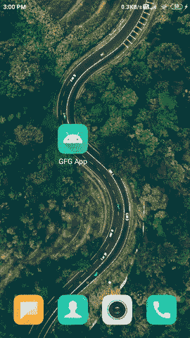

# 如何在安卓中创建群组条形图？

> 原文:[https://www . geeksforgeeks . org/如何创建群组-安卓条形图/](https://www.geeksforgeeks.org/how-to-create-group-barchart-in-android/)

正如我们已经看到的，我们可以在安卓中创建一个漂亮的条形图，但是如果我们必须在条形图中以组的形式表示数据呢？这样我们就可以在柱状图中绘制一组数据。因此，在本文中，我们将在我们的安卓应用程序中创建一个分组条形图。

### 我们将在本文中构建什么？

我们将构建一个简单的应用程序，其中我们将在我们的安卓应用程序中显示一个包含多组数据的条形图。我们将在条形图中以组的形式显示数据。下面给出了一个 GIF 示例，来了解一下在本文中要做什么。请注意，我们将使用 **Java** 语言来实现这个项目。



### **分步实施**

**第一步:创建新项目**

要在安卓工作室创建新项目，请参考[如何在安卓工作室创建/启动新项目](https://www.geeksforgeeks.org/android-how-to-create-start-a-new-project-in-android-studio/)。注意选择 **Java** 作为编程语言。

**第二步:添加依赖和 JitPack 存储库**

导航到**渐变脚本>构建.渐变(模块:应用)**，并在依赖项部分添加以下依赖项。

> 实现' com . github . philjay:MPAndroidChart:v 3 . 1 . 0 '

将 JitPack 存储库添加到构建文件中。将其添加到 allprojects{ }部分内存储库末尾的 root build.gradle 中。

> *所有项目{*
> 
> *存储库{*
> 
> *……*
> 
> *maven { URL " https://jitpack . io " }*
> 
> *}*
> 
> *}*

添加这个依赖项后，同步您的项目，现在我们将开始实现它。

**步骤 3:使用 activity_main.xml 文件**

导航到**应用程序> res >布局> activity_main.xml** 并将下面的代码添加到该文件中。下面是 **activity_main.xml** 文件的代码。

## 可扩展标记语言

```java
<?xml version="1.0" encoding="utf-8"?>
<RelativeLayout 
    xmlns:android="http://schemas.android.com/apk/res/android"
    xmlns:tools="http://schemas.android.com/tools"
    android:layout_width="match_parent"
    android:layout_height="match_parent"
    tools:context=".MainActivity">

    <!--Ui component for our bar chart-->
    <com.github.mikephil.charting.charts.BarChart
        android:id="@+id/idBarChart"
        android:layout_width="match_parent"
        android:layout_height="match_parent" />

</RelativeLayout>
```

**第四步:使用****MainActivity.java 文件**

转到**MainActivity.java**文件，参考以下代码。以下是**MainActivity.java**文件的代码。代码中添加了注释，以更详细地理解代码。

## Java 语言(一种计算机语言，尤用于创建网站)

```java
import android.graphics.Color;
import android.os.Bundle;

import androidx.appcompat.app.AppCompatActivity;

import com.github.mikephil.charting.charts.BarChart;
import com.github.mikephil.charting.components.XAxis;
import com.github.mikephil.charting.data.BarData;
import com.github.mikephil.charting.data.BarDataSet;
import com.github.mikephil.charting.data.BarEntry;
import com.github.mikephil.charting.formatter.IndexAxisValueFormatter;

import java.util.ArrayList;

public class MainActivity extends AppCompatActivity {

    // variable for our bar chart
    BarChart barChart;

    // variable for our bar data set.
    BarDataSet barDataSet1, barDataSet2;

    // array list for storing entries.
    ArrayList barEntries;

    // creating a string array for displaying days.
    String[] days = new String[]{"Sunday", "Monday", "Tuesday", "Thursday", "Friday", "Saturday"};

    @Override
    protected void onCreate(Bundle savedInstanceState) {
        super.onCreate(savedInstanceState);
        setContentView(R.layout.activity_main);

        // initializing variable for bar chart.
        barChart = findViewById(R.id.idBarChart);

        // creating a new bar data set.
        barDataSet1 = new BarDataSet(getBarEntriesOne(), "First Set");
        barDataSet1.setColor(getApplicationContext().getResources().getColor(R.color.purple_200));
        barDataSet2 = new BarDataSet(getBarEntriesTwo(), "Second Set");
        barDataSet2.setColor(Color.BLUE);

        // below line is to add bar data set to our bar data.
        BarData data = new BarData(barDataSet1, barDataSet2);

        // after adding data to our bar data we
        // are setting that data to our bar chart.
        barChart.setData(data);

        // below line is to remove description
        // label of our bar chart.
        barChart.getDescription().setEnabled(false);

        // below line is to get x axis 
        // of our bar chart.
        XAxis xAxis = barChart.getXAxis();

        // below line is to set value formatter to our x-axis and 
        // we are adding our days to our x axis.
        xAxis.setValueFormatter(new IndexAxisValueFormatter(days));

        // below line is to set center axis 
        // labels to our bar chart.
        xAxis.setCenterAxisLabels(true);

        // below line is to set position 
        // to our x-axis to bottom.
        xAxis.setPosition(XAxis.XAxisPosition.BOTTOM);

        // below line is to set granularity 
        // to our x axis labels.
        xAxis.setGranularity(1);

        // below line is to enable 
        // granularity to our x axis.
        xAxis.setGranularityEnabled(true);

        // below line is to make our 
        // bar chart as draggable.
        barChart.setDragEnabled(true);

        // below line is to make visible
        // range for our bar chart.
        barChart.setVisibleXRangeMaximum(3);

        // below line is to add bar
        // space to our chart.
        float barSpace = 0.1f;

        // below line is use to add group
        // spacing to our bar chart.
        float groupSpace = 0.5f;

        // we are setting width of 
        // bar in below line.
        data.setBarWidth(0.15f);

        // below line is to set minimum 
        // axis to our chart.
        barChart.getXAxis().setAxisMinimum(0);

        // below line is to 
        // animate our chart.
        barChart.animate();

        // below line is to group bars
        // and add spacing to it.
        barChart.groupBars(0, groupSpace, barSpace);

        // below line is to invalidate
        // our bar chart.
        barChart.invalidate();
    }

    // array list for first set
    private ArrayList<BarEntry> getBarEntriesOne() {

        // creating a new array list
        barEntries = new ArrayList<>();

        // adding new entry to our array list with bar
        // entry and passing x and y axis value to it.
        barEntries.add(new BarEntry(1f, 4));
        barEntries.add(new BarEntry(2f, 6));
        barEntries.add(new BarEntry(3f, 8));
        barEntries.add(new BarEntry(4f, 2));
        barEntries.add(new BarEntry(5f, 4));
        barEntries.add(new BarEntry(6f, 1));
        return barEntries;
    }

    // array list for second set.
    private ArrayList<BarEntry> getBarEntriesTwo() {

        // creating a new array list
        barEntries = new ArrayList<>();

        // adding new entry to our array list with bar 
        // entry and passing x and y axis value to it.
        barEntries.add(new BarEntry(1f, 8));
        barEntries.add(new BarEntry(2f, 12));
        barEntries.add(new BarEntry(3f, 4));
        barEntries.add(new BarEntry(4f, 1));
        barEntries.add(new BarEntry(5f, 7));
        barEntries.add(new BarEntry(6f, 3));
        return barEntries;
    }
}
```

现在运行您的应用程序，并查看应用程序的输出。

### **输出:**

<video class="wp-video-shortcode" id="video-549839-1" width="640" height="360" preload="metadata" controls=""><source type="video/mp4" src="https://media.geeksforgeeks.org/wp-content/uploads/20210124150116/Screenrecorder-2021-01-24-15-00-24-765.mp4?_=1">[https://media.geeksforgeeks.org/wp-content/uploads/20210124150116/Screenrecorder-2021-01-24-15-00-24-765.mp4](https://media.geeksforgeeks.org/wp-content/uploads/20210124150116/Screenrecorder-2021-01-24-15-00-24-765.mp4)</video>