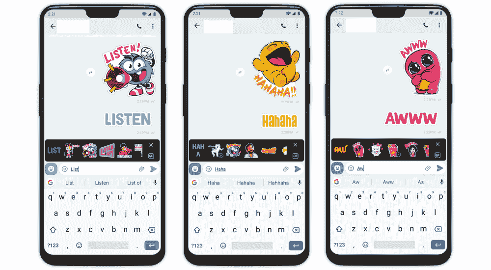
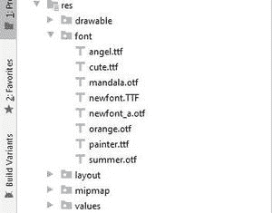

# 如何在安卓中创建文字贴纸？

> 原文:[https://www . geesforgeks . org/如何在安卓中创建文本标签/](https://www.geeksforgeeks.org/how-to-create-text-stickers-in-android/)

不仅一张图片胜过千言万语，而且比单调的文字更酷。在本文中，我们将学习如何从[文本视图](https://www.geeksforgeeks.org/textview-widget-in-android-using-java-with-examples/)创建贴纸。这将有助于如果你正在创建一个应用程序，你想添加一些文本覆盖功能，**例如，一个图像编辑应用程序**。此外，我们可以在**徒步旅行应用程序**中看到非常好的实现。



图片来源:Hike 安卓应用

## 它是如何工作的？

我们在这里使用的主要概念是，我们将文本视图转换为位图，并将该位图保存在手机存储器中。现在，我们可以在文本视图中进行“n”次操作，比如我们可以改变文本视图的颜色、字体、大小、样式、外观等。我们在文本视图中所做的任何更改都会反映在所形成的标签(位图)中。记住这个想法，让我们开始创建应用程序。注意，我们将使用 **Java** 语言来实现这个项目。

### 逐步实施

**第一步:创建新项目**

要在安卓工作室创建新项目，请参考[如何在安卓工作室创建/启动新项目](https://www.geeksforgeeks.org/android-how-to-create-start-a-new-project-in-android-studio/)。注意选择 **Java** 作为编程语言。

**第 2 步:向 build.gradle 文件添加依赖关系**

我们将使用一个库在运行时提取颜色，并相应地改变文本视图的颜色。所以在 [build.gradle](https://www.geeksforgeeks.org/android-build-gradle/) 文件中添加这个依赖项。

> 实现' petrov . Kristi Yan:color picker-library:1 . 1 . 10 '

**第三步:添加字体文件**

为了使我们的贴纸更漂亮，我们将在文本视图中添加一些字体。为此，我们需要**中的字体文件。ttf** 或**。otf** 格式。你可以从网上下载任何你喜欢的字体文件。现在一旦你下载了文件，进入**应用> res >右键>新建>文件夹>字体文件夹**在 android studio 中创建新的该字体的 Android Resources 文件夹，并将字体文件放入该文件夹。



例如，我们将使用六个字体文件，您可以从[这里](https://drive.google.com/drive/folders/1oLJtucomLMKR4MEvw3AvQRr0upsTFm5I?usp=sharing)下载这些文件。

**第 4 步:使用 activity_main.xml 文件**

转到 **activity_main.xml** 文件，参考以下代码。下面是 **activity_main.xml** 文件的代码。

## 可扩展标记语言

```
<?xml version="1.0" encoding="utf-8"?>
<RelativeLayout
    xmlns:android="http://schemas.android.com/apk/res/android"
    xmlns:tools="http://schemas.android.com/tools"
    android:layout_width="match_parent"
    android:layout_height="match_parent"
    android:background="#0F9D58"
    tools:context=".MainActivity">

    <ImageButton
        android:id="@+id/changeFont"
        android:layout_width="wrap_content"
        android:layout_height="wrap_content"
        android:layout_alignParentStart="true"
        android:background="#43A047"
        android:src="@drawable/ic_android_black_24dp" />

    <ImageButton
        android:id="@+id/changeColor"
        android:layout_width="wrap_content"
        android:layout_height="wrap_content"
        android:layout_alignParentEnd="true"
        android:background="#43A047"
        android:src="@drawable/ic_android_black_24dp" />

    <Button
        android:id="@+id/convert"
        style="@style/TextAppearance.AppCompat.Widget.Button.Colored"
        android:layout_width="wrap_content"
        android:layout_height="wrap_content"
        android:layout_centerHorizontal="true"
        android:background="#7CB342"
        android:text="Stickerize!"
        android:textStyle="bold" />

    <TextView
        android:id="@+id/stickerTextview"
        android:layout_width="wrap_content"
        android:layout_height="wrap_content"
        android:layout_centerInParent="true"
        android:text="Geeks for Geeks"
        android:textAppearance="@style/TextAppearance.AppCompat.Large"
        android:textColor="@color/white"
        android:textStyle="bold" />

    <EditText
        android:id="@+id/stickerEditText"
        android:layout_width="match_parent"
        android:layout_height="wrap_content"
        android:layout_alignParentBottom="true"
        android:hint="Enter your text here.."
        android:textAlignment="center" />

</RelativeLayout>
```

**步骤 5:使用 MainActivity.java 文件**

转到**文件，参考以下代码。以下是**MainActivity.java**文件的代码。代码中添加了注释，以更详细地理解代码。**

## **Java 语言(一种计算机语言，尤用于创建网站)**

```
import android.app.ProgressDialog;
import android.content.ContentValues;
import android.graphics.Bitmap;
import android.graphics.BitmapFactory;
import android.graphics.Color;
import android.graphics.drawable.BitmapDrawable;
import android.graphics.drawable.Drawable;
import android.net.Uri;
import android.os.Build;
import android.os.Bundle;
import android.os.Environment;
import android.provider.MediaStore;
import android.text.Editable;
import android.text.TextWatcher;
import android.view.View;
import android.widget.Button;
import android.widget.EditText;
import android.widget.ImageButton;
import android.widget.TextView;
import android.widget.Toast;
import androidx.appcompat.app.AppCompatActivity;
import androidx.core.content.res.ResourcesCompat;
import java.io.File;
import java.io.FileNotFoundException;
import java.io.FileOutputStream;
import java.io.IOException;
import java.io.InputStream;
import java.io.OutputStream;
import petrov.kristiyan.colorpicker.ColorPicker;

public class MainActivity extends AppCompatActivity {

    TextView textSticker;
    EditText editTextSticker;
    ImageButton fontchange;
    ImageButton colorPickerText;
    Button createSticker;

    // this will work as a counter to 
    // change the font of TextView
    int i = 0;

    @Override
    protected void onCreate(Bundle savedInstanceState) {
        super.onCreate(savedInstanceState);
        setContentView(R.layout.activity_main);

        textSticker = (TextView) findViewById(R.id.stickerTextview);
        editTextSticker = (EditText) findViewById(R.id.stickerEditText);
        colorPickerText = (ImageButton) findViewById(R.id.changeColor);
        fontchange = (ImageButton) findViewById(R.id.changeFont);
        createSticker = (Button) findViewById(R.id.convert);

        createSticker.setOnClickListener(new View.OnClickListener() {
            @Override
            public void onClick(View view) {
                try {
                    executeSticker();
                } catch (IOException e) {
                    e.printStackTrace();
                }
            }
        });

        // Here we have added a TextWatcher. The onTextChanged() method will change
        // the text in TextVie as we type, in the EditText. This makes app more interactive.
        editTextSticker.addTextChangedListener(new TextWatcher() {
            @Override
            public void beforeTextChanged(CharSequence charSequence, int i, int i1, int i2) {

            }

            @Override
            public void onTextChanged(CharSequence charSequence, int i, int i1, int i2) {
                textSticker.setText(charSequence);
            }

            @Override
            public void afterTextChanged(Editable editable) {

            }
        });

        // Here we have implemented a small logic which changes the font of the TextView
        // Whenever we click this button. The counter increments by one and reset to zero
        // when it reaches value 6.
        fontchange.setOnClickListener(new View.OnClickListener() {
            @Override
            public void onClick(View view) {
                switch (i) {
                    case 0:
                        i = 1;

                        // This is a very important method of this example. 
                        // The setTypeFace() method sets the font of the TextView at runtime.
                        textSticker.setTypeface(ResourcesCompat.getFont(MainActivity.this, R.font.summer));
                        break;
                    case 1:
                        i = 2;
                        textSticker.setTypeface(ResourcesCompat.getFont(MainActivity.this, R.font.angel));
                        break;
                    case 2:
                        i = 3;
                        textSticker.setTypeface(ResourcesCompat.getFont(MainActivity.this, R.font.cute));
                        break;
                    case 3:
                        i = 4;
                        textSticker.setTypeface(ResourcesCompat.getFont(MainActivity.this, R.font.mandala));
                        break;
                    case 4:
                        i = 5;
                        textSticker.setTypeface(ResourcesCompat.getFont(MainActivity.this, R.font.painter));
                        break;
                    case 5:
                        i = 6;
                        textSticker.setTypeface(ResourcesCompat.getFont(MainActivity.this, R.font.newfont));
                        break;
                    case 6:
                        i = 0;
                        textSticker.setTypeface(ResourcesCompat.getFont(MainActivity.this, R.font.orange));
                        break;
                }
            }
        });

        colorPickerText.setOnClickListener(new View.OnClickListener() {
            @Override
            public void onClick(View view) {

                // create an instance of ColorPicker and invoke the ColorPicker dialog onClick.
                final ColorPicker colorPicker = new ColorPicker(MainActivity.this);
                colorPicker.setOnFastChooseColorListener(new ColorPicker.OnFastChooseColorListener() {
                    @Override
                    public void setOnFastChooseColorListener(int position, int color) {
                        // get the integer value of color selected from the dialog box and
                        // the color of the TextView.
                        textSticker.setTextColor(color);
                    }

                    @Override
                    public void onCancel() {
                        colorPicker.dismissDialog();
                    }
                })
                        // set the number of color columns 
                        // you want  to show in dialog.
                        .setColumns(5)

                        // set a default color selected in the dialog
                        .setDefaultColorButton(Color.parseColor("#000000"))
                        .show();
            }
        });
    }

    // This method creates a Bitmap from the TextView
    // and saves that into the storage
    private void executeSticker() throws IOException {

        // Create an OutputStream to write the file in storage
        OutputStream imageOutStream;

        // Although the ProgressDialog is not necessary but there may be cases when
        // it might takes 2-3seconds in creating the bitmap.(This happens only when there is a
        // large chunk of cache and also when app is running multiple threads)
        final ProgressDialog progressDialog = new ProgressDialog(MainActivity.this);
        progressDialog.setMessage("Please wait..");
        progressDialog.show();

        // All the three methods are discussed later in this article.
        // destroyDrawingCache(),buildDrawingCache(),getDrawingCache().
        textSticker.destroyDrawingCache();
        textSticker.buildDrawingCache();
        Bitmap textStickerBitmap = textSticker.getDrawingCache();

        // From Android 10 onwards using the former method gives error, because
        // there is a security/privacy update in Android Q which doesn't allow 
        // access to third party files.
        if (Build.VERSION.SDK_INT >= Build.VERSION_CODES.Q) {

            // In order to create a new image file in 
            // storage we do the following steps.
            ContentValues values = new ContentValues();
            values.put(MediaStore.Images.Media.DISPLAY_NAME, "gfg.png");
            values.put(MediaStore.Images.Media.MIME_TYPE, "image/png");
            values.put(MediaStore.Images.Media.RELATIVE_PATH, Environment.DIRECTORY_PICTURES);
            Uri uri = getContentResolver().insert(MediaStore.Images.Media.EXTERNAL_CONTENT_URI, values);
            imageOutStream = getContentResolver().openOutputStream(uri);

            // this method writes the file in storage. And finally 
            // our sticker has been created and
            // successfully saved in our storage
            textStickerBitmap.compress(Bitmap.CompressFormat.PNG, 100, imageOutStream);

            // close the output stream after use.
            imageOutStream.close();
            progressDialog.dismiss();

            // Now, incase you want to use that bitmap(sticker) 
            // at the very moment it is created
            // we do the following steps.
            // Open a Inputstream to get the data from file
            final InputStream imageStream;
            try {
                // use the same uri which we previously used 
                // in writing the file, as it contains
                // the path to that file.
                imageStream = getContentResolver().openInputStream(uri);
                final Bitmap selectedImage = BitmapFactory.decodeStream(imageStream);

                // create a drawable from bitmap.
                Drawable drawable = new BitmapDrawable(getResources(), selectedImage);

                // You can do anything with this drawable.
                // This drawable contains sticker png.
            } catch (FileNotFoundException e) {
                Toast.makeText(MainActivity.this, "File not found!!", Toast.LENGTH_SHORT).show();
            }
            // The else condition is executed if the device 
            // Android version is less than Android 10
        } else {
            String imagesDir = Environment.getExternalStoragePublicDirectory(Environment.DIRECTORY_PICTURES).toString();
            File image = new File(imagesDir, "gfg.jpg");
            imageOutStream = new FileOutputStream(image);
            textStickerBitmap.compress(Bitmap.CompressFormat.PNG, 100, imageOutStream);
            imageOutStream.close();

            final Uri imageUri = Uri.fromFile(image);
            final InputStream imageStream;
            try {
                imageStream = getContentResolver().openInputStream(imageUri);
                final Bitmap selectedImage = BitmapFactory.decodeStream(imageStream);
                Drawable drawable = new BitmapDrawable(getResources(), selectedImage);
                // You can do anything with this drawable.
                // This drawable contains sticker png.
            } catch (FileNotFoundException e) {
                Toast.makeText(MainActivity.this, "File not found!!", Toast.LENGTH_SHORT).show();
            }
        }
        // Finally, print a success message.
        Toast.makeText(this, "Sticker created successfully!!", Toast.LENGTH_SHORT).show();
    }
}
```

### ****输出:在物理设备上运行****

**<video class="wp-video-shortcode" id="video-519045-1" width="640" height="360" preload="metadata" controls=""><source type="video/mp4" src="https://media.geeksforgeeks.org/wp-content/uploads/20201121230031/out.mp4?_=1">[https://media.geeksforgeeks.org/wp-content/uploads/20201121230031/out.mp4](https://media.geeksforgeeks.org/wp-content/uploads/20201121230031/out.mp4)</video>**

> ****关于兼容模式下自动缩放的注意事项:**未启用自动缩放时，此方法将创建与此视图大小相同的位图。启用硬件加速时，应避免调用此方法。如果不需要绘图缓存位图，调用此方法将增加内存使用，并导致视图在软件中呈现一次，从而对性能产生负面影响。**

## **本例中使用的重要方法**

*   ****构建绘图缓存:**如果绘图缓存无效，则强制构建绘图缓存。**
*   ****销毁绘图缓存:**释放绘图缓存使用的资源。如果手动调用 buildDrawingCache()，而不调用 setDrawingCacheEnabled(true)，则应在之后使用此方法清理缓存。**
*   ****getDrawingCache:** 返回缓存该视图图形的位图。禁用缓存时，返回的位图为空。如果启用了缓存并且缓存未准备好，此方法将创建它。这个函数有一个重载的布尔参数，该参数指示当应用程序处于兼容模式时，是否应该根据屏幕的当前密度来缩放生成的位图。零参数方法的工作原理与 getDrawingCache 相同(false)。**
*   ****设置绘图缓存已启用:**启用或禁用绘图缓存。启用绘图缓存后，对 getDrawingCache()或 buildDrawingCache()的下一次调用将在位图中绘制查看器。**

## **未来范围**

1.  **您可以在运行时添加增加或减少文本视图大小的功能。**
2.  **你可以添加一个画布到你的应用程序，这将允许拖动，拉伸，旋转文本视图，这将更具互动性。**
3.  **您也可以尝试在聊天应用程序中实现这一点，用户可以根据键入的文本生成贴纸。**
4.  **试着用不同的语言输入并创建标签。**

> ****备注:****
> 
> ****1。**我们在这里不需要读写权限，因为我们保存在手机存储中的贴纸或位图属于我们自己的应用程序。**
> 
> ****2。**从安卓 10 开始，从设备存储访问文件的方法发生了变化。如果你使用早期的方法，你可能会得到荒谬的结果。**
> 
> ****3。**如果手动调用 buildDrawingCache()而不调用 setDrawingCacheEnabled(true)，则应在之后调用 destroyDrawingCache()来清理缓存。**