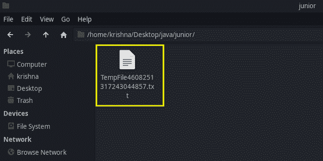

# 如何在 Java 中删除临时文件？

> 原文:[https://www . geesforgeks . org/如何删除-java 中的临时文件/](https://www.geeksforgeeks.org/how-to-delete-temporary-file-in-java/)

在 java 中，我们有一个 java.io 包，它提供了对文件/目录执行各种操作的各种方法。

临时文件是为一些业务逻辑或单元测试而创建的文件，在使用这些文件之后，您必须确保这些临时文件应该被删除。如果您忘记删除这些临时文件，那么这将在执行时占用额外的空间，这对您的应用程序来说效率不高。

**要创建临时文件:-**Java . io 包中存在的文件类有 createTempFile()方法，该方法将采用两个参数，即临时文件的文件名(前缀)和扩展名(后缀)。提供创建临时文件所需的抽象路径。

## Java 语言(一种计算机语言，尤用于创建网站)

```
// Create temp file

import java.io.File;
import java.io.IOException;
public class tempFile {
    public static void main(String args[])
        throws IOException
    {
        // name of the file
        String prefix = "TempFile";

        // extension of the file
        String suffix = ".txt";

        // Creating a File object for directory
        File directoryPath = new File(
            "/home/krishna/Desktop/java/junior/");

        // Creating a temp file
        File.createTempFile(prefix, suffix, directoryPath);
        System.out.println(
            "Temp file created at the specified path");
    }
}
```

**输出:**

```
Temporary file has been created in the specified path
```



有两种方法可以删除现有的临时文件。

**a .****JVM 退出时删除:**

只有在应用程序完成时，才能使用 deleteOnExit()方法删除现有文件。如果您的代码异常终止，请记住，您的临时文件还没有被删除，一旦您请求删除操作，您就不能取消。

## Java 语言(一种计算机语言，尤用于创建网站)

```
// Delete File when JVM Exists

import java.io.File;
import java.io.IOException;

public class tempFile {
    public static void main(String[] args)
    {
        File temp;
        try {
            // name of the file and extension
            temp = File.createTempFile("TempFile", ".txt");

            // Delete when JVM exits
            temp.deleteOnExit();
        }
        // If not found any temporary file
        catch (IOException e) {
            e.printStackTrace();
        }
    }
}
```

**B .立即删除文件:**

我们可以使用 delete()方法删除临时文件。

## Java 语言(一种计算机语言，尤用于创建网站)

```
// Delete file using delete() method

import java.io.File;
import java.io.IOException;

public class tempFile {
    public static void main(String[] args)
    {
        File temp;
        try {
            temp
                = File.createTempFile("myTempFile", ".txt");

            // Perform other operations
            // Delete the file immediately
            temp.delete();
        }
        // If not found the temporary file
        catch (IOException e) {
            e.printStackTrace();
        }
    }
}
```