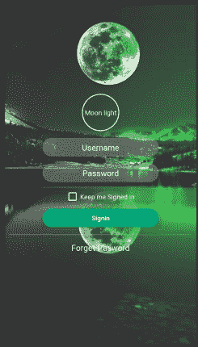
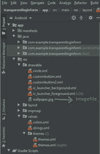

# 如何用 Java 在 Android Studio 中设计透明登录表单？

> 原文:[https://www . geesforgeks . org/how-design-transparent-log in-form-in-Android-studio-use-Java/](https://www.geeksforgeeks.org/how-to-design-transparent-login-form-in-android-studio-using-java/)

我们将设计一个简单的应用程序，其中我们在我们的主活动中制作一个透明的登录屏幕，从用户那里获取用户名和密码。下面给出了一个示例图像，以了解我们将在本文中做什么。



### **分步实施**

**第一步:创建新项目**

要在安卓工作室创建新项目，请参考[如何在安卓工作室创建/启动新项目](https://www.geeksforgeeks.org/android-how-to-create-start-a-new-project-in-android-studio/)。

**第二步**:下载你想在你的应用中使用的任何背景图片，并将其添加到可绘制部分，这是资源文件夹的一个子部分。



**图=可绘制的图像文件**

**第三步**:按照以下步骤制作应用中需要的自定义按钮。右键单击项目名称文件(本例中为透明登录表单)- >新建- >安卓资源文件。

**circle.xml 文件:**

## 可扩展标记语言

```
<?xml version="1.0" encoding="utf-8"?>
<shape xmlns:android="http://schemas.android.com/apk/res/android"
    android:shape="oval">

    <corners android:radius="100dp" />
    <stroke
        android:width="2dp"
        android:color="#ffffff" />
    <size
        android:width="80dp"
        android:height="80dp" />

</shape>
```

**custombutton.xml 文件:**

## 可扩展标记语言

```
<?xml version="1.0" encoding="utf-8"?>
<shape xmlns:android="http://schemas.android.com/apk/res/android">
    <solid android:color="#3fff" />
    <corners android:radius="50dp" />
</shape>
```