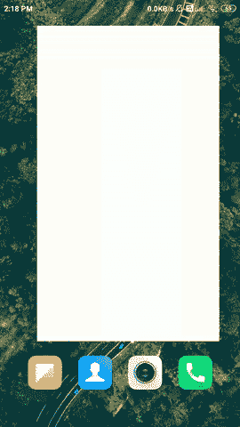
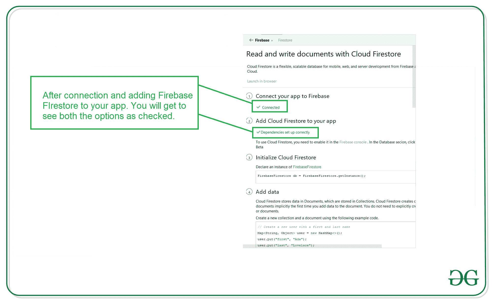
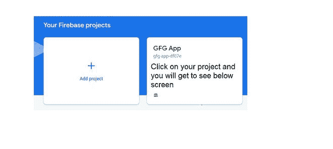
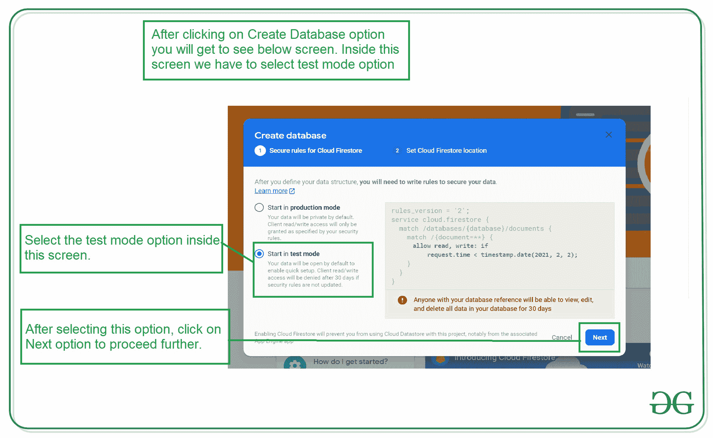
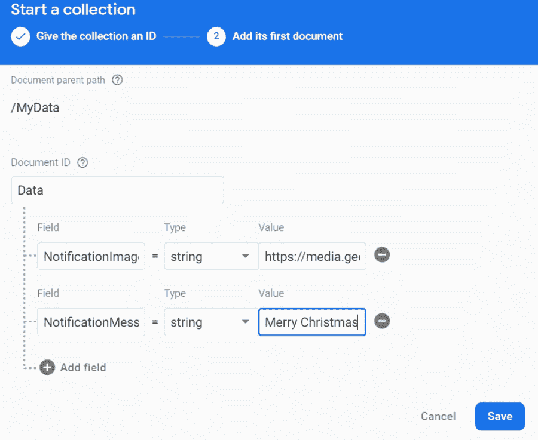
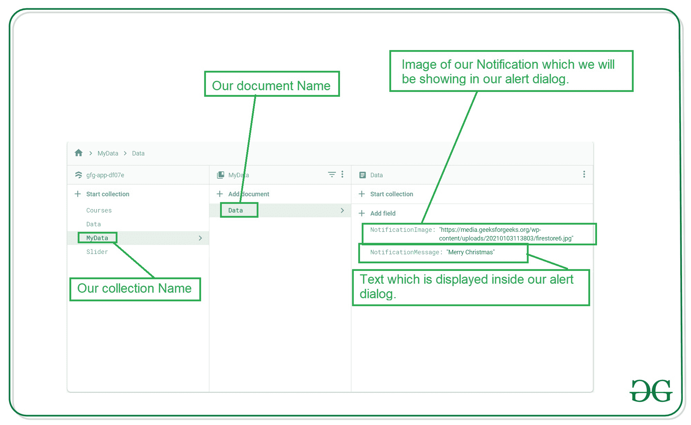

# 如何使用 Firebase Firestore 在安卓中显示动态 AlertDialog？

> 原文:[https://www . geesforgeks . org/how-display-dynamic-alertdialog-in-Android-use-firebase-firestore/](https://www.geeksforgeeks.org/how-to-display-dynamic-alertdialog-in-android-using-firebase-firestore/)

动态[警报对话框](https://www.geeksforgeeks.org/android-alert-dialog-box-and-how-to-create-it/)用于许多不同的应用程序，用于向用户显示不同的对话框消息。这种类型的对话也用于教育用户这么多的宣传横幅。这种类型的警报对话框通常是动态的，它显示的图像和文本在行为上是动态的，并且在一定的时间间隔后会发生变化。在本文中，我们将看一下动态提醒对话框在 Android 中的实现。

### 我们将在本文中构建什么？

我们将在安卓系统中建立一个简单的提醒对话框。在警报对话框中，我们将显示来自 Firebase 的图像和文本。我们的警报对话框中的数据可以根据我们的要求进行更改。下面给出了一个 GIF 示例，来了解一下在本文中要做什么。请注意，我们将使用 **Java** 语言来实现这个项目。



### **分步实施**

**第一步:创建新项目**

要在安卓工作室创建新项目，请参考[如何在安卓工作室创建/启动新项目](https://www.geeksforgeeks.org/android-how-to-create-start-a-new-project-in-android-studio/)。注意选择 **Java** 作为编程语言。

**第二步:将你的应用连接到 Firebase**

创建新项目后，导航到顶部栏上的“工具”选项。点击火焰基地。点击 Firebase 后，你可以看到截图中下面提到的右栏。


在那一栏中，导航到火基云火石。点击那个选项，你会看到两个选项:连接应用到 Firebase 和添加云 Firestore 到你的应用。单击立即连接选项，您的应用程序将连接到 Firebase。之后点击第二个选项，现在你的应用程序连接到 Firebase。将您的应用程序连接到 Firebase 后，您将看到下面的屏幕。



之后，验证 Firebase Firestore 数据库的依赖项是否已经添加到我们的 Gradle 文件中。导航到该文件中的**应用程序>渐变脚本**，检查是否添加了以下依赖项。如果您的 build.gradle 文件中不存在以下依赖项。在依赖项部分添加以下依赖项。

> *实现‘com . Google . firebase:firebase-firestore:22 . 0 . 1’*

添加此依赖项后，同步您的项目，现在我们可以创建我们的应用程序了。如果你想了解更多关于连接你的应用到 Firebase。参考本文详细了解[如何给安卓 App](https://www.geeksforgeeks.org/adding-firebase-to-android-app/) 添加 Firebase。

**第 3 步:使用 AndroidManifest.xml 文件**

要将数据添加到 Firebase，我们应该拥有访问互联网的权限。要添加这些权限，请导航到 **应用程序> AndroidManifest.xml** ，并在该文件中添加以下权限。

## 可扩展标记语言

```
<!--Permissions for internet-->
<uses-permission android:name="android.permission.INTERNET" />
<uses-permission android:name="android.permission.ACCESS_NETWORK_STATE" />
```

**第 4 步:使用 activity_main.xml 文件**

由于我们没有在 **activity_main.xml** 文件中显示任何用户界面，因此我们没有在 **activity_main.xml** 中添加任何用户界面组件，因为我们在自定义布局文件中显示数据。

**第五步:为我们的提醒对话框创建一个新的布局文件**

当我们在警报对话框中显示一个图像和文本时。因此，我们将为我们的警报对话框构建一个自定义布局。为创建一个新的布局文件四我们的自定义对话框。导航到**应用程序> res >布局>右键单击它>单击新建>布局资源文件**并将其命名为 **custom_pop_up_layout** 并向其添加以下代码。

## 可扩展标记语言

```
<?xml version="1.0" encoding="utf-8"?>
<RelativeLayout 
    xmlns:android="http://schemas.android.com/apk/res/android"
    android:layout_width="match_parent"
    android:layout_height="wrap_content"
    android:layout_margin="30dp"
    android:background="@color/purple_500">

    <!--Image view inside our dialog box-->
    <ImageView
        android:id="@+id/idIVNotification"
        android:layout_width="300dp"
        android:layout_height="300dp"
        android:layout_below="@id/idTVNotification"
        android:layout_centerHorizontal="true"
        android:layout_margin="20dp" />

    <!--Text view inside our dialog box-->
    <TextView
        android:id="@+id/idTVNotification"
        android:layout_width="match_parent"
        android:layout_height="wrap_content"
        android:layout_margin="8dp"
        android:text="Notification Message"
        android:textAlignment="center"
        android:textColor="@color/white"
        android:textSize="18sp" />

</RelativeLayout>
```

**步骤 6:使用 MainActivity.java 文件**

转到**MainActivity.java**文件，参考以下代码。以下是**MainActivity.java**文件的代码。代码中添加了注释，以更详细地理解代码。

## Java 语言(一种计算机语言，尤用于创建网站)

```
import android.app.AlertDialog;
import android.os.Bundle;
import android.view.LayoutInflater;
import android.view.View;
import android.widget.ImageView;
import android.widget.TextView;
import android.widget.Toast;

import androidx.annotation.Nullable;
import androidx.appcompat.app.AppCompatActivity;

import com.google.firebase.firestore.DocumentReference;
import com.google.firebase.firestore.DocumentSnapshot;
import com.google.firebase.firestore.EventListener;
import com.google.firebase.firestore.FirebaseFirestore;
import com.google.firebase.firestore.FirebaseFirestoreException;
import com.squareup.picasso.Picasso;

public class MainActivity extends AppCompatActivity {

    // initializing th variable for firebase firestore.
    FirebaseFirestore db = FirebaseFirestore.getInstance();

    @Override
    protected void onCreate(Bundle savedInstanceState) {
        super.onCreate(savedInstanceState);
        setContentView(R.layout.activity_main);

        // creating a variable for our alert dialog builder.
        AlertDialog.Builder builder = new AlertDialog.Builder(MainActivity.this);

        // creating a layout inflater variable.
        LayoutInflater inflater = getLayoutInflater();

        // below line is for inflating a custom pop up layout.
        View dialoglayout = inflater.inflate(R.layout.custom_pop_up_layout, null);

        // initializing the textview and imageview from our dialog box.
        TextView notificationTV = dialoglayout.findViewById(R.id.idTVNotification);
        ImageView notificationIV = dialoglayout.findViewById(R.id.idIVNotification);

        // creating a variable for document reference.
        DocumentReference documentReference = db.collection("MyData").document("Data");

        // adding snapshot listener to our document reference.
        documentReference.addSnapshotListener(new EventListener<DocumentSnapshot>() {
            @Override
            public void onEvent(@Nullable DocumentSnapshot value, @Nullable FirebaseFirestoreException error) {
                // inside the on event method.
                if (error != null) {
                    // this method is called when error is not null 
                    // and we gt any error
                    // in this cas we are displaying an error message.
                    Toast.makeText(MainActivity.this, "Error found is " + error, Toast.LENGTH_SHORT).show();
                    return;
                }
                if (value != null && value.exists()) {
                    // if the value from firestore is not null then we are
                    // getting our data and setting that data to our text view.
                    // after getting the value from firebase firestore
                    // we are setting it to our text view and image view.
                    notificationTV.setText(value.getData().get("NotificationMessage").toString());
                    Picasso.get().load(value.getData().get("NotificationImage").toString()).into(notificationIV);
                }
            }
        });

        // after setting the text to our text view.
        // we are displaying our alert dialog.
        builder.setView(dialoglayout);
        builder.show();
    }
}
```

**第七步:将数据添加到安卓**中的 Firebase Firestore 控制台

添加完这段代码后，点击这个链接打开 Firebase。点击此链接后，您将看到下面的页面，在此页面上点击右上角的转到控制台选项。


点击此屏幕后，您将看到下面的屏幕，其中包含您选择项目的所有项目。



在该屏幕中，单击左侧窗口中的 n Firebase Firestore 数据库。


点击创建数据库选项后，您将看到下面的屏幕。



在此屏幕中，我们必须选择“在测试模式下启动”选项。我们使用测试模式，因为我们没有在我们的应用程序中设置身份验证。所以我们在测试模式下选择开始。选择测试模式后，点击下一步选项，您将看到下面的屏幕。


在这个屏幕中，我们只需要点击启用按钮来启用我们的 Firebase Firestore 数据库。完成这个过程后，我们只需要运行我们的应用程序，并在 Firebase 控制台中添加数据。要添加数据，请点击**开始收集**选项，并将您的收集名称添加为“**我的数据**”。添加此内容后，我们必须将我们的**文档标识**添加为“**数据**”。在字段部分，我们必须将我们的字段名称添加为“**通知图像**，以在通知中显示我们的图像，并输入相应的值(图像的网址)。并创建另一个文件，将该字段命名为“**通知消息**，以显示我们的通知中的消息。另外，输入它的相应值。最后点击**保存**按钮。



添加数据后，屏幕将如下所示。您可以编辑和删除这些文件。



现在运行该应用程序，并查看下面应用程序的输出:

### **输出:**

<video class="wp-video-shortcode" id="video-545519-1" width="640" height="360" preload="metadata" controls=""><source type="video/mp4" src="https://media.geeksforgeeks.org/wp-content/uploads/20210114142312/Screenrecorder-2021-01-14-14-18-47-533.mp4?_=1">[https://media.geeksforgeeks.org/wp-content/uploads/20210114142312/Screenrecorder-2021-01-14-14-18-47-533.mp4](https://media.geeksforgeeks.org/wp-content/uploads/20210114142312/Screenrecorder-2021-01-14-14-18-47-533.mp4)</video>