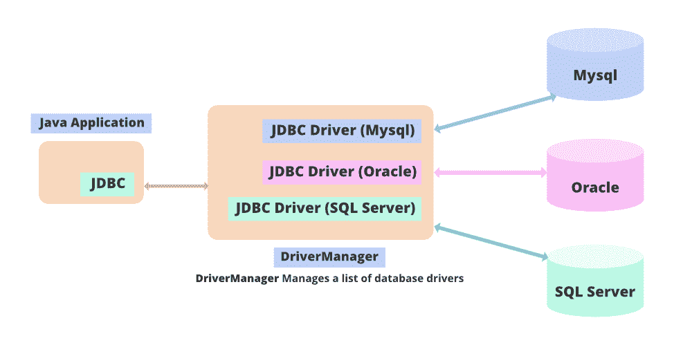
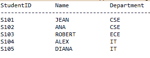
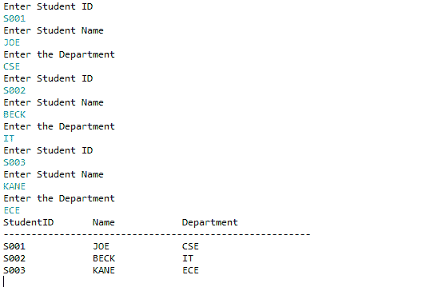

# 在 JDBC 如何在一个数据库上同时执行多个 SQL 命令？

> 原文:[https://www . geesforgeks . org/如何在 jdbc 中同时执行多个数据库 sql 命令/](https://www.geeksforgeeks.org/how-to-execute-multiple-sql-commands-on-a-database-simultaneously-in-jdbc/)

Java 数据库连接也称为 JDBC，是 Java 中的一个应用程序编程接口，用于在 Java 应用程序和数据库之间建立连接。JDBC 命令可用于从 Java 应用程序执行 SQL 操作。使用 JDBC 的 addBatch()和 executeBatch()命令演示在数据库上同时执行多个 SQL 命令。



> ***【addBatch()】***命令用于对 SQL 语句进行排队， ***executeBatch()*** 命令用于一次性执行排队的 SQL 语句。为了在 java 应用程序中使用 SQL 语句，需要在 Java 应用程序的开头导入“java.sql”包。Java 应用程序使用 DriverManager 类的 getConnection()方法连接到数据库。getConnection()方法接受三个参数 URL、用户名和密码。

**目标:**演示两个例子，一个使用 ***报表界面*** 另一个使用 ***准备报表*** 界面。PreparedStatement 的性能优于语句接口。语句接口可用于执行静态 SQL 查询，而 PreparedStatement 接口用于多次执行动态 SQL 查询。

**例 1:使用语句接口**

在这个例子中，java.sql 包类和接口被导入。语句接口用于执行 sql 语句。该表是创建 sql 语句以及记录插入 sql 语句，它们是使用 addBatch()命令添加到批处理中的。当所有语句被批处理时，执行 executeBatch()命令，该命令同时运行所有批处理查询。sql 语句可能会抛出 SQL 异常，这些异常必须在 try catch 块中处理，以避免程序突然终止。创建表并插入记录后，要查看表中的数据，将执行选择查询。通过执行选择查询获得的结果存储在结果集游标中。使用 next()方法迭代光标，记录显示在屏幕上。

**实现:**使用标准接口

## Java 语言(一种计算机语言，尤用于创建网站)

```
// Step 1: Create a database
// SQL database imported
import java.sql.Connection;
import java.sql.DriverManager;
import java.sql.ResultSet;
import java.sql.Statement;

public class BatchCommand {

    // Main driver method
    public static void main(String args[])
    {

        // Try block to check if exception occurs
        try {

            // Step 2: Loading driver class
            // Using forName()
            Class.forName("oracle.jdbc.OracleDriver");

            // Step 3: Create connection object
            Connection con = DriverManager.getConnection(
                "jdbc:oracle:thin:@localhost:1521:xe",
                "username", "password");
            Statement s = con.createStatement();

            // Step 4: Create a statement / create table
            String sql1
                = "CREATE TABLE STUDENT(STUDENTID VARCHAR2(10) PRIMARY KEY,NAME VARCHAR2(20),DEPARTMENT VARCHAR2(10))";

            // Step 5: Process a query
            // Insert records in the table
            String sql2
                = "INSERT INTO STUDENT VALUES('S101','JEAN','CSE')";
            String sql3
                = "INSERT INTO STUDENT VALUES('S102','ANA','CSE')";
            String sql4
                = "INSERT INTO STUDENT VALUES('S103','ROBERT','ECE')";
            String sql5
                = "INSERT INTO STUDENT VALUES('S104','ALEX','IT')";
            String sql6
                = "INSERT INTO STUDENT VALUES('S105','DIANA','IT')";
            s.addBatch(sql1);
            s.addBatch(sql2);
            s.addBatch(sql3);
            s.addBatch(sql4);
            s.addBatch(sql5);
            s.addBatch(sql6);

            // Step 6: Process the results
            // execute the sql statements
            s.executeBatch();
            ResultSet rs
                = s.executeQuery("Select * from Student");

            // Print commands
            System.out.println(
                "StudentID\tName\t\tDepartment");
            System.out.println(
                "-------------------------------------------------------");

            // Condition to check pointer pointing
            while (rs.next()) {
                System.out.println(rs.getString(1) + "\t\t"
                                   + rs.getString(2)
                                   + "\t\t"
                                   + rs.getString(3));
            }

            // Step 7: Close the connection
            con.commit();
            con.close();
        }

        // Catch block to handle exceptions
        catch (Exception e) {

            // Print line number if exception occured
            System.out.println(e);
        }
    }
}
```

在 executeBatch()的参与下，使用 addBatch()方法在数据库上执行 SQL 命令

## Java 语言(一种计算机语言，尤用于创建网站)

```
// Step 1: Importing database
// SQL database imported
import java.sql.Connection;
import java.sql.DriverManager;
import java.sql.ResultSet;
import java.sql.Statement;

public class BatchCommand {

    // Main driver method
    public static void main(String args[])
    {

        // Try block to handle if exception occurs
        try {

            // Step 2: loading driver class
            Class.forName("oracle.jdbc.OracleDriver");

            // Step 3: create connection object
            Connection con = DriverManager.getConnection(
                "jdbc:oracle:thin:@localhost:1521:xe",
                "username", "password");
            Statement s = con.createStatement();

            // Step 4: Create a statement
            // Create table
            String sql1
                = "CREATE TABLE STUDENT(STUDENTID VARCHAR2(10) PRIMARY KEY,NAME VARCHAR2(20),DEPARTMENT VARCHAR2(10))";

            // Step 5: Execute a query
            // Insert records in the table
            String sql2
                = "INSERT INTO STUDENT VALUES('S101','JEAN','CSE')";
            String sql3
                = "INSERT INTO STUDENT VALUES('S102','ANA','CSE')";
            String sql4
                = "INSERT INTO STUDENT VALUES('S103','ROBERT','ECE')";
            String sql5
                = "INSERT INTO STUDENT VALUES('S104','ALEX','IT')";
            String sql6
                = "INSERT INTO STUDENT VALUES('S105','DIANA','IT')";
            s.addBatch(sql1);
            s.addBatch(sql2);
            s.addBatch(sql3);
            s.addBatch(sql4);
            s.addBatch(sql5);
            s.addBatch(sql6);

            // Step 6: Process the statements
            // Create an int[] to hold returned values
            s.executeBatch();
            ResultSet rs
                = s.executeQuery("Select * from Student");

            // Print statements
            System.out.println(
                "StudentID\tName\t\tDepartment");
            System.out.println(
                "-------------------------------------------------------");

            // Condition check for pointer pointing which
            // record
            while (rs.next()) {
                System.out.println(rs.getString(1) + "\t\t"
                                   + rs.getString(2)
                                   + "\t\t"
                                   + rs.getString(3));
            }

            // Step 7: Close the connection
            con.commit();
            con.close();
        }

        // Catch block to handle exception
        catch (Exception e) {

            // Print line number where exception occured
            System.out.println(e);
        }
    }
}
```

**输出**



**示例 2:** 在本例中，导入了 java.sql 包类和接口。PreparedStatement 接口用于执行 SQL 语句。该表是使用 addBatch()命令添加到批处理中的创建 SQL 语句和记录插入 SQL 语句。当所有语句被批处理时，执行 executeBatch()命令，该命令同时运行所有批处理查询。sql 语句可能会抛出 SQL 异常，这些异常必须在 try-catch 块中处理，以避免程序突然终止。创建表并插入记录后，要查看表中的数据，将执行选择查询。通过执行选择查询获得的结果存储在结果集游标中。使用 next()方法迭代光标，记录显示在屏幕上。与前面的例子不同，它接受用户的动态输入。因此，使用 PreparedStatement 具有性能优势。

**代码实现**

## Java 语言(一种计算机语言，尤用于创建网站)

```
import java.sql.Connection;
import java.sql.DriverManager;
import java.sql.PreparedStatement;
import java.sql.ResultSet;
import java.sql.Statement;
import java.util.*;
public class AddBatchCommand {
    public static void main(String args[])
    {
        Scanner scan = new Scanner(System.in);
        try {

            // loading driver class
            Class.forName("oracle.jdbc.OracleDriver");

            // create connection object
            Connection con = DriverManager.getConnection(
                "jdbc:oracle:thin:@localhost:1521:xe",
                "username", "password");

            // create the table
            String sql1
                = "CREATE TABLE STUDENTS(STUDENTID VARCHAR2(10) PRIMARY KEY,NAME VARCHAR2(20),DEPARTMENT VARCHAR2(10))";
            PreparedStatement ps
                = con.prepareStatement(sql1);
            ps.execute(sql1);

            // inserting records
            String sql
                = "Insert into Students values(?,?,?)";
            PreparedStatement ps1
                = con.prepareStatement(sql);
            for (int i = 0; i < 3; i++) {
                System.out.println("Enter Student ID");
                String id = scan.nextLine();
                System.out.println("Enter Student Name");
                String name = scan.nextLine();
                System.out.println("Enter the Department");
                String dept = scan.nextLine();
                ps1.setString(1, id);
                ps1.setString(2, name);
                ps1.setString(3, dept);
                // adding to batch
                ps1.addBatch();
            }
            // executing the batch
            ps1.executeBatch();

            // viewing the table
            ResultSet rs
                = ps.executeQuery("Select * from Students");
            System.out.println(
                "StudentID\tName\t\tDepartment");
            System.out.println(
                "-------------------------------------------------------");
            while (rs.next()) {
                System.out.println(rs.getString(1) + "\t\t"
                                   + rs.getString(2)
                                   + "\t\t"
                                   + rs.getString(3));
            }
            con.commit();
            con.close();
        }

        catch (Exception e) {
            System.out.println(e);
        }
    }
}
```

**输出:**同时显示数据库上的多个 SQL 命令:

