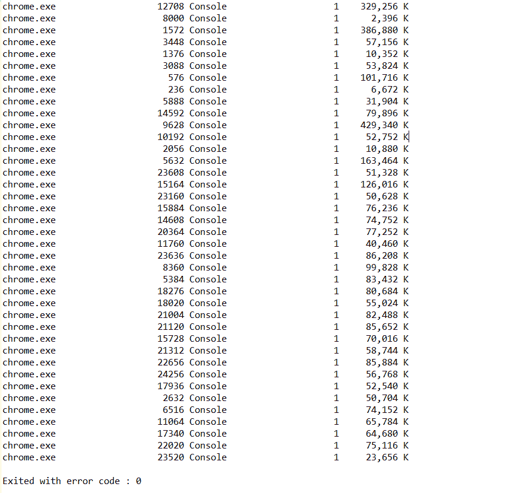
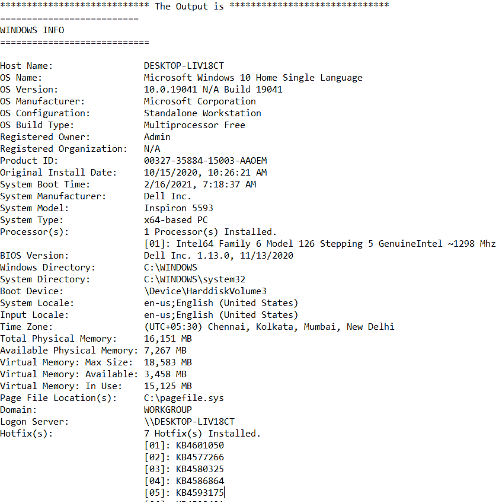

# 如何从 Java 程序执行本机 Shell 命令？

> 原文:[https://www . geesforgeks . org/如何执行-原生-shell-commands-from-Java-program/](https://www.geeksforgeeks.org/how-to-execute-native-shell-commands-from-java-program/)

shell 命令是一种命令，我们可以使用键盘和命令行或 shell 而不是图形用户界面来触发它。通常，我们会手动触发 shell 命令。但是，在某些情况下，这需要通过 Java 以编程方式完成。

Java 支持用两个类运行本机 shell 命令: [RunTime](https://docs.oracle.com/javase/8/docs/api/java/lang/Runtime.html) 和 [ProcessBuilder](https://docs.oracle.com/javase/8/docs/api/java/lang/ProcessBuilder.html) 。使用这些类并从 Java 程序内部运行 shell 命令的主要缺点是 Java 失去了可移植性。

**失去便携性意味着什么？**

Java 遵循“编译一次，运行在任何地方”的原则这意味着在一个操作系统上编写和编译的 Java 程序可以在任何其他操作系统上运行，而无需进行任何更改。

当我们使用 ProcessBuilder 或 Runtime 类来运行 Native shell 命令时，我们使 Java 程序依赖于底层操作系统。例如，专门运行 Linux shell 命令的 Java 程序无法在 Windows 机器上按原样运行，主要是因为 Windows 具有不同的文件夹结构和 shell 命令。

**示例:**

前三个示例将研究如何实现 ProcessBuilder 类来运行 Java 中的 shell 命令。以下示例针对 RunTime 类。

**例 1:便携性丧失。**

这个例子展示了如果我们在 Windows 操作系统上执行一个用于 Linux/Unix 操作系统的 Java 程序会发生什么。

## Java 语言(一种计算机语言，尤用于创建网站)

```
// if we execute a Java program meant for the Linux/Unix
// operating system on a Windows operating system
import java.io.BufferedReader;
import java.io.File;
import java.io.IOException;
import java.io.InputStreamReader;

public class ShellCommandRunner4 {
    public static void main(String[] args)
    {
        try {

            System.out.println(
                System.getProperty("os.name"));
            System.out.println();

            // This process cannot be run on Windows. So the
            // program will throw an exception.
            ProcessBuilder pb
                = new ProcessBuilder("sh", "-c", "ls");
            // Exception thrown here because folder
            // structure of Windows and Linux are different.
            pb.directory(
                new File(System.getProperty("user.home")));
            // It will throw and exception
            Process process = pb.start();

            StringBuilder output = new StringBuilder();
            BufferedReader reader
                = new BufferedReader(new InputStreamReader(
                    process.getInputStream()));

            String line;
            while ((line = reader.readLine()) != null) {
                output.append(line + "\n");
            }

            int exitVal = process.waitFor();
            if (exitVal == 0) {
                System.out.println(
                    "**************************** The Output is ******************************");
                System.out.println(output);
                System.exit(0);
            }
        }
        catch (IOException e) {
            e.printStackTrace();
        }
        catch (InterruptedException e) {
            e.printStackTrace();
        }
    }
}
```


上述程序在 Windows 机器上运行时的输出。

**示例 2:运行一个简单的 shell 命令**

这个例子展示了如何运行一个简单的 Windows shell 命令。我们使用一个列表来构建命令，然后使用 ProcessBuilder 类的“start”方法来执行它们。程序运行命令，从机器中运行的任务列表中找到 chrome 浏览器进程。

## Java 语言(一种计算机语言，尤用于创建网站)

```
// Run a simple Windows shell command
import java.io.BufferedReader;
import java.io.IOException;
import java.io.InputStreamReader;
import java.util.ArrayList;
import java.util.List;

public class ShellCommandRunner {

    public static void main(String[] args)
    {

        ProcessBuilder processBuilder
            = new ProcessBuilder();

        List<String> builderList = new ArrayList<>();

        // add the list of commands to a list
        builderList.add("cmd.exe");
        builderList.add("/C");
        builderList.add("tasklist | findstr chrome");

        try {
            // Using the list , trigger the command
            processBuilder.command(builderList);
            Process process = processBuilder.start();

            // To read the output list
            BufferedReader reader
                = new BufferedReader(new InputStreamReader(
                    process.getInputStream()));

            String line;
            while ((line = reader.readLine()) != null) {
                System.out.println(line);
            }

            int exitCode = process.waitFor();
            System.out.println("\nExited with error code : "
                               + exitCode);
        }
        catch (IOException e) {
            e.printStackTrace();
        }
        catch (InterruptedException e) {
            e.printStackTrace();
        }
    }
}
```



Chrome 浏览器进程。

**示例 3:运行 bat 文件**

这个例子展示了如何运行一个简单的。Java 控制台中的 bat 程序。那个。bat 文件显示 windows 系统信息。

## Java 语言(一种计算机语言，尤用于创建网站)

```
// Run a simple .bat program in the Java console
import java.io.BufferedReader;
import java.io.File;
import java.io.IOException;
import java.io.InputStreamReader;

public class ShellCommandRunner3 {
    public static void main(String[] args)
    {
        try {
            // File location for the bat script
            File dir = new File("D:\\bat_scripts");
            // Command to run the bat file in the same
            // console
            ProcessBuilder pb = new ProcessBuilder(
                "cmd.exe", "/C", "sysinfo.bat");
            pb.directory(dir);
            Process process = pb.start();

            StringBuilder output = new StringBuilder();
            BufferedReader reader
                = new BufferedReader(new InputStreamReader(
                    process.getInputStream()));

            String line;
            while ((line = reader.readLine()) != null) {
                output.append(line + "\n");
            }

            int exitVal = process.waitFor();
            if (exitVal == 0) {
                System.out.println(
                    "**************************** The Output is ******************************");
                System.out.println(output);
                System.exit(0);
            }
        }
        catch (IOException e) {
            e.printStackTrace();
        }
        catch (InterruptedException e) {
            e.printStackTrace();
        }
    }
}
```



系统信息 bat 文件程序输出

**示例 4:使用 RunTime 类运行 shell 命令。**

这个例子展示了如何使用 RunTime 类运行一个简单的命令。我们使用 Runtime 类的 exec()方法。

## Java 语言(一种计算机语言，尤用于创建网站)

```
// Run a simple command using the RunTime class
import java.io.BufferedReader;
import java.io.File;
import java.io.IOException;
import java.io.InputStreamReader;

public class ShellCommandRunner2 {

    public static void main(String[] args)
    {

        try {
            Process process
                = Runtime.getRuntime().exec("where java");

            StringBuilder output = new StringBuilder();

            BufferedReader reader
                = new BufferedReader(new InputStreamReader(
                    process.getInputStream()));

            String line;
            while ((line = reader.readLine()) != null) {
                output.append(line + "\n");
            }

            int exitVal = process.waitFor();
            if (exitVal == 0) {
                System.out.println(
                    "**************************** The Output is ******************************");
                System.out.println(output);
                System.exit(0);
            }
        }
        catch (IOException e) {
            e.printStackTrace();
        }
        catch (InterruptedException e) {
            e.printStackTrace();
        }
    }
}
```


java 程序中的 Java