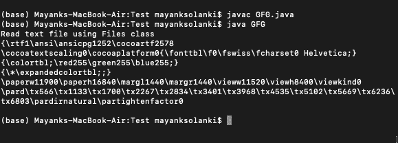
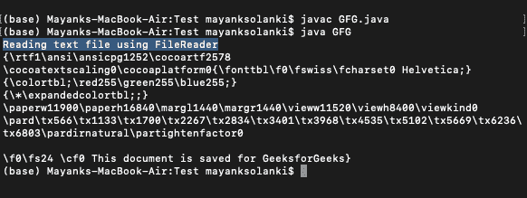
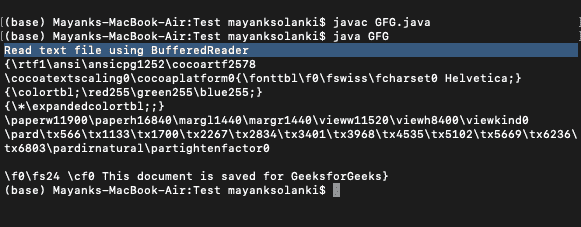
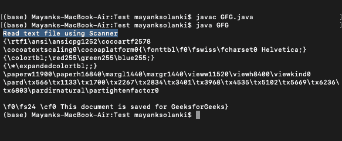

# 如何使用 Java 从文本文档中提取内容？

> 原文:[https://www . geesforgeks . org/如何使用 java 从文本文档中提取内容/](https://www.geeksforgeeks.org/how-to-extract-content-from-a-text-document-using-java/)

java 中有几种读取文本文件的方式，如 [BufferReader](https://www.geeksforgeeks.org/java-io-bufferedreader-class-java/) 、 [FileReader](https://www.geeksforgeeks.org/file-handling-java-using-filewriter-filereader/) 和 [Scanner](https://www.geeksforgeeks.org/scanner-class-in-java/) 。每种方法都提供了一种读取文本文件的独特方式。

**方法:**

1.  使用文件类
2.  使用文件阅读器类
3.  使用 BufferReader 类
4.  使用扫描仪类

让我们通过一个例子来详细了解每一个方法，以便更好地理解这些方法，从而在以后实现相同的方法来从文本文档中提取内容。

**方法 1:** [使用文件类](https://www.geeksforgeeks.org/file-class-in-java/)

正如 Java 提供的*****Java . nio . file*****。** API 我们可以使用***Java . nio . file . files*****类将一个文件的所有内容读入一个数组。要读取文本文件，我们可以使用文件类的***ReadalBytes()方法*** ，当您需要内存中的所有文件内容以及处理小文件时，使用该方法。****

******示例:******

## ****Java 语言(一种计算机语言，尤用于创建网站)****

```
**// Java Program to Extract Content From a Text Document
// Using Files class

// Importing java.nio package for network linking
import java.io.IOException;
import java.nio.charset.StandardCharsets;
import java.nio.file.Files;
import java.nio.file.Path;
import java.nio.file.Paths;
// Importing List class from java.util package
import java.util.List;

// Main class
public class GFG {
    // Method 1
    // To read the file using class
    private static void readUsingClass(String fileName)
        throws IOException
    {
        // Creating an object of Path class
        Path path = Paths.get(fileName);

        // To read file to byte array
        byte[] bytes = Files.readAllBytes(path);

        // Display message only
        System.out.println(
            "Read text file using Files class");

        // Reading the file to String List
        @SuppressWarnings("unused")

        // Creating a List class object of string type
        // as data in file to be read is words
        List<String> allLines = Files.readAllLines(
            path, StandardCharsets.UTF_8);
        System.out.println(new String(bytes));
    }

    // Method 2
    // Main driver method
    public static void main(String[] args)
        throws IOException
    {
        // Custom input directory passed where text
        String fileName
            = "/Users/mayanksolanki/Desktop/file.txt";

        // read using FileReader, no encoding support, not
        // efficient
        readUsingClass(fileName);
    }
}**
```

******输出:******

********

******方法二:** [使用文件阅读器类](https://www.geeksforgeeks.org/file-handling-java-using-filewriter-filereader/)**T5】******

****我们可以使用 **java.io.FileReader** 可以用来从文件中读取数据(以字符为单位)。这是一种非常有效的逐行读取文件的方法。****

******语法:******

```
**FileReader input = new FileReader(String name);**
```

******示例:******

## ****Java 语言(一种计算机语言，尤用于创建网站)****

```
**// Java Program to Extract Content From a Text Document
// Using FileReader class

// Importing required libraries
import java.io.BufferedReader;
import java.io.File;
import java.io.FileReader;
import java.io.IOException;

// Main class
public class GFG {
    // Method
    // To read the file using File Reader
    private static void readUsingFileReader(String fileName)
        throws IOException
    {
        File file = new File(fileName);
        FileReader fr = new FileReader(file);
        BufferedReader br = new BufferedReader(fr);
        String line;
        System.out.println(
            "Reading text file using FileReader");
        while ((line = br.readLine()) != null) {
            // process the line
            System.out.println(line);
        }
        br.close();
        fr.close();
    }

    // Method 2
    // Main driver method
    public static void main(String[] args)
        throws IOException
    {
        String fileName
            = "/Users/mayanksolanki/Desktop/file.txt";

        // read using FileReader, no encoding support, not
        // efficient
        readUsingFileReader(fileName);
    }
}**
```

******输出:******

********

******方法三:** [使用](https://www.geeksforgeeks.org/java-io-bufferedreader-class-java/) **级******

****如果你想逐行读取文件，如果你想处理该文件，那么你必须使用 BufferedReader。它也用于处理大文件，也支持编码。BufferReader 上的读取操作非常高效。****

> ******注意:**要么指定缓冲区的大小，要么保持缓冲区的默认大小为 8KB。****

******语法:******

```
**BufferedReader in = new BufferedReader(Reader in, int size);**
```

******实施:******

```
**Hello I am learning web- development.
I am writing article for GFG.
I am cloud enthusiast.
I am an open-source contributor.**
```

> ******注意:**开始之前，使用创建一个文本文件。txt 扩展名，并在练习时随时使用该文件的路径。****

******示例:******

## ****Java 语言(一种计算机语言，尤用于创建网站)****

```
**// Java Program to Extract Content From a Text Document
// Using BufferedReader class

// Importing required libraries
import java.io.BufferedReader;
import java.io.File;
import java.io.FileReader;
import java.io.IOException;

// Main class
public class GFG {
    // Method
    // To read the file using Buffered Reader
    private static void
    readUsingBufferedReader(String fileName)
        throws IOException
    {
        File file = new File(fileName);
        FileReader fr = new FileReader(file);
        // read file line by line
        BufferedReader br = new BufferedReader(fr);
        String line;
        System.out.println(
            "Read text file using BufferedReader");
        while ((line = br.readLine()) != null) {
            // process the line
            System.out.println(line);
        }
        // close resources
        br.close();
        fr.close();
    }

    // Method 2
    // Main driver method
    public static void main(String[] args)
        throws IOException
    {
        String fileName
            = "/Users/mayanksolanki/Desktop/file.txt";

        // read using FileReader, no encoding support, not
        // efficient
        readUsingBufferedReader(fileName);
    }
}**
```

******输出:******

********

******方法 4:** 使用扫描仪类****

****如果我们想基于某个表达式阅读文档&如果你想逐行阅读文档，那么我们使用 Scanner 类。扫描仪将输入分成标记，默认情况下，标记与空格匹配。****

******示例:******

## ****Java 语言(一种计算机语言，尤用于创建网站)****

```
**// Java Program to Extract Content From a Text Document
// Using Scanner class

// Importing required libraries
import java.io.IOException;
import java.nio.file.Path;
import java.nio.file.Paths;
import java.util.Scanner;

// Main class
public class GFG {

    // Method 1
    // To read the file using Scanner
    private static void readUsingScanner(String fileName)
        throws IOException
    {

        // Again,  creating Path class object in main()
        // method
        Path path = Paths.get(fileName);

        // Creating Scanner class object to take input
        Scanner scanner = new Scanner(path);

        // Display message for readability
        System.out.println("Read text file using Scanner");

        // Now reading file line by line
        // using hasNextLine() method
        while (scanner.hasNextLine()) {

            // Processing each line
            String line = scanner.nextLine();

            // Printing processed lines
            System.out.println(line);
        }

        // close() method is used to close all the read
        // write connections
        scanner.close();
    }

    // Method 2
    // Main driver method
    public static void main(String[] args)
        throws IOException
    {
        // Custom input text document
        // present already on the machine
        String fileName
            = "/Users/mayanksolanki/Desktop/file.txt";

        // Now lastly reading using FileReader
        // no encoding support, not efficient
        readUsingScanner(fileName);
    }
}**
```

******输出:******

********

******实施:******

****这里的“**my _ file . txt”**是一个演示文件，用于下面演示的程序，其中示例行如下:****

```
**Hello I am learning web- development.
I am writing article of GFG.
I am cloud enthusiast.
I am an open-source contributor.**
```

******例 1:******

## ****Java 语言(一种计算机语言，尤用于创建网站)****

```
**// Java Program to Implement Extraction of Content
// From a Text Document

// Importing required libraries
import java.io.BufferedReader;
import java.io.File;
import java.io.FileInputStream;
import java.io.FileReader;
import java.io.IOException;
import java.io.InputStreamReader;
import java.nio.charset.Charset;
import java.nio.charset.StandardCharsets;
import java.nio.file.Files;
import java.nio.file.Path;
import java.nio.file.Paths;
import java.util.List;
import java.util.Scanner;

// Main class
public class read_file {
    // Method 1
    // To read the file using File Reader
    private static void readUsingFileReader(String fileName)
        throws IOException
    {
        File file = new File(fileName);
        FileReader fr = new FileReader(file);
        BufferedReader br = new BufferedReader(fr);
        String line;
        System.out.println(
            "Reading text file using FileReader");
        while ((line = br.readLine()) != null) {
            // process the line
            System.out.println(line);
        }
        br.close();
        fr.close();
    }

    // Method 2
    // To read the file using Buffered Reader
    private static void
    readUsingBufferedReader(String fileName)
        throws IOException
    {
        File file = new File(fileName);
        FileReader fr = new FileReader(file);
        // read file line by line
        BufferedReader br = new BufferedReader(fr);
        String line;
        System.out.println(
            "Read text file using BufferedReader");
        while ((line = br.readLine()) != null) {
            // process the line
            System.out.println(line);
        }

        // Closing resources to
        // release memory spaces
        br.close();
        fr.close();
    }

    // Method 3
    // To read the file using Scanner
    private static void readUsingScanner(String fileName)
        throws IOException
    {
        Path path = Paths.get(fileName);
        Scanner scanner = new Scanner(path);
        System.out.println("Read text file using Scanner");
        // read line by line
        while (scanner.hasNextLine()) {
            // process each line
            String line = scanner.nextLine();
            System.out.println(line);
        }
        scanner.close();
    }

    // Method 4
    // To read the file using class
    private static void readUsingClass(String fileName)
        throws IOException
    {
        Path path = Paths.get(fileName);
        // read file to byte array
        byte[] bytes = Files.readAllBytes(path);
        System.out.println(
            "Read text file using Files class");
        // read file to String list
        @SuppressWarnings("unused")
        List<String> allLines = Files.readAllLines(
            path, StandardCharsets.UTF_8);
        System.out.println(new String(bytes));
    }

    // Method 5
    // main driver method
    public static void main(String[] args)
        throws IOException
    {
        String fileName
            = "C:\\Users\\HP\\Desktop\\my_file.txt";

        // using Java 7 Files class to
        // process small files, get complete file data
        readUsingClass(fileName);

        // using Scanner class for
        // large files, to read line by line
        readUsingScanner(fileName);

        // read using BufferedReader, to read line by line
        readUsingBufferedReader(fileName);

        // read using FileReader, no encoding support, not
        // efficient
        readUsingFileReader(fileName);
    }
}**
```

 ******示例 2:** 从文本文件中读取特定行****

****现在，如果您想从给定的文档中读取特定的行，那么我们使用 BufferReader 方法。根据文件的不同，使用了 BufferReader()方法，这样我们的代码可以更快更有效地工作。在这个程序中，存储在 BufferReader 中的文本文件是通过使用 for 循环遍历所有行，当条件变为真时，我们将打印这些行****

******实施:******

> *********my file . txt*****是要使用的演示文件。********

******这是包含在该文件中的样本行，该文件由以行组成的随机仲裁字组成******

> ******3D 打印或添加制造是从数字文件制作三维实体对象的过程。******
> 
> ******3D 打印对象的创建是使用附加过程实现的。在添加过程中，通过铺设连续的材料层直到创建对象，来创建对象。这些层中的每一层都可以看作是物体的薄片横截面。******
> 
> ******3D 打印与减法制造相反，减法制造是用例如铣床切割/挖空一块金属或塑料。******
> 
> ******3D 打印使您能够制作复杂的形状。******
> 
> ******它比传统制造方法使用更少的材料。******

## ******Java 语言(一种计算机语言，尤用于创建网站)******

```
****// Java program to Read Specific Lines from a Text File

// Importing required libraries
import java.io.*;
import java.io.BufferedReader;
import java.io.FileReader;
import java.io.IOException;

// Main class
public class GFG {

    // Main driver method
    public static void main(String[] args)
    {
        // Initially taking empty string
        String text = "";

        // Declaring a variable to lookup for
        // number of lines in afile
        int lineNumber;

        // Try block to check for exceptions
        try {

            // Creating a FileReader object so as to
            // get the directory of file to be read
            FileReader readfile = new FileReader(
                "C:\\Users\\HP\\Desktop\\Exam.txt");

            // Creating a BufferReader class object to
            // read file as passed above
            BufferedReader readbuffer
                = new BufferedReader(readfile);

            // Buffer reader declaration

            // Conditionality for specific line/s

            // Loop for the traversing line by line
            // into the text file
            for (lineNumber = 1; lineNumber < 10;
                 lineNumber++) {
                // If spefic line/s is found
                if (lineNumber == 7) {
                    // Store the content of this specific
                    // line
                    text = readbuffer.readLine();
                }

                else {
                    // Just keep on reading
                    readbuffer.readLine();
                }
            }
        }

        // Catching IOException exception
        catch (IOException e) {

            // Print the line number where exception occurred
            e.printStackTrace();
        }

        // Print the specific line from the file read
        System.out.println(" The specific Line is: "
                           + text);
    }
}****
```

 ********输出:**具体线路为:******

```
**3D printing enables you to produce complex shapes.**
```