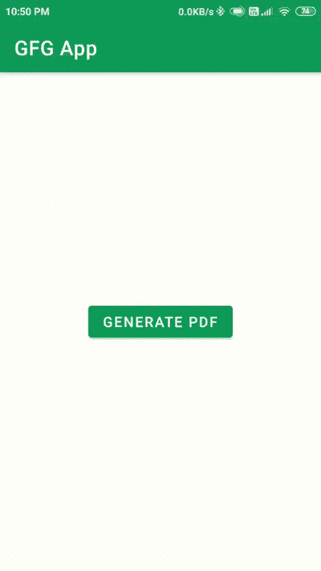

# 如何在安卓 App 中生成 PDF 文件？

> 原文:[https://www . geesforgeks . org/如何在安卓应用程序中生成 pdf 文件/](https://www.geeksforgeeks.org/how-to-generate-a-pdf-file-in-android-app/)

有许多应用程序将应用程序中的数据以可下载的 PDF 文件格式提供给用户。因此，在这种情况下，我们必须根据应用程序中的数据创建一个 PDF 文件，并在应用程序中适当地表示这些数据。因此，通过使用这种技术，我们可以很容易地根据我们的要求创建一个新的 PDF。在本文中，我们将研究如何从您的安卓应用程序中的数据创建一个新的 PDF 文件，并将该 PDF 文件保存在用户设备的外部存储中。因此，为了从安卓应用程序中的数据生成一个新的 PDF 文件，我们将使用画布。Canvas 是 Android 中的一个预定义类，用于在我们的屏幕上绘制不同对象的 2D 图。因此，在本文中，我们将使用画布在画布中绘制数据，然后以 PDF 的形式存储画布。现在我们将着手实施我们的项目。

### 生成 PDF 文件的示例

下面是示例 GIF，我们将在其中了解本文中要构建的内容。请注意，该应用程序是使用 **Java** 语言构建的。在这个项目中，我们将显示一个简单的按钮。点击按钮后，我们的 PDF 文件将被生成，我们可以看到这个 PDF 文件保存在我们的文件中。



### 逐步实施

**第一步:创建新项目**

要在安卓工作室创建新项目，请参考[如何在安卓工作室创建/启动新项目](https://www.geeksforgeeks.org/android-how-to-create-start-a-new-project-in-android-studio/)。注意选择 **Java** 作为编程语言。

**步骤 2:使用 activity_main.xml 文件**

转到 **activity_main.xml** 文件，参考以下代码。下面是 **activity_main.xml** 文件的代码。

## 可扩展标记语言

```java
<?xml version="1.0" encoding="utf-8"?>
<RelativeLayout
    xmlns:android="http://schemas.android.com/apk/res/android"
    xmlns:tools="http://schemas.android.com/tools"
    android:layout_width="match_parent"
    android:layout_height="match_parent"
    tools:context=".MainActivity">

    <!--Button for generating the PDF file-->
    <Button
        android:id="@+id/idBtnGeneratePDF"
        android:layout_width="wrap_content"
        android:layout_height="wrap_content"
        android:layout_centerInParent="true"
        android:text="Generate PDF" />

</RelativeLayout>
```

**第三步:在外存储器**中添加读写权限

导航到**应用程序>和**文件，并添加以下权限。

## 可扩展标记语言

```java
<uses-permission android:name="android.permission.WRITE_EXTERNAL_STORAGE"/>
<uses-permission android:name="android.permission.READ_EXTERNAL_STORAGE"/>
```

**第四步:处理 MainActivity.java 文件**

转到**MainActivity.java**文件，参考以下代码。以下是**MainActivity.java**文件的代码。代码中添加了注释，以更详细地理解代码。

## Java 语言(一种计算机语言，尤用于创建网站)

```java
import android.content.pm.PackageManager;
import android.graphics.Bitmap;
import android.graphics.BitmapFactory;
import android.graphics.Canvas;
import android.graphics.Paint;
import android.graphics.Typeface;
import android.graphics.pdf.PdfDocument;
import android.os.Bundle;
import android.os.Environment;
import android.view.View;
import android.widget.Button;
import android.widget.Toast;

import androidx.annotation.NonNull;
import androidx.appcompat.app.AppCompatActivity;
import androidx.core.app.ActivityCompat;
import androidx.core.content.ContextCompat;

import java.io.File;
import java.io.FileOutputStream;
import java.io.IOException;

import static android.Manifest.permission.READ_EXTERNAL_STORAGE;
import static android.Manifest.permission.WRITE_EXTERNAL_STORAGE;

public class MainActivity extends AppCompatActivity {

    // variables for our buttons.
    Button generatePDFbtn;

    // declaring width and height
    // for our PDF file.
    int pageHeight = 1120;
    int pagewidth = 792;

    // creating a bitmap variable
    // for storing our images
    Bitmap bmp, scaledbmp;

    // constant code for runtime permissions
    private static final int PERMISSION_REQUEST_CODE = 200;

    @Override
    protected void onCreate(Bundle savedInstanceState) {
        super.onCreate(savedInstanceState);
        setContentView(R.layout.activity_main);

        // initializing our variables.
        generatePDFbtn = findViewById(R.id.idBtnGeneratePDF);
        bmp = BitmapFactory.decodeResource(getResources(), R.drawable.gfgimage);
        scaledbmp = Bitmap.createScaledBitmap(bmp, 140, 140, false);

        // below code is used for
          // checking our permissions.
        if (checkPermission()) {
            Toast.makeText(this, "Permission Granted", Toast.LENGTH_SHORT).show();
        } else {
            requestPermission();
        }

        generatePDFbtn.setOnClickListener(new View.OnClickListener() {
            @Override
            public void onClick(View v) {
                // calling method to
                  // generate our PDF file.
                generatePDF();
            }
        });
    }

    private void generatePDF() {
        // creating an object variable
        // for our PDF document.
        PdfDocument pdfDocument = new PdfDocument();

        // two variables for paint "paint" is used
        // for drawing shapes and we will use "title"
        // for adding text in our PDF file.
        Paint paint = new Paint();
        Paint title = new Paint();

        // we are adding page info to our PDF file
        // in which we will be passing our pageWidth,
        // pageHeight and number of pages and after that
        // we are calling it to create our PDF.
        PdfDocument.PageInfo mypageInfo = new PdfDocument.PageInfo.Builder(pagewidth, pageHeight, 1).create();

        // below line is used for setting
        // start page for our PDF file.
        PdfDocument.Page myPage = pdfDocument.startPage(mypageInfo);

        // creating a variable for canvas
        // from our page of PDF.
        Canvas canvas = myPage.getCanvas();

        // below line is used to draw our image on our PDF file.
        // the first parameter of our drawbitmap method is
        // our bitmap
        // second parameter is position from left
        // third parameter is position from top and last
        // one is our variable for paint.
        canvas.drawBitmap(scaledbmp, 56, 40, paint);

        // below line is used for adding typeface for
        // our text which we will be adding in our PDF file.
        title.setTypeface(Typeface.create(Typeface.DEFAULT, Typeface.NORMAL));

        // below line is used for setting text size
        // which we will be displaying in our PDF file.
        title.setTextSize(15);

        // below line is sued for setting color
        // of our text inside our PDF file.
        title.setColor(ContextCompat.getColor(this, R.color.purple_200));

        // below line is used to draw text in our PDF file.
        // the first parameter is our text, second parameter
        // is position from start, third parameter is position from top
        // and then we are passing our variable of paint which is title.
        canvas.drawText("A portal for IT professionals.", 209, 100, title);
        canvas.drawText("Geeks for Geeks", 209, 80, title);

        // similarly we are creating another text and in this
        // we are aligning this text to center of our PDF file.
        title.setTypeface(Typeface.defaultFromStyle(Typeface.NORMAL));
        title.setColor(ContextCompat.getColor(this, R.color.purple_200));
        title.setTextSize(15);

        // below line is used for setting
        // our text to center of PDF.
        title.setTextAlign(Paint.Align.CENTER);
        canvas.drawText("This is sample document which we have created.", 396, 560, title);

        // after adding all attributes to our
        // PDF file we will be finishing our page.
        pdfDocument.finishPage(myPage);

        // below line is used to set the name of
        // our PDF file and its path.
        File file = new File(Environment.getExternalStorageDirectory(), "GFG.pdf");

        try {
            // after creating a file name we will
            // write our PDF file to that location.
            pdfDocument.writeTo(new FileOutputStream(file));

            // below line is to print toast message
            // on completion of PDF generation.
            Toast.makeText(MainActivity.this, "PDF file generated successfully.", Toast.LENGTH_SHORT).show();
        } catch (IOException e) {
            // below line is used
            // to handle error
            e.printStackTrace();
        }
        // after storing our pdf to that
        // location we are closing our PDF file.
        pdfDocument.close();
    }

    private boolean checkPermission() {
        // checking of permissions.
        int permission1 = ContextCompat.checkSelfPermission(getApplicationContext(), WRITE_EXTERNAL_STORAGE);
        int permission2 = ContextCompat.checkSelfPermission(getApplicationContext(), READ_EXTERNAL_STORAGE);
        return permission1 == PackageManager.PERMISSION_GRANTED && permission2 == PackageManager.PERMISSION_GRANTED;
    }

    private void requestPermission() {
        // requesting permissions if not provided.
        ActivityCompat.requestPermissions(this, new String[]{WRITE_EXTERNAL_STORAGE, READ_EXTERNAL_STORAGE}, PERMISSION_REQUEST_CODE);
    }

    @Override
    public void onRequestPermissionsResult(int requestCode, @NonNull String[] permissions, @NonNull int[] grantResults) {
        if (requestCode == PERMISSION_REQUEST_CODE) {
            if (grantResults.length > 0) {

                // after requesting permissions we are showing
                // users a toast message of permission granted.
                boolean writeStorage = grantResults[0] == PackageManager.PERMISSION_GRANTED;
                boolean readStorage = grantResults[1] == PackageManager.PERMISSION_GRANTED;

                if (writeStorage && readStorage) {
                    Toast.makeText(this, "Permission Granted..", Toast.LENGTH_SHORT).show();
                } else {
                    Toast.makeText(this, "Permission Denined.", Toast.LENGTH_SHORT).show();
                    finish();
                }
            }
        }
    }
}
```

**输出:**

<video class="wp-video-shortcode" id="video-534393-1" width="640" height="360" preload="metadata" controls=""><source type="video/mp4" src="https://media.geeksforgeeks.org/wp-content/uploads/20201228225603/Screenrecorder-2020-12-28-22-50-42-301.mp4?_=1">[https://media.geeksforgeeks.org/wp-content/uploads/20201228225603/Screenrecorder-2020-12-28-22-50-42-301.mp4](https://media.geeksforgeeks.org/wp-content/uploads/20201228225603/Screenrecorder-2020-12-28-22-50-42-301.mp4)</video>