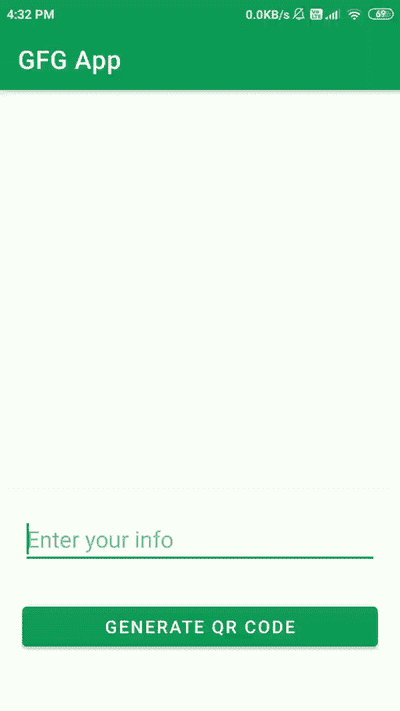

# 如何在安卓系统中生成二维码？

> 原文:[https://www . geeksforgeeks . org/如何生成安卓二维码/](https://www.geeksforgeeks.org/how-to-generate-qr-code-in-android/)

**二维码**在许多应用中用于以机器可读的形式显示数据。这些代码用于以安全的方式表示数据，这些数据只能由机器读取，不能由人类读取。我们已经看到许多应用程序提供二维码，我们可以用移动设备扫描二维码。在本文中，我们将看看**如何为我们的应用程序**生成二维码。所以为了实现这个特性，我们将使用 GitHub 中的一个库。

## 二维码生成器在安卓系统中的实现

我们将创建一个简单的二维码生成器应用程序，我们将从该应用程序中添加数据，并生成一个二维码，显示其中的数据。下面是示例 GIF，在其中您将对本文中我们要做的事情有一个基本的了解。并不是说我们使用 **Java** 语言来构建这个项目。



### 逐步实施

**第一步:创建新项目**

要在安卓工作室创建新项目，请参考[如何在安卓工作室创建/启动新项目](https://www.geeksforgeeks.org/android-how-to-create-start-a-new-project-in-android-studio/)。注意选择 **Java** 作为编程语言。

**第二步:添加依赖项进行构建. gradle(模块:app)**

导航到**渐变脚本>构建.渐变(模块:应用)**，并在依赖项部分添加以下依赖项。

> 实现“androidmads . library . qrgenarator:qrgenarator:1 . 0 . 3”

现在从“立即同步”的右上角选项同步项目。

**第三步:修改 strings.xml 文件**

下面是 **strings.xml** 文件的代码。

## 可扩展标记语言

```
<resources>
    <string name="app_name">GFG App</string>
    <string name="qr_code">qr_code</string>
    <string name="enter_your_info">Enter your info</string>
    <string name="generate_qr_code">Generate QR Code</string>
</resources>
```

**第 4 步:使用 activity_main.xml 文件**

转到 **activity_main.xml** 文件，参考以下代码。下面是 **activity_main.xml** 文件的代码。

## 可扩展标记语言

```
<?xml version="1.0" encoding="utf-8"?>
<RelativeLayout 
    xmlns:android="http://schemas.android.com/apk/res/android"
    xmlns:tools="http://schemas.android.com/tools"
    android:layout_width="match_parent"
    android:layout_height="match_parent"
    tools:context=".MainActivity">

    <!--We are using this image 
        view to display our QR code-->
    <ImageView
        android:id="@+id/idIVQrcode"
        android:layout_width="300dp"
        android:layout_height="300dp"
        android:layout_centerHorizontal="true"
        android:layout_marginTop="50dp"
        android:contentDescription="@string/qr_code" />

    <!--Edit text to enter text 
        for creating a QR code-->
    <EditText
        android:id="@+id/idEdt"
        android:layout_width="match_parent"
        android:layout_height="wrap_content"
        android:layout_below="@id/idIVQrcode"
        android:layout_marginStart="20dp"
        android:layout_marginTop="30dp"
        android:layout_marginEnd="20dp"
        android:autofillHints=""
        android:hint="@string/enter_your_info"
        android:inputType="text" />

    <!--Button for creating a QR code-->
    <Button
        android:id="@+id/idBtnGenerateQR"
        android:layout_width="match_parent"
        android:layout_height="wrap_content"
        android:layout_below="@id/idEdt"
        android:layout_marginStart="20dp"
        android:layout_marginTop="30dp"
        android:layout_marginEnd="20dp"
        android:text="@string/generate_qr_code" />

</RelativeLayout>
```

**步骤 5:使用 MainActivity.java 文件**

转到**MainActivity.java**文件，参考以下代码。以下是**MainActivity.java**文件的代码。代码中添加了注释，以更详细地理解代码。

## Java 语言(一种计算机语言，尤用于创建网站)

```
import android.graphics.Bitmap;
import android.graphics.Point;
import android.os.Bundle;
import android.text.TextUtils;
import android.util.Log;
import android.view.Display;
import android.view.View;
import android.view.WindowManager;
import android.widget.Button;
import android.widget.EditText;
import android.widget.ImageView;
import android.widget.Toast;
import androidx.appcompat.app.AppCompatActivity;
import com.google.zxing.WriterException;
import androidmads.library.qrgenearator.QRGContents;
import androidmads.library.qrgenearator.QRGEncoder;

public class MainActivity extends AppCompatActivity {

    // variables for imageview, edittext,
    // button, bitmap and qrencoder.
    private ImageView qrCodeIV;
    private EditText dataEdt;
    private Button generateQrBtn;
    Bitmap bitmap;
    QRGEncoder qrgEncoder;

    @Override
    protected void onCreate(Bundle savedInstanceState) {
        super.onCreate(savedInstanceState);
        setContentView(R.layout.activity_main);

        // initializing all variables.
        qrCodeIV = findViewById(R.id.idIVQrcode);
        dataEdt = findViewById(R.id.idEdt);
        generateQrBtn = findViewById(R.id.idBtnGenerateQR);

        // initializing onclick listener for button.
        generateQrBtn.setOnClickListener(new View.OnClickListener() {
            @Override
            public void onClick(View v) {
                if (TextUtils.isEmpty(dataEdt.getText().toString())) {

                    // if the edittext inputs are empty then execute 
                    // this method showing a toast message.
                    Toast.makeText(MainActivity.this, "Enter some text to generate QR Code", Toast.LENGTH_SHORT).show();
                } else {
                    // below line is for getting 
                    // the windowmanager service.
                    WindowManager manager = (WindowManager) getSystemService(WINDOW_SERVICE);

                    // initializing a variable for default display.
                    Display display = manager.getDefaultDisplay();

                    // creating a variable for point which 
                    // is to be displayed in QR Code.
                    Point point = new Point();
                    display.getSize(point);

                    // getting width and 
                    // height of a point
                    int width = point.x;
                    int height = point.y;

                    // generating dimension from width and height.
                    int dimen = width < height ? width : height;
                    dimen = dimen * 3 / 4;

                    // setting this dimensions inside our qr code
                    // encoder to generate our qr code.
                    qrgEncoder = new QRGEncoder(dataEdt.getText().toString(), null, QRGContents.Type.TEXT, dimen);
                    try {
                        // getting our qrcode in the form of bitmap.
                        bitmap = qrgEncoder.encodeAsBitmap();
                        // the bitmap is set inside our image 
                        // view using .setimagebitmap method.
                        qrCodeIV.setImageBitmap(bitmap);
                    } catch (WriterException e) {
                        // this method is called for 
                        // exception handling.
                        Log.e("Tag", e.toString());
                    }
                }
            }
        });
    }
}
```

### 输出:

<video class="wp-video-shortcode" id="video-531333-1" width="640" height="360" preload="metadata" controls=""><source type="video/mp4" src="https://media.geeksforgeeks.org/wp-content/uploads/20201217163353/Screenrecorder-2020-12-17-16-32-03-350.mp4?_=1">[https://media.geeksforgeeks.org/wp-content/uploads/20201217163353/Screenrecorder-2020-12-17-16-32-03-350.mp4](https://media.geeksforgeeks.org/wp-content/uploads/20201217163353/Screenrecorder-2020-12-17-16-32-03-350.mp4)</video>

> **注意:**也可以参考[如何在安卓](https://www.geeksforgeeks.org/how-to-use-camview-library-in-android-apps/)中读取二维码？

**查看项目:**[https://github.com/ChaitanyaMunje/QRCodeGenerator](https://github.com/ChaitanyaMunje/QRCodeGenerator)