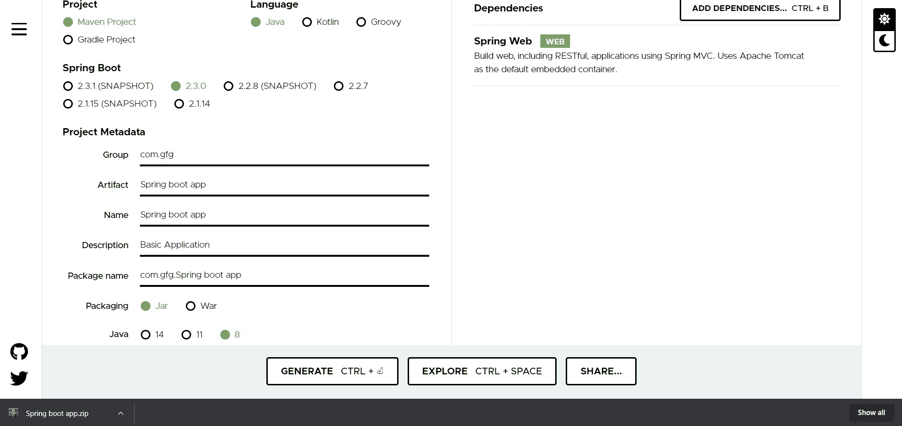
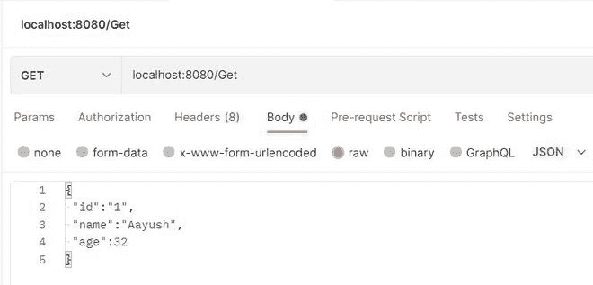

# 如何在 Spring Boot 获得请求体？

> 原文:[https://www . geeksforgeeks . org/如何获取春季开机请求正文/](https://www.geeksforgeeks.org/how-to-get-the-body-of-request-in-spring-boot/)

**Java 语言**是所有编程语言中最流行的语言之一。使用 java 编程语言有几个优点，无论是出于安全目的还是构建大型分发项目。使用 Java 的优势之一是 JAVA 试图借助类、继承、多态等概念将语言中的每个概念与现实世界联系起来。

java 中还有其他几个概念，增加了 java 代码和程序员之间的用户友好交互，例如泛型、访问说明符、注释等。这些特性为类以及 java 程序的方法增加了一个额外的属性。在本文中，我们将讨论如何在 spring boot 中获取传入请求的主体。

```java
@RequestBody: Annotation is used to get request body in the incoming request.
```

> **注意:**首先我们需要在我们的项目中建立 spring 应用。

**Spring Initializr** 是一个基于 web 的工具，使用它我们可以很容易地生成 Spring Boot 项目的结构。它还为元数据模型中表达的项目提供了各种不同的特性。这个模型允许我们配置 JVM 支持的依赖列表。在这里，我们将使用 spring 初始化器创建应用程序的结构，然后使用 IDE 创建一个示例 GET 路由。因此，要做到这一点，依次遵循以下步骤:

**第一步:**转到[春天初始化](https://www.geeksforgeeks.org/spring-initializr/)

按照要求填写细节。对于此应用:

```java
Project: Maven
Language: Java
Spring Boot: 2.2.8
Packaging: JAR
Java: 8
Dependencies: Spring Web      
```

**第 2 步:**点击生成，将下载启动项目。



**第三步:**提取 zip 文件。现在打开一个合适的 IDE，然后转到文件- >新建- >现有来源的项目- > Spring-boot-app，并选择 pom.xml。在提示符下单击导入更改，等待项目同步。


> **注意:**在 Maven 的导入项目窗口中，确保选择了与创建项目时选择的 JDK 相同的版本。

**第四步:**转到***src->main->java->com . gfg . spring . boot . app***和创建一个名为 Controller 的 Java 类，并添加注释@RestController。现在创建如下所示的 GET 应用编程接口:

**例 1:**Person.java

```java
// Class
public class Person {

    // Attributes of Person
    int id;
    String name;
    int age;

    // Constructor of this class
    public Person(int id, String name, int age) {

        // this keyword refers to current instance object
        this.id = id;
        this.name = name;
        this.age = age;
    }

    // Method of Person class
    // toString() method
    public String toString() {

        // Simply returning the name and age of person
        return id + " " + name + " " + age;
    }

```

**例 2:**Controller.java

```java
@RestController

// Class
public class Controller {

       @GetMapping("/Get")

       void getBody(@RequestBody Person ob) {

              // Print and display the person object
              System.out.println(ob);
       }
}
```

这个应用程序现在可以运行了。运行 SpringBootAppApplication 类，等待 Tomcat 服务器启动。

> **注意:**Tomcat 服务器的默认端口是 8080，可以在 application.properties 文件中更改。

**第五步:**现在去 [**邮差**](https://www.geeksforgeeks.org/introduction-postman-api-development/) 添加网址并发出获取请求



**输出:**最后将在终端/CMD 上产生如下输出:

```java
1 Aayush 32
```