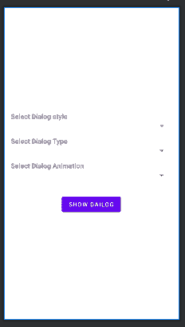

# 如何在安卓系统中实现自定义对话框生成器？

> 原文:[https://www . geeksforgeeks . org/如何实现-自定义-对话框-android 中的 maker/](https://www.geeksforgeeks.org/how-to-implement-custom-dialog-maker-in-android/)

在本文中，我们将在 android studio 中制作一个自定义对话框生成器的应用程序。在这个应用程序中，我们可以创建自己选择样式、类型和动画的对话框。

### 什么是对话？

对话框是一个小窗口，提示用户做出决定，提供一些附加信息，并通知用户一些特定的任务。

**对话的目标/目的:**

以下是对话的主要目的或目标-

*   警告用户任何活动。
*   通知用户任何活动。
*   告诉用户这是否是一个错误。
*   告诉用户他/她想要的动作已经成功。

### 我们将在本文中构建什么？

在这个应用程序中，我们将为用户提供选择他想要的对话框类型的工具，即他/她可以选择所需对话框的类型、样式和动画。注意，我们将使用 **Java** 语言来实现这个应用程序。下面给出了一个示例视频，以了解我们将在本文中做什么。

<video class="wp-video-shortcode" id="video-643334-1" width="640" height="360" preload="metadata" controls=""><source type="video/mp4" src="https://media.geeksforgeeks.org/wp-content/uploads/20210712174109/WhatsApp-Video-2021-07-12-at-17.26.04.mp4?_=1">[https://media.geeksforgeeks.org/wp-content/uploads/20210712174109/WhatsApp-Video-2021-07-12-at-17.26.04.mp4](https://media.geeksforgeeks.org/wp-content/uploads/20210712174109/WhatsApp-Video-2021-07-12-at-17.26.04.mp4)</video>

### 逐步实施

**第一步:创建新项目**

*   打开一个新项目。
*   我们将使用 Java 语言来处理空活动。保持所有其他选项不变。
*   您可以在方便的时候更改项目的名称。
*   将有两个名为 **activity_main.xml 和 MainActivity.java**的默认文件。

如果你不知道如何在安卓工作室创建新项目，那么你可以参考[如何在安卓工作室创建/启动新项目？](https://www.geeksforgeeks.org/android-how-to-create-start-a-new-project-in-android-studio/)

**第二步:添加依赖和 JitPack 存储库**

导航到**渐变脚本>构建.渐变(模块:应用)**，并在依赖项部分添加以下依赖项。

> 实现' com . github . Gabriel-COde:唯美对话框:1.3.5 '

将 JitPack 存储库添加到构建文件中。将其添加到 allprojects{ }部分内存储库末尾的 root build.gradle 中。

> *所有项目{*
> 
> *存储库{*
> 
> *……*
> 
> *maven { URL " https://jitpack . io " }*
> 
> *}*
> 
> *}*

添加这个依赖项后，同步您的项目，现在我们将开始实现它。

**步骤 3:使用 activity_main.xml 文件**

在这里，我们将设计应用程序的用户界面。我们将在他们各自的作品中使用以下组件:

*   [文本视图:](https://www.geeksforgeeks.org/textview-widget-in-android-using-java-with-examples/)向用户显示选择类型、样式或动画的消息。
*   [微调器:](https://www.geeksforgeeks.org/spinner-in-android-using-java-with-example/)打开下拉列表，供用户选择类型、样式或动画。
*   [按钮](https://www.geeksforgeeks.org/button-in-kotlin/):显示对话框。

在 **activity_main.xml** 文件中使用以下代码。

## 可扩展标记语言

```java
<?xml version="1.0" encoding="utf-8"?>
<!-- linear layout as parent layout-->
<LinearLayout 
    xmlns:android="http://schemas.android.com/apk/res/android"
    xmlns:tools="http://schemas.android.com/tools"
    android:layout_width="match_parent"
    android:layout_height="match_parent"
    android:gravity="center"
    android:orientation="vertical"
    android:padding="16dp"
    tools:context=".MainActivity">

    <!-- to display the message "Select dialog style-->
    <TextView
        android:layout_width="match_parent"
        android:layout_height="wrap_content"
        android:text="Select Dialog style"
        android:textSize="16sp"
        android:textStyle="bold" />

    <!-- to allow user to select dialog style-->
    <Spinner
        android:id="@+id/sp_style"
        android:layout_width="match_parent"
        android:layout_height="wrap_content" />

    <!-- to display the message "Select dialog type"-->
    <TextView
        android:layout_width="match_parent"
        android:layout_height="wrap_content"
        android:layout_marginTop="12dp"
        android:text="Select Dialog Type"
        android:textSize="16sp"
        android:textStyle="bold" />

    <!-- to allow user to select dialog type-->
    <Spinner
        android:id="@+id/sp_type"
        android:layout_width="match_parent"
        android:layout_height="wrap_content" />

    <!-- to display the message "Select dialog animation"-->
    <TextView
        android:layout_width="match_parent"
        android:layout_height="wrap_content"
        android:layout_marginTop="12dp"
        android:text="Select Dialog Animation"
        android:textSize="16sp"
        android:textStyle="bold" />

    <!-- to allow the user to select dialog animation-->
    <Spinner
        android:id="@+id/sp_animation"
        android:layout_width="match_parent"
        android:layout_height="wrap_content" />

    <!-- to perform the action  of Showing dialog box-->
    <Button
        android:id="@+id/bt_show"
        android:layout_width="wrap_content"
        android:layout_height="wrap_content"
        android:layout_marginTop="32dp"
        android:text="Show Dialog" />

</LinearLayout>
```

执行上述代码后， **activity_main.xml** 文件的设计如下。



**第四步:使用****MainActivity.java 文件**

转到**MainActivity.java**文件，参考以下代码。以下是**MainActivity.java**文件的代码。代码中添加了注释，以更详细地理解代码。

## Java 语言(一种计算机语言，尤用于创建网站)

```java
import android.os.Bundle;
import android.view.View;
import android.widget.AdapterView;
import android.widget.ArrayAdapter;
import android.widget.Button;
import android.widget.Spinner;

import androidx.appcompat.app.AppCompatActivity;

import com.thecode.aestheticdialogs.AestheticDialog;
import com.thecode.aestheticdialogs.DialogAnimation;
import com.thecode.aestheticdialogs.DialogStyle;
import com.thecode.aestheticdialogs.DialogType;

import java.util.ArrayList;

public class MainActivity extends AppCompatActivity {

    // Initialize variables
    Spinner spStyle, spType, spAnimation;
    Button btShow;
    ArrayList<DialogStyle> styleList = new ArrayList<>();
    ArrayList<DialogType> typeList = new ArrayList<>();
    ArrayList<DialogAnimation> Animationlist = new ArrayList<>();
    DialogStyle dialogStyle;
    DialogAnimation dialogAnimation;
    DialogType dialogType;

    @Override
    protected void onCreate(Bundle savedInstanceState) {
        super.onCreate(savedInstanceState);
        setContentView(R.layout.activity_main);

        // assign variables
        spStyle = findViewById(R.id.sp_style);
        spType = findViewById(R.id.sp_type);
        spAnimation = findViewById(R.id.sp_animation);
        btShow = findViewById(R.id.bt_show);

        // add dialog styles to arraylist
        styleList.add(DialogStyle.FLASH);
        styleList.add(DialogStyle.CONNECTIFY);
        styleList.add(DialogStyle.TOASTER);
        styleList.add(DialogStyle.EMOJI);
        styleList.add(DialogStyle.EMOTION);
        styleList.add(DialogStyle.DRAKE);
        styleList.add(DialogStyle.RAINBOW);
        styleList.add(DialogStyle.FLAT);

        // set adapter to style spinner
        spStyle.setAdapter(new ArrayAdapter<>(this, android.R.layout.simple_spinner_dropdown_item, styleList));

        // add dialog types to arraylist
        typeList.add(DialogType.ERROR);
        typeList.add(DialogType.INFO);
        typeList.add(DialogType.WARNING);
        typeList.add(DialogType.SUCCESS);

        // set adapter to type spinner
        spType.setAdapter(new ArrayAdapter<>(this, android.R.layout.simple_spinner_dropdown_item, typeList));

        // add dialog animations to arraylist
        Animationlist.add(DialogAnimation.FADE);
        Animationlist.add(DialogAnimation.CARD);
        Animationlist.add(DialogAnimation.DEFAULT);
        Animationlist.add(DialogAnimation.DIAGONAL);
        Animationlist.add(DialogAnimation.IN_OUT);
        Animationlist.add(DialogAnimation.SHRINK);
        Animationlist.add(DialogAnimation.SLIDE_DOWN);
        Animationlist.add(DialogAnimation.SLIDE_LEFT);
        Animationlist.add(DialogAnimation.SLIDE_RIGHT);
        Animationlist.add(DialogAnimation.SLIDE_UP);
        Animationlist.add(DialogAnimation.SPIN);
        Animationlist.add(DialogAnimation.SPLIT);
        Animationlist.add(DialogAnimation.SWIPE_LEFT);
        Animationlist.add(DialogAnimation.SWIPE_RIGHT);
        Animationlist.add(DialogAnimation.WINDMILL);
        Animationlist.add(DialogAnimation.ZOOM);

        // set adapter to animation spinner
        spAnimation.setAdapter(new ArrayAdapter<>(this, android.R.layout.simple_spinner_dropdown_item, Animationlist));

        // to select style
        spStyle.setOnItemSelectedListener(new AdapterView.OnItemSelectedListener() {
            @Override
            public void onItemSelected(AdapterView<?> adapterView, View view, int i, long l) {
                // get selected style
                dialogStyle = styleList.get(i);
            }

            @Override
            public void onNothingSelected(AdapterView<?> adapterView) {

            }
        });

        // to select type
        spType.setOnItemSelectedListener(new AdapterView.OnItemSelectedListener() {
            @Override
            public void onItemSelected(AdapterView<?> adapterView, View view, int i, long l) {
                // get selected style
                dialogType = typeList.get(i);
            }

            @Override
            public void onNothingSelected(AdapterView<?> adapterView) {

            }
        });

        // to select animation
        spAnimation.setOnItemSelectedListener(new AdapterView.OnItemSelectedListener() {
            @Override
            public void onItemSelected(AdapterView<?> adapterView, View view, int i, long l) {
                // get selected style
                dialogAnimation = Animationlist.get(i);
            }

            @Override
            public void onNothingSelected(AdapterView<?> adapterView) {

            }
        });

        // to show dialog as output
        btShow.setOnClickListener(new View.OnClickListener() {
            @Override
            public void onClick(View view) {
                // initialize dialog
                AestheticDialog.Builder builder = new AestheticDialog.Builder(MainActivity.this, dialogStyle, dialogType);
                // set title
                builder.setTitle("Title");
                // set message
                builder.setMessage("Message");
                // set animation
                builder.setAnimation(dialogAnimation);
                // show dialog
                builder.show();
            }
        });
    }
}
```

恭喜你！我们已经成功地在安卓工作室中实现了自定义对话框生成器的应用。这是我们应用程序的最终输出。

**输出:**

<video class="wp-video-shortcode" id="video-643334-2" width="640" height="360" preload="metadata" controls=""><source type="video/mp4" src="https://media.geeksforgeeks.org/wp-content/uploads/20210712174109/WhatsApp-Video-2021-07-12-at-17.26.04.mp4?_=2">[https://media.geeksforgeeks.org/wp-content/uploads/20210712174109/WhatsApp-Video-2021-07-12-at-17.26.04.mp4](https://media.geeksforgeeks.org/wp-content/uploads/20210712174109/WhatsApp-Video-2021-07-12-at-17.26.04.mp4)</video>