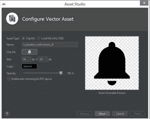
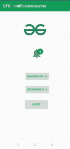

# 如何在安卓系统中实现通知计数器？

> 原文:[https://www . geesforgeks . org/如何实施-通知-安卓中的计数器/](https://www.geeksforgeeks.org/how-to-implement-notification-counter-in-android/)

**通知计数器**基本上是统计你通过应用程序得到的通知，并显示在你的应用程序图标顶部，这样你就可以知道你得到了新消息或任何新的更新，而无需打开你的应用程序或像 Instagram 中的消息按钮这样的特定功能。通知计数器是当今几乎所有安卓应用程序都提供的功能，例如脸书、Whatsapp、Instagram、YouTube、Gmail 这些是我们在日常生活中使用的一些社交应用程序，那么通知计数器功能到底有什么作用呢？

**用于各种用途，如:**

1.  告诉用户您收到了新消息
2.  告诉他们有多少未读消息
3.  要通知用户上传了新功能或内容，例如当您订阅的频道在 Youtube 上上传视频时，您的 Youtube 通知计数会增加。

### **本文我们要构建什么？**

在本文中，我们将构建一个简单的应用程序，借助两个按钮递增和递减来计算通知的数量。每当用户点击递增按钮时，通知计数增加，每当用户点击递减按钮时，通知计数与这两个按钮一起减少，我们还将实现或使用第三个按钮，即直接将通知计数设置为零的重置按钮。下面给出了一个 GIF 示例，来了解一下我们将在本文中做什么。注意，我们将使用 **Java** 语言来实现这个项目。

<video class="wp-video-shortcode" id="video-672749-1" width="640" height="360" preload="metadata" controls=""><source type="video/mp4" src="https://media.geeksforgeeks.org/wp-content/uploads/20210902002618/WhatsApp-Video-2021-09-02-at-12.20.12-AM.mp4?_=1">[https://media.geeksforgeeks.org/wp-content/uploads/20210902002618/WhatsApp-Video-2021-09-02-at-12.20.12-AM.mp4](https://media.geeksforgeeks.org/wp-content/uploads/20210902002618/WhatsApp-Video-2021-09-02-at-12.20.12-AM.mp4)</video>

### **分步实施**

**第一步:创建新项目**

要在安卓工作室创建新项目，请参考[如何在安卓工作室创建/启动新项目](https://www.geeksforgeeks.org/android-how-to-create-start-a-new-project-in-android-studio/)。注意选择 **Java** 作为编程语言。

**步骤 2:** 按照以下步骤为通知铃声创建一个新的 Vector 资产。右键单击可绘制的>新建>矢量资产>搜索通知图标并选择>完成。我们将使用这个图标在上面显示我们的通知计数。现在，我们在这个步骤中使用的向量资产到底是什么。

**Vector Asset:** Vector Asset 是一款 Android Studio 工具，可以添加素材图标，将可缩放矢量图形(SVG)和 Adobe Photoshop Document (PSD)文件作为矢量可绘制资源导入到项目中。

> **注意:**您也可以通过从设备存储中选择自定义通知铃声图标来使用它，但这里我们默认使用安卓工作室提供的通知图标。

**参考图像:**



**图=矢量资产**

## 可扩展标记语言

```
<vector xmlns:android="http://schemas.android.com/apk/res/android"
    android:width="24dp" <!--width of the bell icon -->
    android:height="24dp" <!-- height of the bell icon -->
    android:viewportWidth="24"  <!-- Used to define the width of the viewport space. -->
    android:viewportHeight="24" <!-- Used to define the height of the viewport space. -->
    android:tint="?attr/colorControlNormal">
  <path
      android:fillColor="@android:color/white"
      android:pathData="M12,22c1.1,0 2,-0.9 2,-2h-4c0,1.1 0.89,2 2,2zM18,16v-5c0,-3.07 -1.64,-5.64 -4.5,-6.32L13.5,4c0,-0.83 -0.67,-1.5 -1.5,-1.5s-1.5,0.67 -1.5,1.5v0.68C7.63,5.36 6,7.92 6,11v5l-2,2v1h16v-1l-2,-2z"/>
</vector>
```

**步骤 3:使用 activity_main.xml 文件**

在这一步中，我们将在我们在步骤 2 中创建的矢量资产的帮助下，在 **activity_main.xml** 文件中设计名为增量、减量和重置的三个按钮以及我们的通知铃声，为了显示通知计数，我们将使用一个文本视图，并将该文本视图设置在我们正在使用图像视图实现的铃声图标的顶部，我们还使用一个[图像视图](https://www.geeksforgeeks.org/imageview-in-android-with-example/)来显示 gfg 徽标的图像。

导航到 **app > res >布局> activity_main.xml** 并将下面的代码添加到该文件中。下面是**activity _ main . XML**文件的代码。

## 可扩展标记语言

```
<?xml version="1.0" encoding="utf-8"?>
<androidx.constraintlayout.widget.ConstraintLayout
    xmlns:android="http://schemas.android.com/apk/res/android"
    xmlns:app="http://schemas.android.com/apk/res-auto"
    xmlns:tools="http://schemas.android.com/tools"
    android:layout_width="match_parent"
    android:layout_height="match_parent"
    tools:context=".MainActivity">

    <Button
        android:id="@+id/decrement"
        android:layout_width="wrap_content"
        android:layout_height="wrap_content"
        android:layout_marginStart="168dp"
        android:layout_marginTop="30dp"
        android:layout_marginEnd="155dp"
        android:text="DECREMENT( - )"
        android:textColor="#0F9D58"
        app:layout_constraintBottom_toTopOf="@+id/reset"
        app:layout_constraintEnd_toEndOf="parent"
        app:layout_constraintHorizontal_bias="0.45"
        app:layout_constraintStart_toStartOf="parent"
        app:layout_constraintTop_toBottomOf="@+id/increment"
        app:layout_constraintVertical_bias="0.0" />

    <Button
        android:id="@+id/increment"
        android:layout_width="wrap_content"
        android:layout_height="wrap_content"
        android:layout_marginStart="168dp"
        android:layout_marginTop="64dp"
        android:layout_marginEnd="155dp"
        android:text="INCREMENT( + )"
        android:textColor="#0F9D58"
        app:layout_constraintEnd_toEndOf="parent"
        app:layout_constraintHorizontal_bias="0.45"
        app:layout_constraintStart_toStartOf="parent"
        app:layout_constraintTop_toBottomOf="@+id/imageView" />

    <Button
        android:id="@+id/reset"
        android:layout_width="125dp"
        android:layout_height="55dp"
        android:layout_marginStart="168dp"
        android:layout_marginTop="25dp"
        android:layout_marginEnd="155dp"
        android:layout_marginBottom="168dp"
        android:text="RESET"
        android:textColor="#0F9D58"
        app:layout_constraintBottom_toBottomOf="parent"
        app:layout_constraintEnd_toEndOf="parent"
        app:layout_constraintHorizontal_bias="0.486"
        app:layout_constraintStart_toStartOf="parent"
        app:layout_constraintTop_toBottomOf="@+id/decrement" />

    <ImageView
        android:id="@+id/imageView"
        android:layout_width="91dp"
        android:layout_height="57dp"
        android:layout_marginTop="188dp"
        app:layout_constraintEnd_toEndOf="parent"
        app:layout_constraintHorizontal_bias="0.531"
        app:layout_constraintStart_toStartOf="parent"
        app:layout_constraintTop_toTopOf="parent"
        app:srcCompat="@drawable/notificationbell" />

    <TextView
        android:id="@+id/textView"
        android:layout_width="30dp"
        android:layout_height="30dp"
        android:layout_marginBottom="24dp"
        android:background="@drawable/custombutton1"
        android:paddingTop="5sp"
        android:text="0"
        android:textAlignment="center"
        android:textColor="@color/white"
        android:textStyle="bold"
        app:layout_constraintBottom_toBottomOf="@+id/imageView"
        app:layout_constraintEnd_toEndOf="@+id/imageView"
        app:layout_constraintHorizontal_bias="0.803"
        app:layout_constraintStart_toStartOf="@+id/imageView" />

    <ImageView
        android:id="@+id/imageView2"
        android:layout_width="136dp"
        android:layout_height="125dp"
        app:layout_constraintBottom_toTopOf="@+id/imageView"
        app:layout_constraintEnd_toEndOf="parent"
        app:layout_constraintStart_toStartOf="parent"
        app:layout_constraintTop_toTopOf="parent"
        app:srcCompat="@drawable/gfg" />

</androidx.constraintlayout.widget.ConstraintLayout>
```

**第四步:**

在这一步中，我们将实现我们的方法来执行像递增、递减、重置这样的操作。为此，通过执行以下步骤创建一个新的 java 类。右键单击项目名称>新建>类>完成。下面是**N**T3**otificationcount.java**T6】文件的代码。

## Java 语言(一种计算机语言，尤用于创建网站)

```
import android.util.Log;
import android.view.View;
import android.widget.TextView;

public class notificationcount { 

    private TextView notificationNumber;

    // maximum count limit
    private final int MAX_NUMBER = 99;

    // minimum count limit
    private final int MIN_NUMBER = 0;

    // initial count
    private int notification_number_counter = 0;

    public notificationcount(View view) {
        // finding textview through id textview
        // in notification number variable
        notificationNumber = view.findViewById(R.id.textView);
    }

    // increment method
    public void increment() {

        // checking condition if notification_counter-number
        // is greater than max number or not
        if (notification_number_counter > MAX_NUMBER) {
            // printing message maximum number reached
            Log.d("Counter", "Maximum number reached");
        } else {
            // if condition fails then increment the count by 1
            notification_number_counter++;
            // returning increased value
            notificationNumber.setText(String.valueOf(notification_number_counter));
        }
    }

    // decrement method
    public void decrement() {

        // checking condition if notification_number_count
        // is less than min number or not
        if (notification_number_counter <= MIN_NUMBER) {
            // if true then message minimum number reached
            Log.d("Counter", "Minimum number reached");
        } else {
            // decrease if condition fails
            notification_number_counter--;
            // returning decrease count
            notificationNumber.setText(String.valueOf(notification_number_counter));
        }
    }

    // rest method
    public void reset() {
        // checking if notification_number_count
        // is already zero or not
        if (notification_number_counter == 0) {
            // if true message already zero
            Log.d("alert", " notification count is already 0 ");
        } else {
            // else setting count to zero
            notification_number_counter = 0;
            // returning updated value
            notificationNumber.setText(String.valueOf(notification_number_counter));
        }
    }

}
```

**第五步:** **使用****MainActivity.java 文件**

在最后一步中，我们将在我们的**MainActivity.java**文件中为我们的三个按钮实现 onclick 侦听器，这三个按钮分别名为递增、递减、重置，并调用我们在上一步中创建的函数递增、递减、重置。乙伊洛是**MainActivity.java**文件的代号。代码中添加了注释，以更详细地理解代码。

## Java 语言(一种计算机语言，尤用于创建网站)

```
import android.os.Bundle;
import android.view.View;
import android.widget.Button;
import android.widget.TextView;

import androidx.appcompat.app.AppCompatActivity;

public class MainActivity extends AppCompatActivity {

    // initializing 3 button variables b1,b2,b3
    Button b1, b2, b3;
    // initializing textview variable number
    TextView number;
    // object of Notificationcount class
    notificationcount notificationcount; 

    @Override
    protected void onCreate(Bundle savedInstanceState) {
        super.onCreate(savedInstanceState);
        setContentView(R.layout.activity_main);
        // finding increment button through id in b1
        b1 = findViewById(R.id.increment);
        // finding decrement button through id in b2
        b2 = findViewById(R.id.decrement);
        // finding reset button through id in b3
        b3 = findViewById(R.id.reset);

        // creating new object of notificationcount class
        notificationcount = new notificationcount(findViewById(R.id.textView));

        // increment button
        b1.setOnClickListener(new View.OnClickListener() {
            @Override
            public void onClick(View v) {
                // calling increment method
                notificationcount.increment();
            }
        });

        // decrement button
        b2.setOnClickListener(new View.OnClickListener() {
            @Override
            public void onClick(View v) {
                // calling decrement button
                notificationcount.decrement();
            }
        });

        // reset button
        b3.setOnClickListener(new View.OnClickListener() {
            @Override
            public void onClick(View v) {
                // calling reset button
                notificationcount.reset();
            }
        });

    }
}
```

**输出:**



**图=通知计数器**

**输出视频:**

<video class="wp-video-shortcode" id="video-672749-2" width="640" height="360" preload="metadata" controls=""><source type="video/mp4" src="https://media.geeksforgeeks.org/wp-content/uploads/20210902002618/WhatsApp-Video-2021-09-02-at-12.20.12-AM.mp4?_=2">[https://media.geeksforgeeks.org/wp-content/uploads/20210902002618/WhatsApp-Video-2021-09-02-at-12.20.12-AM.mp4](https://media.geeksforgeeks.org/wp-content/uploads/20210902002618/WhatsApp-Video-2021-09-02-at-12.20.12-AM.mp4)</video>

**项目链接:** [点击此处](https://media.geeksforgeeks.org/wp-content/cdn-uploads/20210902235158/notificationcounter-master.zip)