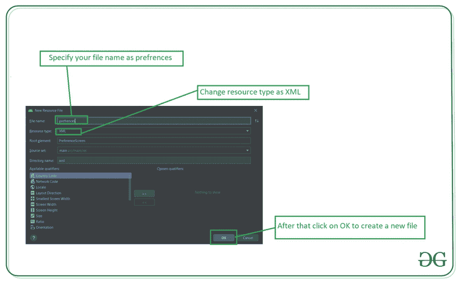

# 如何在安卓中实现偏好设置屏幕？

> 原文:[https://www . geesforgeks . org/how-implementation-preferences-settings-in-screen-in-Android/](https://www.geeksforgeeks.org/how-to-implement-preferences-settings-screen-in-android/)

在许多应用程序中，我们看到了大多数应用程序中最常见的设置屏幕。该设置屏幕用于管理用户的偏好。为了创建这个设置屏幕，android 提供了一个功能来创建一个设置首选项屏幕。在本文中，我们将了解如何在安卓系统中实现首选项设置屏幕。

### 我们将在本文中构建什么？

我们将建立一个简单的应用程序，其中我们将显示一个简单的按钮，点击该按钮，我们将打开一个设置屏幕，我们将使用设置首选项创建。该设置屏幕看起来将类似于我们在“常规”选项的 YouTube 设置中看到的内容。下面给出了一个示例视频，让我们了解一下在本文中要做什么。请注意，我们将使用 **Java** 语言来实现这个项目。

<video class="wp-video-shortcode" id="video-557866-1" width="640" height="360" preload="metadata" controls=""><source type="video/mp4" src="https://media.geeksforgeeks.org/wp-content/uploads/20210212001954/Screenrecorder-2021-02-12-00-17-46-433.mp4?_=1">[https://media.geeksforgeeks.org/wp-content/uploads/20210212001954/Screenrecorder-2021-02-12-00-17-46-433.mp4](https://media.geeksforgeeks.org/wp-content/uploads/20210212001954/Screenrecorder-2021-02-12-00-17-46-433.mp4)</video>

### **分步实施**

**第一步:创建新项目**

要在安卓工作室创建新项目，请参考[如何在安卓工作室创建/启动新项目](https://www.geeksforgeeks.org/android-how-to-create-start-a-new-project-in-android-studio/)。注意选择 **Java** 作为编程语言。

**步骤 2:使用 activity_main.xml 文件**

导航到**应用程序> res >布局> activity_main.xml** 并将下面的代码添加到该文件中。下面是 **activity_main.xml** 文件的代码。

## 可扩展标记语言

```java
<?xml version="1.0" encoding="utf-8"?>
<RelativeLayout
    xmlns:android="http://schemas.android.com/apk/res/android"
    xmlns:tools="http://schemas.android.com/tools"
    android:layout_width="match_parent"
    android:layout_height="match_parent"
    tools:context=".MainActivity">

    <!--button for opening settings activity-->
    <Button
        android:id="@+id/idBtnSettings"
        android:layout_width="wrap_content"
        android:layout_height="wrap_content"
        android:layout_centerInParent="true"
        android:text="Settings"
        android:textAllCaps="false" />

</RelativeLayout>
```

**步骤 3:创建一个新的活动来显示设置屏幕**

导航到**应用程序> java >您的应用程序的包名>右键单击它>新建>活动**，选择空活动并将其命名为**设置活动**。

**步骤 4:使用 MainActivity.java 文件**

转到**MainActivity.java**文件，参考以下代码。以下是**MainActivity.java**文件的代码。代码中添加了注释，以更详细地理解代码。

## Java 语言(一种计算机语言，尤用于创建网站)

```java
import android.content.Intent;
import android.os.Bundle;
import android.view.View;
import android.widget.Button;

import androidx.appcompat.app.AppCompatActivity;

public class MainActivity extends AppCompatActivity {

    // creating a variable for our button.
    private Button settingsBtn;

    @Override
    protected void onCreate(Bundle savedInstanceState) {
        super.onCreate(savedInstanceState);
        setContentView(R.layout.activity_main);

        // initializing our button.
        settingsBtn = findViewById(R.id.idBtnSettings);

        // adding on click listener for our button.
        settingsBtn.setOnClickListener(new View.OnClickListener() {
            @Override
            public void onClick(View v) {
                // opening a new intent to open settings activity.
                Intent i = new Intent(MainActivity.this, SettingsActivity.class);
                startActivity(i);
            }
        });
    }
}
```

**第五步:创建一个偏好文件来显示我们的设置**

导航到**应用程序> res >右键单击它>新建>安卓资源文件**，您将看到下面的屏幕。



**第六步:在 strings.xml 文件**中添加以下代码

导航到**应用程序>RES>values>strings . XML**文件，并向其中添加以下代码。

## 可扩展标记语言

```java
<resources>
    <string name="app_name">GFG App</string>
    <string name="remind_to_take_a_break">Remind me to take a break</string>
    <string name="key_upload_quality">key_upload_quality</string>
    <string name="remind_me">Remind me to take a break</string>
    <string name="remind_me_for_bed_time">remind_me_for_bed_time</string>
    <string name="remind_for_bed_time">Remind me for bed time</string>
    <string name="limit_data_usage">prefs_limit_data_usage</string>
    <string name="stream_video">Only stream HD video on Wi-Fi</string>
    <string name="limit_mobile_usage">Limit mobile data usage</string>
    <string name="double_tap_to_seek">Double-tap to seek</string>
    <string name="pref_seek_val">pref_seek_val</string>
    <string name="seconds">seconds</string>
    <string name="uploads">Uploads</string>
    <string name="pref_uploads">pref_uploads</string>
    <string name="specify_network_prefs">Specify network preferences for uploads</string>
    <string name="prefs_restricted_mode">prefs_restricted_mode</string>
    <string name="restricated_mode">Restricted Mode can help to hide videos with potentially mature content.No filter is 100% accurate, but it should help you to avoid most of this type of content.</string>
    <string name="restricated_mode_description">Restricted Mode</string>
    <string name="prefs_enable_stats">prefs_enable_stats</string>
    <string name="enable_stats">Enable stats for nerds</string>

    <string-array name="pref_upload_quality_entries">
        <item>360p</item>
        <item>480p</item>
        <item>720p</item>
        <item>1080p</item>
        <item>Original</item>
    </string-array>

    <string-array name="pref_remind_me_to_take_a_break">
        <item>1 hours</item>
        <item>2 hours</item>
        <item>3 hours</item>
        <item>5 hours</item>
        <item>10 hours</item>
    </string-array>

    <string-array name="pref_seek_values">
        <item>5</item>
        <item>10</item>
        <item>15</item>
        <item>20</item>
        <item>30</item>
    </string-array>

    <string-array name="pref_duration">
        <item>0</item>
        <item>1</item>
        <item>2</item>
        <item>3</item>
        <item>4</item>
    </string-array>

    <string-array name="pref_uploads">
        <item>Only when on Wi-Fi</item>
        <item>On any network</item>
    </string-array>

</resources>
```

**第 7 步:使用 preferences.xml 文件**

在首选项中，有不同类型的首选项，如下所示:

*   **EditTextPreference** :用于从用户获取文本。
*   **列表首选项**:该选项用于显示一个对话框，其中包含可供选择的选项列表。
*   **复选框首选项**:该选项用于显示一个复选框来切换设置。
*   **开关首选项**:此选项用于打开和关闭开关。
*   **铃声首选项**:此选项用于打开设备的铃声页面。
*   带有意图操作的首选项安卓.意图.操作.视图–打开一个外部浏览器，导航到一个网址。

导航到**应用程序>RES>XML>preferences . XML**文件，并在其中添加以下代码。代码中添加了注释，以便更详细地了解。

## 可扩展标记语言

```java
<?xml version="1.0" encoding="utf-8"?>
<PreferenceScreen
    xmlns:android="http://schemas.android.com/apk/res/android">

    <!--below line is to create preference category-->
    <PreferenceCategory android:title="General">

        <!--in below line we are creating a list preference
            and we are adding default selected value in list for 3 rd index-->
        <!--dialog title is to set title for our dialog box
            entries is used to add list of data which we
            are adding from our strings file
            entry values is to add values to our entries.
            key is use to add key to our list preferences
            summary is use to add description to our option
            title is use to add title to our list preferences.-->
        <!--this list preference is for remind me option-->
        <ListPreference
            android:defaultValue="3"
            android:dialogTitle="@string/remind_to_take_a_break"
            android:entries="@array/pref_remind_me_to_take_a_break"
            android:entryValues="@array/pref_duration"
            android:key="@string/key_upload_quality"
            android:summary="@string/remind_me"
            android:title="@string/remind_me" />

        <!--on below line we are creating a switch preference
            default value is use to set switch on or off
            key is use to set key
            title is use to add title to our switch-->
        <!--this switch preference option is to remind for a bed time-->
        <SwitchPreference
            android:defaultValue="false"
            android:key="@string/remind_me_for_bed_time"
            android:title="@string/remind_for_bed_time" />

        <!--below switch preference is
            use for mobile data usage-->
        <SwitchPreference
            android:defaultValue="false"
            android:key="@string/limit_data_usage"
            android:summary="@string/stream_video"
            android:title="@string/limit_mobile_usage" />

        <!--below list preference is use for
            double tap to seek option-->
        <ListPreference
            android:defaultValue="1"
            android:dialogTitle="@string/double_tap_to_seek"
            android:entries="@array/pref_seek_values"
            android:entryValues="@array/pref_duration"
            android:key="@string/pref_seek_val"
            android:summary="@string/seconds"
            android:title="@string/double_tap_to_seek" />

        <!--below option is use to create a list
            preference for Upload preferences-->
        <ListPreference
            android:defaultValue="1"
            android:dialogTitle="@string/uploads"
            android:entries="@array/pref_uploads"
            android:entryValues="@array/pref_duration"
            android:key="@string/pref_uploads"
            android:summary="@string/specify_network_prefs"
            android:title="Uploads" />

        <!--below switch preferences is use to restrict mode-->
        <SwitchPreference
            android:defaultValue="false"
            android:key="@string/prefs_restricted_mode"
            android:summary="@string/restricated_mode"
            android:title="@string/restricated_mode_description" />

        <!--below switch pref is use for enable stats option-->
        <SwitchPreference
            android:defaultValue="false"
            android:key="@string/prefs_enable_stats"
            android:title="@string/enable_stats" />

    </PreferenceCategory>

</PreferenceScreen>
```

**第 8 步:现在创建一个新的 java 类来显示我们的偏好片段**

导航到**应用> java >你的应用的包名>右键点击它>新建> Java 类**并将其命名为**设置片段**并添加下面的代码。代码中添加了注释，以便更详细地了解。

## Java 语言(一种计算机语言，尤用于创建网站)

```java
import android.os.Bundle;
import android.preference.PreferenceFragment;

import androidx.annotation.Nullable;

public class SettingsFragment extends PreferenceFragment {

    @Override
    public void onCreate(@Nullable Bundle savedInstanceState) {
        super.onCreate(savedInstanceState);

        // below line is used to add preference
        // fragment from our xml folder.
        addPreferencesFromResource(R.xml.preferences);
    }
}
```

**第九步:使用 activity_settings.xml 文件**

导航到 **activity_settings.xml** 文件，并在其中添加以下代码。代码中添加了注释，以便更详细地了解。

## 可扩展标记语言

```java
<?xml version="1.0" encoding="utf-8"?>
<androidx.constraintlayout.widget.ConstraintLayout
    xmlns:android="http://schemas.android.com/apk/res/android"
    xmlns:tools="http://schemas.android.com/tools"
    android:layout_width="match_parent"
    android:layout_height="match_parent"
    tools:context=".SettingsActivity">

    <!--frame layout for displaying
        our preference fragment-->
    <FrameLayout
        android:id="@+id/idFrameLayout"
        android:layout_width="match_parent"
        android:layout_height="match_parent" />

</androidx.constraintlayout.widget.ConstraintLayout>
```

**第十步:使用 SettingsActivity.java 文件**

导航到**应用程序> java >你的应用程序的包名>SettingsActivity.java**文件，并添加下面的代码。代码中添加了注释，以便更详细地了解。

## Java 语言(一种计算机语言，尤用于创建网站)

```java
import android.os.Bundle;

import androidx.appcompat.app.AppCompatActivity;

public class SettingsActivity extends AppCompatActivity {

    @Override
    protected void onCreate(Bundle savedInstanceState) {
        super.onCreate(savedInstanceState);
        setContentView(R.layout.activity_settings);

        // below line is to change
        // the title of our action bar.
        getSupportActionBar().setTitle("Settings");

        // below line is used to check if
        // frame layout is empty or not.
        if (findViewById(R.id.idFrameLayout) != null) {
            if (savedInstanceState != null) {
                return;
            }
            // below line is to inflate our fragment.
            getFragmentManager().beginTransaction().add(R.id.idFrameLayout, new SettingsFragment()).commit();
        }
    }
}
```

现在运行您的应用程序，并查看应用程序的输出。

### **输出:**

<video class="wp-video-shortcode" id="video-557866-2" width="640" height="360" preload="metadata" controls=""><source type="video/mp4" src="https://media.geeksforgeeks.org/wp-content/uploads/20210212001954/Screenrecorder-2021-02-12-00-17-46-433.mp4?_=2">[https://media.geeksforgeeks.org/wp-content/uploads/20210212001954/Screenrecorder-2021-02-12-00-17-46-433.mp4](https://media.geeksforgeeks.org/wp-content/uploads/20210212001954/Screenrecorder-2021-02-12-00-17-46-433.mp4)</video>