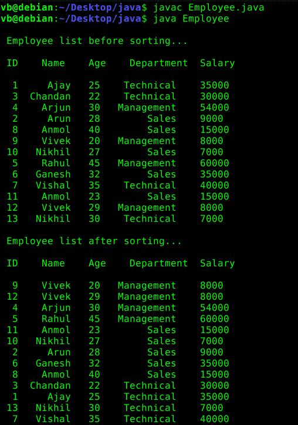

# 如何在 Java 中实现 SQL GROUP BY？

> 原文:[https://www . geesforgeks . org/如何在 java 中逐个组地实现 SQL/](https://www.geeksforgeeks.org/how-to-implement-sql-group-by-in-java/)

**先决条件: [Java 集合](https://www.geeksforgeeks.org/collections-in-java-2/)、 [Java 数组列表](https://www.geeksforgeeks.org/arraylist-in-java/)、[Java 中的比较器接口](https://www.geeksforgeeks.org/comparator-interface-java/)**

给定一个包含多条记录的列表对象，我们的任务是在 Java 中对列表的字段执行 [SQL group by](https://www.geeksforgeeks.org/sql-group-by/) 。

```
Input: A list containing employee records
       in random order. 
Output: List sorted first by department
        and then by age in each department

```

**进场:**

*   对部门和年龄分别使用[比较器](https://www.geeksforgeeks.org/comparator-interface-java/)对列表进行排序。
*   然后我们首先使用 [collections.sort()](https://www.geeksforgeeks.org/collections-sort-java-examples/) 方法进行排序。
*   我们将使用比较器界面的 ***【比较()*** 方法对列表进行排序。使用这种方法非常简单，可以用来链接多个比较器，从而使过程更容易。

下面是上述方法的实现:

**程序:**

```
// Java code to implement SQL GROUP BY

import java.util.*;

// Create the employee class
class Employee {

    int empid;
    String name;
    int age;
    String dept;
    int salary;

    public Employee(int empid, String name, int age,
                    String dept, int sal)
    {
        this.name = name;
        this.empid = empid;
        this.age = age;
        this.dept = dept;
        this.salary = sal;
    }

    public String getDept()
    {
        return this.dept;
    }

    public static void main(String[] args)
    {

        // create the employee list
        List<Employee> empData
            = new ArrayList<Employee>();

        // add values to list by
        // using the add() method
        // of the list interface
        empData.add(new Employee(1, "Ajay",
                                 25, "Technical", 35000));
        empData.add(new Employee(3, "Chandan",
                                 22, "Technical", 30000));
        empData.add(new Employee(4, "Arjun",
                                 30, "Management", 54000));
        empData.add(new Employee(2, "Arun",
                                 28, "Sales", 9000));
        empData.add(new Employee(8, "Anmol",
                                 40, "Sales", 15000));
        empData.add(new Employee(9, "Vivek",
                                 20, "Management", 8000));
        empData.add(new Employee(10, "Nikhil",
                                 27, "Sales", 7000));
        empData.add(new Employee(5, "Rahul",
                                 45, "Management", 60000));
        empData.add(new Employee(6, "Ganesh",
                                 32, "Sales", 35000));
        empData.add(new Employee(7, "Vishal",
                                 35, "Technical", 40000));
        empData.add(new Employee(11, "Anmol",
                                 23, "Sales", 15000));
        empData.add(new Employee(12, "Vivek",
                                 29, "Management", 8000));
        empData.add(new Employee(13, "Nikhil",
                                 30, "Technical", 7000));

        System.out.println("\n Employee list"
                           + " before sorting...\n");
        System.out.println(" ID    Name    Age"
                           + "    Department  Salary  \n");

        for (Employee e : empData) {
            System.out.format(" %2d  %7s   %d   %10s    %d \n",
                              e.empid, e.name, e.age, e.dept, e.salary);
        }

        // Sorting the list by department
        // and age by using the thenComparing() method
        Collections.sort(empData,
                         new DepartmentComparator()
                             .thenComparing(new AgeComparator()));

        System.out.println("\n Employee list after sorting...\n");
        System.out.println(" ID    Name    Age    Department  Salary  \n");
        for (Employee emp : empData) {
            System.out.format(" %2d  %7s   %d   %10s    %d \n",
                              emp.empid, emp.name, emp.age,
                              emp.dept, emp.salary);
        }
    }
}

class DepartmentComparator implements Comparator<Employee> {

    public int compare(Employee e1, Employee e2)
    {
        return e1.dept.compareTo(e2.dept);
    }
}

class AgeComparator implements Comparator<Employee> {

    public int compare(Employee e1, Employee e2)
    {

        if (e1.age == e2.age)
            return 0;
        else if (e1.age > e2.age)
            return 1;
        else
            return -1;
    }
}
```

**Output:**

```
Employee list before sorting...

 ID    Name    Age    Department  Salary  

  1     Ajay   25    Technical    35000 
  3  Chandan   22    Technical    30000 
  4    Arjun   30   Management    54000 
  2     Arun   28        Sales    9000 
  8    Anmol   40        Sales    15000 
  9    Vivek   20   Management    8000 
 10   Nikhil   27        Sales    7000 
  5    Rahul   45   Management    60000 
  6   Ganesh   32        Sales    35000 
  7   Vishal   35    Technical    40000 
 11    Anmol   23        Sales    15000 
 12    Vivek   29   Management    8000 
 13   Nikhil   30    Technical    7000 

 Employee list after sorting...

 ID    Name    Age    Department  Salary  

  9    Vivek   20   Management    8000 
 12    Vivek   29   Management    8000 
  4    Arjun   30   Management    54000 
  5    Rahul   45   Management    60000 
 11    Anmol   23        Sales    15000 
 10   Nikhil   27        Sales    7000 
  2     Arun   28        Sales    9000 
  6   Ganesh   32        Sales    35000 
  8    Anmol   40        Sales    15000 
  3  Chandan   22    Technical    30000 
  1     Ajay   25    Technical    35000 
 13   Nikhil   30    Technical    7000 
  7   Vishal   35    Technical    40000

```

**注:**在上述输出中，列表按部门分组，部门进一步按员工年龄排序。

[](https://media.geeksforgeeks.org/wp-content/uploads/20190623232047/groupby-sort-java-list.png)