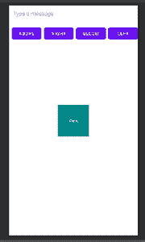

# 如何在安卓工作室实现工具提示？

> 原文:[https://www . geesforgeks . org/如何实现-安卓工具提示-studio/](https://www.geeksforgeeks.org/how-to-implement-tooltip-in-android-studio/)

工具提示是当光标位于图标、图像、超链接或任何其他图形用户界面组件上时出现的消息。在这个应用程序中，我们将使用编辑文本从用户那里获取消息，然后将该消息显示为视图上的工具提示。这是我们将要构建的应用程序的示例视频。注意我们要用 **Java** 语言实现这个项目。

<video class="wp-video-shortcode" id="video-727695-1" width="640" height="360" preload="metadata" controls=""><source type="video/mp4" src="https://media.geeksforgeeks.org/wp-content/uploads/20211205165637/WhatsApp-Video-2021-12-05-at-16.32.40.mp4?_=1">[https://media.geeksforgeeks.org/wp-content/uploads/20211205165637/WhatsApp-Video-2021-12-05-at-16.32.40.mp4](https://media.geeksforgeeks.org/wp-content/uploads/20211205165637/WhatsApp-Video-2021-12-05-at-16.32.40.mp4)</video>

### 逐步实施

**第一步:创建新项目**

*   打开一个新项目。
*   我们将使用 Java 语言来处理空活动。保持所有其他选项不变。
*   您可以在方便的时候更改项目的名称。
*   将有两个名为 activity_main.xml 和 MainActivity.java 的默认文件。

如果你不知道如何在安卓工作室创建新项目，那么你可以参考[如何在安卓工作室创建/启动新项目？](https://www.geeksforgeeks.org/android-how-to-create-start-a-new-project-in-android-studio/)

**第 2 步:导航到构建脚本- > build.gradle(模块)文件，并向其中添加以下依赖项**

```java
implementation 'com.tomergoldst.android:tooltips:1.0.10'
```

单击立即同步保存更改。

**步骤 3:使用 activity_main.xml 文件**

导航到**应用程序> res >布局> activity_main.xml** 并将下面的代码添加到该文件中。下面是 **activity_main.xml** 文件的代码。

## 可扩展标记语言

```java
<?xml version="1.0" encoding="utf-8"?>

<!-- Relative layout as parent layout-->
<RelativeLayout
    xmlns:android="http://schemas.android.com/apk/res/android"
    xmlns:app="http://schemas.android.com/apk/res-auto"
    xmlns:tools="http://schemas.android.com/tools"
    android:layout_width="match_parent"
    android:id="@+id/relative_layout"
    android:layout_height="match_parent"
    tools:context=".MainActivity">

   <!-- Edit text to take message from user-->
   <EditText
       android:layout_width="match_parent"
       android:layout_height="wrap_content"
       android:id="@+id/et_message"
       android:hint="Type a message"
       android:padding="12dp"
       android:background="@android:drawable/editbox_background"
       />

    <!-- Linear layout to hold buttons-->
    <LinearLayout
        android:layout_width="match_parent"
        android:layout_height="wrap_content"
        android:id="@+id/linear_layout"
        android:orientation="horizontal"
        android:layout_marginTop="16dp"
        android:layout_below="@id/et_message"
        >

        <!-- Button for above tooltip-->
        <Button
            android:layout_width="0dp"
            android:layout_height="wrap_content"
            android:layout_weight="1"
            android:id="@+id/bt_above"
            android:text="Above"
            android:layout_marginStart="8dp"
            />
          <!-- Button for right tooltip-->
        <Button
            android:layout_width="0dp"
            android:layout_height="wrap_content"
            android:layout_weight="1"
            android:id="@+id/bt_right"
            android:text="Right"
            android:layout_marginStart="8dp"
            />
          <!-- Button for Below tooltip-->
        <Button
            android:layout_width="0dp"
            android:layout_height="wrap_content"
            android:layout_weight="1"
            android:id="@+id/bt_below"
            android:text="Below"
            android:layout_marginStart="8dp"
            />

          <!-- Button for left tooltip-->
        <Button
            android:layout_width="0dp"
            android:layout_height="wrap_content"
            android:layout_weight="1"
            android:id="@+id/bt_left"
            android:text="Left"
            android:layout_marginStart="8dp"
            />

    </LinearLayout>

      <!-- View over which tooltip will be displayed-->
    <TextView
        android:layout_width="100dp"
        android:layout_height="100dp"
        android:id="@+id/text_view"
        android:text="View"
        android:textColor="@color/white"
        android:gravity="center"
        android:layout_centerInParent="true"
        android:background="@color/teal_700"
        />
</RelativeLayout>
```

执行上述代码后，activity_main.xml 文件的设计如下所示。



**第四步:使用 MainActivity.java 文件**

转到**MainActivity.java**文件，参考以下代码。以下是**MainActivity.java**文件的代码。代码中添加了注释，以更详细地理解代码。

## Java 语言(一种计算机语言，尤用于创建网站)

```java
package com.example.tooltip;

import androidx.appcompat.app.AppCompatActivity;

import android.graphics.Color;
import android.os.Bundle;
import android.view.View;
import android.widget.Button;
import android.widget.EditText;
import android.widget.RelativeLayout;
import android.widget.TextView;
import android.widget.Toast;

import com.tomergoldst.tooltips.ToolTip;
import com.tomergoldst.tooltips.ToolTipsManager;

public class MainActivity extends AppCompatActivity implements ToolTipsManager.TipListener, View.OnClickListener {

    // Initialize variable
    RelativeLayout relativeLayout;
    EditText etMessage;
    Button btAbove,btRight,btLeft,btBelow;
    TextView textView;
    ToolTipsManager toolTipsManager;
    @Override
    protected void onCreate(Bundle savedInstanceState) {
        super.onCreate(savedInstanceState);
        setContentView(R.layout.activity_main);

        // assign variable
        relativeLayout=findViewById(R.id.relative_layout);
        etMessage=findViewById(R.id.et_message);
        btAbove=findViewById(R.id.bt_above);
        btBelow=findViewById(R.id.bt_below);
        btLeft=findViewById(R.id.bt_left);
        btRight=findViewById(R.id.bt_right);
        textView=findViewById(R.id.text_view);

        // Initialize tooltip manager
        toolTipsManager=new ToolTipsManager(this);

        btRight.setOnClickListener(this);
        btLeft.setOnClickListener(this);
        btAbove.setOnClickListener(this);
        btBelow.setOnClickListener(this);

        textView.setOnClickListener(new View.OnClickListener() {
            @Override
            public void onClick(View v) {
                // Dismiss tooltip
                toolTipsManager.dismissAll();
            }
        });
    }

    @Override
    public void onTipDismissed(View view, int anchorViewId, boolean byUser) {
        // check condition
        if(byUser)
        {
            // when user dissmiss the tooltip
            // display toast
            Toast.makeText(getApplicationContext(), "Dismissed", Toast.LENGTH_SHORT).show();
        }
    }

    @Override
    public void onClick(View v) {
        // check condition
        switch(v.getId())
        {
            case R.id.bt_above:
                // when above button clicked
                // define position
                int position= ToolTip.POSITION_ABOVE;
                // define alignment
                int align=ToolTip.ALIGN_RIGHT;
                // create method
                displayToolTip(position,align);
                break;

            case R.id.bt_right:
                // when right button is clicked
                displayToolTip(ToolTip.POSITION_RIGHT_TO,ToolTip.ALIGN_CENTER);
                break;

            case R.id.bt_below:
                // when below button clicked
                displayToolTip(ToolTip.POSITION_BELOW,ToolTip.ALIGN_LEFT);
                break;

            case R.id.bt_left:
                // when left button is clicked
                displayToolTip(ToolTip.POSITION_LEFT_TO,ToolTip.ALIGN_CENTER);
                break;
        }
    }

    private void displayToolTip(int position, int align) {
        // get message from edit text
        String sMessage=etMessage.getText().toString().trim();
        // set tooltip on text view
        toolTipsManager.findAndDismiss(textView);
        // check condition
        if(!sMessage.isEmpty())
        {
            // when message is not equal to empty
            // create tooltip
            ToolTip.Builder builder=new ToolTip.Builder(this,textView,relativeLayout,sMessage,position);
            // set align
            builder.setAlign(align);
            // set background color
            builder.setBackgroundColor(Color.BLUE);
            // show tooltip
            toolTipsManager.show(builder.build());

        }
        else
        {
            // when message is empty
            // display toast
            Toast.makeText(getApplicationContext(), "Type a Message", Toast.LENGTH_SHORT).show();
        }
    }
}
```

这是我们应用程序的最终输出。

**输出:**

<video class="wp-video-shortcode" id="video-727695-2" width="640" height="360" preload="metadata" controls=""><source type="video/mp4" src="https://media.geeksforgeeks.org/wp-content/uploads/20211205165637/WhatsApp-Video-2021-12-05-at-16.32.40.mp4?_=2">[https://media.geeksforgeeks.org/wp-content/uploads/20211205165637/WhatsApp-Video-2021-12-05-at-16.32.40.mp4](https://media.geeksforgeeks.org/wp-content/uploads/20211205165637/WhatsApp-Video-2021-12-05-at-16.32.40.mp4)</video>