# 如何在 Linux 上安装 Java JDK9？

> 原文:[https://www . geesforgeks . org/how-install-Java-JDK 9-on-Linux/](https://www.geeksforgeeks.org/how-to-install-java-jdk9-on-linux/)

众所周知 [Java](https://www.geeksforgeeks.org/java/) 广泛应用于科技行业，目前大约有 40 亿台设备使用 Java。这个 Java 安装将非常简单，并且对初学者友好。在本文中，我们将看到一个关于如何在 Linux 机器上安装 java 的分步指南。

### 安装的分步过程

**第一步:**下载 JAVA 存档二进制文件头到[链接](https://www.oracle.com/java/technologies/javase/javase9-archive-downloads.html)，下载这个存档文件保存在你的电脑上。

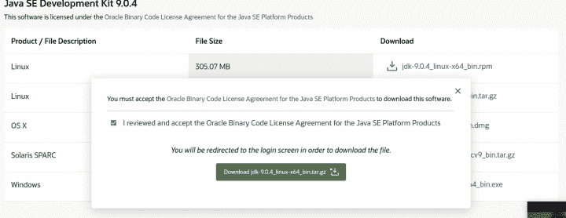

下载存档二进制文件

**第二步:**创建一个你想安装 JAVA 的空目录，并将下载的文件复制到该目录。

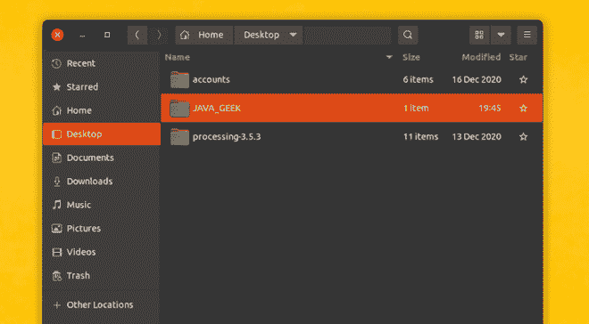

创建了一个新文件夹

在这里，我们创建了一个名为 JAVA_GEEK 的新文件夹(你可以命名任何东西)，并将存档文件(jdk-9.0.4_linux-x64_bin.tar.gz)从下载文件复制到 JAVA_GEEK 文件夹中。

我们可以通过终端复制和粘贴，或者简单地将文件从下载文件拖到 JAVA_GEEK 文件夹中。下面是通过终端这样做的命令。

**语法:**

```java
$ cp '/home/amninder/Desktop/JAVA_GEEK/jdk-9.0.4_linux-x64_bin.tar.gz' /home/amninder/Desktop
```

**复制后文件夹应该是这样的:**

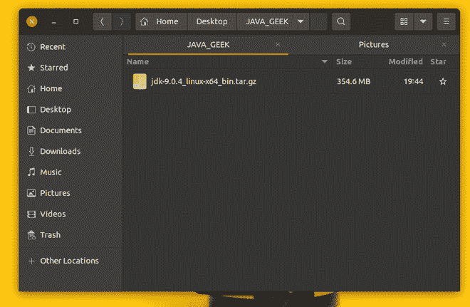

成功复制

**步骤 3:** 使用以下命令提取归档文件(jdk-9.0.4_linux-x64_bin.tar.gz):

```java
$  tar -xf jdk-9.0.4_linux-x64_bin.tar.gz
```

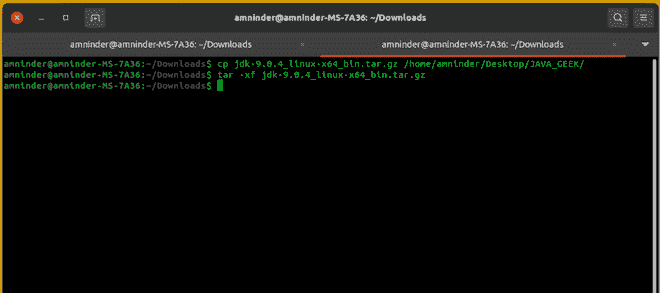

正在提取二进制档案

**这个命令带有提取二进制文件和提取后的文件结构应该是这样的:**

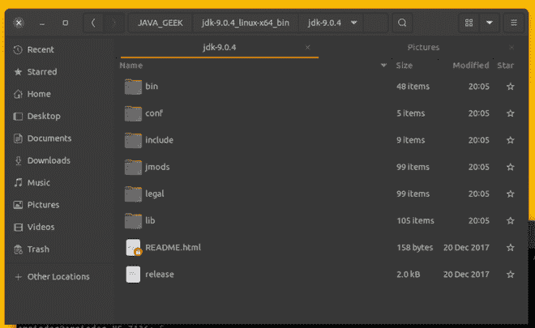

**提取后。**

**步骤 4:** 设置 JAVA 环境变量

### 为什么设置环境变量？

我们设置了一些环境变量，让一些事情变得更容易。假设我们没有设置环境变量，在这种情况下，如果我们每次必须指定 java bin 的完整路径时都必须编译一个程序。

***例如:*** 你正在编译一个 Helloworld 程序，那么你已经这样编译了。

```java
 $  /home/amninder/Desktop/JAVA_GEEK/jdk-9/bin javac Helloworld.java
```

但是在设置变量之后，我们可以通过使用 javac 程序名来实现同样的事情

***例如:*** 编译一个 Helloworld 程序。

```java
$ javac Helloworld.java
```

正如我们现在看到的不同，我们知道为什么要设置变量。

### Java 环境变量的设置

首先按 Ctrl+Alt+T 打开终端，或者您可以在应用程序中搜索终端。然后键入:

```java
nano /home/amninder/.bashrc
```

[nano](https://www.geeksforgeeks.org/nano-text-editor-in-linux/) 是 Linux 中最常用的编辑文件的文本编辑器。这里我们打开的 [bashrc](https://www.geeksforgeeks.org/environment-variables-in-linux-unix/) 文件是我们将提供环境变量、函数和自定义别名的文件，这个文件在我们每次打开一个新终端时都会在后台自动加载。

它应该是这样的，然后导航到文件的底部，JAVA bin 路径的类型如下:

```java
export PATH="$PATH:/home/amninder/Desktop/JAVA_GEEK/jdk-9.0.4_linux-x64_bin/jdk-9.0.4/bin"
```

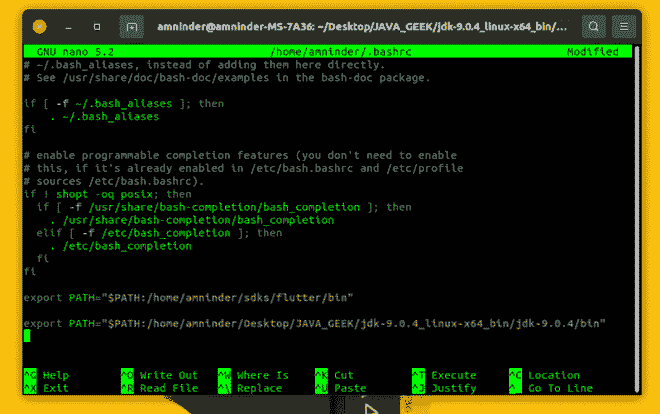

设置 JAVA 路径

写完命令后，按 Ctrl+X 并键入 y，退出 shell。


**步骤 5:** 设置默认 JVM:

现在，为了通知系统 java 及其可执行文件的安装位置，我们必须使用如下的 update-alternatives 命令(如果您安装了多个 JDK):

> $ sudo 更新-替代方案–install/usr/bin/JAVA JAVA/home/amninder/Desktop/JAVA _ GEEK/JDK-9 . 0 . 4 _ Linux-x64 _ bin/JDK-9 . 0 . 4/bin/JAVA 100

Update-alternatives 是一个特殊命令，用于更新“/etc/alternatives”中指向其他程序的链接。

同样，我们也可以为 javac 做同样的事情:

> $ sudo update-alternatives–install/usr/bin/javac javac/home/amninder/Desktop/JAVA _ GEEK/JDK-9 . 0 . 4 _ Linux-x64 _ bin/JDK-9 . 0 . 4/bin/javac 100

创建链接后，现在我们可以通过运行以下命令在不同的 java 安装版本之间进行选择:

```java
$ sudo update-alternatives --config java
```

之后，它会要求您选择一个默认的 JAVA:

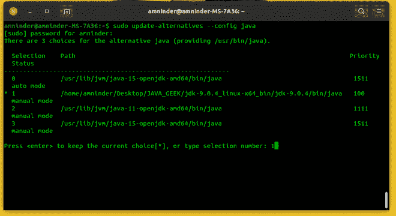

选择默认 java

您必须选择相应的数字，第一个版本显示为 0，第二个版本显示为 1，依此类推…

**步骤 6:** 验证安装

最后，JAVA 已经成功安装在您的 Linux 系统上，要验证安装，请键入以下命令:

```java
java -version
```

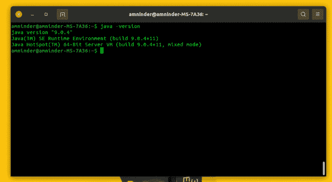

JAVA 安装成功

### 如何卸载 jdk9？

**删除 java 链接**

> $ sudo 更新-替代方案–删除 JAVA/home/amninder/Desktop/JAVA _ GEEK/JDK-9 . 0 . 4 _ Linux-x64 _ bin/JDK-9 . 0 . 4/bin/JAVA

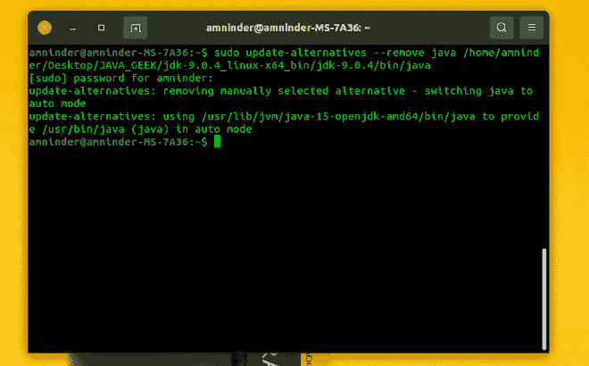

从替代链接中删除 java

**移除 javac 链接**

> $ sudo 更新-备选方案–删除 javac/home/amninder/Desktop/JAVA _ GEEK/JDK-9 . 0 . 4 _ Linux-x64 _ bin/JDK-9 . 0 . 4/bin/javac

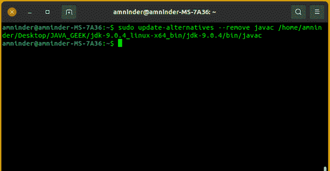

从替代链接中删除 javac

**移除安装 java 的文件夹**

```java
$ sudo rm -rf /home/amninder/Desktop/JAVA_GEEK/jdk-9.0.4_linux-x64_bin
```

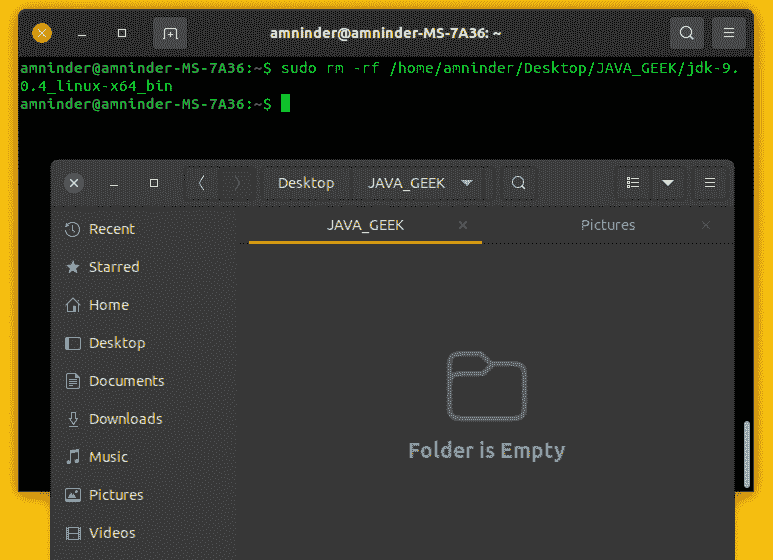

正在删除 Java 文件夹