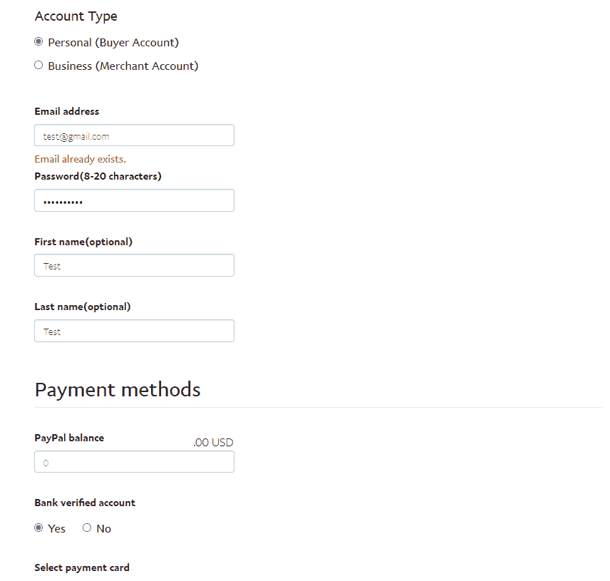
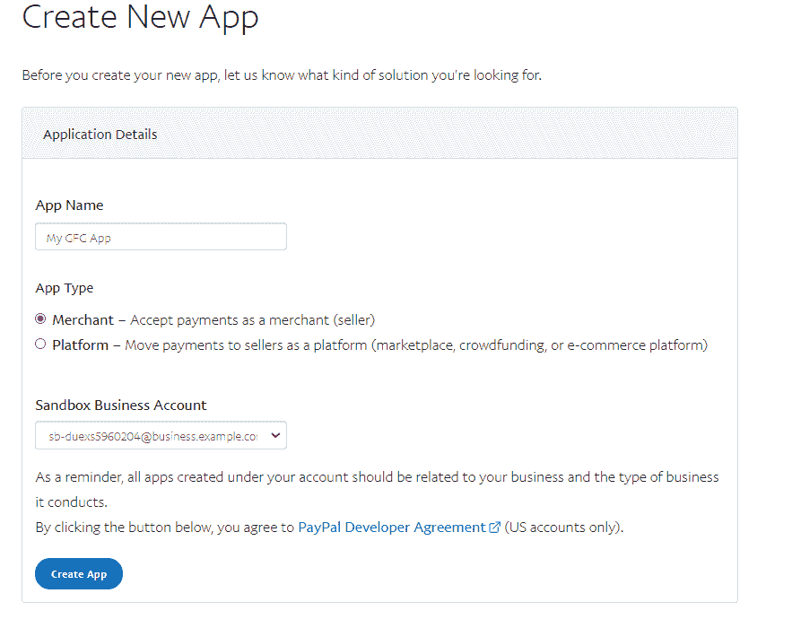

# 如何在安卓系统中集成 PayPal SDK？

> 原文:[https://www . geesforgeks . org/如何集成-paypal-sdk-in-android/](https://www.geeksforgeeks.org/how-to-integrate-paypal-sdk-in-android/)

PayPal 是著名的支付网关集成之一，它是全球著名的支付网关之一，用于如此多的应用程序和网站。在本文中，我们将看看如何在我们的应用程序中实现这个贝宝软件开发工具包。

### 我们将在本文中构建什么？

我们将构建一个简单的应用程序，其中我们将显示一个简单的编辑文本和一个按钮。从编辑文本中，我们将获得用户输入的金额，然后点击按钮后，我们将调用贝宝进行支付。在贝宝用户界面的帮助下，我们将能够从卡和贝宝账户进行支付。下面给出了一个示例视频，以了解我们将在本文中做什么。注意，我们将使用 **Java** 语言来实现这个项目。

<video class="wp-video-shortcode" id="video-595588-1" width="640" height="360" preload="metadata" controls=""><source type="video/mp4" src="https://media.geeksforgeeks.org/wp-content/uploads/20210420123644/20210420_122845.mp4?_=1">[https://media.geeksforgeeks.org/wp-content/uploads/20210420123644/20210420_122845.mp4](https://media.geeksforgeeks.org/wp-content/uploads/20210420123644/20210420_122845.mp4)</video>

### **生成客户端标识的分步实现**

**第一步:导航到下面的网址创建你的沙盒账号**

导航到此[网址](https://developer.paypal.com/developer/accounts/create)，并使用您的贝宝用户名和密码登录。之后，你会看到下面的页面。在那个页面上，我们必须用下面表格中显示的一些基本细节来创建我们的沙盒帐户。



填写完所有细节后。点击创建帐户选项创建您的沙盒帐户。

**第二步:新建应用生成客户端 ID**

导航到此[网址](https://developer.paypal.com/developer/applications/create)，并在其中添加您的应用程序名称



在这个屏幕中，我们必须添加我们的应用名称，并选择它作为商家，然后点击创建应用选项来创建一个新的应用。之后，您将看到我们必须在应用程序中使用的客户端标识。现在我们将转向安卓部分。

### **安卓中的分步实现**

**第一步:创建新项目**

要在安卓工作室创建新项目，请参考[如何在安卓工作室创建/启动新项目](https://www.geeksforgeeks.org/android-how-to-create-start-a-new-project-in-android-studio/)。注意选择 **Java** 作为编程语言。

**第二步:在 build.gradle 中添加依赖关系**

导航到**应用程序>渐变脚本>构建.渐变**，并在依赖项部分添加下面的依赖项。

```java
implementation 'com.paypal.sdk:paypal-android-sdk:2.14.2'
```

添加这个依赖项后，现在同步您的项目，我们将继续使用 XML 文件。

**步骤 3:使用 activity_main.xml 文件**

导航到**应用程序> res >布局> activity_main.xml** 并将下面的代码添加到该文件中。下面是 **activity_main.xml** 文件的代码。

## 可扩展标记语言

```java
<?xml version="1.0" encoding="utf-8"?>
<RelativeLayout
    xmlns:android="http://schemas.android.com/apk/res/android"
    xmlns:tools="http://schemas.android.com/tools"
    android:layout_width="match_parent"
    android:layout_height="match_parent"
    tools:context=".MainActivity">

    <!--Edit text for entering the amount-->
    <EditText
        android:id="@+id/idEdtAmount"
        android:layout_width="match_parent"
        android:layout_height="wrap_content"
        android:layout_marginStart="20dp"
        android:layout_marginTop="50dp"
        android:layout_marginEnd="20dp"
        android:hint="Enter Amount to be Paid"
        android:inputType="numberDecimal" />

    <!--button for making a payment-->
    <Button
        android:id="@+id/idBtnPay"
        android:layout_width="wrap_content"
        android:layout_height="wrap_content"
        android:layout_below="@id/idEdtAmount"
        android:layout_centerInParent="true"
        android:layout_marginTop="10dp"
        android:text="Make Payment" />

    <!--text view for displaying payment status-->
    <TextView
        android:id="@+id/idTVStatus"
        android:layout_width="match_parent"
        android:layout_height="wrap_content"
        android:layout_below="@id/idBtnPay"
        android:layout_marginStart="20dp"
        android:layout_marginTop="20dp"
        android:layout_marginEnd="20dp"
        android:padding="5dp"
        android:textAlignment="center"
        android:textColor="@color/purple_200"
        android:textSize="20sp" />

</RelativeLayout>
```

**第四步:使用****MainActivity.java 文件**

转到**MainActivity.java**文件，参考以下代码。以下是**MainActivity.java**文件的代码。代码中添加了注释，以更详细地理解代码。

## Java 语言(一种计算机语言，尤用于创建网站)

```java
import android.app.Activity;
import android.content.Intent;
import android.os.Bundle;
import android.util.Log;
import android.view.View;
import android.widget.Button;
import android.widget.EditText;
import android.widget.TextView;

import androidx.annotation.Nullable;
import androidx.appcompat.app.AppCompatActivity;

import com.paypal.android.sdk.payments.PayPalConfiguration;
import com.paypal.android.sdk.payments.PayPalPayment;
import com.paypal.android.sdk.payments.PayPalService;
import com.paypal.android.sdk.payments.PaymentActivity;
import com.paypal.android.sdk.payments.PaymentConfirmation;

import org.json.JSONException;
import org.json.JSONObject;

import java.math.BigDecimal;

public class MainActivity extends AppCompatActivity {

    public static final String clientKey = "Enter your client id here";
    public static final int PAYPAL_REQUEST_CODE = 123;

      // Paypal Configuration Object
    private static PayPalConfiguration config = new PayPalConfiguration()
            // Start with mock environment.  When ready,
              // switch to sandbox (ENVIRONMENT_SANDBOX)
            // or live (ENVIRONMENT_PRODUCTION)
            .environment(PayPalConfiguration.ENVIRONMENT_SANDBOX)
            // on below line we are passing a client id.
            .clientId(clientKey);
    private EditText amountEdt;
    private TextView paymentTV;

    @Override
    protected void onCreate(Bundle savedInstanceState) {
        super.onCreate(savedInstanceState);
        setContentView(R.layout.activity_main);

        // on below line we are initializing our variables.
        amountEdt = findViewById(R.id.idEdtAmount);

          // creating a variable for button, edit text and status tv.
        Button makePaymentBtn = findViewById(R.id.idBtnPay);
        paymentTV = findViewById(R.id.idTVStatus);

          // on below line adding click listener to our make payment button.
        makePaymentBtn.setOnClickListener(new View.OnClickListener() {
            @Override
            public void onClick(View v) {
                // calling a method to get payment.
                getPayment();
            }
        });
    }

    private void getPayment() {

          // Getting the amount from editText
        String amount = amountEdt.getText().toString();

          // Creating a paypal payment on below line.
        PayPalPayment payment = new PayPalPayment(new BigDecimal(String.valueOf(amount)), "USD", "Course Fees",
                PayPalPayment.PAYMENT_INTENT_SALE);

        // Creating Paypal Payment activity intent
        Intent intent = new Intent(this, PaymentActivity.class);

        //putting the paypal configuration to the intent
        intent.putExtra(PayPalService.EXTRA_PAYPAL_CONFIGURATION, config);

        // Putting paypal payment to the intent
        intent.putExtra(PaymentActivity.EXTRA_PAYMENT, payment);

        // Starting the intent activity for result
        // the request code will be used on the method onActivityResult
        startActivityForResult(intent, PAYPAL_REQUEST_CODE);
    }

    @Override
    protected void onActivityResult(int requestCode, int resultCode, @Nullable Intent data) {
        super.onActivityResult(requestCode, resultCode, data);

          // If the result is from paypal
        if (requestCode == PAYPAL_REQUEST_CODE) {

            // If the result is OK i.e. user has not canceled the payment
            if (resultCode == Activity.RESULT_OK) {

                  // Getting the payment confirmation
                PaymentConfirmation confirm = data.getParcelableExtra(PaymentActivity.EXTRA_RESULT_CONFIRMATION);

                // if confirmation is not null
                if (confirm != null) {
                    try {
                        // Getting the payment details
                        String paymentDetails = confirm.toJSONObject().toString(4);
                        // on below line we are extracting json response and displaying it in a text view.
                        JSONObject payObj = new JSONObject(paymentDetails);
                        String payID = payObj.getJSONObject("response").getString("id");
                        String state = payObj.getJSONObject("response").getString("state");
                        paymentTV.setText("Payment " + state + "\n with payment id is " + payID);
                    } catch (JSONException e) {
                        // handling json exception on below line
                        Log.e("Error", "an extremely unlikely failure occurred: ", e);
                    }
                }
            } else if (resultCode == Activity.RESULT_CANCELED) {
                // on below line we are checking the payment status.
                Log.i("paymentExample", "The user canceled.");
            } else if (resultCode == PaymentActivity.RESULT_EXTRAS_INVALID) {
                // on below line when the invalid paypal config is submitted.
                Log.i("paymentExample", "An invalid Payment or PayPalConfiguration was submitted. Please see the docs.");
            }
        }
    }
}
```

现在运行您的应用程序，并查看应用程序的输出。

**输出:**

> **注意:**由于我的 PayPal 账户没有验证，所以付款不会在我这边进行。

<video class="wp-video-shortcode" id="video-595588-2" width="640" height="360" preload="metadata" controls=""><source type="video/mp4" src="https://media.geeksforgeeks.org/wp-content/uploads/20210420123644/20210420_122845.mp4?_=2">[https://media.geeksforgeeks.org/wp-content/uploads/20210420123644/20210420_122845.mp4](https://media.geeksforgeeks.org/wp-content/uploads/20210420123644/20210420_122845.mp4)</video>