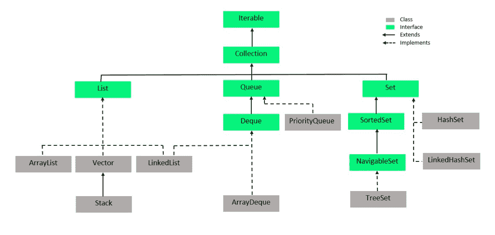
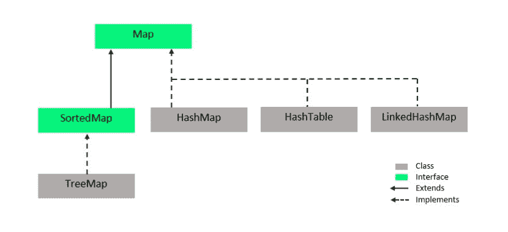

# 如何学习 Java 集合–完整指南

> 原文:[https://www . geesforgeks . org/how-learning-Java-collections-a-complete-guide/](https://www.geeksforgeeks.org/how-to-learn-java-collections-a-complete-guide/)

在现实世界中，集合根据定义是一组具有相似属性的文章。因为 Java 是一种面向对象的语言，所以它模仿真实世界。在 Java 中，一个 [**集合**](https://www.geeksforgeeks.org/collections-in-java-2/) 是一组多个对象放在一起成为一个单元。Java Collections 是一个非常广泛的话题，作为一个初学者，在学习它的过程中很难找到自己的方向。从 Java Collections 开始，这里有您需要了解的一切。


#### 什么是收集框架？

我们有了对象的集合，现在我们需要一种有组织的方式来使用这些集合，因此我们需要一个框架。在 JDK 1.2 ( Java 开发工具包 1.2)中首次引入的 Java 集合框架是一个由接口和类组成的体系结构。简单地说，它就像是一个组件的骨架结构，随时可以用于各种编程需求。它还提供不同的数据操作，如搜索、排序、插入、删除和操作。集合框架的所有类和接口都捆绑到 [java.util 包](https://www.geeksforgeeks.org/java-util-package-java/)中。

### 收集框架层次结构

 

### 类 Vs 接口

<figure class="table">

| 

班级

 | 

连接

 |
| --- | --- |
| 类是用户定义的原型，用于在 Java 中构建对象。 | 接口是用户定义的蓝图，描述了实现它的每个类的结构。 |
| 它用于定义对象。 | 它不能用于定义对象。 |
| 一个类可以有公共和默认的访问修饰符。 | 接口可以有公共和默认的访问修饰符。 |
| 类可以是具体的，也可以是抽象的。 | 所有接口都是抽象的。 |
| 类由构造函数、方法和属性组成。这些方法是在类中定义的。 | 接口由属性和方法组成。这些方法没有在接口中定义，它只包含它们的签名。 |

</figure>

现在我们已经有了 Java 集合的基本概念，我们将详细了解它的每个组件。它们的属性是什么，以及一些最常用的集合示例？

### 1.[可重复](https://www.geeksforgeeks.org/java-implementing-iterator-and-iterable-interface/)

Iterable 接口是整个集合层次结构的根，这意味着每个类和接口都实现了它。迭代器的主要功能是允许用户遍历所有集合类对象，就像它们是简单的数据项序列一样。

### 2.收藏品

集合接口扩展了可迭代接口。它具有使用框架中所有其他集合来添加、删除和操作数据所需的基本方法。因为它是一个接口，所以它只有一个方法签名(即<return type="">method name(ArgumentList)；)并且没有定义，因为实现这个接口的每个接口或类都有不同类型的元素要处理。但是由于它们实现了这个接口，所以集合的其余部分具有一致性和结构。下面给出了集合接口的方法，所有扩展或实现集合接口的接口和类都使用这些方法以及它们自己添加的特定于它们的方法。</return>

### 3.[列表](https://www.geeksforgeeks.org/list-interface-java-examples/)

列表界面从集合界面扩展而来。列表中的元素像序列一样排序。用户可以使用索引号来访问列表中的特定元素，也就是说，用户可以完全控制在列表中插入哪个元素。

### 3.a) [数组列表](https://www.geeksforgeeks.org/arraylist-in-java/)

ArrayList [](https://www.geeksforgeeks.org/arraylist-in-java/)类实现了 List 接口。这个类的对象是动态数组。数组列表本质上是列表的一个可调整大小的实现。它实现了所有的 List 方法，并且允许所有的元素，甚至空元素。数组列表对象有一个容量，该容量最初等于大小，但随着新元素的添加而动态增加。数组列表是非同步的，这意味着多个线程可以同时访问它们。线程是可以在操作系统中处理的顺序流控制单元。

*语法:*

```
ArrayList<?> arrayListName = new ArrayList<?>();
```

*示例:*现在我们举个例子，对一个 ArrayList 执行一些基本操作。这里我们实例化一个名为 intArr 的数组列表。我们使用 add()方法向 intArr 添加整数。用于声明 intArr 的整数类是基本数据类型 int 的包装类。包装类是从对象类扩展而来的，使用它们是为了使基本数据类型与其他类兼容。接下来，我们在控制台上打印数组列表。我们使用 remove()方法从指定的索引中移除元素。我们检查一个元素，这里是 25，是否存在于 intArr 中，并打印适当的消息。然后，我们使用 get()方法检索索引 1 处的元素。如您所见，当使用 remove()方法移除一个元素时，其余的元素会按顺序移动。

## Java 语言(一种计算机语言，尤用于创建网站)

```
// An example for ArrayList
// All of the classes and
// interfaces of the collection
// framework are bundled into
// the java.util package
import java.util.*;

public class BasicArrayList {

    // main method
    public static void main(String[] args) {

        // Instantiate an ArrayList Object
        // Integer is a wrapper class for
        // the basic datatype int
        ArrayList<Integer> intArr = new ArrayList<Integer>();

        // Add elements using add() method
        intArr.add(10);
        intArr.add(12);
        intArr.add(25);
        intArr.add(19);
        intArr.add(11);
        intArr.add(3);

        // Print the ArrayList on the console
        System.out.println(intArr);

        // Remove elements at index 1 and 4
        intArr.remove(1);
        intArr.remove(4);

        // Print the ArrayList on the console
        System.out.println(intArr);

        // Check if intArr contains the element 25
        if(intArr.contains(25))
        {
            System.out.println("The ArrayList contains 25");
        }
        else
        {
            System.out.println("No such element exists");
        }

        // Use get method to get the element at index 1
        int elementAt1 = intArr.get(1);
        System.out.println("The Element at index 1 now is " + elementAt1);

    }

}
```

**Output**

```
[10, 12, 25, 19, 11, 3]
[10, 25, 19, 11]
The ArrayList contains 25
The Element at index 1 now is 25
```

### 3.b) [向量](https://www.geeksforgeeks.org/java-util-vector-class-java/)

向量类实现了列表迭代器。向量实例是一个动态数组，其中的元素可以用索引来访问。向量和数组列表的区别在于向量是同步的。

*语法:*

```
Vector<?> vectorName = new Vector<?>();
```

让我们通过一个例子更好地理解 Vector，在下面给出的代码中，我们已经声明了一个名为 intVector 的 Vector，我们使用 add()向 Vector 添加元素。size()方法给出了当前存储在 Vector 中的元素数量。remove()方法用于移除指定索引处的元素。

## Java 语言(一种计算机语言，尤用于创建网站)

```
// An example for Vector
import java.util.*;

public class VectorExample {

    public static void main(String[] args) {

        // Instantiate Vector object
        Vector<Integer> intVector = new Vector<Integer>();

        // Print the initial size of the Vector
        System.out.println("The initial size of the Vector = " + intVector.size());
        System.out.println();

        // Add elements using add method
        intVector.add(11);
        intVector.add(18);
        intVector.add(1);
        intVector.add(87);
        intVector.add(19);
        intVector.add(11);

        // Print the Vector on the console
        System.out.println("The Vector intVector : ");
        System.out.println(intVector);
        System.out.println("Size of intVector : " + intVector.size());

        System.out.println();

        // Remove the element at index 2
        intVector.remove(2);

        // Print the vector again on the console
        System.out.println("The Vector intVector after removing element at 2 : ");
        System.out.println(intVector);

        System.out.println();

        // Clear all elements of the Vector and
        // Print the Vector on the console
        intVector.clear();
        System.out.println("The Vector intVector after using clear : ");
        System.out.println(intVector);

    }

}
```

**Output**

```
The initial size of the Vector = 0

The Vector intVector : 
[11, 18, 1, 87, 19, 11]
Size of intVector : 6

The Vector intVector after removing element at 2 : 
[11, 18, 87, 19, 11]

The Vector intVector after using clear : 
[]
```

### 3.b) i) [堆叠](https://www.geeksforgeeks.org/stack-class-in-java/)

堆栈类从向量类扩展而来。堆栈是后进先出结构。你可以把它想象成桌子上的一摞书，放在第一位的书必须放在最后一位，放在最后一叠的书必须放在第一位。堆栈类的基本方法是推送、弹出、查看、清空和搜索。

*语法:*

```
Stack<?> stackName = new Stack<?>();
```

*举例:*用一个例子让我们更好的理解 Stack。在下面给出的代码中，我们首先实例化一个名为 strStack 的堆栈，其元素类型为 String。这些元素是使用 push()方法添加的。size()方法返回堆栈中存在的元素数量。search()方法用于搜索堆栈中的元素。如果找到，它返回元素从 1 开始的位置，否则返回-1 表示堆栈中不存在这样的元素。

## Java 语言(一种计算机语言，尤用于创建网站)

```
// An example to show workings of a Stack
import java.util.*;

public class StackExample {

    public static void main(String[] args) {

        // Instantiate a Stack named strStack
        Stack<String> strStack = new Stack<String>();

        // Add elements using the push() method
        strStack.push("Stack");
        strStack.push("a");
        strStack.push("is");
        strStack.push("This");

        // The size() method gives the
        // number of elements in the Stack
        System.out.println("The size of the Stack is : " + strStack.size());

        // The search() method is
        // used to search an element
        // it returns the position of
        // the element
        int position = strStack.search("a");
        System.out.println("\nThe string 'a' is at position " + position);

        System.out.println("\nThe elements of the stack are : ");
        String temp;
        int num = strStack.size();

        for(int i = 1; i <= num; i++)
        {
            // peek() returns the topmost element
            temp = strStack.peek();
            System.out.print(temp + " ");

            // pop() removes the topmost element
            strStack.pop();

        }

    }

}
```

**Output**

```
The size of the Stack is : 4

The string 'a' is at position 3

The elements of the stack are : 
This is a Stack 
```

### 3.c) [链表](https://www.geeksforgeeks.org/linked-list-in-java/)

LinkedList 类实现了 List 接口和 Deque 接口。链表是链表数据结构的类实现，其中每个元素都有一个指向下一个形成链接的元素的指针。由于每个元素都有下一个元素的地址，被称为节点的链表元素可以存储在内存中不连续的位置。

*语法:*

```
LinkedList<?> linkedListName = new LinkedList<?>();
```

让我们举个例子来理解 LinkedList。在下面给出的代码中，我们实例化了一个名为 strLinkedList 的 LinkedList。add()方法用于添加元素，remove()方法用于移除元素。元素的检索是使用 get()方法完成的。

## Java 语言(一种计算机语言，尤用于创建网站)

```
// An example for the LinkedList
import java.util.*;

public class LinkedListExample {

    public static void main(String[] args) {

        // Instantiate LinkedList named strLinkedList
        LinkedList<String> strLinkedList = new LinkedList<String>();

        // Add elements to the LinkedList using add()
        strLinkedList.add("This");
        strLinkedList.add("is");
        strLinkedList.add("a");
        strLinkedList.add("LinkedList");

        // The elements are retrieved using the get() method
        System.out.println("The contents of strLinkedList : ");
        for(int i = 0; i < strLinkedList.size(); i++)
        {
            System.out.print(strLinkedList.get(i) + " ");
        }

        // The elements are removed using remove()
        strLinkedList.remove(0);
        strLinkedList.remove(1);

        System.out.println("\n\nThe contents of strLinkedList after remove operation : ");
        for(int i = 0; i < strLinkedList.size(); i++)
        {
            System.out.print(strLinkedList.get(i) + " ");
        }

    }

}
```

**Output**

```
The contents of strLinkedList : 
This is a LinkedList 

The contents of strLinkedList after remove operation : 
is LinkedList 
```

### 4.队列

队列接口扩展了集合接口。队列是队列数据结构的接口实现。因为 java 中的队列是一个接口，它没有方法的定义，只有它们的签名。队列通常是先进先出(FIFO)结构，但优先级队列不是这样。你可以把它想象成柜台前的一队人，先进入的人先得到服务，然后先离开。

### 4.a)优先权队列

优先级队列类实现了队列接口。优先级队列的元素或者按照自然顺序排序，或者按照比较器指定的顺序排序，这取决于所使用的构造函数。优先级队列是无界的，但是它的容量决定了存储元素的数组的大小。初始容量等于阵列的大小，但随着新元素的添加，它会动态扩展。

语法:

```
PriorityQueue<?> priorityQueueName = new PriorityQueue<?>();
```

让我们用一个例子来更好地理解优先级队列。在下面给出的代码中，我们实例化了一个名为 intPriorityQueue 的 PriorityQueue 对象，因为构造函数中没有指定比较器，所以这个 PriorityQueue 的元素将自然排序。add()方法用于添加元素，remove()方法用于移除指定元素的单个实例。peek()方法是从队列接口实现的，它返回 PriorityQueue 头部的元素。然而，poll()方法删除了 PriorityQueue 头部的元素并返回它。

## Java 语言(一种计算机语言，尤用于创建网站)

```
// An example for PriorityQueue
import java.util.*;

public class PriorityQueueExample {

    public static void main(String[] args) {

        // Instantiate PriorityQueue object named intPriorityQueue
        PriorityQueue<Integer> intPriorityQueue = new PriorityQueue<Integer>();

        // Add elements using add()
        intPriorityQueue.add(17);
        intPriorityQueue.add(20);
        intPriorityQueue.add(1);
        intPriorityQueue.add(13);
        intPriorityQueue.add(87);

        // Print the contents of PriorityQueue
        System.out.println("The contents of intPriorityQueue : ");
        System.out.println(intPriorityQueue);

        // The peek() method is used to retrieve
          // the head of the PriorityQueue
        System.out.println("\nThe head of the PriorityQueue : " + intPriorityQueue.peek());

        // The remove() method is used
        // to remove a single instance
        // of the specified object
        intPriorityQueue.remove(17);

        // Print the contents of PriorityQueue
        System.out.println("\nThe contents of intPriorityQueue after removing 17 : ");
        System.out.println(intPriorityQueue);

        // The poll() method is used
        // to retrieve and remove the
        // element at the head of the PriorityQueue
        Integer head = intPriorityQueue.poll();
        System.out.println("\nThe head of the PriorityQueue was : " + head);

        // Print the contents of PriorityQueue
        System.out.println("\nThe contents of intPriorityQueue after poll : ");
        System.out.println(intPriorityQueue);
    }

}
```

**Output**

```
The contents of intPriorityQueue : 
[1, 13, 17, 20, 87]

The head of the PriorityQueue : 1

The contents of intPriorityQueue after removing 17 : 
[1, 13, 87, 20]

The head of the PriorityQueue was : 1

The contents of intPriorityQueue after poll : 
[13, 20, 87]
```

### 5.从开始

德奎接口扩展了队列接口。Deque 是双端队列数据结构的实现，这是一种线性结构，可以在队列的两端进行插入和删除。德格接口支持有容量限制的德格，也支持没有固定限制的德格。Deque 既可以用作后进先出(LIFO)结构，也可以用作先进先出(FIFO)结构。

### 5 .(a)array deque

ArrayDeque 类实现了 Deque 接口。ArrayDeque 是 Deque 的一个相当大的实现，它没有固定的容量，但会根据需要增加。ArrayDeque 可以作为堆栈使用，与 stack 类相比速度更快。ArrayDeque 不是线程安全的，它不允许不同线程的并发访问。

*语法:*

```
ArrayDeque<?> arrayDequeName = new ArrayDeque<?>();
```

### 6.[设置](https://www.geeksforgeeks.org/set-in-java/)

设置 [](https://www.geeksforgeeks.org/set-in-java/) 界面扩展了采集界面。集合是对集合的数学定义建模的结构。它是对象的集合，不允许有重复的对象。该集合最多允许一个空元素。

### 6.a)哈希集

HashSet [](https://www.geeksforgeeks.org/hashset-in-java/)类实现了 Set 接口。在哈希集中，元素的顺序可能与插入的顺序不同。当一个元素被添加到哈希集中时，会计算一个哈希码，并将该元素添加到适当的桶中(桶是任何哈希结构中的一个槽)。一个好的 HashSet 算法会均匀分布元素，这样结构的时间性能就保持不变。恒定时间性能意味着基本操作(如插入、删除和搜索)需要恒定的时间。

### 6.b） [LinkedHashSet](https://www.geeksforgeeks.org/linkedhashset-in-java-with-examples/)

[LinkedHashSet](https://www.geeksforgeeks.org/linkedhashset-in-java-with-examples/) 实现设置界面。LinkedHashSet 与 HashSet 非常相似，不同之处在于，对于每个存储桶，用于存储元素的结构都是一个双链表。与 HashSet 相比，LinkedHashSet 的订购更好，没有任何额外的成本。

让我们举个例子来理解 HashSet 和 LinkedHashSet。在下面给出的代码中，我们实例化了一个名为 strHashSet 的 HashSet，使用 add()方法向 HashSet 添加元素。hasNext()方法和 Next()方法是 Iterable 接口的方法，分别用于检查任何集合中是否有下一个元素和检索下一个元素。使用 LinkedHashSet 的构造函数，HashSet 的所有元素都被添加到其中。创建一个迭代器来遍历它，并使用它将元素打印在控制台上。

## Java 语言(一种计算机语言，尤用于创建网站)

```
// An example for HashSet and LinkedHashSet
import java.util.*;

public class HashSetAndLinkedHashSet {

    public static void main(String[] args) {

        /*-----------HashSet-------------*/

        // Instantiate a HashSet object named strHashSet
        HashSet<String> strHashSet = new HashSet<String>();

        // Add elements using add()
        strHashSet.add("This");
        strHashSet.add("is");
        strHashSet.add("a");
        strHashSet.add("HashSet");

        // Create an Iterator to traverse through the HashSet
        Iterator<String> hsIterator = strHashSet.iterator();

        // Print all the elements of the HashSet
        System.out.println("Contents of HashSet : ");
        while(hsIterator.hasNext())
        {
            System.out.print(hsIterator.next() + " ");
        }

        /*---------LinkedHashSet----------*/

        // Instantiate an object of LinkedHashSet named strLinkedHashSet
        // Pass the name of the HashSet created earlier to copy all of the contents
        // of the HashSet to the LinkedHashSet using a constructor
        LinkedHashSet<String> strLinkedHashSet = new LinkedHashSet<String>(strHashSet);

        // Create an Iterator to traverse through the LinkedHashSet
        Iterator<String> lhsIterator = strLinkedHashSet.iterator();

        // Print all the elements of the LinkedHashSet
        System.out.println("\n\nContents of LinkedHashSet : ");
        while(lhsIterator.hasNext())
        {
            System.out.print(lhsIterator.next() + " ");
        }

    }

}
```

**Output**

```
Contents of HashSet : 
a This is HashSet 

Contents of LinkedHashSet : 
a This is HashSet 
```

### 7.[排序集](https://www.geeksforgeeks.org/sortedset-java-examples/)

SortedSet 接口扩展了 Set 接口。SortedSet 提供了元素的完整排序。默认顺序为自然顺序，否则由施工时指定的比较器进行排序。遍历通常以元素的升序进行。

### 8.[适航设置](https://www.geeksforgeeks.org/navigableset-java-examples/)

导航集接口从排序集接口扩展而来。除了 SortedSet 的方法之外，NavigableSet 还具有给出最接近匹配的导航方法，例如地板、天花板、较低和较高。导航集可以按升序和降序遍历。虽然它允许空元素实现，但不鼓励这样做，因为这些实现可能会给出不明确的结果。

### 8.a)tree set

TreeSet 类实现了可导航接口。顾名思义，TreeSet 使用树结构来存储元素，使用集合来对元素进行排序。排序可以是自然排序，也可以是构建时指定的比较器排序。TreeSet 是不同步的，也就是说如果多个线程想同时访问它，我们需要在外部同步它。

*语法:*

```
TreeSet<?> treeSetName = new TreeSet<?>();
```

让我们举个例子来更好地理解 TreeSet。在下面给出的代码中，我们实例化了一个名为 intTreeSet 的对象。正如您可以观察到的，这个树集中的顺序是自然顺序，不允许有重复的元素。add()方法用于添加元素，remove()方法用于删除元素。

## Java 语言(一种计算机语言，尤用于创建网站)

```
// An example for TreeSet
import java.util.*;

public class TreeSetExample {

    public static void main(String[] args) {

        // Instantiate an object of TreeSet named intTreeSet
        TreeSet<Integer> intTreeSet = new TreeSet<Integer>();

        // Add elements using add()
        intTreeSet.add(18);
        intTreeSet.add(13);
        intTreeSet.add(29);
        intTreeSet.add(56);
        intTreeSet.add(73);

        // Try to add a duplicate
        // Observe output as it will not be added
        intTreeSet.add(18);

        // Print the TreeSet on the console
        System.out.println("The contents of intTreeSet : ");
        System.out.println(intTreeSet);

        // Remove 18 using remove()
        if(intTreeSet.remove(18))
        {
            System.out.println("\nElement 18 has been removed");
        }
        else
        {
            System.out.println("\nNo such element exists");
        }

        // Try to remove a non-existent element
        if(intTreeSet.remove(12))
        {
            System.out.println("\nElement 18 has been removed");
        }
        else
        {
            System.out.println("\nNo such element exists");
        }

        System.out.println();

        // Print the TreeSet on the console
        System.out.println("The contents of intTreeSet : ");
        System.out.println(intTreeSet);

    }

}
```

**Output**

```
The contents of intTreeSet : 
[13, 18, 29, 56, 73]

Element 18 has been removed

No such element exists

The contents of intTreeSet : 
[13, 29, 56, 73]
```

### 9.[地图](https://www.geeksforgeeks.org/map-interface-java-examples/)

映射接口是将一个键映射到每个值的结构。映射不允许重复元素，因为一个键不能有多个映射。一个映射有三个不同的视图，一个键的集合视图，一个键值映射的集合视图，以及一个值的集合视图。下面给出了 Map 接口的方法，每个实现 Map 的类都必须提供这些方法的定义。

### 9.a) [HashMap](https://www.geeksforgeeks.org/java-util-hashmap-in-java-with-examples/)

HashMap [](https://www.geeksforgeeks.org/java-util-hashmap-in-java-with-examples/)类实现了 Map 接口。对于 HashMap 中的每个条目，都会计算一个 hashCode，并将这个条目插入桶中，hashCode 值作为其索引。每个条目都是键值对。哈希表中的桶可以包含多个条目。一个好的 HashMap 算法会尝试在 HashMap 中均匀分布元素。对于基本的检索、插入、删除和操作操作，HashMap 具有恒定的时间性能。影响哈希映射性能的两个最重要的因素是初始容量和负载系数。铲斗数量是容量，何时增加该容量的衡量标准是负载系数。哈希表比哈希表更快。

*语法:*

```
HashMap<? , ?> hashMapName = new HashMap<? , ?>();
```

### 9.b) [哈希表](https://www.geeksforgeeks.org/hashtable-in-java/)

哈希表 [](https://www.geeksforgeeks.org/hashtable-in-java/) 类实现了映射接口。哈希表的元素是键值对。为了有效地实现哈希表，键必须是唯一的。哈希表与哈希表非常相似，但是哈希表是同步的。一个好的哈希表算法会尝试在哈希表中均匀分布元素。哈希表对于基本的检索、插入、删除和操作操作具有恒定的时间性能。影响哈希表性能的两个最重要的因素是初始容量和负载系数。铲斗数量是容量，何时增加该容量的衡量标准是负载系数。

*语法:*

```
HashTable<? , ?> hashTableName = new HashTable<? , ?>();
```

### 9.c） [LinkedHashMap](https://www.geeksforgeeks.org/linkedhashmap-class-java-examples/)

LinkedHashMap 类实现了映射接口。LinkedHashMap 是映射的哈希映射链表实现。LinkedHashMap 中的每个条目都有一个双向链表贯穿其中。该链表定义了迭代顺序，即插入到 LinkedHashMap 中的键的顺序。像 Map 的所有实现一样，LinkedHashMap 的元素是键值对。

语法:

```
LinkedHashMap<? , ?> linkedHashMapName = new LinkedHashMap<? , ?>();
```

让我们举个例子来理解所有的 Map 实现。在下面给出的代码中，我们使用 put()方法向所有 HashMap、Hashtable 和 LinkedHashMap 添加元素。正如 put()是 Map 接口的一个方法，因此，是由这三个类实现的。正如您可以观察到的，哈希表的插入顺序与内部顺序不同，因此它是不确定的。当我们试图插入一个重复的键时，旧的值会在这三个键中被替换。当我们试图用不同的键插入一个重复的值时，它会被添加为一个新条目。基本上，这是为了描述我们可以有重复的值，但不能有重复的键。

## Java 语言(一种计算机语言，尤用于创建网站)

```
// An example for HashMap,
// Hashtable and LinkedHashMap
import java.util.*;

public class MapImplementaionExample {

    public static void main(String[] args) {

        /*--------------HashMap---------------*/

        // Instantiate an object of HashMap named hashMap
        HashMap<Integer, String> hashMap = new HashMap<Integer, String>();

        // Add elements using put()
        hashMap.put(1, "This");
        hashMap.put(2, "is");
        hashMap.put(3, "HashMap");

        // Print the HashMap contents on the console
        System.out.println("Contents of hashMap : ");
        System.out.print(hashMap.entrySet());

        // Add a duplicate key
        hashMap.put(3, "Duplicate");

        // Add a duplicate value
        hashMap.put(4, "This");

        // Print the HashMap contents on the console
        System.out.println("\nContents of hashMap after adding duplicate : ");
        System.out.print(hashMap.entrySet());

        /*--------------Hashtable----------------*/

        // Instantiate an object of Hashtable named hashTable
        Hashtable<Integer, String> hashTable = new Hashtable<Integer, String>();

        // Add elements using put()
        hashTable.put(11, "This");
        hashTable.put(12, "is");
        hashTable.put(13, "Hashtable");

        // Print the Hashtable contents on the console
        System.out.println("\n\nContents of hashTable : ");
        System.out.print(hashTable.entrySet());

        // Add a duplicate key
        hashTable.put(11, "Duplicate");

        // Add a duplicate value
        hashTable.put(14, "is");

        // Print the Hashtable contents on the console
        System.out.println("\nContents of hashTable after adding duplicate : ");
        System.out.print(hashTable.entrySet());

        /*---------------LinkedHashMap---------------*/

        // Instantiate an object of LinkedHashMap named linkedHashMape
        LinkedHashMap<Integer, String> linkedHashMap = new LinkedHashMap<Integer, String>();

        // Add elements using put()
        linkedHashMap.put(21, "This");
        linkedHashMap.put(22, "is");
        linkedHashMap.put(23, "LinkedHashMap");

        // Print the LinkedHashMap contents on the console
        System.out.println("\n\nContents of linkedHashMap : ");
        System.out.print(linkedHashMap.entrySet());

        // Add a duplicate key
        linkedHashMap.put(22, "Duplicate");

        // Add a duplicate value
        linkedHashMap.put(24, "This");

        // Print the LinkedHashMap contents on the console
        System.out.println("\nContents of linkedHashMap after adding duplicate : ");
        System.out.print(linkedHashMap.entrySet());
    }

}
```

**Output**

```
Contents of hashMap : 
[1=This, 2=is, 3=HashMap]
Contents of hashMap after adding duplicate : 
[1=This, 2=is, 3=Duplicate, 4=This]

Contents of hashTable : 
[13=Hashtable, 12=is, 11=This]
Contents of hashTable after adding duplicate : 
[14=is, 13=Hashtable, 12=is, 11=Duplicate]

Contents of linkedHashMap : 
[21=This, 22=is, 23=LinkedHashMap]
Contents of linkedHashMap after adding duplicate : 
[21=This, 22=Duplicate, 23=LinkedHashMap, 24=This]
```

### 10.[排序地图](https://www.geeksforgeeks.org/sortedmap-java-examples/)

[排序地图](https://www.geeksforgeeks.org/sortedmap-java-examples/)界面扩展了地图界面，增加了按键总顺序的规定。根据所使用的构造函数，这些键或者按自然顺序排序，或者按构造时指定的比较器排序。所有的键都必须是可比较的。

### 10\. a) [树图](https://www.geeksforgeeks.org/treemap-in-java/)

TreeMap 类实现了 SortedMap 接口。TreeMap 类使用红黑树结构进行存储，使用映射对元素进行排序。每个元素都是键值对。此实现为基本操作提供了保证的日志(n)时间成本。

*语法:*

```
TreeMap<? , ?> treeMapName = new TreeMap<? , ?>();
```

让我们举个例子来了解一下 TreeMap 的基础知识。在下面给出的代码中，我们实例化了名为 treeMap 的 TreeMap 对象的一个对象。使用 put()方法添加元素。当我们尝试添加一个具有不同值的重复键时，旧的实例将被替换为与该键关联的新值。但是当我们试图用一个新的关键字添加一个重复的值时，它被当作一个不同的条目。

## Java 语言(一种计算机语言，尤用于创建网站)

```
// An example of TreeMap
import java.util.*;

public class TreeMapExample {

    public static void main(String[] args) {

        // Instantiate an object of TreeMap named treeMap
        TreeMap<Integer, String> treeMap = new TreeMap<Integer, String>();

        // Add elements using put()
        treeMap.put(1, "This");
        treeMap.put(2, "is");
        treeMap.put(3, "TreeMap");

        // Print the contents of treeMap on the console
        System.out.println("The contents of treeMap : ");
        System.out.println(treeMap);

        // Add a duplicate key
        treeMap.put(1, "Duplicate");

        // Add a duplicate value
        treeMap.put(4, "is");

        // Print the contents of treeMap on the console
        System.out.println("\nThe contents of treeMap after adding duplicates : ");
        System.out.println(treeMap);

    }

}
```

**Output**

```
The contents of treeMap : 
{1=This, 2=is, 3=TreeMap}

The contents of treeMap after adding duplicates : 
{1=Duplicate, 2=is, 3=TreeMap, 4=is}
```

GeeksforGeeks 还准备了一门课程[**【Java 基础】和**](https://practice.geeksforgeeks.org/courses/Java-Collections) 来深入的教你 Java 的概念。本课程将帮助您使用 Collections Framework 的内置类和函数，以便轻松高效地实现一些复杂的数据结构&并对其执行操作。查看本课程:

