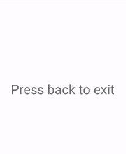

# 如何在安卓中制作自定义退出对话框？

> 原文:[https://www . geesforgeks . org/如何在安卓中自定义退出对话框/](https://www.geeksforgeeks.org/how-to-make-a-custom-exit-dialog-in-android/)

在本教程中，我们将在安卓中创建一个自定义退出对话框。默认情况下，android 不提供任何退出对话框，但是我们可以使用 java 中的对话框类来创建它。但是大多数开发人员和用户都不喜欢默认的对话框，我们也不能根据需要对对话框进行任何修改，所以在本文中，我们将创建一个简单的自定义退出对话框。下面给出了一个 GIF 示例，来了解一下在本文中要做什么。请注意，我们将使用 **Java** 语言来实现这个项目。



### **接近**

**步骤 1:创建新项目**

要在安卓工作室创建新项目，请参考[如何在安卓工作室创建/启动新项目](https://www.geeksforgeeks.org/android-how-to-create-start-a-new-project-in-android-studio/)。注意选择 **Java** 作为语言，虽然我们要用 Java 语言实现这个项目。

**第二步:去编码区之前先做一些前置任务**

转到**应用程序->RES->values->colors . XML**文件，为应用程序设置颜色。

## 可扩展标记语言

```
<?xml version="1.0" encoding="utf-8"?>
<resources>

   <color name="colorPrimary">#0F9D58</color>
   <color name="colorPrimaryDark">#0F9D58</color>
   <color name="colorAccent">#05af9b</color>

</resources>
```

我们还创建了一个新的可绘制文件( **card_round.xml** )并将 elasq，flaticon 引用为 [](https://elasq.com/icon/alert-icon-free/) 警报图标，并将其粘贴到可绘制文件夹中。 **card_round.xml** 代码如下

## 可扩展标记语言

```
<?xml version="1.0" encoding="utf-8"?>
<shape xmlns:android="http://schemas.android.com/apk/res/android"
    android:shape="rectangle">
    <corners android:radius="8dp" />
    <padding
        android:bottom="8dp"
        android:left="8dp"
        android:right="8dp"
        android:top="8dp" />
</shape>
```

**第三步:设计 UI**

**activity_main.xml** 包含默认文本，我们将文本更改为“**按回车键退出**，如下所示

## 可扩展标记语言

```
<?xml version="1.0" encoding="utf-8"?>
<androidx.constraintlayout.widget.ConstraintLayout 
    xmlns:android="http://schemas.android.com/apk/res/android"
    xmlns:app="http://schemas.android.com/apk/res-auto"
    xmlns:tools="http://schemas.android.com/tools"
    android:layout_width="match_parent"
    android:layout_height="match_parent"
    tools:context=".MainActivity">

    <TextView
        android:layout_width="wrap_content"
        android:layout_height="wrap_content"
        android:text="Press back to exit"
        android:textSize="40dp"
        app:layout_constraintBottom_toBottomOf="parent"
        app:layout_constraintLeft_toLeftOf="parent"
        app:layout_constraintRight_toRightOf="parent"
        app:layout_constraintTop_toTopOf="parent" />

</androidx.constraintlayout.widget.ConstraintLayout>
```