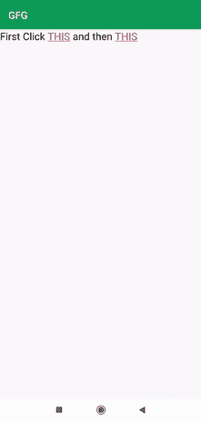

# 如何让一个 TextView 的子串在安卓系统中可点击？

> 原文:[https://www . geesforgeks . org/如何制作子串文本视图-安卓中可点击/](https://www.geeksforgeeks.org/how-to-make-substring-of-a-textview-clickable-in-android/)

在本文中，我们将实现一个与 TextView 相关的非常重要的特性。这里我们将字符串或子字符串的一部分作为子字符串。这个特性在写博客时很重要，因为对于某些点，我们可能希望将用户重定向到一个链接。所以在这里，我们将学习如何实现这个特性。下面给出了一个示例 GIF，以了解我们将在本文中做什么。注意，我们将使用 **Java** 语言来实现这个项目。



### **分步实施**

**第一步:创建新项目**

要在安卓工作室创建新项目，请参考[如何在安卓工作室创建/启动新项目](https://www.geeksforgeeks.org/android-how-to-create-start-a-new-project-in-android-studio/)。注意选择 **Java** 作为编程语言。

**步骤 2:使用 activity_main.xml 文件**

导航到**应用程序> res >布局> activity_main.xml** 并将下面的代码添加到该文件中。下面是 **activity_main.xml** 文件的代码。

## 可扩展标记语言

```java
<?xml version="1.0" encoding="utf-8"?>
<LinearLayout 
    xmlns:android="http://schemas.android.com/apk/res/android"
    xmlns:app="http://schemas.android.com/apk/res-auto"
    xmlns:tools="http://schemas.android.com/tools"
    android:layout_width="match_parent"
    android:layout_height="match_parent"
    android:orientation="vertical"
    tools:context=".MainActivity">

    <TextView
        android:id="@+id/text_view"
        android:layout_width="wrap_content"
        android:layout_height="wrap_content"
        android:text="First Click THIS and then THIS "
        android:textColor="@color/black"
        android:textSize="20sp"
        app:layout_constraintBottom_toBottomOf="parent"
        app:layout_constraintLeft_toLeftOf="parent"
        app:layout_constraintRight_toRightOf="parent"
        app:layout_constraintTop_toTopOf="parent" />

</LinearLayout>
```

**第三步:使用****MainActivity.java 文件**

转到**MainActivity.java**文件，参考以下代码。以下是**MainActivity.java**文件的代码。代码中添加了注释，以更详细地理解代码。

## Java 语言(一种计算机语言，尤用于创建网站)

```java
import android.os.Bundle;
import android.text.SpannableString;
import android.text.Spanned;
import android.text.method.LinkMovementMethod;
import android.text.style.ClickableSpan;
import android.view.View;
import android.widget.TextView;
import android.widget.Toast;

import androidx.appcompat.app.AppCompatActivity;

public class MainActivity extends AppCompatActivity {

    @Override
    protected void onCreate(Bundle savedInstanceState) {
        super.onCreate(savedInstanceState);
        setContentView(R.layout.activity_main);

        TextView textView = findViewById(R.id.text_view);
        String text = "First Click THIS and then THIS ";

        SpannableString ss = new SpannableString(text);

        // creating clickable span to be implemented as a link
        ClickableSpan clickableSpan1 = new ClickableSpan() {
            public void onClick(View widget) {
                Toast.makeText(MainActivity.this, "First Clickable Text", Toast.LENGTH_SHORT).show();
            }
        };

        // creating clickable span to be implemented as a link
        ClickableSpan clickableSpan2 = new ClickableSpan() {
            @Override
            public void onClick(View widget) {
                Toast.makeText(MainActivity.this, "Second Clickable Text", Toast.LENGTH_SHORT).show();
            }
        };

        // setting the part of string to be act as a link
        ss.setSpan(clickableSpan1, 12, 16, Spanned.SPAN_EXCLUSIVE_EXCLUSIVE);
        ss.setSpan(clickableSpan2, 26, 30, Spanned.SPAN_EXCLUSIVE_EXCLUSIVE);

        textView.setText(ss);
        textView.setMovementMethod(LinkMovementMethod.getInstance());
    }
}
```

**输出:**

<video class="wp-video-shortcode" id="video-592208-1" width="640" height="360" preload="metadata" controls=""><source type="video/mp4" src="https://media.geeksforgeeks.org/wp-content/uploads/20210410223046/substrclick.mp4?_=1">[https://media.geeksforgeeks.org/wp-content/uploads/20210410223046/substrclick.mp4](https://media.geeksforgeeks.org/wp-content/uploads/20210410223046/substrclick.mp4)</video>