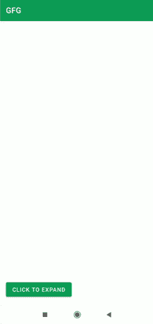

# 如何用 Android 中的 dodgeInsetEdges 移动视图？

> 原文:[https://www . geeksforgeeks . org/how-to-move-view-with-dodgeinsetedges-in-Android/](https://www.geeksforgeeks.org/how-to-move-views-out-of-the-way-with-dodgeinsetedges-in-android/)

我们已经使用了[浮动动作按钮](https://www.geeksforgeeks.org/floating-action-button-fab-in-android-with-example/)，其行为是向上扩展，并在浮动动作按钮下方显示[滚动条](https://www.geeksforgeeks.org/snackbar-material-design-components-in-android/)信息。这种行为存在于带有默认行为的浮动操作按钮中，但是如果我们想在自定义视图中添加这种类型的行为。所以在这篇文章中，我们将看看如何在安卓系统中用 dodgeInsetEdges 来解决这个问题。

### 我们将在本文中构建什么？

我们将建立一个简单的可扩展的视图，我们将显示在安卓的按钮点击。下面给出了一个 GIF 示例，来了解一下在本文中要做什么。请注意，我们将使用 **Java** 语言来实现这个项目。



### **分步实施**

**第一步:创建新项目**

要在安卓工作室创建新项目，请参考[如何在安卓工作室创建/启动新项目](https://www.geeksforgeeks.org/android-how-to-create-start-a-new-project-in-android-studio/)。注意选择 **Java** 作为编程语言。

**步骤 2:使用 activity_main.xml 文件**

导航到**应用程序> res >布局> activity_main.xml** 并将下面的代码添加到该文件中。下面是 **activity_main.xml** 文件的代码。

## 可扩展标记语言

```
<?xml version="1.0" encoding="utf-8"?>
<!--we are using coordinator layout for this example-->
<androidx.coordinatorlayout.widget.CoordinatorLayout 
    xmlns:android="http://schemas.android.com/apk/res/android"
    xmlns:app="http://schemas.android.com/apk/res-auto"
    xmlns:tools="http://schemas.android.com/tools"
    android:layout_width="match_parent"
    android:layout_height="match_parent"
    tools:context=".MainActivity">

    <!--button to expand the view-->
    <Button
        android:id="@+id/button"
        android:layout_width="wrap_content"
        android:layout_height="wrap_content"
        android:layout_gravity="bottom|start"
        android:layout_margin="16dp"
        android:text="Click to Expand"
        app:layout_dodgeInsetEdges="bottom" />

    <!--Nested scroll view to display 
        bottom scrolled layout-->
    <androidx.core.widget.NestedScrollView
        android:id="@+id/bottom_sheet"
        android:layout_width="match_parent"
        android:layout_height="350dp"
        android:background="@color/purple_500"
        app:behavior_hideable="true"
        app:behavior_peekHeight="0dp"
        app:layout_behavior="@string/bottom_sheet_behavior"
        app:layout_insetEdge="bottom">

        <!--we will be displaying a simple text
            view in that nested scroll view-->
        <TextView
            android:layout_width="match_parent"
            android:layout_height="match_parent"
            android:padding="16dp"
            android:text="Welcome to the DSA Self paced Course,
                          where you will get to learn all about 
                          Data Structures and Algorithms in detail."
            android:textColor="@color/white"
            android:textSize="16sp"
            android:textStyle="bold" />
    </androidx.core.widget.NestedScrollView>
</androidx.coordinatorlayout.widget.CoordinatorLayout>
```

**第三步:使用****MainActivity.java 文件**

转到**MainActivity.java**文件，参考以下代码。以下是**MainActivity.java**文件的代码。代码中添加了注释，以更详细地理解代码。

## Java 语言(一种计算机语言，尤用于创建网站)

```
import android.os.Bundle;
import android.view.View;
import android.widget.Button;

import androidx.appcompat.app.AppCompatActivity;

import com.google.android.material.bottomsheet.BottomSheetBehavior;

public class MainActivity extends AppCompatActivity {

    // creating a new variable for bottom sheet behaviour.
    private BottomSheetBehavior bottomSheetBehavior;

    @Override
    protected void onCreate(Bundle savedInstanceState) {
        super.onCreate(savedInstanceState);
        setContentView(R.layout.activity_main);

        // initializing view for our bottom sheet below.
        View bottomSheet = findViewById(R.id.bottom_sheet);

        // initializing bottom sheet behaviour
        // with our bottom sheet view.
        bottomSheetBehavior = BottomSheetBehavior.from(bottomSheet);

        // initializing the button where we will
        // be displaying our expanded view.
        Button button = findViewById(R.id.button);

        //adding on click listener to our button.
        button.setOnClickListener(new View.OnClickListener() {
            @Override
            public void onClick(View v) {
                // below line is use to expand our view on button click in android.
                bottomSheetBehavior.setState(BottomSheetBehavior.STATE_EXPANDED);
            }
        });
    }
}
```

现在运行应用程序并查看应用程序的输出。

### **输出:**

<video class="wp-video-shortcode" id="video-548265-1" width="640" height="360" preload="metadata" controls=""><source type="video/mp4" src="https://media.geeksforgeeks.org/wp-content/uploads/20210122195639/Screenrecorder-2021-01-22-17-53-24-508.mp4?_=1">[https://media.geeksforgeeks.org/wp-content/uploads/20210122195639/Screenrecorder-2021-01-22-17-53-24-508.mp4](https://media.geeksforgeeks.org/wp-content/uploads/20210122195639/Screenrecorder-2021-01-22-17-53-24-508.mp4)</video>