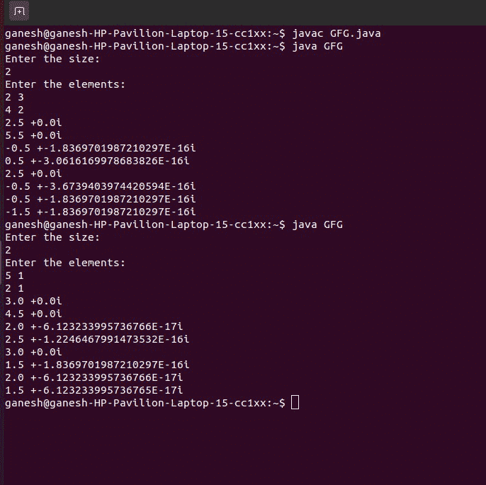

# 给定一个复杂的 2D 数组，如何在 Java 中执行 2D 快速傅立叶变换？

> 原文:[https://www . geeksforgeeks . org/如何执行-a-2d-FFT-in place-给定-a-complex-2d-array-in-Java/](https://www.geeksforgeeks.org/how-to-perform-a-2d-fft-inplace-given-a-complex-2d-array-in-java/)

快速傅里叶变换是一种计算离散傅里叶变换及其逆的算法。**傅立叶** **分析**将时间(或空间)转换为频率，反之亦然。快速傅立叶变换减少了计算离散傅立叶变换所需的计算时间，性能比直接计算快速傅立叶变换提高了 100 倍或更多。快速傅立叶变换通过将离散傅立叶变换矩阵分解成稀疏矩阵的乘积来计算这种变换。

这里我们使用一个 2D 阵列，它将帮助我们找到快速傅立叶变换。该算法在模式识别中很有用。

**示例**

> **输入:**
> 
> 输入大小:
> 
> Two
> 
> 输入元素:
> 
> 2  3
> 
> 4  2
> 
> **输出:**
> 
> 2.5 + 0.0 i
> 
> 5.5 + 0.0 i
> 
> -0.5 + -1.8369701987210297E-16 i
> 
> 0.5 + -3.0616169978683826E-16 i
> 
> 2.5 + 0.0 i
> 
> -0.5 + -3.6739403974420594E-16 i
> 
> -0.5 + -1.8369701987210297E-16 i
> 
> -1.5 + -1.8369701987210297E-16 i
> 
> **输入:**
> 
> 输入大小:
> 
> Two
> 
> 输入元素:
> 
> 5 1
> 
> 2 1
> 
> **输出:**
> 
> 3.0 + 0.0 i
> 
> 4.5 + 0.0 i
> 
> 2.0 + -6.123233995736766E-17 i
> 
> 2.5 + -1.2246467991473532E-16 i
> 
> 3.0 + 0.0 i
> 
> 1.5 + -1.8369701987210297E-16 i
> 
> 2.0 + -6.123233995736766E-17 i
> 
> 1.5 + -6.123233995736765E-17 i

**进场:**

*   输入数组的大小。
*   我们将取 4 个数据类型的数组，双名为 input，realOut，虚数。
*   给出 2D 阵列的输入。
*   现在让我们调用一个函数 **dft** ，它将帮助我们计算
*   现在，我们将计算输入数据的高度和宽度。
*   现在，让我们重复循环的高度和宽度，
*   现在来计算 **DFT** 我们会得到它的指数项，可以转换成余弦项和正弦项，标记为实部和虚部。这些可以通过使用这些公式来计算。
*   用高度和宽度迭代它，我们计算**实出**，使用公式:

> realOut[y][x]+=(输入[y1][x1]*Math.cos(2*Math。PI *(1.0 * x * x1/宽度)+(1.0 * y * y1/高度)))/Math.sqrt(宽度*高度)；

*   同样，我们将使用以下公式获得假想输出:

> imagOut[y][x]-=(输入[y1][x1]*Math.sin(2*Math。PI *(1.0 * x * x1/宽度)+(1.0 * y * y1/高度)))/Math.sqrt(宽度*高度)；

*   现在，我们将以 **a+ib** 的形式打印这些值。

**示例:**

## Java 语言(一种计算机语言，尤用于创建网站)

```
// Java program to perform  a 2D FFT Inplace Given a Complex
// 2D Array

// Declare the needed libraries
import java.io.*;
import java.util.Scanner;

public class GFG {
    public static void main(String[] args)
    {
        // enter the size of the matrix
        System.out.println("Enter the size:");

        // declaring the scan element
        Scanner sc = new Scanner(System.in);
        // scan the size of the matrix
        int n = sc.nextInt();

        // Declaring the matrices in double datatype
        // Declaring the input variable where we take in the
        // input
        double[][] input = new double[n][n];

        // Taking the matrices for real value
        double[][] realOut = new double[n][n];

        // Taking the matrices for imaginary output
        double[][] imagOut = new double[n][n];

        // Enter the values of elements of the DFT Matrix
        System.out.println("Enter the elements:");

        // Taking the input of the array
        // By iterating the two loops
        for (int i = 0; i < n; i++) {
            for (int j = 0; j < n; j++) {
                input[i][j] = sc.nextDouble();
            }
        }

        // Calling the function discrete
        discrete(input, realOut, imagOut);

        // Closing  the function scanner
        sc.close();
    }

    // Now by taking the discrete function
    // This is the declaration of the function
    // This function includes 4 parameters
    // The parameters are the 4 matrices.
    static void discrete(double[][] input,
                         double[][] realOut,
                         double[][] imagOut)
    {

        // Height is the variable of data type int
        // the length of the input variable is stored in
        // variable height
        int height = input.length;

        // The input of the first index length is stored in
        // variable width
        int width = input[0].length;

        // Iterating the input till height stored in
        // variable y
        for (int y = 0; y < height; y++) {

            // Taking the input iterating till width in
            // variable x
            for (int x = 0; x < width; x++) {

                // Taking another variable y1 which will be
                // the continuation of
                // the variable y
                // This y1 will be iterating till height
                // This index of the variable starts at 0
                for (int y1 = 0; y1 < height; y1++) {

                    // This index x1 iterates till width
                    // This x1 is continuation of x
                    // The variables y1 and x1 are the
                    // continuation of summable of x and y
                    for (int x1 = 0; x1 < width; x1++) {

                        // realOut is the variable which
                        // lets us know the real output as
                        // we do te summation of exponential
                        // signal
                        // we get cos as real term and sin
                        // as imaginary term
                        // so taking the consideration of
                        // above properties we write the
                        // formula of real as
                        // summing till x and y and
                        // multiplying it with cos2pie
                        // and then dividing it with width
                        // *height gives us the real term
                        realOut[y][x]
                            += (input[y1][x1]
                                * Math.cos(
                                    2 * Math.PI
                                    * ((1.0 * x * x1
                                        / width)
                                       + (1.0 * y * y1
                                          / height))))
                               / Math.sqrt(width * height);

                        // Now imagOut is the imaginary term
                        // That is the sine term
                        // This sine term can be obtained
                        // using sin2pie and then we divide
                        // it using width*height The
                        // formulae is same as real

                        imagOut[y][x]
                            -= (input[y1][x1]
                                * Math.sin(
                                    2 * Math.PI
                                    * ((1.0 * x * x1
                                        / width)
                                       + (1.0 * y * y1
                                          / height))))
                               / Math.sqrt(width * height);
                    }

                    // Now we will print the value of
                    // realOut and imaginary outputn The
                    // ppoutput of imaginary output will end
                    // with value 'i'.
                    System.out.println(realOut[y][x] + " +"
                                       + imagOut[y][x]
                                       + "i");
                }
            }
        }
    }
}
```

**输出:**

