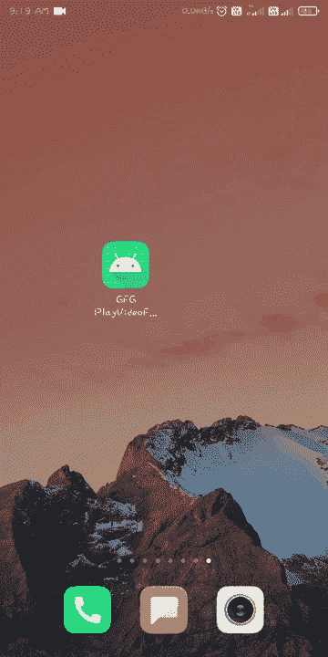

# 如何在安卓系统中从 URL 播放视频？

> 原文:[https://www . geesforgeks . org/如何在安卓中从 url 播放视频/](https://www.geeksforgeeks.org/how-to-play-video-from-url-in-android/)

在本文中，您将看到如何在 Android 上从 URL 播放视频。为了在我们的安卓应用程序中显示视频，我们将使用 VideoView 小部件。VideoView 小部件能够播放媒体文件，VideoView 支持的格式有 3gp 和 MP4。通过使用视频视图，您可以从本地存储器和互联网播放媒体文件。下面给出了一个示例 GIF，以了解我们将在本文中做什么。注意，我们将使用 **Java** 语言来实现这个项目。



现在让我们看看 gif 中显示的上述应用程序的逐步实现。

### **分步实施**

**第一步:创建新项目**

所以第一步是创建一个新项目，在安卓工作室的欢迎屏幕上，点击**创建新项目**，如果你已经打开了一个项目，转到**文件>新建>新项目**。然后选择一个项目模板窗口，选择**空活动**，点击**下一步**。在名称字段中输入您的应用名称，并从语言下拉菜单中选择 **Java** 。

**第二步:添加互联网权限**

导航到**应用程序>清单>和如下所示的该文件的互联网权限。**

```java
<uses-permission android:name="android.permission.INTERNET"/>
```

**步骤 3:使用 activity_main.xml**

导航到**应用程序> res >布局> activity_main.xml** 并将下面的代码添加到该文件中。下面是 **activity_main.xml** 文件的代码。

## 可扩展标记语言

```java
<?xml version="1.0" encoding="utf-8"?>
<RelativeLayout 
    xmlns:android="http://schemas.android.com/apk/res/android"
    xmlns:tools="http://schemas.android.com/tools"
    android:layout_width="match_parent"
    android:layout_height="match_parent"
    tools:context=".MainActivity">

    <!-- adding VideoView to the layout -->
    <VideoView
        android:id="@+id/videoView"
        android:layout_width="match_parent"
        android:layout_height="match_parent"
        android:layout_centerInParent="true" />

</RelativeLayout>
```

**第四步:与 MainActivity.java 合作**

转到**MainActivity.java**文件，参考以下代码。以下是**MainActivity.java**文件的代码。代码中添加了注释，以更详细地理解代码。

## Java 语言(一种计算机语言，尤用于创建网站)

```java
import android.net.Uri;
import android.os.Bundle;
import android.widget.MediaController;
import android.widget.VideoView;

import androidx.appcompat.app.AppCompatActivity;

public class MainActivity extends AppCompatActivity {

    // Your Video URL
    String videoUrl = "https://media.geeksforgeeks.org/wp-content/uploads/20201217192146/Screenrecorder-2020-12-17-19-17-36-828.mp4?_=1";

    @Override
    protected void onCreate(Bundle savedInstanceState) {
        super.onCreate(savedInstanceState);
        setContentView(R.layout.activity_main);

        // finding videoview by its id
        VideoView videoView = findViewById(R.id.videoView);

        // Uri object to refer the 
        // resource from the videoUrl
        Uri uri = Uri.parse(videoUrl);

        // sets the resource from the
        // videoUrl to the videoView
        videoView.setVideoURI(uri);

        // creating object of 
        // media controller class
        MediaController mediaController = new MediaController(this);

        // sets the anchor view 
        // anchor view for the videoView
        mediaController.setAnchorView(videoView);

        // sets the media player to the videoView
        mediaController.setMediaPlayer(videoView);

        // sets the media controller to the videoView
        videoView.setMediaController(mediaController);

        // starts the video
        videoView.start();
    }
}
```

**输出:**

<video class="wp-video-shortcode" id="video-645169-1" width="640" height="360" preload="metadata" controls=""><source type="video/mp4" src="https://media.geeksforgeeks.org/wp-content/uploads/20210714100314/1626234667310.mp4?_=1">[https://media.geeksforgeeks.org/wp-content/uploads/20210714100314/1626234667310.mp4](https://media.geeksforgeeks.org/wp-content/uploads/20210714100314/1626234667310.mp4)</video>