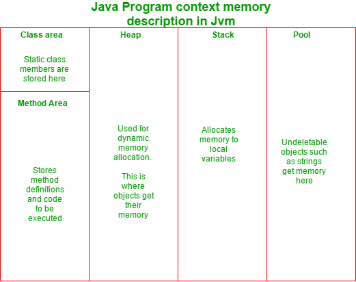

# 如何在 Java 中防止类的对象进行垃圾收集

> 原文:[https://www . geesforgeks . org/如何防止 java 垃圾收集中的类对象/](https://www.geeksforgeeks.org/how-to-prevent-objects-of-a-class-from-garbage-collection-in-java/)

Java 中的垃圾收集器是自动的，即用户不必手动释放动态分配的已占用内存。垃圾收集器如何决定删除哪个对象？很简单:丢失引用的对象被标记为从堆内存中删除。例如，看看下面这段代码:

```java
// Java code to demonstrate when an object would
// be deleted by the garbage collector

class A {
    void f()
    {
        A x = new A(); /*object created locally
              It's scope remains valid till the
              termination of this function*/
    }
    public static void main(String a[])
    {
        f();

        /* function f() terminates, 
           and hence the object 'x' 
           too gets collected 
           by the garbage collector*/
    }
}
```

上面的代码显示引用变量“x”的作用域仅限于函数“f()”。因此，在上述函数终止后，变量也没有识别。因此，创建的对象失去了它的引用，因此被垃圾收集器收集。

垃圾收集器收集的对象被收集起来，以便释放堆内存，在那里分配动态内存。下图解释了 Java 程序中不同的内存段及其用途:



然而，有时经常会出现这样的问题:**‘有没有一种方法可以防止一个物体被垃圾收集器收集？’**

有几种方法可以使对象在 Java 中不可删除。下文将讨论这些问题:

**通过增加堆内存**

Java 在一个名为“堆”的分区中为它的对象分配内存(除了字符串和其他一些在池中分配内存的特殊对象)。由于堆内存有限，总是需要释放一些内存来容纳新对象的空间。然而，在某种程度上，我们可以通过增加堆的大小来使对象不可删除。以下 jvm 命令行参数可以完成这项工作:

*   扩展内存
*   xmx

    Xmx 指定 Java 虚拟机(JVM)的最大内存分配池，而 Xms 指定初始内存分配池。以下是一个例子:

    ```java
    java -Xms256m -Xmx2048m classfile
    ```

    这里，在上面的示例中，您从最初分配的 256 MB 堆内存开始，它可以扩展到最大 2048MB 的堆大小。

    这种方法导致垃圾收集器不经常运行，但是当它运行时，将比以前花费更长的时间来完成垃圾收集任务。

    **通过使用单例类**

    在单例类的情况下，唯一创建的对象的引用可以存储在静态引用中。由于静态成员存储在类区域(一个内存段)中，它们的生命周期跨越了程序的生命周期。以下程序解释了如何做到这一点:

    ```java
    public class Singleton {

        /* static class member which 
           will store the object reference*/
        private static Singleton uniqueInstance;

        private Singleton()
        {
        }

        public static synchronized Singleton getInstance()
        {
            if (uniqueInstance == null) {
                uniqueInstance = new Singleton();
            }
            return uniqInstance;
        }
    }
    ```

    上面的例子表明，由于对象的引用已经被传递到一个静态变量中，所以它永远不会丢失。因此，直到程序结束，对象才会被删除。然而，唯一的问题是这里只能创建一个对象。

    **使用公共作废敲定()**

    Finalize 是一个回调方法(一个由 JVM 调用的方法，而不是由用户调用的方法)，它是在对象上执行的最后一个方法。子类可以覆盖 finalize 方法来处理系统资源或执行其他清理。

    **如何防止垃圾收集使用 finalize？**

    可以重写类的 finalize 方法，以保留对将要删除的对象的引用。以下程序演示了如何:

    ```java
    // Java code to demonstrate how to prevent garbage collection
    // of an object using finalize method
    class A {
        static A y;
        void f()
        {
            A x = new A();
        }
        pubic void finalize()
        {
            y = this; // Putting the reference id
            // of the current object
            // into the static variable y

            System.out.println("Object reference saved. The object
                  won't be collected by the garbage collector");
        }
        public static void main(String a[])
        {
            f(); // function called
        }
    ```

    输出:

    ```java
    Object reference saved. The object won't be collected by the garbage collector
    ```

    如前所述，finalize 是对对象执行的最后一个方法。在上面的程序中，函数“f()”创建了一个类 a 的本地对象。当函数的调用终止时，变量“x”的作用域也终止，因此被垃圾收集器标记为要收集。但是，在垃圾收集器删除对象之前，finalize 会运行。

    在方法“finalize”的主体中，可以看到类 A 的静态成员“y”被分配了当前对象的引用 id。结果，要删除的对象的引用 id 被保留，因此，该对象不被删除。

    然而，知道使对象不可删除是有风险的，并且会增加内存泄漏的机会，这一点非常重要。因此，这样做是不可取的。